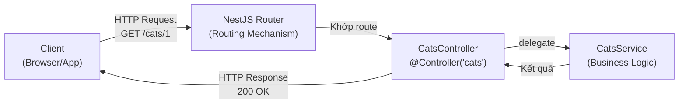

# [NestJS] Controllers: Cổng Điều Phối HTTP Request

<!--truncate-->

## Agenda

**Thời gian đọc ước tính:** ~15 phút

### Learning outcome:
- **Hiểu** được vai trò duy nhất của Controller trong kiến trúc NestJS và tại sao không nên đặt Business Logic vào Controller.
- **Thiết lập** được các Routes đầy đủ (GET, POST, PUT, DELETE) với các Param Decorators phù hợp.
- **Áp dụng** được Data Transfer Object (DTO) để định nghĩa cấu trúc dữ liệu đầu vào một cách an toàn.
- **Phân biệt** được hai chiến lược trả về Response: Standard (NestJS quản lý) và Library-specific (Express `@Res()`).

---

## Glossary & Vocabulary

**1. Technical Terms (Thuật ngữ kỹ thuật):**
| Term | Vietnamese Meaning & Quick Explain |
| :--- | :--- |
| **Controller** | Bộ điều khiển. Lớp nhận Request HTTP, điều phối xử lý sang Service, và trả về Response. |
| **Route Handler** | Hàm xử lý Route. Một method trong Controller được gắn HTTP Method Decorator (như `@Get()`, `@Post()`). |
| **Data Transfer Object (DTO)** | Đối tượng truyền dữ liệu. Một class TypeScript định nghĩa chính xác cấu trúc và kiểu dữ liệu của payload gửi lên. |
| **Routing** | Định tuyến. Cơ chế ánh xạ URL + HTTP Method đến một hàm xử lý cụ thể. |
| **Passthrough** | Chuyển tiếp. Cho phép dùng `@Res()` để set Cookie/Header nhưng vẫn để NestJS tự trả Response. |

**2. Vocabulary Support (Từ vựng học thuật/B1+):**
| Word | Meaning in Context (Nghĩa trong ngữ cảnh) |
| :--- | :--- |
| **Delegate (v)** | Giao phó, ủy thác. Controller "delegate" xử lý nghiệp vụ sang Service. |
| **Arbitrary (adj)** | Tùy ý, không có quy tắc đặc biệt. Ví dụ: tên method trong Controller là arbitrary. |
| **Serialized (adj)** | Đã được chuyển đổi sang định dạng truyền được (thường là JSON string). |

---

## 1. WHY — Tại sao phải có Controller?

Trong kiến trúc Express.js không có cấu trúc, mọi logic thường được gom vào cùng một chỗ: nhận Request, validate dữ liệu, truy vấn Database, tính toán nghiệp vụ, rồi trả Response. Kết quả là các "Route Handler khổng lồ" dài hàng trăm dòng, vi phạm nghiêm trọng nguyên tắc Single Responsibility.

**Vấn đề phát sinh:**
1. **Không thể tái sử dụng Business Logic:** Logic tính toán giá sản phẩm bị nhúng thẳng vào route handler. Khi cần dùng lại ở một API khác (ví dụ: batch processing), bạn không có cách nào gọi lại mà không copy-paste.
2. **Khó Unit Test:** Để test logic tính giá, bạn phải giả lập toàn bộ HTTP Request/Response object — tốn công và không đáng tin cậy.
3. **Coupling cao:** HTTP layer và Business layer gắn chặt vào nhau. Thay đổi một bên ảnh hưởng ngay đến bên kia.

**Giải pháp:** NestJS phân tách rõ ràng bằng kiến trúc **Controller → Service**:
- Controller chỉ làm đúng một việc: nhận Request, trích xuất dữ liệu cần thiết, gọi Service, trả về kết quả.
- Service chứa toàn bộ Business Logic — độc lập hoàn toàn với HTTP layer, dễ test và tái sử dụng.

---

## 2. WHAT — Controller là gì?

### 2.1. Định nghĩa kỹ thuật

Controller (*Bộ điều khiển*) là một class được gắn decorator `@Controller()`, chịu trách nhiệm xử lý các HTTP Request đến và gửi Response trở lại cho Client.


### 2.2. Definition Anatomy — Giải phẫu `@Controller()`



- **`@Controller('cats')`**: Khai báo prefix `/cats` cho toàn bộ routes trong class này. Mọi method bên trong sẽ tự động được tiền tố bởi `/cats`.
- **Route Handler method**: Tên method (`findAll`, `create`...) là tùy ý (*arbitrary*), NestJS không dựa vào tên method để routing. Chỉ decorator gắn trên nó (`@Get()`, `@Post()`) mới có ý nghĩa.

### 2.3. Hai chiến lược Response

NestJS hỗ trợ hai cách trả về Response, và đây là điểm dễ gây nhầm lẫn nhất:

| Chiến lược | Cách hoạt động | Khi nào dùng |
| :--- | :--- | :--- |
| **Standard (Khuyến nghị)** | `return` một giá trị. NestJS tự serialize sang JSON, tự set Status Code (200/201). | Luôn ưu tiên dùng cách này. |
| **Library-specific** | Inject `@Res() res: Response` rồi gọi `res.json()` hoặc `res.send()`. | Chỉ khi cần set Cookie hoặc thao tác Header ở mức độ thấp. |

---

## 3. HOW — Làm chủ Routes và Request Data

### 3.1. CRUD Routes cơ bản

```typescript
// filename: src/cats/cats.controller.ts
import { Controller, Get, Post, Put, Delete, Param, Body, HttpCode } from '@nestjs/common';

@Controller('cats')
export class CatsController {
  
  @Get()
  findAll(): string {
    // NestJS tự serialize kết quả return sang JSON
    return 'Danh sách mèo';
  }

  @Post()
  @HttpCode(201) // Ghi đè status code mặc định (mặc định POST đã là 201)
  create() {
    return 'Đã thêm mèo mới';
  }

  @Put(':id')
  update(@Param('id') id: string) {
    return `Đã cập nhật mèo #${id}`;
  }

  @Delete(':id')
  remove(@Param('id') id: string) {
    return `Đã xóa mèo #${id}`;
  }
}
```

### 3.2. Các Param Decorators để trích xuất dữ liệu từ Request

NestJS cung cấp bộ Param Decorators để trích xuất dữ liệu từ các phần của HTTP Request, thay thế hoàn toàn việc phải dùng `req.params`, `req.query`, `req.body` thủ công.

| Decorator | Tương đương Express | Dữ liệu trích xuất |
| :--- | :--- | :--- |
| `@Param('id')` | `req.params.id` | Path parameter: `/cats/:id` |
| `@Query('page')` | `req.query.page` | Query string: `?page=2` |
| `@Body()` | `req.body` | Toàn bộ Request Body (JSON) |
| `@Headers('authorization')` | `req.headers.authorization` | Một HTTP Header cụ thể |
| `@Ip()` | `req.ip` | IP Address của client |

**Ví dụ thực tế — Một Route hoàn chỉnh:**

```typescript
// filename: src/cats/cats.controller.ts
@Get()
findAll(
  @Query('page') page: number,     // Lấy query ?page=X
  @Query('breed') breed: string,   // Lấy query ?breed=X
): string {
  return `Lấy mèo giống ${breed}, trang ${page}`;
}

@Get(':id')
// Route có tham số phải khai báo SAU route tĩnh để tránh conflict
findOne(@Param('id') id: string): string {
  return `Thông tin mèo #${id}`;
}
```

### 3.3. Data Transfer Object (DTO) — Định nghĩa cấu trúc dữ liệu đầu vào

Khi nhận dữ liệu từ Client (qua `@Body()`), chúng ta cần đảm bảo dữ liệu đó có đúng cấu trúc mong muốn. Đây là lúc DTO phát huy vai trò.

**Tại sao phải dùng Class thay vì Interface TypeScript?**
TypeScript Interface bị xóa hoàn toàn khi biên dịch sang JavaScript. Trong khi đó, NestJS cần thông tin kiểu dữ liệu ở Runtime (ví dụ: để Pipes validate dữ liệu). Vì vậy, **DTO phải là Class**.

```typescript
// filename: src/cats/dto/create-cat.dto.ts
export class CreateCatDto {
  name: string;
  age: number;
  breed: string;
}
```

```typescript
// filename: src/cats/cats.controller.ts
import { CreateCatDto } from './dto/create-cat.dto';

@Post()
async create(@Body() createCatDto: CreateCatDto) {
  // Lúc này, createCatDto đã được type-safe với cấu trúc đã định nghĩa
  return this.catsService.create(createCatDto);
}
```

### 3.4. Kiểm soát Response: `@HttpCode()`, `@Header()`, `@Redirect()`

```typescript
// filename: src/cats/cats.controller.ts
import { Controller, Post, HttpCode, Header, Redirect, Get, Query } from '@nestjs/common';

@Controller('cats')
export class CatsController {

  @Post()
  @HttpCode(204) // Trả về 204 No Content thay vì 201
  create() {
    return; // Không có body
  }

  @Get('export')
  @Header('Content-Type', 'application/octet-stream')
  // Gắn thêm header vào Response
  exportData() {
    return 'binary data';
  }

  @Get('docs')
  @Redirect('https://docs.nestjs.com', 301) // Chuyển hướng vĩnh viễn
  getDocs(@Query('version') version: string) {
    // Có thể override redirect URL động bằng cách return object
    if (version === '5') {
      return { url: 'https://docs.nestjs.com/v5/', statusCode: 302 };
    }
    // Nếu không return gì, sử dụng URL mặc định trong @Redirect()
  }
}
```

### 3.5. Trade-off: Standard vs Library-specific Response

Đây là quyết định kiến trúc quan trọng và cần hiểu rõ trade-off:

```typescript
// filename: src/cats/cats.controller.ts (Library-specific approach)
import { Controller, Get, Res } from '@nestjs/common';
import { Response } from 'express';

@Controller('cats')
export class CatsController {

  @Get()
  // Khi inject @Res(), NestJS chuyển sang "Library-specific mode"
  // Bạn phải tự gọi res.json() hoặc res.send() — nếu không, request sẽ bị "treo"
  findAll(@Res() res: Response) {
    res.status(200).json([]);
  }

  @Get('safe')
  // Dùng passthrough: true để set cookie/header nhưng vẫn để NestJS lo response
  setCookie(@Res({ passthrough: true }) res: Response) {
    res.cookie('token', 'my-value'); // Chỉ set cookie, KHÔNG gọi res.json()
    return []; // NestJS tự serialize và gửi response
  }
}
```

**Tổng kết trade-off:**

| Tiêu chí | Standard | Library-specific |
| :--- | :--- | :--- |
| Interceptors hoạt động | Có | Không (trừ khi dùng `passthrough`) |
| Platform-agnostic | Có | Không (gắn chặt vào Express) |
| Testability | Dễ | Phức tạp (phải mock res object) |
| Khi nào dùng | Luôn luôn | Chỉ khi cần thao tác Cookie/Header trực tiếp |

**Lời khuyên:** Chỉ dùng `@Res()` kèm `{ passthrough: true }` khi cần set Cookie. Không bao giờ dùng full Library-specific mode nếu không thực sự cần thiết.

### 3.6. Đăng ký Controller vào Module

Controller phải được khai báo trong một Module. Đây là bước bắt buộc để NestJS mount các routes:

```typescript
// filename: src/app.module.ts
import { Module } from '@nestjs/common';
import { CatsController } from './cats/cats.controller';

@Module({
  controllers: [CatsController], // Khai báo trong array controllers
})
export class AppModule {}
```

---

## 4. Discussion Questions

Hãy thử suy luận và trả lời các câu hỏi sau để kiểm tra sự thấu hiểu:

1. **Thứ tự Route:** Nếu bạn có hai routes `@Get('profile')` và `@Get(':id')` trong cùng một Controller, thứ tự khai báo có ảnh hưởng đến kết quả không? Điều gì xảy ra nếu bạn khai báo `:id` trước `profile`? Giải thích cơ chế.
2. **DTO vs Interface:** Tại sao NestJS docs khuyến nghị dùng Class thay vì TypeScript Interface để định nghĩa DTO? Liên hệ đến cách TypeScript compiler xử lý Interface và cách NestJS Pipes cần thông tin kiểu dữ liệu ở Runtime.
3. **Library-specific trap:** Một developer viết `@Get() findAll(@Res() res: Response) { return []; }` (có `@Res()` nhưng dùng `return` thay vì `res.json()`). Chuyện gì sẽ xảy ra với request đó? Và tại sao NestJS lại thiết kế theo cơ chế này thay vì tự động xử lý cả hai cách?

---

## References

- Tài liệu chính thức NestJS - [Controllers](https://docs.nestjs.com/controllers)
- Kỹ thuật validate DTO chuyên sâu - [Validation](https://docs.nestjs.com/techniques/validation)

---

*Made by Anh Tu - Share to be share*
