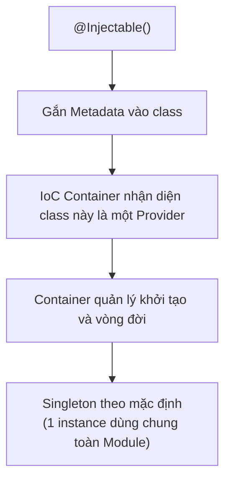

# [NestJS] Providers: Trái Tim Của Hệ Thống Dependency Injection

<!--truncate-->

## Agenda

**Thời gian đọc ước tính:** ~10 phút

### Learning outcome:
- **Hiểu** được tại sao Business Logic phải được tách ra khỏi Controller và đặt vào Provider.
- **Giải thích** được cơ chế hoạt động của `@Injectable()` và Singleton Scope mặc định của NestJS.
- **Tự tay** tạo một Service, inject nó vào Controller, và đăng ký đúng cách trong Module.
- **Phân biệt** được Constructor-based Injection và Property-based Injection — cùng khi nào dùng cái nào.

---

## Glossary & Vocabulary

**1. Technical Terms (Thuật ngữ kỹ thuật):**
| Term | Vietnamese Meaning & Quick Explain |
| :--- | :--- |
| **Provider** | Nhà cung cấp. Khái niệm tổng quát trong NestJS — bất kỳ class nào có thể được inject như một dependency (Services, Repositories, Factories). |
| **Service** | Dịch vụ. Loại Provider phổ biến nhất, chứa Business Logic và có thể được tái sử dụng ở nhiều nơi. |
| **Singleton** | Thực thể đơn. Chỉ có một instance duy nhất được tạo ra và dùng chung cho toàn bộ ứng dụng. |
| **IoC Container** | Bộ chứa Inversion of Control. Hệ thống của NestJS tự động khởi tạo và quản lý vòng đời của tất cả Providers. |

**2. Vocabulary Support (Từ vựng học thuật/B1+):**
| Word | Meaning in Context (Nghĩa trong ngữ cảnh) |
| :--- | :--- |
| **Instantiate (v)** | Khởi tạo instance. Hành động tạo ra một đối tượng từ một class. |
| **Cumbersome (adj)** | Rườm rà, cồng kềnh. Thường dùng để mô tả giải pháp có quá nhiều bước thủ công. |
| **Delegate (v)** | Giao phó, ủy thác. Controller "delegate" business logic sang Service. |

---

## 1. WHY — Tại sao Controller không nên chứa Business Logic?

Sau khi hiểu về Controller ở bài trước, câu hỏi đặt ra là: tại sao không viết logic nghiệp vụ thẳng vào Controller cho nhanh?

**Vấn đề phát sinh khi đặt Business Logic vào Controller:**
1. **Không thể tái sử dụng:** Logic tính phí vận chuyển được viết trong `OrdersController`. Khi tính năng lập lịch tự động (Cron Job) cũng cần tính phí vận chuyển, bạn phải copy-paste code — vi phạm nguyên tắc DRY.
2. **Không thể Unit Test độc lập:** Để test logic tính phí, bạn phải giả lập toàn bộ HTTP Request/Response object. Đây là sự tốn kém không cần thiết.
3. **Single Responsibility bị vi phạm:** Controller có hai trách nhiệm: xử lý HTTP và xử lý nghiệp vụ. Khi một trong hai thay đổi (ví dụ đổi sang GraphQL), tất cả sẽ bị ảnh hưởng.

**Giải pháp:** Tách Business Logic ra thành **Provider** (thường là Service). Controller chỉ nhận Request và giao việc (delegate) cho Provider. Provider không biết gì về HTTP — nó chỉ thuần túy xử lý dữ liệu.

---

## 2. WHAT — Provider là gì?

### 2.1. Định nghĩa kỹ thuật

Provider (*Nhà cung cấp*) là một class được đánh dấu `@Injectable()`, có thể được inject như một dependency vào các class khác thông qua Constructor. Nest IoC Container chịu trách nhiệm khởi tạo và quản lý vòng đời của tất cả Providers.


### 2.2. Definition Anatomy — Giải phẫu `@Injectable()`



- **`@Injectable()`**: Là một Decorator tín hiệu — nó không chứa logic, chỉ gắn metadata vào class để thông báo với NestJS IoC Container rằng "Class này có thể được inject". Không có decorator này, NestJS sẽ từ chối inject class đó.
- **Singleton Scope (mặc định)**: Nest chỉ tạo **một** instance duy nhất cho mỗi Provider trong phạm vi Module. Instance này được dùng chung và tái sử dụng cho mọi yêu cầu.

### 2.3. Các kiểu Provider phổ biến

Trong thực tế, các loại class sau đây thường được dùng làm Provider:
- **Services**: Chứa Business Logic (phổ biến nhất).
- **Repositories**: Thao tác với Database (thường được tạo bởi TypeORM, Prisma...).
- **Factories**: Tạo ra các đối tượng phức tạp theo điều kiện.
- **Helpers/Utils**: Các hàm tiện ích dùng chung.

---

## 3. HOW — Xây dựng và sử dụng Provider

### 3.1. Tạo Service — Loại Provider phổ biến nhất

```typescript
// filename: src/cats/cats.service.ts
import { Injectable } from '@nestjs/common';
import { Cat } from './interfaces/cat.interface';

@Injectable() // Bắt buộc: đánh dấu để IoC Container quản lý
export class CatsService {
  // Lưu trữ tạm thời trong bộ nhớ (trong dự án thực, đây sẽ là DB call)
  private readonly cats: Cat[] = [];

  create(cat: Cat) {
    this.cats.push(cat);
  }

  findAll(): Cat[] {
    return this.cats;
  }
}
```

```typescript
// filename: src/cats/interfaces/cat.interface.ts
export interface Cat {
  name: string;
  age: number;
  breed: string;
}
```

### 3.2. Inject Service vào Controller (Constructor-based Injection)

Đây là cách inject chuẩn và được khuyến nghị trong NestJS:

```typescript
// filename: src/cats/cats.controller.ts
import { Controller, Get, Post, Body } from '@nestjs/common';
import { CatsService } from './cats.service';
import { CreateCatDto } from './dto/create-cat.dto';

@Controller('cats')
export class CatsController {
  // TypeScript shorthand: khai báo và khởi tạo private property trong một dòng
  // NestJS đọc type CatsService → tìm trong providers → inject instance Singleton
  constructor(private readonly catsService: CatsService) {}

  @Post()
  async create(@Body() createCatDto: CreateCatDto) {
    // Controller không biết CatsService được tạo ở đâu
    // Nó chỉ biết gọi method và delegate công việc
    this.catsService.create(createCatDto);
  }

  @Get()
  async findAll() {
    return this.catsService.findAll();
  }
}
```

**Tại sao dùng `private readonly`?**
- `private`: Bên ngoài class không thể truy cập trực tiếp `catsController.catsService`.
- `readonly`: Đảm bảo `catsService` không bị gán lại sau khi khởi tạo — bảo vệ tính bất biến của dependency.

### 3.3. Property-based Injection — và khi nào cần

Trong phần lớn trường hợp, Constructor-based Injection là đủ và tốt nhất. Tuy nhiên, có một trường hợp đặc biệt: khi class của bạn **kế thừa** từ một base class và cần truyền nhiều dependencies qua `super()`.

```typescript
// filename: src/common/base.service.ts
import { Injectable, Inject } from '@nestjs/common';

@Injectable()
export class BaseService {
  // Dùng @Inject() trực tiếp trên property thay vì qua constructor
  // Hữu ích khi class có hierarchy phức tạp
  @Inject('HTTP_OPTIONS')
  private readonly httpOptions: HttpOptions;
}
```

> Nguyên tắc: Luôn ưu tiên Constructor-based Injection. Chỉ dùng Property-based Injection khi thực sự cần thiết trong các trường hợp kế thừa phức tạp.

### 3.4. Optional Providers — khi Dependency không bắt buộc

Đôi khi, một Provider có thể không tồn tại (ví dụ: cấu hình tùy chọn). Thay vì để ứng dụng crash, dùng `@Optional()`:

```typescript
// filename: src/cats/cats.service.ts
import { Injectable, Optional, Inject } from '@nestjs/common';

@Injectable()
export class CatsService {
  constructor(
    // Nếu 'HTTP_OPTIONS' không được đăng ký, httpOptions sẽ là undefined thay vì throw Error
    @Optional() @Inject('HTTP_OPTIONS') private httpOptions: HttpOptions,
  ) {
    // Cần tự xử lý trường hợp httpOptions = undefined
    if (this.httpOptions) {
      console.log('Cấu hình HTTP đã được tải');
    }
  }
}
```

### 3.5. Đăng ký Provider trong Module

Sau khi tạo xong Controller và Service, phải đăng ký cả hai vào Module:

```typescript
// filename: src/app.module.ts
import { Module } from '@nestjs/common';
import { CatsController } from './cats/cats.controller';
import { CatsService } from './cats.service';

@Module({
  controllers: [CatsController], // Đăng ký Controller
  providers: [CatsService],      // Đăng ký Provider — đây là bước NestJS "biết" về CatsService
})
export class AppModule {}
```

**Sau khi đăng ký**, cấu trúc thư mục chuẩn sẽ trông như sau:

```
src/
├── cats/
│   ├── dto/
│   │   └── create-cat.dto.ts
│   ├── interfaces/
│   │   └── cat.interface.ts
│   ├── cats.controller.ts
│   └── cats.service.ts
├── app.module.ts
└── main.ts
```

### 3.6. Giới hạn của Providers cơ bản — và bước tiếp theo

Providers đã học ở bài này sử dụng cú pháp shorthand (`providers: [CatsService]`). Cú pháp đầy đủ thực ra là:

```typescript
providers: [
  {
    provide: CatsService,  // Token định danh
    useClass: CatsService, // Class thực tế sẽ được khởi tạo
  }
]
```

Từ cú pháp đầy đủ này, NestJS mở ra một cơ chế cực kỳ linh hoạt: **Custom Providers** — nơi bạn có thể dùng `useValue`, `useFactory`, `useExisting` để inject bất kỳ giá trị nào, không chỉ class instance. Chủ đề này sẽ được phân tích sâu trong module **03-core-fundamentals**.

---

## 4. Discussion Questions

Hãy thử suy luận và trả lời để kiểm chứng mức độ thấu hiểu:

1. **Singleton và State:** Nếu `CatsService` có thuộc tính `private count = 0` và mỗi lần gọi `create()` thì `count++`. Sau 100 HTTP Requests từ nhiều Users khác nhau, giá trị `count` sẽ là bao nhiêu? Điều này nói lên điều gì về việc lưu trữ "trạng thái phiên người dùng" (user session state) trong một Service?
2. **Constructor vs Property Injection:** Hãy tìm một ví dụ thực tế (trong NestJS docs hoặc một thư viện NestJS) mà Property-based Injection được dùng thay vì Constructor-based Injection. Lý do kỹ thuật là gì?
3. **Manual Instantiation:** Khi nào bạn cần lấy một Provider instance thủ công bên ngoài hệ thống DI bình thường (ví dụ: trong `bootstrap()` function của `main.ts`)? NestJS cung cấp cơ chế nào để làm điều này mà không phá vỡ kiến trúc?

---

## References

- Tài liệu chính thức NestJS - [Providers](https://docs.nestjs.com/providers)
- Chủ đề nâng cao - [Custom Providers](https://docs.nestjs.com/fundamentals/custom-providers)

---

*Made by Anh Tu - Share to be share*
