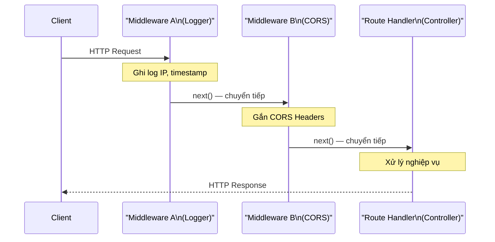

# [NestJS] Middleware: Lớp Tiền Xử Lý Request (Trước Khi Đến Controller)

<!--truncate-->

## Agenda

**Thời gian đọc ước tính:** ~10 phút

### Learning outcome:
- **Hiểu** được vai trò và giới hạn của Middleware trong NestJS — và tại sao giới hạn đó lại dẫn đến sự ra đời của Guards.
- **Tự tay** viết Class-based Middleware và Functional Middleware cho một use-case thực tế.
- **Đăng ký** Middleware đúng cách thông qua `configure()` + `MiddlewareConsumer`, kiểm soát phạm vi theo route và HTTP method.
- **Phân biệt** được khi nào dùng Global Middleware (`app.use()`) và khi nào cần dùng scoped Middleware.

---

## Glossary & Vocabulary

**1. Technical Terms (Thuật ngữ kỹ thuật):**
| Term | Vietnamese Meaning & Quick Explain |
| :--- | :--- |
| **Middleware** | Phần mềm trung gian. Hàm/class đứng giữa Request đến và Route Handler — có khả năng đọc, sửa đổi, hoặc dừng Request. |
| **MiddlewareConsumer** | Người tiêu thụ Middleware. Đối tượng tiện ích của NestJS dùng để cấu hình và áp dụng Middleware theo route. |
| **Execution Context** | Ngữ cảnh thực thi. Thông tin về Controller, Method, và loại ứng dụng đang xử lý request (HTTP, WebSocket...). |
| **`next()` function** | Hàm chuyển tiếp. Gọi hàm này để chuyển quyền kiểm soát sang middleware tiếp theo hoặc Route Handler. |

**2. Vocabulary Support (Từ vựng học thuật/B1+):**
| Word | Meaning in Context (Nghĩa trong ngữ cảnh) |
| :--- | :--- |
| **Interpose (v)** | Đặt vào giữa, can thiệp vào giữa hai điểm trong một quy trình. |
| **Agnostic (adj)** | Không phụ thuộc, độc lập. "Context-agnostic" = không biết và không quan tâm đến ngữ cảnh. |
| **Chained (adj)** | Nối tiếp nhau theo kiểu chain. Fluent API cho phép gọi method liên tiếp như `a.b().c().d()`. |

---

## 1. WHY — Middleware ra đời để giải quyết bài toán gì?

HTTP Web Applications cần thực hiện một loạt các tác vụ "tiền xử lý" cho mỗi Request trước khi chúng đến được Controller:

**Các tác vụ tiền xử lý phổ biến:**
1. **Ghi log Request**: Ghi lại IP, timestamp, method, URL cho mục đích monitoring.
2. **Cấu hình CORS Header**: Thêm các header cho phép cross-origin request.
3. **Parse Request Body**: Chuyển đổi raw bytes thành JSON object (Express làm điều này bằng `body-parser`).
4. **Rate Limiting sơ bộ**: Kiểm tra tần suất request từ một IP.

Middleware chính xác là công cụ được thiết kế cho những tác vụ này. Về bản chất, **NestJS Middleware là Express Middleware** — cùng cú pháp `(req, res, next)`, cùng cơ chế chain, được tích hợp vào kiến trúc NestJS.

**Giới hạn quan trọng của Middleware:**
Middleware "mù tịt" (*context-agnostic*) về hệ thống NestJS. Nó không biết và không thể truy cập vào `ExecutionContext` — nghĩa là không biết Controller nào sẽ xử lý Request, không biết Method nào sẽ được gọi, không đọc được Metadata đã gắn trên Route Handler (như Roles, Permissions).

Chính giới hạn này là lý do tại sao **Guards** được tạo ra — để làm những việc mà Middleware không thể làm (xem lại bài `04-aop-layer/02-guards.mdx`).

---

## 2. WHAT — Middleware trong NestJS là gì?

### 2.1. Định nghĩa kỹ thuật

Middleware (*Phần mềm trung gian*) là một hàm được gọi **trước** Route Handler. Nó có quyền truy cập vào các đối tượng `Request`, `Response`, và hàm `next()` trong chu kỳ request-response.


### 2.2. Definition Anatomy — Giải phẫu cơ chế hoạt động



**Quy tắc bắt buộc về `next()`:** Nếu Middleware function không kết thúc chu kỳ request-response (bằng `res.json()` hoặc tương tự), nó **bắt buộc phải gọi `next()`**. Nếu không, Request sẽ bị "treo" vô thời hạn và Client không bao giờ nhận được Response.

---

## 3. HOW — Triển khai và cấu hình Middleware

### 3.1. Class-based Middleware

Cách này được khuyến nghị khi Middleware cần inject các Dependency khác (ví dụ: inject `LoggerService`):

```typescript
// filename: src/common/middleware/logger.middleware.ts
import { Injectable, NestMiddleware } from '@nestjs/common';
import { Request, Response, NextFunction } from 'express';

// @Injectable() cho phép inject Dependency vào Middleware (nếu cần)
@Injectable()
export class LoggerMiddleware implements NestMiddleware {
  use(req: Request, res: Response, next: NextFunction) {
    console.log(`[${new Date().toISOString()}] ${req.method} ${req.url} — từ IP: ${req.ip}`);
    
    // Bắt buộc phải gọi next() để Request không bị treo ở đây
    next();
  }
}
```

### 3.2. Đăng ký Middleware — Cơ chế `configure()` + `MiddlewareConsumer`

Middleware không được đăng ký trong `@Module()` decorator như Controller hay Provider. Thay vào đó, Module phải implement interface `NestModule` và khai báo trong method `configure()`:

```typescript
// filename: src/app.module.ts
import { Module, NestModule, MiddlewareConsumer, RequestMethod } from '@nestjs/common';
import { LoggerMiddleware } from './common/middleware/logger.middleware';
import { CatsModule } from './cats/cats.module';
import { CatsController } from './cats/cats.controller';

@Module({
  imports: [CatsModule],
})
export class AppModule implements NestModule {
  configure(consumer: MiddlewareConsumer) {
    consumer
      .apply(LoggerMiddleware)
      // Cách 1: Áp dụng cho tất cả routes của CatsController (Khuyến nghị)
      .forRoutes(CatsController);
      
      // Cách 2: Áp dụng cho route cụ thể với HTTP method cụ thể
      // .forRoutes({ path: 'cats', method: RequestMethod.GET });
      
      // Cách 3: Áp dụng cho nhiều Controllers/routes
      // .forRoutes(CatsController, OrdersController);
  }
}
```

### 3.3. Loại trừ Routes với `exclude()`

Khi áp dụng Middleware cho một Controller nhưng muốn bỏ qua một vài route cụ thể:

```typescript
configure(consumer: MiddlewareConsumer) {
  consumer
    .apply(LoggerMiddleware)
    .exclude(
      // Loại trừ route POST /cats khỏi LoggerMiddleware
      { path: 'cats', method: RequestMethod.POST },
      // Loại trừ tất cả sub-routes của cats (ví dụ: /cats/123, /cats/profile)
      'cats/{*splat}',
    )
    .forRoutes(CatsController);
}
```

### 3.4. Functional Middleware — Khi không cần Dependency

Nếu Middleware không cần inject bất kỳ Dependency nào, có thể viết đơn giản hơn dưới dạng một hàm thuần túy:

```typescript
// filename: src/common/middleware/logger.middleware.ts
import { Request, Response, NextFunction } from 'express';

// Không cần class, không cần @Injectable()
export function logger(req: Request, res: Response, next: NextFunction) {
  console.log(`[Logger] ${req.method} ${req.url}`);
  next();
}
```

Sử dụng trong Module:
```typescript
configure(consumer: MiddlewareConsumer) {
  consumer
    .apply(logger) // Truyền function trực tiếp (không phải class)
    .forRoutes(CatsController);
}
```

**Trade-off Class vs Function:**

| Tiêu chí | Class-based | Functional |
| :--- | :--- | :--- |
| Dependency Injection | Có (`@Injectable()`) | Không |
| Kích thước code | Dài hơn | Ngắn gọn hơn |
| Khi nào dùng | Cần inject Service/Logger | Logic đơn giản, không phụ thuộc |

### 3.5. Áp dụng nhiều Middleware — Thứ tự thực thi

```typescript
configure(consumer: MiddlewareConsumer) {
  consumer
    // Middleware được thực thi theo thứ tự truyền vào apply()
    // Đầu tiên: cors, sau đó: helmet, cuối cùng: logger
    .apply(cors(), helmet(), logger)
    .forRoutes(CatsController);
}
```

### 3.6. Global Middleware — `app.use()`

Khi cần áp dụng Middleware cho **mọi route** trong toàn bộ ứng dụng:

```typescript
// filename: src/main.ts
import { NestFactory } from '@nestjs/core';
import { AppModule } from './app.module';
import { logger } from './common/middleware/logger.middleware';

async function bootstrap() {
  const app = await NestFactory.create(AppModule);
  
  // Áp dụng Global Middleware — chạy trước mọi route
  app.use(logger);
  
  await app.listen(3000);
}
bootstrap();
```

**Giới hạn quan trọng của `app.use()`:** Global Middleware đăng ký qua `app.use()` **không thể** truy cập NestJS DI Container. Vì vậy, nếu Middleware cần inject Dependency, bạn phải dùng class method với `.forRoutes('*')` trong Module thay vì `app.use()`.

---

## 4. Discussion Questions

Hãy thử suy luận để kiểm chứng sự thấu hiểu:

1. **Middleware vs Guard:** Cả Middleware và Guard đều có thể chặn Request không hợp lệ. Tuy nhiên, có một tình huống mà Middleware hoàn toàn không thể thay thế Guard: đó là khi bạn cần đọc Metadata (ví dụ `@Roles('admin')`) từ Route Handler để quyết định có cho phép Request hay không. Giải thích tại sao Middleware không thể làm điều này về mặt kỹ thuật.
2. **Vấn đề `next()`:** Một developer quên gọi `next()` trong Middleware. Triệu chứng nào sẽ xuất hiện ở phía Client? Và làm thế nào để debug lỗi này nhanh chóng?
3. **Dependency trong Global Middleware:** Bạn muốn tạo một Global Middleware để ghi log mọi Request vào Database thông qua `LogRepository`. Bạn không thể inject `LogRepository` nếu dùng `app.use()`. Hãy đề xuất một cách kiến trúc để vừa áp dụng Middleware cho toàn bộ routes, vừa giữ được khả năng Dependency Injection.

---

## References

- Tài liệu chính thức NestJS - [Middleware](https://docs.nestjs.com/middleware)
- Bài liên quan về Guards - [Guards](https://docs.nestjs.com/guards)

---

*Made by Anh Tu - Share to be share*
