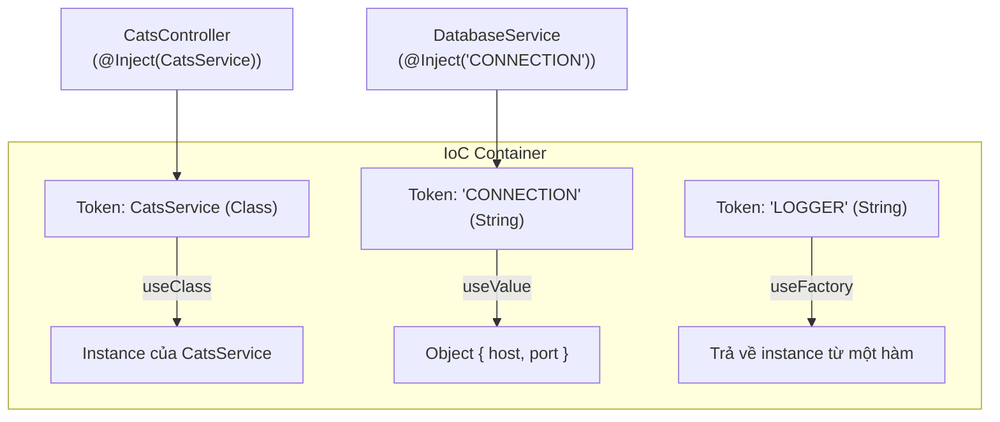

# [NestJS] Custom Providers: Làm Chủ Dependency Injection Nâng Cao

Trong các bài trước, chúng ta đã quen với việc inject các Service thông qua constructor (Standard Providers). Tuy nhiên, khi ứng dụng phức tạp hơn, bạn sẽ cần tới sức mạnh thực sự của Dependency Injection (DI) system mà NestJS cung cấp. Chào mừng bạn đến với thế giới của **Custom Providers**.

<!--truncate-->

## Agenda

**Thời gian đọc ước tính:** ~15 phút

### Learning outcome:
- **Hiểu** được sự khác biệt giữa cú pháp khởi tạo Provider rút gọn (Standard) và cú pháp đầy đủ.
- **Giải thích** được bản chất của DI Token và cách sử dụng Token không phải là Class (String hoặc Symbol).
- **Áp dụng** được 4 loại Custom Providers (`useValue`, `useClass`, `useFactory`, `useExisting`) vào các kịch bản thực tế (Mocking, thay đổi logic theo môi trường).
- **Tự tay** thiết lập và export một Custom Provider có các dependency (phụ thuộc) phức tạp.

---

## Glossary & Vocabulary

**1. Technical Terms (Thuật ngữ kỹ thuật):**
| Term | Vietnamese Meaning & Quick Explain |
| :--- | :--- |
| **DI Token** | Mã định danh DI. Là một "chìa khóa" (có thể là tên Class, String, hoặc Symbol) mà IoC Container dùng để tìm kiếm và trả về đúng đối tượng (instance) tương ứng. |
| **Standard Provider** | Nhà cung cấp tiêu chuẩn. Cách cấu hình Provider cơ bản nhất, dùng chính tên Class làm Token và khởi tạo từ Class đó. |
| **Custom Provider** | Nhà cung cấp tùy chỉnh. Cho phép bạn định nghĩa rõ ràng Token là gì và giá trị thực sự được trả về là gì (một object mock, một class khác, hoặc kết quả từ một hàm). |
| **Transitive Dependency** | Phụ thuộc bắc cầu. Nếu A phụ thuộc B, và B phụ thuộc C, IoC Container sẽ tự động giải quyết (resolve) C trước, rồi khởi tạo B, cuối cùng khởi tạo A. |

**2. Vocabulary Support (Từ vựng học thuật/B1+):**
| Word | Meaning in Context (Nghĩa trong ngữ cảnh) |
| :--- | :--- |
| **Imperatively (adv)** | Một cách mệnh lệnh. Tự tay viết code từng bước để thực hiện một việc (thay vì giao cho Framework tự động xử lý). |
| **Gloss over (v)** | Lướt qua, bỏ qua chi tiết. (Ví dụ: Chúng ta lướt qua chi tiết cơ chế phân tích dependency graph). |
| **Correlate (v)** | Tương quan, khớp với nhau. (Ví dụ: Các tham số trong mảng `inject` phải khớp với tham số của hàm factory). |

---

## 1. WHY — Tại sao Standard Provider không đủ?

Trong các bài học cơ bản, bạn đã thấy cú pháp đăng ký Provider rất ngắn gọn: `providers: [CatsService]`. Cú pháp này hoạt động hoàn hảo cho phần lớn trường hợp khi bạn chỉ cần NestJS tạo ra một instance duy nhất từ chính Class đó.

Tuy nhiên, **vấn đề phát sinh** khi yêu cầu thực tế vượt ra ngoài kịch bản mặc định:
1. **Mocking để Unit Test:** Khi chạy test, bạn không muốn gọi thực tế vào Database. Bạn muốn "đánh tráo" `CatsService` bằng một object giả (mock object).
2. **Logic thay đổi theo môi trường:** Ở môi trường Development, bạn muốn dùng `LocalConfigService`, nhưng ở Production lại muốn dùng `AwsConfigService`. Làm sao để báo cho NestJS thay đổi Class tự động mà không phải sửa code ở mọi Controller?
3. **Khởi tạo động (Dynamic Instantiation):** Provider của bạn cần lấy dữ liệu từ một API thứ ba hoặc đọc file cấu hình trước khi khởi tạo xong. Một Class constructor thuần túy không thể làm tác vụ bất đồng bộ (async) một cách linh hoạt.
4. **Tái sử dụng instance:** Bạn muốn hai Token khác nhau nhưng lại cùng trỏ về một instance duy nhất trong bộ nhớ (Alias).

**Giải pháp:** NestJS cung cấp cơ chế **Custom Providers** để bạn can thiệp sâu vào quá trình liên kết giữa *DI Token* và *Implementation* (Thực thi thực tế).

---

## 2. WHAT — Bản chất của Custom Providers

### 2.1. Giải phẫu cú pháp (Definition Anatomy)

Để hiểu Custom Provider, trước tiên chúng ta phải "giải phẫu" Standard Provider. Khi bạn viết cú pháp rút gọn `providers: [CatsService]`, dưới nền NestJS thực chất dịch nó thành cú pháp đầy đủ sau:

```typescript
providers: [
  {
    provide: CatsService,   // DI Token: Đây là cái mà Controller sẽ "xin"
    useClass: CatsService,  // Implementation: Đây là class mà Nest sẽ khởi tạo (bằng từ khóa new)
  },
];
```

Giải phẫu từng phần:
- **`provide`** (*Cung cấp*): Đây là **DI Token**. Nó đóng vai trò là "chìa khóa". Khi Controller khai báo `constructor(private catsService: CatsService)`, nó đang cầm chìa khóa `CatsService` đến kho IoC Container để xin đồ.
- **`useClass` / `useValue` / `useFactory`** (*Sử dụng...*): Đây là **Implementation**. Chỉ ra chính xác "món đồ" nào sẽ được trả về khi có người dùng chìa khóa trên để xin.

### 2.2. Non-class-based provider tokens (Token không phải là Class)

Token không nhất thiết phải là một Class. Nó có thể là một chuỗi (String) hoặc một Symbol. Điều này rất hữu ích khi bạn muốn inject một hằng số, một cấu hình, hoặc một object không thuộc bất kỳ Class nào.



---

## 3. HOW — 4 Chiến Lược Custom Provider

### 3.1. `useValue` — Tiêm một giá trị cố định (Value Provider)

Sử dụng `useValue` khi bạn muốn thay thế một implementation thật bằng một mock object, hoặc khi bạn muốn đưa một thư viện bên ngoài / hằng số vào IoC Container.

**Ví dụ: Mocking trong Testing**

```typescript
// filename: src/app.module.ts
import { Module } from '@nestjs/common';
import { CatsService } from './cats.service';

// Tạo một object giả lập có cùng interface với CatsService thật
const mockCatsService = {
  findAll: () => ['Mock Cat 1', 'Mock Cat 2'],
};

@Module({
  providers: [
    {
      provide: CatsService,      // Token: Vẫn dùng tên Class để controller không bị ảnh hưởng
      useValue: mockCatsService, // Value: Trả về object giả lập thay vì khởi tạo Class thật
    },
  ],
})
export class AppModule {}
```

**Ví dụ: Dùng String Token**

```typescript
// Định nghĩa hằng số
const connection = { host: 'localhost', port: 5432 };

@Module({
  providers: [
    {
      provide: 'DATABASE_CONNECTION', // Token là một chuỗi string
      useValue: connection,           // Value trả về
    },
  ],
})
export class DatabaseModule {}
```

**Cách inject String Token:**
Bởi vì Token không phải là một kiểu dữ liệu (Class) hợp lệ trong TypeScript, bạn không thể viết `constructor(private conn: 'DATABASE_CONNECTION')`. Bạn phải dùng Decorator `@Inject()`.

```typescript
// filename: src/cats.repository.ts
import { Injectable, Inject } from '@nestjs/common';

@Injectable()
export class CatsRepository {
  constructor(
    @Inject('DATABASE_CONNECTION') private dbConnection: any,
  ) {}
}
```

---

### 3.2. `useClass` — Thay đổi Class linh hoạt theo ngữ cảnh (Class Provider)

`useClass` cho phép bạn quyết định linh hoạt Class nào sẽ được sử dụng để xử lý logic, dựa trên một điều kiện (ví dụ: biến môi trường).

**Ví dụ: Đổi cấu hình theo Environment**

```typescript
// filename: src/app.module.ts
import { Module } from '@nestjs/common';

const configServiceProvider = {
  provide: ConfigService, // Token
  useClass:
    process.env.NODE_ENV === 'development'
      ? DevelopmentConfigService   // Trả về class này ở môi trường Dev
      : ProductionConfigService,   // Trả về class này ở môi trường Prod
};

@Module({
  providers: [configServiceProvider],
})
export class AppModule {}
```

> **Lợi ích:** Bất kỳ class nào inject `ConfigService` sẽ không cần quan tâm nó đang ở môi trường nào. NestJS đã "đánh tráo" implementation dưới nền.

---

### 3.3. `useFactory` — Khởi tạo động với Logic và Phụ thuộc (Factory Provider)

`useFactory` là cơ chế mạnh mẽ nhất. Nó cho phép bạn tạo ra một Provider thông qua một hàm (function). Hàm này có thể chứa logic phức tạp và quan trọng nhất: **Nó có thể nhận các provider khác làm tham số**.

**Ví dụ: Tạo Database Connection dựa trên Option Service**

```typescript
// filename: src/app.module.ts
const connectionProvider = {
  provide: 'CONNECTION', // Token
  
  // Hàm factory: Nhận vào optionsProvider và trả về instance
  useFactory: (optionsProvider: OptionsProvider) => {
    const options = optionsProvider.getDbConfig();
    return new DatabaseConnection(options);
  },
  
  // Mảng inject: NestJS sẽ tìm các provider này và truyền vào hàm useFactory theo đúng thứ tự
  inject: [OptionsProvider], 
};

@Module({
  providers: [
    OptionsProvider, // Phải khai báo provider này để Nest biết
    connectionProvider,
  ],
})
export class AppModule {}
```

> **Nguyên tắc "Correlate" (Tương quan):** Các thành phần trong mảng `inject` phải khớp hoàn toàn về thứ tự và số lượng với các tham số của hàm `useFactory`.

Bạn cũng có thể định nghĩa một dependency là tùy chọn (*optional*) trong mảng `inject` bằng cú pháp object: `inject: [{ token: 'SomeOptionalProvider', optional: true }]`.

---

### 3.4. `useExisting` — Đặt bí danh (Alias Provider)

`useExisting` giúp tạo ra một "bí danh" (alias) cho một Provider đã tồn tại. Nếu bạn có 2 Token khác nhau, nhưng bạn muốn chúng đều cùng trỏ về một instance duy nhất trong bộ nhớ (Singleton), đây là công cụ bạn cần.

```typescript
// filename: src/app.module.ts
@Injectable()
class LoggerService { /* ... */ }

const loggerAliasProvider = {
  provide: 'AliasedLoggerService', // Token mới (Bí danh)
  useExisting: LoggerService,      // Trỏ về Token cũ
};

@Module({
  providers: [LoggerService, loggerAliasProvider],
})
export class AppModule {}
```

> **Kết quả:** Khi Class A gọi `@Inject('AliasedLoggerService')` và Class B gọi `constructor(private logger: LoggerService)`, cả hai sẽ nhận được **cùng một instance** của `LoggerService`.

---

### 3.5. Exporting Custom Providers

Giống như Standard Providers, Custom Providers bị giới hạn phạm vi (scoped) trong Module khai báo chúng. Để chia sẻ chúng cho các Module khác, bạn phải export bằng Token hoặc nguyên cả object Provider.

```typescript
// Export bằng Token (String)
@Module({
  providers: [connectionFactory],
  exports: ['CONNECTION'], // Trùng với thuộc tính provide
})
export class DatabaseModule {}

// Export bằng toàn bộ object
@Module({
  providers: [connectionFactory],
  exports: [connectionFactory], 
})
export class DatabaseModule {}
```

---

## 4. Discussion Questions

Hãy thử suy luận để củng cố kiến thức:

1. **Vấn đề Scope với `useFactory`:** Nếu trong hàm `useFactory` bạn trả về `new DatabaseConnection()`, liệu mỗi lần có một Service xin inject `'CONNECTION'`, NestJS có chạy lại hàm factory này để tạo connection mới không? Tại sao? (Gợi ý: Nhớ lại kiến thức về Singleton mặc định của NestJS).
2. **`useClass` vs `useExisting`:** Một developer viết cú pháp sau: 
   `{ provide: 'LoggerAlias', useClass: LoggerService }`. 
   Điều này khác gì so với việc dùng `useExisting: LoggerService`? Liệu số lượng instance được sinh ra trong bộ nhớ có giống nhau không? (Gợi ý: `useClass` sẽ thực thi từ khóa `new` thêm một lần nữa).
3. **Môi trường thực tế:** Giả sử bạn dùng thư viện thứ ba (ví dụ `stripe` SDK không được thiết kế cho NestJS). Bạn sẽ làm thế nào để bọc thư viện này thành một Provider và inject nó khắp ứng dụng một cách chuẩn xác theo phong cách của NestJS?

---

## 5. References

- [NestJS Official Docs - Custom Providers](https://docs.nestjs.com/fundamentals/custom-providers)

---

*Made by Anh Tu - Share to be share*
