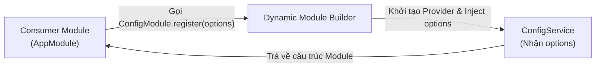

# [NestJS] Dynamic Modules: Kiến Trúc Plugin & ConfigurableModuleBuilder

Các Module thông thường (Static Module) được thiết kế để liên kết với nhau một cách cố định. Tuy nhiên, khi bạn muốn xây dựng một Module dùng chung — giống như một "Plugin" — mà mỗi dự án hoặc mỗi Feature lại muốn cấu hình nó theo một cách khác nhau, Static Module không thể đáp ứng được. Đó là lúc chúng ta cần đến **Dynamic Modules**.

<!--truncate-->

## Agenda

**Thời gian đọc ước tính:** ~18 phút

### Learning outcome:
- **Hiểu** được giới hạn của Static Module và tại sao Dynamic Module ra đời để giải quyết bài toán "Cấu hình tại thời điểm Import".
- **Giải phẫu** được cấu trúc trả về của một Dynamic Module (`module`, `providers`, `exports`).
- **Phân biệt** được quy ước đặt tên cộng đồng: `register`, `forRoot`, và `forFeature`.
- **Tự tay** thiết kế một Dynamic Module hiện đại bằng công cụ mạnh mẽ `ConfigurableModuleBuilder` thay vì viết code thủ công.

---

## Glossary & Vocabulary

**1. Technical Terms (Thuật ngữ kỹ thuật):**
| Term | Vietnamese Meaning & Quick Explain |
| :--- | :--- |
| **Static Module** | Module tĩnh. Module được liên kết cố định thông qua decorators (`@Module()`), không thể thay đổi hành vi từ bên ngoài khi import. |
| **Dynamic Module** | Module động. Module được tạo ra tại Runtime (thời điểm chạy) bằng cách gọi một hàm (method) trả về một object cấu hình Module. |
| **ConfigurableModuleBuilder** | Trình xây dựng Module có thể cấu hình. Công cụ (từ NestJS v9) giúp tự động sinh ra các hàm `register`, `registerAsync` và Injection Token chuẩn hóa. |
| **Blueprint** | Bản thiết kế. Một khuôn mẫu hoặc bộ khung để tự động sinh ra các thành phần lặp đi lặp lại. |

**2. Vocabulary Support (Từ vựng học thuật/B1+):**
| Word | Meaning in Context (Nghĩa trong ngữ cảnh) |
| :--- | :--- |
| **Transitively (adv)** | Một cách bắc cầu. Khởi tạo A dẫn đến khởi tạo B, B dẫn đến khởi tạo C. |
| **Analogous (adj)** | Tương tự, giống như. (Ví dụ: Module dùng chung *tương tự* như một khái niệm Plugin). |
| **Mutually exclusive (adj)** | Loại trừ lẫn nhau. (Ví dụ: Bạn chỉ được chọn 1 trong 3: `useFactory`, `useClass`, hoặc `useExisting`). |

---

## 1. WHY — Vấn đề của Static Modules là gì?

Ở các bài trước, khi Module A import Module B, mọi thứ đều "tĩnh":

```typescript
@Module({
  imports: [UsersModule], // Static binding
})
export class AuthModule {}
```

NestJS đọc `@Module()` metadata và tự động khởi tạo mọi thứ một cách hoàn hảo. Nhưng sự "tĩnh" này có một nhược điểm chí mạng: **Consumer (Module đi import) không có cách nào can thiệp vào cách Host Module (Module được import) được cấu hình.**

**Bài toán thực tế:**
Bạn viết ra một `ConfigModule` chung cho cả công ty. Ở dự án A, bạn muốn nó đọc file cấu hình nằm ở thư mục `./config`. Ở dự án B, bạn muốn nó đọc ở `./env-vars`.
Nếu dùng Static Module, bạn phải "hard-code" đường dẫn này bên trong `ConfigModule` — điều này phá vỡ tính tái sử dụng.

**Giải pháp:** Chúng ta cần một "API" để Module A có thể truyền tham số vào Module B ngay tại thời điểm import. Đây chính là **Dynamic Module**. Thay vì truyền một tên Class, bạn truyền lời gọi một hàm trả về Module.

```typescript
@Module({
  // Dynamic binding: Truyền cấu hình { folder: './config' } vào module
  imports: [ConfigModule.register({ folder: './config' })], 
})
export class AppModule {}
```

---

## 2. WHAT — Dynamic Module là gì?

### 2.1. Định nghĩa kỹ thuật

Dynamic Module (*Module động*) là một module được tạo ra bằng code (programmatically) thay vì dùng Decorator. Nó là một hàm static nằm trong Class Module, trả về một đối tượng có kiểu dữ liệu là `DynamicModule`.



### 2.2. Definition Anatomy — Giải phẫu đối tượng `DynamicModule`

Một Dynamic Module phải trả về một object có cấu trúc gần như y hệt với những gì bạn truyền vào `@Module()` decorator, cộng thêm một thuộc tính bắt buộc là `module`.

```typescript
static register(): DynamicModule {
  return {
    module: ConfigModule,      // BẮT BUỘC: Tên của Class Module
    providers: [ConfigService],// Tùy chọn: Danh sách Providers
    exports: [ConfigService],  // Tùy chọn: Export ra ngoài
    imports: [],               // Tùy chọn: Các Module con khác
  };
}
```

- **`module`**: Chỉ định rõ Class nào đang đại diện cho Module này.
- Các thuộc tính còn lại hoàn toàn giống với Metadata của `@Module()`.

---

## 3. HOW — Các chiến lược thiết kế Dynamic Module

### 3.1. Phân biệt Conventions: `register`, `forRoot`, và `forFeature`

Bạn không bắt buộc phải đặt tên hàm là `register`. NestJS không quy định, nhưng cộng đồng đã thống nhất một bộ quy ước (Conventions) sau:

1. **`register`**: Dùng khi bạn cấu hình một Dynamic Module cho **riêng Module đang gọi nó** (Cục bộ). Ví dụ: `HttpModule.register({ timeout: 5000 })` ở `OrdersModule` sẽ không ảnh hưởng đến `HttpModule` ở `UsersModule`.
2. **`forRoot`**: Dùng khi bạn cấu hình một Dynamic Module **một lần duy nhất** cho toàn bộ ứng dụng (Global). Ví dụ: `TypeOrmModule.forRoot({...})`, `GraphQLModule.forRoot({...})`. Kết nối Database này sẽ được dùng chung khắp nơi.
3. **`forFeature`**: Dùng ở các Module con để **kế thừa** kết nối từ `forRoot` nhưng bổ sung thêm cấu hình đặc thù. Ví dụ: `TypeOrmModule.forFeature([UserEntity])` báo cho TypeORM biết để tạo thêm Provider cho Repository của bảng User.

### 3.2. Cách triển khai thủ công (Manual Implementation)

Để làm cho Module thực sự "động", chúng ta phải lấy tham số cấu hình (ví dụ `options`) truyền từ ngoài vào, đăng ký nó thành một **Custom Provider** (`useValue`), và sau đó inject nó vào Service.

```typescript
// filename: src/config/config.module.ts
import { DynamicModule, Module } from '@nestjs/common';
import { ConfigService } from './config.service';

@Module({})
export class ConfigModule {
  static register(options: Record<string, any>): DynamicModule {
    return {
      module: ConfigModule,
      providers: [
        {
          provide: 'CONFIG_OPTIONS', // Biến options thành một Provider
          useValue: options,         // Giá trị được truyền từ ngoài vào
        },
        ConfigService,
      ],
      exports: [ConfigService],
    };
  }
}
```

Trong Service, bạn dùng `@Inject()` để lấy `options` ra:

```typescript
// filename: src/config/config.service.ts
import { Injectable, Inject } from '@nestjs/common';

@Injectable()
export class ConfigService {
  constructor(
    // Xin IoC Container cấp cho Token 'CONFIG_OPTIONS'
    @Inject('CONFIG_OPTIONS') private options: Record<string, any>
  ) {
    console.log('Thư mục cấu hình là:', this.options.folder);
  }
}
```

### 3.3. Cuộc cách mạng: `ConfigurableModuleBuilder`

Việc tạo tay các hàm `register` như trên khá đơn giản. Tuy nhiên, trong thực tế, các "Plugin" thường đòi hỏi khả năng nạp cấu hình bất đồng bộ (ví dụ: lấy cấu hình DB từ Secret Manager). Viết tay các hàm `registerAsync`, hỗ trợ `useFactory`, `useClass`, `useExisting` là một cơn ác mộng boilerplate.

Từ NestJS v9, `ConfigurableModuleBuilder` ra đời để giải quyết triệt để vấn đề này. Nó tự động sinh ra toàn bộ các hàm static cần thiết.

**Bước 1: Khai báo kiểu dữ liệu của Options và tạo Builder**

```typescript
// filename: src/config/config.module-definition.ts
import { ConfigurableModuleBuilder } from '@nestjs/common';

export interface ConfigModuleOptions {
  folder: string;
}

// Builder sẽ tự động sinh ra Class và Token
export const { ConfigurableModuleClass, MODULE_OPTIONS_TOKEN } =
  new ConfigurableModuleBuilder<ConfigModuleOptions>().build();
```

**Bước 2: Cho Module kế thừa Class được sinh ra**

```typescript
// filename: src/config/config.module.ts
import { Module } from '@nestjs/common';
import { ConfigService } from './config.service';
import { ConfigurableModuleClass } from './config.module-definition';

@Module({
  providers: [ConfigService],
  exports: [ConfigService],
})
// Chỉ cần extend, ConfigModule giờ đã có sẵn .register() và .registerAsync()
export class ConfigModule extends ConfigurableModuleClass {}
```

**Bước 3: Inject cấu hình trong Service bằng Token sinh tự động**

```typescript
// filename: src/config/config.service.ts
import { Injectable, Inject } from '@nestjs/common';
import { MODULE_OPTIONS_TOKEN } from './config.module-definition';
import { ConfigModuleOptions } from './interfaces/config-module-options.interface';

@Injectable()
export class ConfigService {
  constructor(
    @Inject(MODULE_OPTIONS_TOKEN) private options: ConfigModuleOptions
  ) {}
}
```

**Lợi ích khổng lồ:** Giờ đây, Consumer có thể nạp cấu hình một cách bất đồng bộ một cách cực kỳ chuyên nghiệp mà tác giả Module không cần viết thêm dòng code nào:

```typescript
// filename: src/app.module.ts
@Module({
  imports: [
    // Gọi hàm async tự sinh
    ConfigModule.registerAsync({
      useFactory: async (httpService: HttpService) => {
        const folder = await httpService.getRemoteConfig();
        return { folder };
      },
      inject: [HttpService], // Inject dependency vào factory
    }),
  ],
})
export class AppModule {}
```

### 3.4. Tùy biến `ConfigurableModuleBuilder` (Nâng cao)

Đôi khi, bạn không muốn hàm tên là `register`, mà muốn nó tên là `forRoot`. Bạn cũng có thể muốn thêm một vài cấu hình "phụ" (*extras*) không cần truyền vào Service (ví dụ cờ `isGlobal` để biến Module thành toàn cục).

```typescript
// filename: src/config/config.module-definition.ts
export const { ConfigurableModuleClass, MODULE_OPTIONS_TOKEN } =
  new ConfigurableModuleBuilder<ConfigModuleOptions>()
    .setClassMethodName('forRoot') // Đổi register() thành forRoot()
    .setExtras(
      { isGlobal: false }, // Tham số phụ mặc định
      (definition, extras) => ({
        ...definition,
        global: extras.isGlobal, // Gắn cờ global cho toàn bộ Dynamic Module
      }),
    )
    .build();
```

Sử dụng:
```typescript
@Module({
  imports: [
    ConfigModule.forRoot({
      folder: './config',
      isGlobal: true, // Cờ này cấu hình Module, nhưng không truyền vào ConfigService
    }),
  ],
})
export class AppModule {}
```

---

## 4. Discussion Questions

1. **Khởi tạo nhiều lần:** Nếu `ModuleA` và `ModuleB` đều import `HttpModule.register({ timeout: 5000 })`, NestJS sẽ tạo ra bao nhiêu instance của `HttpModule` và `HttpService`? Hãy đối chiếu với nguyên tắc Singleton của Static Module.
2. **`forRoot` vs `forFeature`:** Trong TypeORM, tại sao chúng ta chỉ được gọi `forRoot` đúng 1 lần duy nhất ở Root Module, trong khi có thể gọi `forFeature` ở hàng chục Feature Modules khác nhau? Điều gì sẽ xảy ra nếu bạn gọi `forRoot` 2 lần?
3. **Async Pitfall:** Trong `registerAsync`, nếu hàm `useFactory` mất tới 10 giây để resolve do mạng chậm (chờ kết nối DB), điều gì sẽ xảy ra với quá trình khởi động (bootstrap) của toàn bộ ứng dụng NestJS?

---

## 5. References

- [NestJS Official Docs - Dynamic Modules](https://docs.nestjs.com/fundamentals/dynamic-modules)

---

*Made by Anh Tu - Share to be share*
