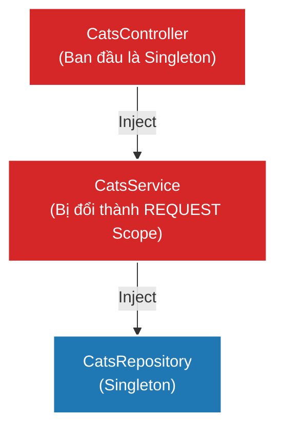

# [NestJS] Injection Scopes: Quản Lý Vòng Đời Của Provider

Trong Node.js, không giống như các ngôn ngữ đa luồng (Multi-Threaded) như Java hay PHP nơi mỗi request được xử lý trên một luồng/tiến trình riêng biệt, Node.js sử dụng kiến trúc Event-Loop đơn luồng. Điều này dẫn đến một sự khác biệt cốt lõi trong cách NestJS quản lý vòng đời (lifetime) của các đối tượng trong bộ nhớ. 

Việc hiểu sai về **Injection Scopes** là nguyên nhân số một gây ra hiện tượng tràn bộ nhớ (Memory Leak) và suy giảm hiệu năng nghiêm trọng cho các ứng dụng NestJS.

<!--truncate-->

## Agenda

**Thời gian đọc ước tính:** ~12 phút

### Learning outcome:
- **Hiểu** được tại sao Singleton lại an toàn và là mặc định trong Node.js.
- **Phân biệt** được 3 loại Scope: `DEFAULT` (Singleton), `REQUEST`, và `TRANSIENT`.
- **Nắm bắt** được tính chất "Lây lan" (Bubble up) của `REQUEST` scope và hệ lụy của nó tới hiệu năng.
- **Ứng dụng** được `REQUEST` provider và `INQUIRER` provider vào các bài toán thực tế (Ví dụ: Multi-tenancy, Logging).

---

## Glossary & Vocabulary

**1. Technical Terms (Thuật ngữ kỹ thuật):**
| Term | Vietnamese Meaning & Quick Explain |
| :--- | :--- |
| **Provider Lifetime** | Vòng đời của Provider. Khoảng thời gian từ lúc một đối tượng được khởi tạo (bằng từ khóa `new`) cho đến khi nó bị dọn dẹp khỏi bộ nhớ. |
| **Singleton Scope** | Phạm vi Độc bản. Chỉ có đúng 1 instance (phiên bản) của Provider được tạo ra và dùng chung cho toàn bộ ứng dụng, bất kể có bao nhiêu request gửi tới. |
| **Request Scope** | Phạm vi Request. Một instance mới tinh sẽ được tạo ra cho *mỗi* request tới server, và bị hủy ngay khi request đó trả về response. |
| **Transient Scope** | Phạm vi Tạm thời. Một instance mới sẽ được tạo ra cho *mỗi* Provider khác xin inject nó (Không dùng chung giữa các Provider). |
| **Garbage-collected** | Thu gom rác. Quá trình bộ nhớ giải phóng các đối tượng không còn được sử dụng để lấy lại không gian lưu trữ. |

**2. Vocabulary Support (Từ vựng học thuật/B1+):**
| Word | Meaning in Context (Nghĩa trong ngữ cảnh) |
| :--- | :--- |
| **Stateless (adj)** | Phi trạng thái. Hệ thống không lưu lại bất kỳ dữ liệu cục bộ nào giữa các request. |
| **Ephemeral (adj)** | Phù du, chớp nhoáng. Tồn tại trong thời gian rất ngắn (Ví dụ: Request-scoped instances là ephemeral). |
| **Inherent (adj)** | Vốn có, bản chất. (Ví dụ: `REQUEST` provider mang bản chất là request-scoped). |

---

## 1. WHY — Tại sao chúng ta cần quan tâm đến Scope?

Khi chuyển từ Spring Boot (Java) hoặc Laravel (PHP) sang NestJS, nhiều lập trình viên mang theo tư duy: *"Mỗi request là một luồng độc lập, nên lưu state (trạng thái) vào biến của Class (this.user) là an toàn"*.

**Trong NestJS, tư duy này là sai lầm và nguy hiểm.**

Mặc định, mọi Provider trong NestJS đều là **Singleton**. Điều đó có nghĩa là nếu có 10.000 người dùng gửi request đến `CatsController`, cả 10.000 request đó đều đang gọi chung vào **cùng một instance duy nhất** của `CatsController` và `CatsService` trong bộ nhớ.

- **Ưu điểm:** Khởi tạo chỉ 1 lần duy nhất lúc app khởi động $\rightarrow$ Tốc độ phản hồi cực nhanh, tốn rất ít RAM.
- **Nhược điểm (Edge cases):** Bạn KHÔNG THỂ lưu thông tin cá nhân của request (ví dụ: `this.currentUser`) vào biến của Class, vì request của User B đến sau sẽ ghi đè biến đó của User A (Race condition).

Vậy, làm sao để giải quyết bài toán:
- Caching dữ liệu tạm thời *chỉ trong phạm vi của 1 request*?
- Lấy thông tin user hiện tại (trong kiến trúc Multi-tenancy)?
- Ghi log đính kèm chính xác Request ID?

Đó là lúc chúng ta phải thay đổi vòng đời mặc định bằng cách sử dụng **Injection Scopes**.

---

## 2. WHAT — Phân loại Injection Scopes

### 2.1. 3 Loại Scope Cốt Lõi

NestJS cung cấp một Enum `Scope` gồm 3 giá trị:

1. **`Scope.DEFAULT` (Singleton):** 
   - 1 instance duy nhất cho toàn bộ App. 
   - Sống cùng với vòng đời của ứng dụng.
2. **`Scope.REQUEST`:**
   - Tạo ra instance mới cho MỖI request.
   - Chết (bị Garbage-collected) sau khi request hoàn thành.
3. **`Scope.TRANSIENT`:**
   - Tạo ra instance mới cho MỖI Consumer (Class nào gọi nó).
   - Ví dụ: `ServiceA` và `ServiceB` cùng inject `LoggerService`. Sẽ có 2 instance của `Logger` được tạo ra.

### 2.2. Sự "Lây lan" của Request Scope (Bubble Up / Scope Hierarchy)

Đặc tính quan trọng nhất của `REQUEST` scope là tính lây lan ngược lên trên cây Dependency Graph.

Hãy xem sơ đồ sau:



**Phân tích sự lây lan:**
- `CatsRepository` là Singleton.
- Bạn cấu hình `CatsService` thành `REQUEST` scope.
- `CatsController` đang inject `CatsService`. Do `CatsService` phải được làm mới với mỗi request, dẫn đến `CatsController` cũng **bắt buộc phải trở thành REQUEST scope**.
- Điều này có nghĩa: Thay vì chỉ có 1 `CatsController`, giờ đây với 30.000 request, NestJS sẽ phải cấp phát bộ nhớ (RAM) và chạy từ khóa `new` để khởi tạo 30.000 `CatsController` và 30.000 `CatsService`.

> **Trade-off (Đánh đổi):** Lạm dụng `REQUEST` scope làm giảm hiệu năng ứng dụng (tăng Latency) do tốn chi phí khởi tạo object và thu gom rác (Garbage Collection). NestJS cảnh báo mức độ suy giảm khoảng ~5% latency, nhưng có thể tệ hơn nếu object của bạn quá nặng.

---

## 3. HOW — Hướng Dẫn Sử Dụng

### 3.1. Khai báo Scope cho Provider và Controller

Để thay đổi Scope, truyền tham số vào Options của `@Injectable()` hoặc `@Controller()`.

```typescript
import { Injectable, Controller, Scope } from '@nestjs/common';

// Cấp Provider
@Injectable({ scope: Scope.REQUEST })
export class CatsService {}

// Cấp Controller
@Controller({
  path: 'cats',
  scope: Scope.REQUEST, // Controller này sẽ tạo mới ở mỗi Request
})
export class CatsController {}
```

Đối với **Custom Providers** (đã học ở bài trước):

```typescript
{
  provide: 'CACHE_MANAGER',
  useClass: CacheManager,
  scope: Scope.TRANSIENT, // Hoặc Scope.REQUEST
}
```

---

### 3.2. Tiêm đối tượng Request nguyên bản (Request Provider)

Lý do lớn nhất khiến chúng ta phải dùng `REQUEST` scope là để lấy được thông tin của Request HTTP nguyên bản (như Headers, Query, User JWT).

Bạn không cần truyền nó qua từng hàm (ví dụ: `service.doSomething(req)`). Thay vào đó, NestJS cung cấp một Token đặc biệt là `REQUEST` (từ `@nestjs/core`).

```typescript
import { Injectable, Scope, Inject } from '@nestjs/common';
import { REQUEST } from '@nestjs/core';
import { Request } from 'express'; // Hoặc FastifyRequest

// BẮT BUỘC: Khi inject REQUEST, Class tự động biến thành REQUEST scope
@Injectable({ scope: Scope.REQUEST })
export class CatsService {
  constructor(
    @Inject(REQUEST) private request: Request
  ) {}

  getTenantId() {
    return this.request.headers['x-tenant-id'];
  }
}
```

> **Lưu ý:** Nếu bạn dùng GraphQL, cấu trúc Request HTTP không tồn tại ở dạng gốc. Bạn phải inject `CONTEXT` (từ `@nestjs/graphql`) thay vì `REQUEST`.

---

### 3.3. Tiêm "Người hỏi" (Inquirer Provider)

Có một bài toán kinh điển: Khi viết `LoggerService`, làm sao để tự động lấy tên của Class đang gọi nó để in ra log?

Ví dụ: `[CatsService] Đã lấy dữ liệu`.

Bạn có thể dùng `Scope.TRANSIENT` kết hợp với Token đặc biệt `INQUIRER` để giải quyết:

```typescript
import { Inject, Injectable, Scope } from '@nestjs/common';
import { INQUIRER } from '@nestjs/core';

// Bắt buộc dùng TRANSIENT: Mỗi class gọi sẽ nhận 1 instance Logger riêng
@Injectable({ scope: Scope.TRANSIENT })
export class MyLoggerService {
  constructor(
    // INQUIRER đại diện cho Class Cha đang inject Logger này
    @Inject(INQUIRER) private parentClass: object
  ) {}

  log(message: string) {
    const parentName = this.parentClass?.constructor?.name || 'Unknown';
    console.log(`[${parentName}] ${message}`);
  }
}
```

Sử dụng:

```typescript
@Injectable()
export class CatsService {
  constructor(private logger: MyLoggerService) {
    // Sẽ tự động in: "[CatsService] Constructor initialized"
    this.logger.log('Constructor initialized'); 
  }
}
```

---

### 3.4. Cứu tinh hiệu năng: Durable Providers (Đọc thêm)

Như đã phân tích ở phần 2.2, `REQUEST` scope lây lan và làm giảm hiệu năng. 
Giả sử bạn có ứng dụng Multi-tenant (10 khách hàng xài chung code, nhưng cắm vào 10 Database khác nhau). Bạn inject `REQUEST` để lấy `x-tenant-id` ở Header. Dù chỉ có 10 tenant, nhưng với 30.000 request, bạn vẫn phải tạo lại Dependency Tree 30.000 lần.

**Giải pháp của NestJS:** `Durable Providers`.
Bằng cách đánh dấu `durable: true`, NestJS sẽ gộp nhóm các request có cùng `tenantId` lại. Thay vì tạo 30.000 cây Dependency, NestJS chỉ tạo đúng **10 cây Dependency (DI Sub-trees)** cho 10 tenant và tái sử dụng chúng (giống như Singleton nhưng cấp độ nhóm).

```typescript
@Injectable({ 
  scope: Scope.REQUEST, 
  durable: true // Đánh dấu là Provider bền vững
})
export class DatabaseService {}
```
*(Đây là một tính năng kiến trúc hệ thống chuyên sâu, bạn chỉ cần dùng khi làm sản phẩm SaaS nhiều tenant).*

---

## 4. Discussion Questions

Hãy thử suy luận để củng cố kiến thức:

1. **Cái bẫy Singleton:** Một bạn Intern viết `users: any[] = []` bên trong `UsersService` (đang mặc định Singleton) để lưu trữ danh sách user đang online. Theo bạn, khi 2 request gọi cùng lúc, điều gì rủi ro sẽ xảy ra?
2. **Ngoại lệ:** Tài liệu NestJS ghi: *"Websocket Gateways không được phép dùng `REQUEST` scope"*. Dựa vào bản chất của giao thức Websocket (Kết nối 2 chiều duy trì liên tục), tại sao `REQUEST` scope lại vô nghĩa hoặc gây lỗi trong trường hợp này?
3. **Transient vs Singleton:** Nếu `CatsService` là Singleton và nó inject một `LoggerService` là Transient. Liệu `LoggerService` này có được làm mới mỗi khi một request gọi tới `CatsService` không? Tại sao? (Gợi ý: Nhớ lại khi nào `CatsService` được khởi tạo).

---

## 5. References

- [NestJS Official Docs - Injection Scopes](https://docs.nestjs.com/fundamentals/injection-scopes)

---

*Made by Anh Tu - Share to be share*
