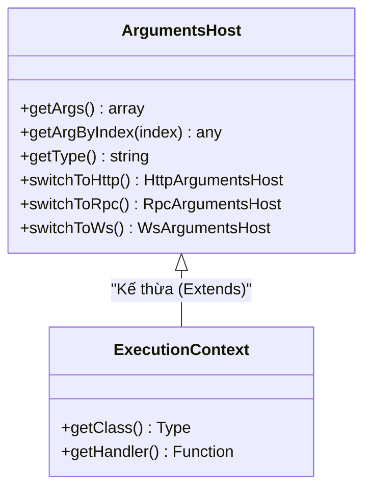

# [NestJS] Execution Context & Reflection: Linh Hồn Của Middleware

Một trong những điểm ăn tiền nhất của NestJS là khả năng chạy trên nhiều môi trường khác nhau: HTTP Server (Express/Fastify), WebSockets, Microservices (RPC), và cả GraphQL. 

Nhưng điều này tạo ra một bài toán khó: Nếu bạn viết một `AuthGuard` để kiểm tra quyền đăng nhập, làm sao Guard đó biết cách lấy token từ Request HTTP, hay lấy từ Context của GraphQL? Lời giải chính là **ArgumentsHost** và **ExecutionContext**.

<!--truncate-->

## Agenda

**Thời gian đọc ước tính:** ~14 phút

### Learning outcome:
- **Hiểu** được tại sao NestJS phải trừu tượng hóa các tham số đầu vào thay vì truyền trực tiếp đối tượng `Request` / `Response` của Express.
- **Phân biệt** được vai trò của `ArgumentsHost` (bọc tham số) và `ExecutionContext` (chứa thông tin class/handler).
- **Thao tác** chuyển đổi ngữ cảnh an toàn bằng các hàm `switchToHttp()`, `switchToRpc()`.
- **Làm chủ** cơ chế Reflection: Tự tạo Custom Decorator và đọc Metadata từ Guard/Interceptor bằng class `Reflector`.

---

## Glossary & Vocabulary

**1. Technical Terms (Thuật ngữ kỹ thuật):**
| Term | Vietnamese Meaning & Quick Explain |
| :--- | :--- |
| **ArgumentsHost** | Máy chủ chứa tham số. Một class đóng vai trò làm lớp trừu tượng (abstraction), bọc lại tất cả các tham số gốc truyền vào handler (Ví dụ: `[req, res, next]` của Express). |
| **ExecutionContext** | Ngữ cảnh thực thi. Kế thừa từ `ArgumentsHost`, cung cấp thêm thông tin về việc Request hiện tại đang chuẩn bị gọi vào Controller nào và Hàm (Handler) nào. |
| **Reflector** | Bộ phản xạ. Một class tiện ích của NestJS dùng để đọc Metadata (Dữ liệu đặc tả) đã được gắn lên Class hoặc Handler thông qua Decorator. |
| **Metadata** | Dữ liệu đặc tả. Những thông tin bổ sung gắn kèm với code (Ví dụ: Đánh dấu hàm này cần quyền `'admin'`). |

**2. Vocabulary Support (Từ vựng học thuật/B1+):**
| Word | Meaning in Context (Nghĩa trong ngữ cảnh) |
| :--- | :--- |
| **Abstraction (n)** | Sự trừu tượng hóa. Che giấu sự phức tạp của nền tảng bên dưới (Express, Fastify) để cung cấp một API chung nhất. |
| **Pluck (v)** | Nhổ, rút ra. (Ví dụ: Rút một tham số cụ thể ra khỏi mảng bằng chỉ mục index). |
| **Selectively (adv)** | Một cách có chọn lọc. (Ví dụ: Ghi đè cấu hình một cách có chọn lọc cho từng hàm). |

---

## 1. WHY — Tại sao không dùng trực tiếp `req` và `res`?

Nếu bạn đã từng code Express.js, bạn viết Middleware thế này:
```javascript
function authMiddleware(req, res, next) {
  const token = req.headers.authorization;
  // ...
}
```

Nhưng trong NestJS, bạn có thể tạo ra một Guard và gắn nó cho **cả REST API lẫn GraphQL**. 
- Ở REST API, tham số là: `(req, res, next)`.
- Ở GraphQL, tham số là: `(root, args, context, info)`.

Nếu NestJS truyền trực tiếp mảng tham số này vào Guard, code của bạn sẽ sập ngay lập tức khi tái sử dụng ở nền tảng khác vì bạn gọi `req.headers` trên đối tượng `root` của GraphQL.

**Giải pháp:** NestJS bọc tất cả mảng tham số lộn xộn này vào một object duy nhất là `ArgumentsHost`. Nó cung cấp các hàm tiện ích (`switchToHttp`, `switchToRpc`) để ép kiểu (Type Casting) một cách an toàn, giúp bạn lấy đúng đối tượng mình cần.

---

## 2. WHAT — Giải phẫu ArgumentsHost & ExecutionContext

### 2.1. Sơ đồ Kế thừa (Inheritance)

`ExecutionContext` thực chất là phiên bản nâng cấp của `ArgumentsHost`.



### 2.2. Sự khác biệt cốt lõi

- Dùng **`ArgumentsHost`**: Khi bạn đứng ở **Exception Filter** (Vì lúc này lỗi đã văng ra, không cần biết Controller nào đang chạy nữa, chỉ cần lấy Response để trả về lỗi).
- Dùng **`ExecutionContext`**: Khi bạn đứng ở **Guard** hoặc **Interceptor** (Vì bạn cần biết người dùng đang chuẩn bị gọi vào hàm nào, class nào để quyết định có cho phép chạy tiếp hay không).

---

## 3. HOW — Ứng dụng thực chiến

### 3.1. Chuyển đổi ngữ cảnh (Context Switch)

Trong Guard hoặc Filter, thay vì lấy tham số bừa bãi bằng mảng `host.getArgs()`, hãy **luôn luôn** kiểm tra nền tảng và dùng hàm `switchTo...`.

```typescript
import { CanActivate, ExecutionContext, Injectable } from '@nestjs/common';
import { Request } from 'express';

@Injectable()
export class AuthGuard implements CanActivate {
  canActivate(context: ExecutionContext): boolean {
    // 1. Kiểm tra môi trường
    if (context.getType() === 'http') {
      
      // 2. Ép kiểu sang HTTP một cách an toàn
      const httpCtx = context.switchToHttp();
      const request = httpCtx.getRequest<Request>();
      
      console.log('HTTP Path:', request.url);
      return true;

    } else if (context.getType() === 'rpc') {
      const rpcCtx = context.switchToRpc();
      const data = rpcCtx.getData(); // Payload của Microservice
      return true;
    }
    
    return false;
  }
}
```

### 3.2. Lấy thông tin Controller đang thực thi

`ExecutionContext` cho phép bạn biết chính xác Request đang đi về đâu:

```typescript
const handlerName = context.getHandler().name; // Trả về tên hàm: ví dụ "create"
const className = context.getClass().name;     // Trả về tên Class: ví dụ "CatsController"
```

Nhưng thông tin này chưa đủ sức mạnh. Sức mạnh thực sự nằm ở việc kết hợp nó với **Metadata**.

---

### 3.3. Reflection: Đọc Metadata từ Decorator

Hãy tưởng tượng bạn muốn Guard kiểm tra xem User có Role "admin" hay không. Thông tin Role này phải được gắn lên từng Route cụ thể. Chúng ta làm điều đó qua 3 bước:

**Bước 1: Tạo Custom Decorator**

NestJS cung cấp hàm `Reflector.createDecorator<T>()` để tạo decorator an toàn về kiểu dữ liệu (Strongly-typed).

```typescript
// filename: roles.decorator.ts
import { Reflector } from '@nestjs/core';

// Định nghĩa Decorator nhận vào 1 mảng string (danh sách các role)
export const Roles = Reflector.createDecorator<string[]>();
```

**Bước 2: Gắn Decorator lên Controller/Handler**

```typescript
// filename: cats.controller.ts
@Controller('cats')
export class CatsController {
  
  @Post()
  @Roles(['admin']) // Gắn Metadata: Chỉ Admin mới được tạo Cat
  create() {
    return 'Cat created';
  }
}
```

**Bước 3: Đọc Metadata trong Guard bằng Reflector**

Bạn inject class `Reflector` vào Guard, và dùng hàm `get()` truyền vào 2 tham số: (1) Reference của Decorator, (2) Ngữ cảnh (`getHandler` hoặc `getClass`).

```typescript
// filename: roles.guard.ts
import { Injectable, CanActivate, ExecutionContext } from '@nestjs/common';
import { Reflector } from '@nestjs/core';
import { Roles } from './roles.decorator'; // Import cái Decorator vừa tạo

@Injectable()
export class RolesGuard implements CanActivate {
  constructor(private reflector: Reflector) {}

  canActivate(context: ExecutionContext): boolean {
    // Đọc metadata từ Hàm đang được gọi
    const requiredRoles = this.reflector.get(Roles, context.getHandler());
    
    if (!requiredRoles) {
      return true; // Nếu không yêu cầu role gì cả, cho qua
    }
    
    const request = context.switchToHttp().getRequest();
    const user = request.user;
    
    // Kiểm tra xem User có role trùng với metadata yêu cầu không
    return requiredRoles.includes(user.role);
  }
}
```

#### Nâng cao: `getAllAndOverride` vs `getAllAndMerge`

Nếu bạn vừa gắn `@Roles(['user'])` lên toàn bộ Controller, và lại gắn `@Roles(['admin'])` lên 1 hàm cụ thể trong Controller đó, chuyện gì sẽ xảy ra? 
NestJS cho bạn 2 hàm xử lý xung đột:

1. `this.reflector.getAllAndOverride(...)`: Chế độ **Ghi đè**. (Lấy Admin, bỏ User).
2. `this.reflector.getAllAndMerge(...)`: Chế độ **Gộp**. (Trả về mảng `['user', 'admin']`).

```typescript
const roles = this.reflector.getAllAndOverride(Roles, [
  context.getHandler(), // Ưu tiên 1: Đọc từ Hàm
  context.getClass(),   // Ưu tiên 2: Đọc từ Class
]);
```

---

## 4. Discussion Questions

1. **Kiến trúc vĩ mô:** Tại sao NestJS thiết kế `ArgumentsHost` cho Exception Filter, nhưng lại bắt Guard và Interceptor phải dùng `ExecutionContext`? Tại sao Exception Filter không cần gọi `context.getHandler()`? (Gợi ý: Lỗi xảy ra ở đâu trong vòng đời Request?).
2. **Metadata vs Biến cục bộ:** Tại sao chúng ta phải dùng `@SetMetadata` hoặc `Reflector.createDecorator` thay vì khởi tạo một biến tĩnh (static variable) trong Class Controller? Điều này có liên quan gì đến cơ chế Reflection của TypeScript?
3. **Hiệu năng:** Việc gọi `Reflector.get()` trên mỗi request trong một Global Guard có làm chậm ứng dụng không? (Gợi ý: Dữ liệu Metadata được lưu trữ ở đâu và khi nào?).

---

## 5. References

- [NestJS Official Docs - Execution Context](https://docs.nestjs.com/fundamentals/execution-context)

---

*Made by Anh Tu - Share to be share*
