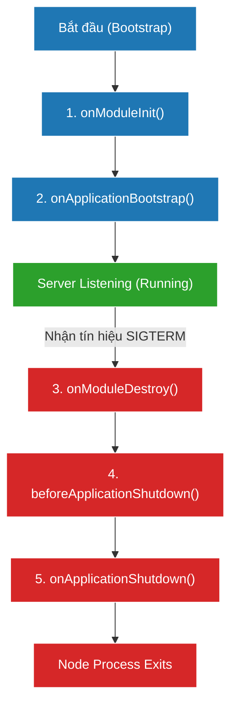

# [NestJS] Lifecycle Events: Quản Lý Vòng Đời Ứng Dụng

Bất kỳ hệ thống phần mềm nào cũng giống như một sinh vật: Nó được sinh ra (khởi động), nó hoạt động (nhận request), và cuối cùng nó chết đi (tắt server). Trong môi trường Production, việc kiểm soát quá trình "chết đi" một cách êm ái (Graceful Shutdown) còn quan trọng hơn cả lúc khởi động. 

NestJS cung cấp một hệ thống **Lifecycle Hooks** (Các điểm neo vòng đời) vô cùng mạnh mẽ để bạn can thiệp vào từng khoảnh khắc này.

<!--truncate-->

## Agenda

**Thời gian đọc ước tính:** ~10 phút

### Learning outcome:
- **Hiểu** được 3 giai đoạn của vòng đời ứng dụng NestJS (Initializing, Running, Terminating).
- **Ghi nhớ** thứ tự kích hoạt của 5 Hooks quan trọng nhất.
- **Biết cách** sử dụng `OnModuleInit` để trì hoãn việc mở cổng (port) cho đến khi kết nối Database thành công.
- **Thiết lập** được cơ chế Graceful Shutdown với `enableShutdownHooks()` để không làm gián đoạn Request đang chạy khi deploy bản mới.

---

## Glossary & Vocabulary

**1. Technical Terms (Thuật ngữ kỹ thuật):**
| Term | Vietnamese Meaning & Quick Explain |
| :--- | :--- |
| **Lifecycle Hook** | Điểm neo vòng đời. Một phương thức đặc biệt được Framework tự động gọi khi ứng dụng bước vào một giai đoạn cụ thể. |
| **Bootstrap** | Quá trình mồi / Khởi động. Quá trình NestJS đọc các Decorators, xây dựng Dependency Graph và khởi tạo các Singleton Provider. |
| **Graceful Shutdown** | Tắt máy êm ái. Quá trình server từ chối nhận request mới, nhưng vẫn cố gắng xử lý nốt các request đang dang dở trước khi thực sự thoát. |
| **SIGTERM / SIGINT** | Tín hiệu hệ thống. Dấu hiệu mà Hệ điều hành (hoặc Docker/Kubernetes) gửi đến ứng dụng Node.js yêu cầu nó phải dừng lại. |

**2. Vocabulary Support (Từ vựng học thuật/B1+):**
| Word | Meaning in Context (Nghĩa trong ngữ cảnh) |
| :--- | :--- |
| **Unpredictable (adj)** | Không thể đoán trước. (Ví dụ: Vòng đời của một Request-scoped provider là không thể đoán trước đối với Framework). |
| **Opt-in (v)** | Chủ động chọn tham gia. (Ví dụ: Tính năng Shutdown Hooks mặc định bị tắt, bạn phải *opt-in* để bật nó lên). |
| **Gracefully (adv)** | Một cách duyên dáng / êm ái. (Ví dụ: Đóng các kết nối database một cách êm ái). |

---

## 1. WHY — Tại sao phải quản lý Vòng đời?

**Vấn đề 1: Lỗi khi khởi động (Cold Start)**
Giả sử ứng dụng của bạn cần kết nối đến Redis Cache. Nếu server mở cổng (Listen port 3000) ngay lập tức, trong khi kết nối Redis mất 2 giây mới xong, thì những User truy cập vào giây đầu tiên sẽ bị lỗi `Redis Connection Error`.
$\rightarrow$ Cần một cơ chế để bảo NestJS: *"Chờ kết nối Redis thành công rồi mới mở cổng"*.

**Vấn đề 2: Dữ liệu bị treo khi tắt server (Zero-downtime Deployment)**
Khi bạn deploy phiên bản mới lên Kubernetes, K8s sẽ gửi tín hiệu tắt (kill) server cũ. Nếu server cũ tắt ngay lập tức, hàng trăm giao dịch thanh toán đang xử lý dở dang sẽ bị đứt kết nối (Downtime).
$\rightarrow$ Cần một cơ chế để bảo NestJS: *"Từ chối request mới, chờ 5 giây xử lý nốt các request cũ, đóng connection DB an toàn rồi mới tắt"*.

Lifecycle Hooks sinh ra để giải quyết 2 bài toán sống còn này.

---

## 2. WHAT — Chuỗi sự kiện Vòng đời (Lifecycle Sequence)

Vòng đời của một ứng dụng NestJS được chia làm 3 pha chính:

1. **Initializing (Khởi tạo):** Resolve dependencies và gọi hooks khởi tạo.
2. **Running (Đang chạy):** Lắng nghe port và xử lý Request.
3. **Terminating (Chấm dứt):** Nhận tín hiệu tắt và dọn dẹp tài nguyên.



> [!WARNING] Ngoại lệ quan trọng
> Các Lifecycle Hooks **KHÔNG** hoạt động đối với các Class được cấu hình là `Scope.REQUEST` hoặc `Scope.TRANSIENT`. Chúng chỉ hoạt động với các Provider/Controller là **Singleton**. 

---

## 3. HOW — Hướng dẫn triển khai Hooks

### 3.1. Khởi tạo Bất đồng bộ (Asynchronous Initialization)

NestJS cho phép các Hooks trả về một `Promise`. Trình khởi động (Bootstrap) sẽ bị **tạm dừng** (await) cho đến khi Promise đó được giải quyết (resolved).

Để sử dụng, bạn nên `implements` Interface tương ứng để lấy gợi ý code từ TypeScript.

```typescript
import { Injectable, OnModuleInit, OnApplicationBootstrap } from '@nestjs/common';

@Injectable()
export class DatabaseService implements OnModuleInit, OnApplicationBootstrap {
  
  // Chạy ngay sau khi DatabaseService được tạo bằng từ khóa new
  async onModuleInit() {
    console.log('1. Bắt đầu kết nối Database...');
    await this.connectToDb(); 
    console.log('2. Kết nối Database thành công!');
    // NestJS sẽ CHỜ lệnh này xong mới đi tiếp
  }

  // Chạy sau khi TẤT CẢ các module trong app đã init xong, 
  // nhưng TRƯỚC KHI server mở cổng (app.listen)
  onApplicationBootstrap() {
    console.log('3. Sẵn sàng nhận Request!');
  }
  
  private async connectToDb() {
    return new Promise(resolve => setTimeout(resolve, 2000));
  }
}
```

---

### 3.2. Kích hoạt Graceful Shutdown (Application Shutdown)

Mặc định, các Hooks dành cho việc tắt server (Phase 3) bị **TẮT** để tiết kiệm tài nguyên bộ nhớ (vì việc lắng nghe tín hiệu OS tốn chút ít RAM).

Nếu bạn deploy lên K8s, Docker, Heroku, bạn **bắt buộc phải bật nó lên** trong file `main.ts`.

```typescript
// filename: main.ts
import { NestFactory } from '@nestjs/core';
import { AppModule } from './app.module';

async function bootstrap() {
  const app = await NestFactory.create(AppModule);

  // Bật tính năng lắng nghe tín hiệu tắt (SIGTERM, SIGINT)
  app.enableShutdownHooks();

  await app.listen(3000);
}
bootstrap();
```

Sau khi đã bật, bạn có thể implement các hook dọn dẹp trong Service:

```typescript
import { Injectable, OnApplicationShutdown, OnModuleDestroy } from '@nestjs/common';

@Injectable()
export class RedisCacheService implements OnModuleDestroy, OnApplicationShutdown {
  
  // Chạy đầu tiên khi nhận tín hiệu tắt
  onModuleDestroy() {
    console.log('Đang dọn dẹp dữ liệu rác trước khi tắt...');
  }

  // Chạy cuối cùng, ngay trước khi Node process thực sự thoát
  onApplicationShutdown(signal: string) {
    console.log(`Nhận tín hiệu tắt hệ thống: ${signal}`); // Ví dụ: SIGTERM
    this.closeRedisConnection();
    console.log('Đã ngắt kết nối Redis an toàn.');
  }
}
```

> [!NOTE] Windows Limitation
> Trên Windows, tín hiệu `SIGTERM` (buộc dừng) từ Task Manager sẽ kill process ngay lập tức mà không có cách nào ngăn cản. Các shutdown hooks chỉ hoạt động hoàn hảo trên môi trường Linux/Unix (như Docker/Ubuntu).

---

## 4. Discussion Questions

1. **Hiểu về Promise Rejection:** Nếu trong hàm `onModuleInit()` của bạn có một lệnh `await fetchConfig()` nhưng API lấy cấu hình bị sập và văng ra lỗi (Reject). Điều gì sẽ xảy ra với ứng dụng NestJS của bạn lúc khởi động?
2. **Thứ tự thực thi:** Giả sử `UsersModule` import `DatabaseModule`. NestJS sẽ gọi `onModuleInit()` của Module nào trước? Tại sao điều này lại hợp lý theo logic Dependency Graph?
3. **Hiệu năng:** Tại sao tài liệu của NestJS cảnh báo: *"Trong môi trường chạy Test (Jest parallel), việc gọi `enableShutdownHooks()` có thể gây lỗi tràn bộ nhớ (excessive listeners)"*? 

---

## 5. References

- [NestJS Official Docs - Lifecycle Events](https://docs.nestjs.com/fundamentals/lifecycle-events)
- [Node.js - Process Signal Events](https://nodejs.org/api/process.html#process_signal_events)

---

*Made by Anh Tu - Share to be share*
