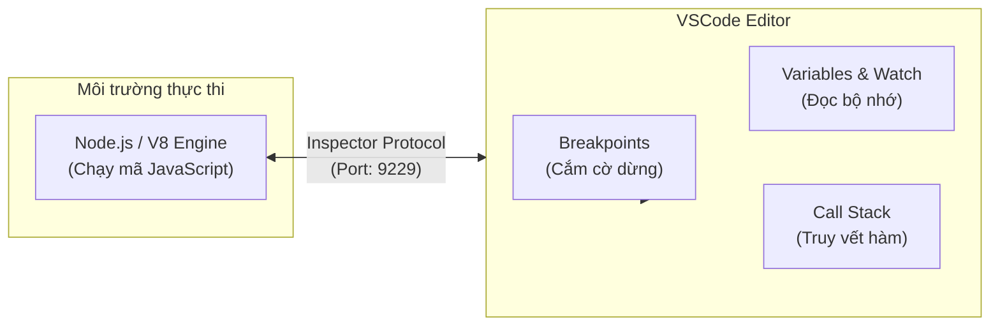

# Công Cụ (Phần 1): Debugger VSCode - Nghệ Thuật Gỡ Lỗi

## Agenda

**Thời gian đọc ước tính:** ~15 phút

### Learning outcome:
- **Hiểu** được cơ chế hoạt động của Node.js Debugger thông qua giao thức Inspector Protocol thay vì phụ thuộc hoàn toàn vào các dòng log thủ công.
- **Giải thích** được vai trò của Source Maps trong quá trình gỡ lỗi các dự án sử dụng ngôn ngữ trung gian (như TypeScript trong NestJS).
- **Tự tay** cấu hình được các tệp `launch.json` để tự động hóa quá trình gắn (attach) trình gỡ lỗi vào các luồng thực thi khác nhau.
- **Phân biệt** được cách xử lý các rủi ro phổ biến trong quá trình debug như Unbound Breakpoint (Điểm chặn không khả dụng) hoặc lỗi chiếm dụng cổng (Port in use).

---

## Glossary & Vocabulary

**1. Technical Terms (Thuật ngữ kỹ thuật):**
| Term | Vietnamese Meaning & Quick Explain |
| :--- | :--- |
| **Debugger** | Trình gỡ lỗi. Công cụ phần mềm giúp kiểm tra, phát hiện và loại bỏ các lỗi (bugs) trong mã nguồn bằng cách tương tác trực tiếp với bộ nhớ. |
| **Breakpoint** | Điểm chặn / Điểm dừng. Đánh dấu một dòng code để chương trình tạm dừng thực thi ngay trước khi dòng code đó chạy. |
| **Call Stack** | Ngăn xếp gọi hàm. Cấu trúc dữ liệu ghi lại lịch sử chuỗi các hàm đã được gọi để dẫn đến điểm thực thi hiện tại. |
| **Source Map** | Bản đồ mã nguồn. Tệp tin (thường có đuôi `.map`) giúp ánh xạ mã JavaScript đã được biên dịch ngược trở lại mã TypeScript gốc. |
| **Inspector Protocol** | Giao thức thanh tra. Giao thức giao tiếp do V8 Engine cung cấp để các công cụ bên ngoài (như Chrome DevTools, VSCode) điều khiển tiến trình Node.js. |

**2. Vocabulary Support (Từ vựng học thuật/B1+):**
| Word | Meaning in Context (Nghĩa trong ngữ cảnh) |
| :--- | :--- |
| **Interactive (adj)** | Có tính tương tác. Hành động phản hồi qua lại giữa người dùng và hệ thống theo thời gian thực. |
| **Attach (v)** | Gắn kết, đính kèm. Quá trình kết nối trình gỡ lỗi của VSCode vào một tiến trình Node.js đang chạy độc lập. |
| **Zombie process (n)** | Tiến trình ma. Các tiến trình phần mềm đã kết thúc nhiệm vụ hoặc bị lỗi nhưng chưa giải phóng hoàn toàn tài nguyên hệ thống (như cổng mạng). |

---

## 1. WHY — Vấn Đề Của Việc Lạm Dụng Console.Log

Trong các dự án nhỏ, `console.log()` là một công cụ nhanh gọn. Tuy nhiên, khi hệ thống phát triển lên quy mô Enterprise (như các dự án NestJS hàng trăm tệp tin), việc phụ thuộc vào in log bộc lộ 3 tử huyệt kỹ thuật nghiêm trọng:

1. **Thiếu ngữ cảnh toàn cục (Lack of Context):** Khi in ra một biến, bạn chỉ nhìn thấy giá trị của nó tại một khoảnh khắc duy nhất. Bạn không thể biết chính xác hàm A đã được gọi từ Controller nào, và ai đã truyền tham số sai (Mất dấu Call Stack).
2. **Chi phí thời gian khổng lồ (Time-consuming):** Mỗi lần muốn kiểm tra một giá trị mới, lập trình viên phải: Viết thêm code log -> Dừng server -> Chạy lại server -> Thực hiện lại các thao tác giao diện để tái tạo lỗi. Chu kỳ này lặp đi lặp lại gây hao tổn hàng giờ đồng hồ.
3. **Rủi ro rò rỉ và rác mã nguồn (Memory & Security Risk):** Trong một tập thể đông người, các câu lệnh `console.log()` dễ bị lọt qua khâu Code Review và đẩy lên môi trường Production. Điều này không chỉ gây tốn kém tài nguyên I/O của máy chủ mà còn có nguy cơ in ra các thông tin nhạy cảm (Mật khẩu, Token, PII).

Trình gỡ lỗi (Debugger) có sẵn trong trình soạn thảo VSCode ra đời để giải quyết bài toán này. Nó cho phép bạn "đóng băng" thời gian, kiểm tra toàn bộ bộ nhớ của ứng dụng mà không cần phải chèn thêm bất kỳ một dòng mã rác nào.

---

## 2. WHAT — Giải Phẫu Cơ Chế Debugging

### 2.1. Bản Chất Của Debugger

**Definition Anatomy (Giải phẫu định nghĩa):**
- **Interactive** (*Tính tương tác*): Không giống như log chỉ để đọc thụ động, Debugger cho phép bạn tương tác: tạm dừng, bước qua (step over), hoặc can thiệp sửa đổi giá trị biến ngay trong lúc mã nguồn đang chạy.
- **Execution control** (*Kiểm soát thực thi*): Khả năng thao túng dòng chảy thời gian của ứng dụng.

### 2.2. Inspector Protocol Hoạt Động Ra Sao?

Node.js được xây dựng trên lõi V8 Engine. V8 cung cấp một giao thức đặc biệt tên là V8 Inspector Protocol.

**Definition Anatomy:**
- **V8 Engine feature** (*Tính năng lõi của V8*): Đây là cơ chế gốc của bộ xử lý JavaScript, không phải do VSCode "hack" vào.
- **WebSocket communication** (*Giao tiếp qua WebSocket*): Khi Node.js chạy với cờ `--inspect`, nó mở một cổng mạng (mặc định là `9229`). VSCode sẽ kết nối vào cổng này như một Client, liên tục gửi nhận các lệnh điều khiển.

### 2.3. Trực Quan Hóa Hệ Thống Gỡ Lỗi

Hãy xem sơ đồ dưới đây để hiểu cách VSCode "trói buộc" tiến trình NestJS:



### 2.4. Vấn Đề Source Maps Trong TypeScript

NestJS được viết hoàn toàn bằng TypeScript, nhưng V8 Engine chỉ hiểu JavaScript. Quá trình biên dịch (Compilation) sẽ dịch tệp `user.controller.ts` thành `user.controller.js`. 

Nếu bạn cắm một Breakpoint ở dòng số 10 trong tệp `.ts`, làm sao VSCode biết nó tương ứng với dòng số mấy trong tệp `.js` đang thực thi?

**Source Map (Bản đồ mã nguồn)** chính là chìa khóa. Nó là một tệp JSON định tuyến từng dòng code từ JavaScript quay ngược lại TypeScript. Không có Source Map, Breakpoint của bạn sẽ bị vô hiệu hóa (Unbound Breakpoint).

---

## 3. HOW — Cấu Hình Và Làm Chủ Debugger

### 3.1. Phương Pháp 1: Auto Attach (Nhanh Gọn Cho Node.js Thuần)

Nếu bạn chỉ viết một đoạn script Node.js ngắn, tính năng Auto Attach (*Tự động gắn kết*) của VSCode là công cụ tiết kiệm thời gian nhất.

**Cách thực hiện:**
1. Nhấn tổ hợp phím `Cmd + Shift + P` (MacOS) hoặc `Ctrl + Shift + P` (Windows) để mở Command Palette.
2. Gõ và chọn lệnh: `Debug: Toggle Auto Attach`.
3. Chọn chế độ **Smart**.

Lúc này, bất kỳ tiến trình Node.js nào bạn gõ từ terminal nội bộ của VSCode (ví dụ: `node index.js`), VSCode sẽ lập tức phát hiện và gắn Debugger vào tự động mà không cần file cấu hình nào.

### 3.2. Phương Pháp 2: Cấu Hình `launch.json` Cho Dự Án NestJS

Đối với các dự án lớn như NestJS, chúng ta cần một file cấu hình chuẩn mực (`.vscode/launch.json`) để lưu trữ vào Git, giúp toàn bộ thành viên trong nhóm thống nhất phương pháp làm việc.

Tạo thư mục `.vscode` ở thư mục gốc của dự án, sau đó tạo file `launch.json`:

```json
// filename: .vscode/launch.json
{
  "version": "0.2.0",
  "configurations": [
    {
      "type": "node",
      "request": "launch",
      "name": "Debug NestJS Application",
      // Đường dẫn gốc của workspace
      "cwd": "${workspaceFolder}",
      // Sử dụng trình thực thi là npm thay vì gọi node trực tiếp
      "runtimeExecutable": "npm",
      "runtimeArgs": [
        "run",
        // Lệnh này tương ứng với script trong package.json
        "start:debug"
      ],
      "restart": true,
      // BẮT BUỘC: Cho phép VSCode giải mã TypeScript
      "sourceMaps": true,
      // Hiển thị kết quả trong Terminal chuẩn của VSCode
      "console": "integratedTerminal"
    }
  ]
}
```

**Cách sử dụng:**
Chỉ cần chuyển sang tab **Run and Debug** ở thanh công cụ bên trái VSCode (hoặc nhấn `Cmd + Shift + D`), chọn cấu hình "Debug NestJS Application" và nhấn `F5`. VSCode sẽ tự động chạy lệnh khởi động server và gắn Debugger vào.

### 3.3. 3 Kỹ Năng Cốt Lõi Khi Debugging

Một khi ứng dụng đã tạm dừng tại một Breakpoint, bạn có 3 vũ khí chính:

1. **Điều hướng thời gian (Stepping):**
   - *Step Over (F10)*: Chạy hết dòng hiện tại và nhảy xuống dòng tiếp theo.
   - *Step Into (F11)*: Nhảy vào bên trong nội dung của hàm đang được gọi để xem chi tiết.
   - *Step Out (Shift + F11)*: Thoát ra khỏi hàm hiện tại, quay lại nơi nó được gọi.

2. **Call Stack (Ngăn xếp gọi hàm):**
   Nằm ở góc trái dưới cùng. Nó trả lời câu hỏi "Làm sao dòng code này được chạy?". Bạn có thể nhấp chuột vào bất kỳ hàm nào trong Call Stack để lùi ngược thời gian, xem lại biến ở các tầng trên (như Middleware hoặc Guard) trước khi nó lọt vào Controller.

3. **Watch Expressions (Theo dõi biểu thức):**
   Thay vì chỉ nhìn vào các biến cục bộ, bạn có thể thêm các biểu thức phức tạp vào panel Watch (ví dụ: `user.permissions.includes('ADMIN')`). VSCode sẽ tính toán lại kết quả của biểu thức này theo thời gian thực mỗi khi bạn Step qua dòng code mới.

### 3.4. Cạm Bẫy (Pitfalls) Thường Gặp

⚠️ **Pitfall 1: Unbound Breakpoint (Điểm chặn biến thành vòng tròn xám lờ mờ)**  
Bạn đánh dấu Breakpoint ở một tệp `.ts`, nhưng khi chạy ứng dụng, chấm đỏ biến thành viền xám và code chạy tuột qua không dừng lại.
- **Nguyên nhân:** VSCode không thể tìm được tệp `Source Map`, hoặc thư mục chứa file biên dịch (`dist/`) bị cấu hình sai.
- **Cách khắc phục:** Đảm bảo trong tệp `tsconfig.json`, thuộc tính `"sourceMap": true` đã được bật.

⚠️ **Pitfall 2: Lỗi "Port 9229 is already in use"**  
Ứng dụng từ chối khởi động và báo cổng bị chiếm.
- **Nguyên nhân:** Cổng 9229 (Cổng mặc định của giao thức Inspector) đang bị một tiến trình Node.js trước đó (một Zombie process chưa tắt hẳn) giữ lại.
- **Cách khắc phục:** Tắt tất cả các tiến trình Node.js đang treo bằng lệnh `killall node` (trên MacOS/Linux) hoặc cấu hình một port tùy chỉnh (ví dụ: 9230) trong `launch.json` nếu bạn cần debug nhiều ứng dụng cùng lúc.

---

## 4. Discussion Questions

1. **Về Performance (Hiệu suất):** Khi bạn gắn (attach) Debugger vào một ứng dụng đang chạy thông qua cổng 9229, hiệu năng (Latency, CPU) của ứng dụng có bị suy giảm nghiêm trọng không? Tại sao các chuyên gia DevOps cảnh báo không bao giờ được phép bật cổng Inspector (cờ `--inspect`) trên môi trường Production ngoài thực tế?
2. **Về Microservices Architecture:** Nếu dự án của bạn chia thành 3 Microservices (User Service, Product Service, Payment Service) chạy độc lập và gọi lẫn nhau qua mạng (TCP/HTTP), làm thế nào để bạn có thể debug được luồng dữ liệu truyền xuyên suốt cả 3 services cùng một lúc trên một cửa sổ VSCode duy nhất? (Gợi ý: Tìm hiểu về tính năng *Compound Configurations* trong `launch.json`).

---

*Made by Anh Tu - Share to be share*
