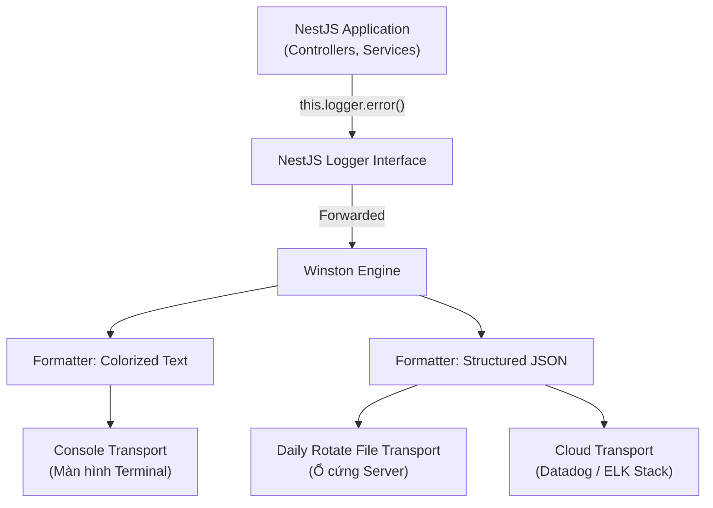

# Công Cụ (Phần 2): Kiến Trúc Logger Chuyên Nghiệp

## Agenda

**Thời gian đọc ước tính:** ~20 phút

### Learning outcome:
- **Hiểu** được nguyên lý hoạt động của NestJS Logger và tại sao `console.log()` lại là một "thảm họa" đối với các ứng dụng vận hành ở cấp độ doanh nghiệp (Production).
- **Giải thích** được các khái niệm cốt lõi cấu thành một hệ thống ghi sự kiện chuẩn mực như Log Levels, Transport, Format và cơ chế Xoay vòng tệp tin (File Rotation).
- **Tự tay** cấu hình hệ thống ghi log chuyên nghiệp bằng cách ghi đè (override) Built-in Logger mặc định và tích hợp thư viện Winston mạnh mẽ.
- **Phân biệt** và tránh được các cạm bẫy kiến trúc thường gặp khi xử lý Log (ví dụ: Log rò rỉ thông tin nhạy cảm, rò rỉ bộ nhớ do cấu hình sai Level).

---

## Glossary & Vocabulary

**1. Technical Terms (Thuật ngữ kỹ thuật):**
| Term | Vietnamese Meaning & Quick Explain |
| :--- | :--- |
| **Logger** | Hệ thống ghi nhận sự kiện. Công cụ phần mềm có nhiệm vụ thu thập, định dạng và lưu trữ các thông điệp về trạng thái hoạt động của ứng dụng. |
| **Log Level** | Mức độ nghiêm trọng. Hệ thống phân loại tính cấp bách của một thông điệp (Ví dụ: Error là lỗi chết người, Debug chỉ là thông tin nháp). |
| **Transport** | Kênh vận chuyển đích. Điểm đến cuối cùng nơi dữ liệu log sẽ được xuất ra (Ví dụ: Màn hình Console, Tệp văn bản tĩnh, hoặc Đám mây). |
| **File Rotation** | Xoay vòng tệp tin. Cơ chế tự động chia nhỏ tệp log theo thời gian (mỗi ngày một tệp) hoặc theo kích thước (đạt 20MB thì tạo tệp mới) để tránh đầy ổ cứng. |

**2. Vocabulary Support (Từ vựng học thuật/B1+):**
| Word | Meaning in Context (Nghĩa trong ngữ cảnh) |
| :--- | :--- |
| **Machine-readable (adj)** | Khả năng đọc bằng máy. Định dạng dữ liệu (thường là JSON) có cấu trúc nghiêm ngặt giúp các hệ thống máy tính dễ dàng tìm kiếm và phân tích. |
| **Masking (n)** | Che giấu dữ liệu. Kỹ thuật ẩn đi một phần thông tin nhạy cảm (như thay đổi mật khẩu thành các dấu sao `***`) trước khi lưu trữ. |
| **Bottleneck (n)** | Nút thắt cổ chai. Điểm yếu nhất trong hệ thống làm suy giảm toàn bộ hiệu năng tổng thể (Ví dụ: Tốc độ ghi ổ cứng chậm làm chậm toàn bộ ứng dụng). |

---

## 1. WHY — Sự Trả Giá Của Console.Log

Trong các dự án sinh viên hoặc bài tập thực hành, hàm `console.log()` là một công cụ quen thuộc. Tuy nhiên, khi hệ thống của bạn phục vụ hàng nghìn người dùng thật và mang lại doanh thu, việc sử dụng `console.log()` sẽ dẫn đến 3 thảm họa quản trị hệ thống:

1. **Thiếu khả năng phân loại (No Severity Filtering):** `console.log` hiển thị mọi thứ với mức độ ưu tiên ngang nhau. Khi hệ thống gặp sự cố, bạn sẽ phải dùng mắt người để mò mẫm tìm kiếm một dòng thông báo lỗi (Error) nằm lẫn lộn giữa hàng nghìn dòng thông tin in ra biến nháp (Debug). Trên Production, chúng ta cần cơ chế chỉ hiển thị lỗi để tiết kiệm tài nguyên I/O.
2. **Dữ liệu dễ bay hơi (Volatile Data):** Màn hình Console chỉ là một bộ đệm tạm thời. Nếu máy chủ ứng dụng (Server) bị quá tải bộ nhớ và sập (Crash), nó sẽ khởi động lại. Toàn bộ nội dung in trên màn hình trước đó sẽ bị xóa sạch. Không có dữ liệu lưu trữ vật lý (Files), bạn sẽ mất hoàn toàn dấu vết để điều tra nguyên nhân.
3. **Không thân thiện với công cụ phân tích (Not Machine-readable):** Các hệ thống giám sát hiện đại như ELK Stack (Elasticsearch, Logstash, Kibana) hay Datadog yêu cầu dữ liệu truyền vào phải có cấu trúc (Structured JSON). Việc in ra một chuỗi văn bản thuần túy khiến quá trình truy vấn ("Tìm tất cả lỗi liên quan đến Module Thanh Toán từ 2h đến 3h sáng") trở nên bất khả thi hoặc tốn kém chi phí tính toán cực lớn.

Đó là lý do NestJS ngay từ đầu đã tích hợp sẵn một hệ thống `Logger` chuyên biệt và cho phép mở rộng với các thư viện tiêu chuẩn ngành như Winston.

---

## 2. WHAT — Giải Phẫu Kiến Trúc Logger

### 2.1. Built-in Logger Là Gì?

**Definition Anatomy (Giải phẫu định nghĩa):**
- **Core Service** (*Dịch vụ lõi*): Đây là một Provider có sẵn trong lõi của NestJS, không cần cài đặt thêm.
- **Context-aware** (*Nhận biết ngữ cảnh*): Điểm mạnh nhất của Logger NestJS là nó cho phép đính kèm tên của Class (Context) sinh ra lỗi, giúp truy vết cực nhanh.

Hệ thống cung cấp 5 Mức độ (Log Levels) theo thứ tự nghiêm trọng tăng dần:
1. `Verbose`: Thông tin cực kỳ chi tiết, diễn biến từng bước nhỏ (Chỉ dùng khi điều tra lỗi cực sâu).
2. `Debug`: Thông tin trạng thái của các biến phục vụ cho quá trình lập trình.
3. `Log`: Luồng hoạt động bình thường, thông báo hệ thống khởi động thành công.
4. `Warn`: Cảnh báo. Ứng dụng vẫn chạy được nhưng có hành vi bất thường cần lưu ý.
5. `Error`: Lỗi nghiêm trọng làm gián đoạn một tính năng, cần phải xử lý ngay lập tức.

### 2.2. Winston Là Gì?

NestJS Built-in Logger giải quyết tốt bài toán phân cấp Level và Context, nhưng nó vẫn thiếu khả năng ghi tệp (File Transport) và định dạng JSON phức tạp. Đây là lúc Winston xuất hiện.

**Definition Anatomy:**
- **Universal Library** (*Thư viện đa năng*): Winston là thư viện ghi log mạnh mẽ và phổ biến nhất trong hệ sinh thái Node.js.
- **Transport-driven** (*Hoạt động dựa trên kênh đích*): Triết lý của Winston là tách bạch giữa "Cái gì cần ghi" và "Ghi nó đi đâu". Bạn có thể cấu hình để một dòng lỗi vừa in ra màn hình có màu sắc đẹp mắt, vừa lưu vào tệp `.log` dưới dạng JSON, vừa bắn qua API của Slack cùng một lúc.

### 2.3. Sơ Đồ Kiến Trúc Transport

Hãy hình dung luồng đi của một thông điệp từ lúc phát sinh đến lúc lưu trữ:



---

## 3. HOW — Cấu Hình Winston Chuẩn Enterprise

Để đưa Winston vào dự án NestJS, chúng ta sẽ thực hiện quy trình "Cấy ghép" (Override). Chúng ta sẽ tắt Logger mặc định và thay thế nó bằng Winston.

### Bước 1: Cài đặt thư viện

Bạn cần cài đặt bộ chuyển đổi của NestJS và các module cốt lõi của Winston:

```bash
npm install nest-winston winston winston-daily-rotate-file
```

### Bước 2: Thiết kế tệp cấu hình (Configuration)

Tạo một tệp cấu hình trung tâm để định nghĩa các kênh xuất (Transports) và định dạng (Format). Kỹ năng quan trọng ở đây là tách biệt cấu hình theo môi trường (Environment).

```typescript
// filename: src/core/logger/winston.config.ts
import * as winston from 'winston';
import { utilities as nestWinstonModuleUtilities } from 'nest-winston';
import 'winston-daily-rotate-file';

const isProduction = process.env.NODE_ENV === 'production';

// Định dạng dành cho Development: Dễ đọc bằng mắt người, có màu sắc
const devFormat = winston.format.combine(
  winston.format.timestamp({ format: 'YYYY-MM-DD HH:mm:ss' }),
  winston.format.ms(),
  nestWinstonModuleUtilities.format.nestLike('MyApp', {
    colors: true,
    prettyPrint: true,
  }),
);

// Định dạng dành cho Production: Máy đọc (JSON), bắt chi tiết Call Stack của lỗi
const prodFormat = winston.format.combine(
  winston.format.timestamp(),
  winston.format.errors({ stack: true }), 
  winston.format.json(),
);

export const winstonConfig: winston.LoggerOptions = {
  // Trên Production, chỉ xử lý log từ mức độ "info" trở lên để tiết kiệm I/O
  level: isProduction ? 'info' : 'debug',
  format: isProduction ? prodFormat : devFormat,

  transports: [
    // 1. Kênh Console: Luôn bật để xem trực tiếp
    new winston.transports.Console({
      stderrLevels: ['error'], // Đẩy lỗi ra luồng stderr riêng biệt
    }),

    // 2. Kênh File Rotation (Chỉ lưu Error): Phục vụ điều tra sự cố
    new winston.transports.DailyRotateFile({
      filename: 'logs/error-%DATE%.log',
      datePattern: 'YYYY-MM-DD',
      level: 'error', 
      maxSize: '20m', // Tạo tệp mới nếu vượt quá 20 Megabytes
      maxFiles: '30d', // Chỉ giữ lại log lỗi trong 30 ngày qua
      zippedArchive: true, // Nén tệp cũ thành .gz để tiết kiệm ổ cứng
    }),

    // 3. Kênh File Rotation (Lưu mọi thứ): Phục vụ phân tích dữ liệu
    new winston.transports.DailyRotateFile({
      filename: 'logs/combined-%DATE%.log',
      datePattern: 'YYYY-MM-DD',
      maxSize: '50m',
      maxFiles: '14d', 
      zippedArchive: true,
    }),
  ],
};
```

### Bước 3: Đăng ký Winston vào vòng đời khởi động (Bootstrap)

Đây là bước hay xảy ra lỗi nhất (Pitfall). Bạn phải bật cờ `bufferLogs: true` để NestJS lưu trữ tạm các bản log sinh ra lúc 프ريم 워크 đang khởi động, cho đến khi Winston thực sự sẵn sàng tiếp quản.

```typescript
// filename: src/main.ts
import { NestFactory } from '@nestjs/core';
import { AppModule } from './app.module';
import { WINSTON_MODULE_NEST_PROVIDER } from 'nest-winston';

async function bootstrap() {
  const app = await NestFactory.create(AppModule, {
    // RẤT QUAN TRỌNG: Giữ lại log khởi động để tránh mất mát định dạng
    bufferLogs: true, 
  });

  // Ra lệnh cho NestJS: "Từ giờ phút này, hãy dùng Winston làm Logger duy nhất"
  app.useLogger(app.get(WINSTON_MODULE_NEST_PROVIDER));

  await app.listen(3000);
}
bootstrap();
```

Và đừng quên Import Module vào hệ thống lõi:

```typescript
// filename: src/app.module.ts
import { Module } from '@nestjs/common';
import { WinstonModule } from 'nest-winston';
import { winstonConfig } from './core/logger/winston.config';

@Module({
  imports: [
    // Đăng ký toàn cục (Global) để mọi nơi đều dùng được
    WinstonModule.forRoot(winstonConfig),
  ],
})
export class AppModule {}
```

### Bước 4: Nguyên tắc sử dụng trong Logic Nghiệp Vụ

Khi sử dụng, tuyệt đối không chèn trực tiếp các chuỗi thông tin nhạy cảm. Hãy tận dụng tham số thứ hai (Metadata) của hàm log để ghi dữ liệu cấu trúc.

```typescript
// filename: src/users/users.service.ts
import { Injectable, Inject } from '@nestjs/common';
import { WINSTON_MODULE_PROVIDER } from 'nest-winston';
import { Logger } from 'winston';

@Injectable()
export class UsersService {
  constructor(
    @Inject(WINSTON_MODULE_PROVIDER) private readonly logger: Logger,
  ) {}

  async createUser(email: string) {
    // Ghi nhận sự kiện có cấu trúc JSON
    this.logger.info('Khởi tạo quy trình tạo người dùng mới', {
      context: UsersService.name,
      userEmail: email,
      action: 'CREATE_USER_INIT'
    });

    try {
      // ... logic thao tác Database
      
      this.logger.info('Tạo người dùng thành công', {
        context: UsersService.name,
        durationMs: 120
      });
    } catch (error) {
      // Khi có lỗi, luôn truyền error.stack để dễ dàng gỡ lỗi sau này
      this.logger.error('Thất bại khi lưu vào cơ sở dữ liệu', {
        context: UsersService.name,
        errorMsg: error.message,
        stackTrace: error.stack
      });
      throw error;
    }
  }
}
```

---

## 4. Discussion Questions

1. **Về Bài Toán Bảo Mật (Security & Compliance):** Giả sử một lập trình viên non kinh nghiệm (Junior) vô tình ghi lại (log) một Object chứa toàn bộ thông tin thẻ tín dụng của khách hàng (`creditCardNumber`, `cvv`) vào tệp tin văn bản `combined.log`. Dưới góc độ kiến trúc sư phần mềm, làm thế nào bạn có thể thiết kế một cơ chế Format tự động "che giấu" (Data Masking) các trường dữ liệu nhạy cảm này trước khi Winston kịp ghi luồng dữ liệu xuống ổ cứng?
2. **Về Nút Thắt Cổ Chai Hiệu Suất (I/O Bottleneck):** Trong khoa học máy tính, thao tác ghi tệp xuống ổ cứng vật lý (Disk I/O) luôn chậm hơn hàng vạn lần so với tốc độ xử lý của CPU. Khi hệ thống của bạn nhận 10,000 requests mỗi giây (đồng nghĩa với hàng chục vạn dòng log được sinh ra), làm thế nào Winston có thể xử lý việc ghi tệp liên tục mà không làm "nghẽn" (Blocking) toàn bộ Event Loop của Node.js? (Gợi ý: Tìm hiểu cơ chế File Streams và Buffer trong Node.js).

---

*Made by Anh Tu - Share to be share*
