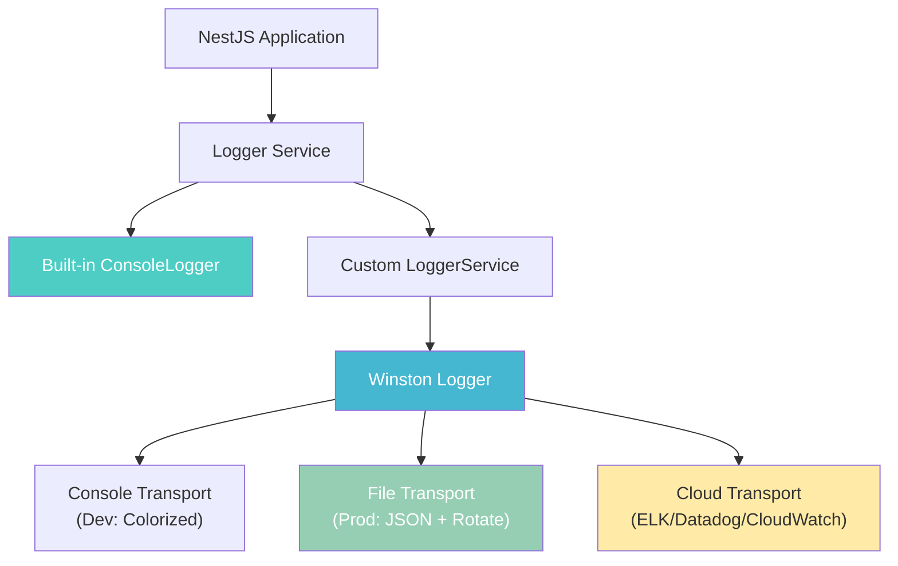
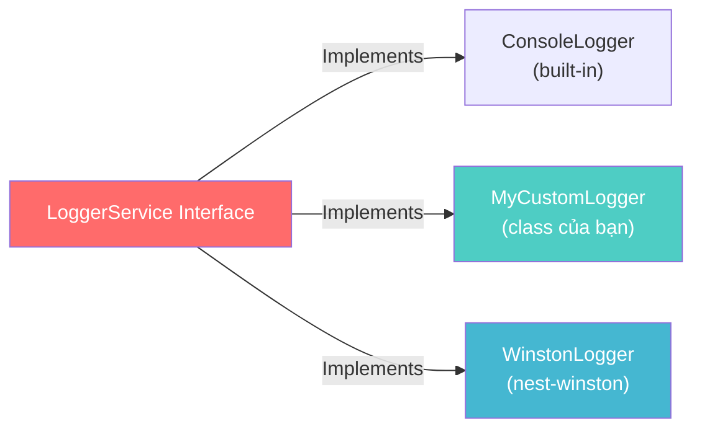
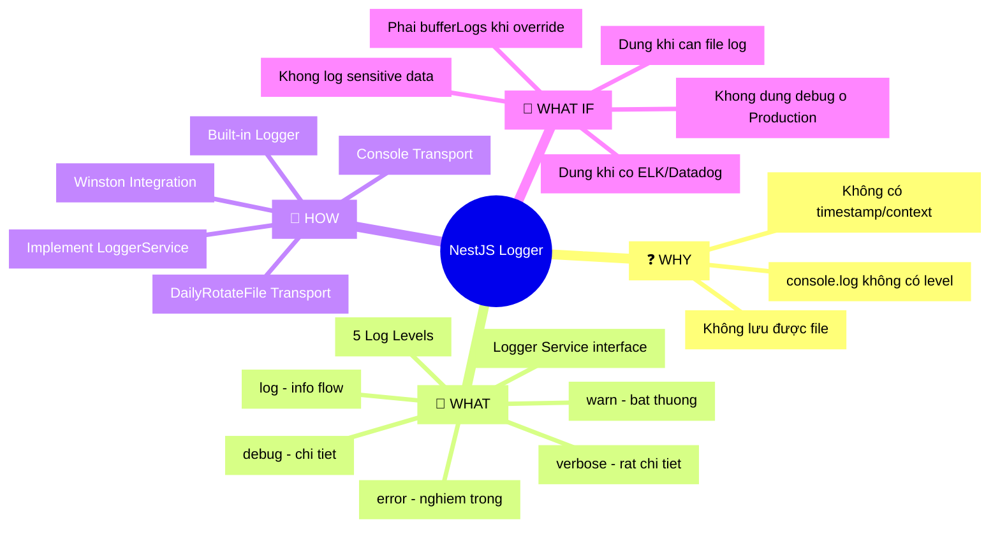

## 📋 Agenda

**Thời gian đọc ước tính:** ~15 phút

### Sau bài này, bạn sẽ:
- ✅ **Hiểu** cơ chế hoạt động của NestJS Logger và hệ thống Log Level
- ✅ **Phân biệt** được khi nào dùng Built-in Logger và khi nào cần Winston
- ✅ **Tự tay** cấu hình Winston với Console + File transport cho production
- ✅ **Tránh** được 3 pitfalls phổ biến trong logging NestJS

### Prerequisites:
- 🔹 Biết cơ bản về NestJS (Module, Service, Controller)
- 🔹 Đã từng chạy một NestJS app ít nhất một lần
- 🔹 Hiểu khái niệm Dependency Injection (DI)

---

## ❓ Vấn đề & Giải pháp

**Vấn đề (Problem Statement):**
- `console.log` không có log level → không thể tắt debug log khi ra production.
- Không có timestamp, context → không biết log đến từ module nào, lúc nào.
- Log chỉ xuất ra Console → không thể lưu file để phân tích sau.
- Khi hệ thống crash, tìm lỗi trong đống `console.log` không có cấu trúc là cực hình.

**Giải pháp (Solution):**
NestJS cung cấp `Logger` built-in với 5 log levels và context hỗ trợ inject DI. Khi cần nâng cao (file rotation, JSON format cho ELK/Datadog), tích hợp **Winston** thông qua `nest-winston` — giữ nguyên API NestJS nhưng tăng sức mạnh vượt trội.

---

## 📖 Kiến trúc Logger trong NestJS

**Định nghĩa:** NestJS Logger là một service có thể inject vào bất kỳ component nào, cung cấp logging có cấu trúc (structured logging) với context và log level.



**Luồng log:**
1. Code gọi `this.logger.log('message', 'Context')`
2. NestJS forward tới `LoggerService` đang active
3. Logger Service format và route tới các Transport

---

## 🔢 Log Levels — Thứ bậc của độ nghiêm trọng

NestJS có 5 log levels, được sắp xếp theo **mức độ nghiêm trọng tăng dần**:

| Level | Màu | Khi nào dùng |
|-------|-----|--------------|
| `verbose` | Cyan | Thông tin rất chi tiết, chỉ cần khi debug sâu |
| `debug` | Blue | Debug thông thường trong development |
| `log` | Green | Luồng hoạt động bình thường của ứng dụng |
| `warn` | Yellow | Cảnh báo — ứng dụng vẫn chạy nhưng có gì đó bất thường |
| `error` | Red | Lỗi nghiêm trọng — cần xử lý ngay |

:::tip Quy tắc lọc Log Level
Khi bạn set level `warn`, NestJS chỉ hiện `warn` và `error`. Các level thấp hơn bị tắt.
:::

### Cấu hình Log Level theo môi trường

```typescript
// filename: main.ts
const app = await NestFactory.create(AppModule, {
  // Production: chỉ hiện warn và error để giảm I/O
  // Development: hiện tất cả để debug dễ hơn
  logger:
    process.env.NODE_ENV === 'production'
      ? ['error', 'warn']
      : ['error', 'warn', 'log', 'debug', 'verbose'],
});
```

### Sử dụng Logger trong Service

```typescript
// filename: users.service.ts
import { Injectable, Logger } from '@nestjs/common';

@Injectable()
export class UsersService {
  // Context giúp xác định log đến từ module nào
  private readonly logger = new Logger(UsersService.name);

  async findAll() {
    this.logger.verbose('Fetching all users from database');
    this.logger.log('UsersService.findAll() called');
    this.logger.debug(`Query: SELECT * FROM users`);

    try {
      // ... business logic
      this.logger.log(`Found ${users.length} users`);
      return users;
    } catch (error) {
      // Truyền error object để NestJS tự extract stack trace
      this.logger.error('Failed to fetch users', error.stack);
      throw error;
    }
  }
}
```

**Output trên console:**
```
[Nest] LOG    [UsersService] UsersService.findAll() called
[Nest] DEBUG  [UsersService] Query: SELECT * FROM users
[Nest] LOG    [UsersService] Found 42 users
```

---

## 🎨 Log Format — Kiểm soát hình dạng của log

NestJS Built-in Logger output theo format:
```
[Nest] <PID>  - <Date>          <Level> [<Context>] <Message>
[Nest] 12345  - 06/04/2026, 11:00:00   LOG [UsersService] User created
```

### Format timestamp tùy chỉnh

```typescript
// filename: main.ts
const app = await NestFactory.create(AppModule, {
  logger: new ConsoleLogger({
    // Tùy chỉnh format timestamp hiển thị
    timestamp: true,
    // Sử dụng ISO string thay vì locale format
  }),
});
```

### Tắt log hoàn toàn (testing)

```typescript
// filename: main.ts — Tắt log khi chạy unit test
const app = await NestFactory.create(AppModule, {
  logger: false, // Tắt hết — hữu ích trong môi trường test
});
```

---

## 🔧 Override Logger — Thay thế built-in bằng custom implementation

NestJS cho phép override Logger bằng cách implement interface `LoggerService`. Đây là cơ chế giúp tích hợp bất kỳ logging library nào.



### Cách 1: Custom Logger đơn giản

```typescript
// filename: src/logger/my-logger.service.ts
import { LoggerService, Injectable } from '@nestjs/common';

@Injectable()
export class MyLoggerService implements LoggerService {
  log(message: any, ...optionalParams: any[]) {
    // Ghi lên console với prefix tùy chỉnh
    console.info(`[MY-APP] ${message}`, ...optionalParams);
  }

  error(message: any, ...optionalParams: any[]) {
    console.error(`[MY-APP][ERROR] ${message}`, ...optionalParams);
  }

  warn(message: any, ...optionalParams: any[]) {
    console.warn(`[MY-APP][WARN] ${message}`, ...optionalParams);
  }

  // Tùy chọn — implement nếu cần
  debug?(message: any, ...optionalParams: any[]) {
    console.debug(`[MY-APP][DEBUG] ${message}`, ...optionalParams);
  }

  verbose?(message: any, ...optionalParams: any[]) {}
}
```

```typescript
// filename: main.ts — Đăng ký custom logger
const app = await NestFactory.create(AppModule, {
  logger: new MyLoggerService(),
});
```

### Cách 2: Extend built-in ConsoleLogger (khuyến nghị cho simple override)

```typescript
// filename: src/logger/app-logger.service.ts
import { ConsoleLogger, Injectable } from '@nestjs/common';

@Injectable()
export class AppLoggerService extends ConsoleLogger {
  // Override chỉ method cần thay đổi, kế thừa phần còn lại
  error(message: any, stack?: string, context?: string) {
    // Gửi alert hoặc notification khi có error
    this.sendAlertToSlack(message);
    super.error(message, stack, context);
  }

  private sendAlertToSlack(message: string) {
    // Integration với Slack/PagerDuty
    // fetch('https://hooks.slack.com/...', { method: 'POST', body: JSON.stringify({ text: message }) })
  }
}
```

---

## 🚀 Winston Integration — Logger chuẩn Production

### Tại sao cần Winston?

| Tính năng | Built-in Logger | Winston |
|-----------|-----------------|---------|
| Log Level | ✅ 5 levels | ✅ 7 levels (NPM standard) |
| Console output | ✅ Colorized | ✅ Colorized |
| File output | ❌ Không | ✅ Có |
| File rotation | ❌ Không | ✅ Với `winston-daily-rotate-file` |
| JSON format | ❌ Không | ✅ Cho ELK/Datadog |
| Multiple transports | ❌ Không | ✅ Console + File + Cloud cùng lúc |

### Bước 1: Cài đặt

```bash
npm install nest-winston winston winston-daily-rotate-file
```

### Bước 2: Tạo Winston Configuration

```typescript
// filename: src/logger/winston.config.ts
import * as winston from 'winston';
import { utilities as nestWinstonModuleUtilities } from 'nest-winston';
import 'winston-daily-rotate-file';

const isProduction = process.env.NODE_ENV === 'production';

// Format cho Development: dễ đọc, có màu sắc như NestJS
const devFormat = winston.format.combine(
  winston.format.timestamp({ format: 'YYYY-MM-DD HH:mm:ss' }),
  winston.format.ms(),
  nestWinstonModuleUtilities.format.nestLike('MyApp', {
    colors: true,
    prettyPrint: true,
  }),
);

// Format cho Production: JSON để log aggregator parse được
const prodFormat = winston.format.combine(
  winston.format.timestamp(),
  winston.format.errors({ stack: true }), // Bắt stack trace của error
  winston.format.json(),
);

export const winstonConfig: winston.LoggerOptions = {
  // Production chỉ log từ info trở lên để tiết kiệm I/O
  level: isProduction ? 'info' : 'debug',
  format: isProduction ? prodFormat : devFormat,

  transports: [
    // --- Transport 1: Console ---
    // Luôn bật — output ra stdout/stderr
    new winston.transports.Console({
      // Dùng stderr cho error để phân biệt output stream
      stderrLevels: ['error'],
    }),

    // --- Transport 2: Error File ---
    // Chỉ ghi error — file này nhỏ, dễ monitor
    new winston.transports.DailyRotateFile({
      filename: 'logs/error-%DATE%.log',
      datePattern: 'YYYY-MM-DD',
      level: 'error', // Chỉ ghi error level
      maxSize: '10m',
      maxFiles: '30d', // Giữ lỗi 30 ngày để audit
      zippedArchive: true,
    }),

    // --- Transport 3: Combined File ---
    // Ghi tất cả log từ info trở lên — file này để phân tích
    new winston.transports.DailyRotateFile({
      filename: 'logs/combined-%DATE%.log',
      datePattern: 'YYYY-MM-DD',
      maxSize: '20m',
      maxFiles: '14d', // Giữ 14 ngày — đủ để debug
      zippedArchive: true,
    }),
  ],
};
```

### Bước 3: Đăng ký vào AppModule

```typescript
// filename: src/app.module.ts
import { Module } from '@nestjs/common';
import { WinstonModule } from 'nest-winston';
import { winstonConfig } from './logger/winston.config';

@Module({
  imports: [
    // Đăng ký WinstonModule toàn cục — inject được ở mọi nơi
    WinstonModule.forRoot(winstonConfig),
    // ... các module khác
  ],
})
export class AppModule {}
```

### Bước 4: Override logger ở bootstrap

```typescript
// filename: main.ts
import { NestFactory } from '@nestjs/core';
import { AppModule } from './app.module';
import { WINSTON_MODULE_NEST_PROVIDER } from 'nest-winston';

async function bootstrap() {
  const app = await NestFactory.create(AppModule, {
    // Tắt built-in logger trong quá trình bootstrap để tránh log trùng
    bufferLogs: true,
  });

  // Thay thế built-in logger bằng Winston sau khi app khởi tạo xong
  app.useLogger(app.get(WINSTON_MODULE_NEST_PROVIDER));

  await app.listen(process.env.PORT ?? 3000);
}
bootstrap();
```

### Bước 5: Sử dụng trong Service

```typescript
// filename: src/users/users.service.ts
import { Injectable, Inject } from '@nestjs/common';
import { WINSTON_MODULE_PROVIDER } from 'nest-winston';
import { Logger } from 'winston';

@Injectable()
export class UsersService {
  constructor(
    // Inject Winston logger trực tiếp — nhận đầy đủ Winston API
    @Inject(WINSTON_MODULE_PROVIDER) private readonly logger: Logger,
  ) {}

  async createUser(dto: CreateUserDto) {
    // Log với metadata object — dễ query trong ELK/Datadog
    this.logger.info('Creating new user', {
      context: 'UsersService',
      email: dto.email,
      // KHÔNG log password hay thông tin nhạy cảm!
    });

    try {
      const user = await this.userRepo.create(dto);

      this.logger.info('User created successfully', {
        context: 'UsersService',
        userId: user.id,
        duration: `${Date.now() - startTime}ms`,
      });

      return user;
    } catch (error) {
      this.logger.error('Failed to create user', {
        context: 'UsersService',
        error: error.message,
        stack: error.stack,
        email: dto.email,
      });
      throw error;
    }
  }
}
```

**Output (Development — console có màu):**
```
[MyApp] 11:00:00   INFO  [UsersService] Creating new user { email: 'john@example.com' }
[MyApp] 11:00:00   INFO  [UsersService] User created successfully { userId: 42, duration: '15ms' }
```

**Output (Production — JSON format):**
```json
{"level":"info","message":"Creating new user","context":"UsersService","email":"john@example.com","timestamp":"2026-04-06T11:00:00.000Z"}
{"level":"info","message":"User created successfully","context":"UsersService","userId":42,"duration":"15ms","timestamp":"2026-04-06T11:00:00.015Z"}
```

---

## 🗂️ Cấu trúc thư mục logs trong dự án thực tế

```
my-nestjs-app/
├── src/
│   ├── logger/
│   │   └── winston.config.ts    ← Cấu hình Winston tập trung
│   ├── app.module.ts
│   └── main.ts
├── logs/                         ← Tự động tạo bởi Winston
│   ├── error-2026-04-06.log     ← Chỉ errors
│   ├── error-2026-04-06.log.gz  ← File cũ được nén
│   ├── combined-2026-04-06.log  ← Tất cả logs
│   └── combined-2026-04-05.log.gz
└── .gitignore                    ← PHẢI ignore thư mục logs/!
```

:::caution Quan trọng: .gitignore
Luôn thêm `logs/` vào `.gitignore`. Log file có thể chứa thông tin nhạy cảm và sẽ làm repository phình to.
```
# .gitignore
logs/
*.log
```
:::

---

## 🚀 WHAT IF — Khi nào dùng, khi nào không?

| ✅ Dùng Built-in Logger khi | ✅ Dùng Winston khi |
|----------------------------|--------------------|
| Side project, prototype | Production app với 100+ users |
| Không cần lưu file | Cần audit trail, file log |
| Team nhỏ, không có DevOps | Tích hợp ELK/Datadog/CloudWatch |
| App đơn giản, ít service | Microservices, cần correlation ID |

### ⚠️ 3 Pitfalls hay gặp

**1. Log thông tin nhạy cảm**
```typescript
// ❌ KHÔNG BAO GIỜ làm thế này
this.logger.log(`User login: ${email}, password: ${password}`);

// ✅ Chỉ log những gì cần thiết để debug
this.logger.log(`User login attempt: ${email}`);
```

**2. Không dùng `bufferLogs: true` khi switch logger**

Nếu không set `bufferLogs: true`, các log trong quá trình bootstrap sẽ vẫn dùng built-in logger → log format không nhất quán.

```typescript
// ❌ Sai — Log bootstrap sẽ không qua Winston
const app = await NestFactory.create(AppModule);
app.useLogger(app.get(WINSTON_MODULE_NEST_PROVIDER));

// ✅ Đúng — bufferLogs giữ log lại cho đến khi Winston sẵn sàng
const app = await NestFactory.create(AppModule, { bufferLogs: true });
app.useLogger(app.get(WINSTON_MODULE_NEST_PROVIDER));
```

**3. Không tắt debug logs trong production**
```typescript
// ❌ Sai — debug logs tạo hàng GB file mỗi ngày ở production
level: 'debug',

// ✅ Đúng — điều chỉnh theo môi trường
level: process.env.NODE_ENV === 'production' ? 'info' : 'debug',
```

---

## 🗺️ Tổng kết — MECE Mindmap



---

*Made by Anh Tu - Share to be share*
