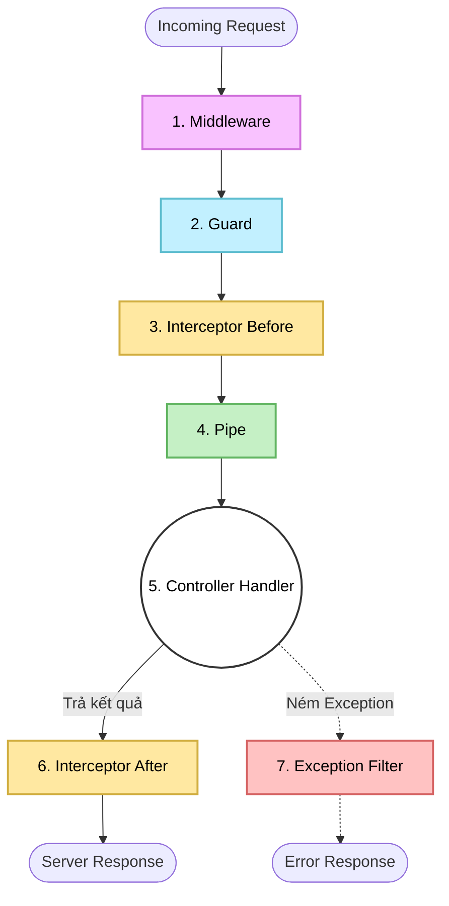

# AOP trong NestJS: Kiến trúc Chặn Đứng Cross-Cutting Concerns

<!--truncate-->

## Agenda

**Thời gian đọc ước tính:** ~10 phút

### Learning outcome:
- **Hiểu** được Aspect-Oriented Programming (AOP) là gì và tại sao nó tồn tại trong NestJS.
- **Giải thích** được vòng đời của một HTTP Request (Request Lifecycle) khi đi qua các tầng bảo vệ của NestJS.
- **Phân biệt** được vai trò của 5 thành phần AOP cốt lõi: Middleware, Guards, Interceptors, Pipes, Exception Filters.
- **Phân tích** được sự khác nhau giữa đoạn code truyền thống và đoạn code đã áp dụng AOP.

---

## Glossary & Vocabulary

**1. Technical Terms (Thuật ngữ kỹ thuật):**
| Term | Vietnamese Meaning & Quick Explain |
| :--- | :--- |
| **Aspect-Oriented Programming (AOP)** | Lập trình hướng khía cạnh. Một mô hình lập trình tập trung vào việc tách rời các logic phụ trợ ra khỏi logic nghiệp vụ chính. |
| **Cross-cutting Concerns** | Các logic cắt ngang. Những chức năng (như logging, auth) không thuộc về một module cụ thể nhưng lại cần thiết ở mọi nơi trong hệ thống. |
| **Request Lifecycle** | Vòng đời yêu cầu. Hành trình của một HTTP Request từ lúc máy chủ tiếp nhận cho đến khi trả về Response. |
| **Dependency Injection (DI)** | Tiêm phụ thuộc. Cơ chế cung cấp các object phụ thuộc (dependencies) từ bên ngoài vào thay vì tự khởi tạo bên trong class. |

**2. Vocabulary Support (Từ vựng học thuật/B1+):**
| Word | Meaning in Context (Nghĩa trong ngữ cảnh) |
| :--- | :--- |
| **Boilerplate (n)** | Những đoạn mã rập khuôn, lặp đi lặp lại ở nhiều nơi. |
| **Tight coupling (n)** | Sự liên kết quá chặt chẽ giữa các thành phần, gây khó khăn cho việc bảo trì. |
| **Intercept (v)** | Chặn đứng, can thiệp vào giữa một luồng thực thi đang diễn ra. |
| **Paradigm (n)** | Mô hình hoặc triết lý thiết kế (như OOP, Functional, AOP). |

---

## 1. WHY — Vấn đề kỹ thuật hiện tại là gì?

Thực trạng kỹ thuật hiện nay thường gặp phải vấn đề nghiêm trọng về việc trộn lẫn logic. Hãy xem xét một route handler thực tế:

```typescript
// filename: src/users/users.controller.ts
@Get(':id')
async getUser(@Param('id') id: string) {
  // 1. Ghi log request
  console.log(`[${new Date().toISOString()}] GET /users/${id}`);

  // 2. Kiểm tra token hợp lệ không?
  const token = this.request.headers['authorization'];
  if (!token || !this.authService.verify(token)) {
    throw new UnauthorizedException();
  }

  // 3. Validate id có phải số không?
  if (isNaN(Number(id))) {
    throw new BadRequestException('id must be a number');
  }

  try {
    // 4. Đây mới là phần THỰC SỰ quan trọng (Business Logic) — chỉ 1 dòng!
    return await this.usersService.findOne(+id);
  } catch (error) {
    // 5. Xử lý lỗi
    console.error(`[ERROR] GET /users/${id}:`, error.message);
    throw new InternalServerErrorException();
  }
}
```

Vấn đề phát sinh khi nhìn vào đoạn code trên:
1. **Quá nhiều Boilerplate (*Mã rập khuôn*):** Một hàm xử lý chỉ cần duy nhất 1 dòng code nghiệp vụ, nhưng lại bị "chôn vùi" bởi hàng chục dòng code phụ trợ.
2. **Lặp code (DRY Violation):** Những logic như kiểm tra token hay ghi log sẽ bị sao chép lặp đi lặp lại ở hàng trăm route khác.
3. **Tight coupling (*Liên kết chặt chẽ*):** Controller đang tự mình đảm nhận quá nhiều việc, phá vỡ nguyên tắc Single Responsibility Principle (SRP - Trách nhiệm duy nhất).

**Giải pháp:** Chúng ta cần một kiến trúc cho phép tách rời các logic phụ trợ này ra, cấu hình chúng một lần, và tự động bao bọc lấy các controller. Đó chính là Aspect-Oriented Programming (AOP).

---

## 2. WHAT — AOP là cái gì?

### 2.1. Định nghĩa kỹ thuật

AOP (Aspect-Oriented Programming) là một Paradigm (*Mô hình*) lập trình bổ sung cho OOP. Nếu OOP tổ chức code theo đối tượng và lớp, thì AOP tổ chức theo khía cạnh (aspects) — những logic cắt ngang (cross-cutting) nhiều tầng của ứng dụng.

**Definition Anatomy (Giải phẫu định nghĩa):**
- **Aspect** (*Khía cạnh*): Đại diện cho một tính năng độc lập, không gắn liền với một nghiệp vụ cụ thể. Ví dụ: Khía cạnh Ghi log, Khía cạnh Xác thực.
- **Cross-cutting** (*Cắt ngang*): Các tính năng này chạy xuyên qua nhiều module khác nhau. Cho dù là module User, Product hay Order, chúng đều cần được ghi log.

NestJS không sử dụng AOP framework thuần túy (như AspectJ của Java), nhưng nó tái tạo tinh thần AOP qua 5 thành phần đặc trưng: Middleware, Guards, Interceptors, Pipes, và Exception Filters.

### 2.2. Kiến trúc Request Lifecycle

Để hình dung rõ nhất về vòng đời của một Request trong NestJS và cách các lớp bảo vệ phân bổ, hãy xem sơ đồ kiến trúc sau:



**Phân tích sơ đồ:**
1. **Middleware (1)**: Đón đầu Request đầu tiên trước khi đi vào hệ thống. Thường dùng để ghi log mức thấp hoặc xử lý Header.
2. **Guard (2)**: Đứng ngay sau đó để quyết định (Authorization) xem Request có quyền đi thẳng tiếp hay không.
3. **Interceptor Trước (3)**: Can thiệp, biến đổi request trước khi chạm đến logic chính.
4. **Pipe (4) & Handler (5)**: Pipe làm nhiệm vụ chuẩn hóa (Transform) và kiểm tra (Validate) dữ liệu, sau đó mới thả vào Controller Handler.
5. **Interceptor Sau (6)**: Sau khi Controller tính toán xong, Interceptor lại "chặn" một lần nữa để bọc hoặc biến đổi Response.
6. **Exception Filter (7)**: Đứng như một chốt chặn an toàn cuối cùng. Nếu bất kỳ bước nào bên trên gặp lỗi (Throw Exception), filter sẽ hứng lại và định dạng lỗi chuẩn chỉ.

---

## 3. HOW — NestJS hiện thực hóa AOP như thế nào?

Chúng ta sẽ đi qua các ví dụ tinh gọn minh họa cho từng thành phần trong AOP pipeline của NestJS.

### 3.1. Guards — Người gác cổng phân quyền

Guards trả về `true` hoặc `false` để quyết định request có được đi tiếp hay không. Khác với Middleware, Guards có quyền truy cập vào ExecutionContext (*Ngữ cảnh thực thi*), giúp nó biết chính xác hàm nào sắp được gọi.

```typescript
// filename: src/common/guards/auth.guard.ts
import { Injectable, CanActivate, ExecutionContext } from '@nestjs/common';

@Injectable()
export class AuthGuard implements CanActivate {
  canActivate(context: ExecutionContext): boolean {
    const request = context.switchToHttp().getRequest();
    const token = request.headers['authorization'];
    
    // Nếu token hợp lệ, trả về true để request đi tiếp
    return token === 'valid-token';
  }
}
```

### 3.2. Interceptors — Can thiệp trước và sau

Interceptors là thành phần mạnh mẽ nhất. Nhờ sử dụng RxJS Observables, nó có thể chặn luồng xử lý cả trước (Before) và sau (After) khi Controller thực thi.

```typescript
// filename: src/common/interceptors/logging.interceptor.ts
import { Injectable, NestInterceptor, ExecutionContext, CallHandler } from '@nestjs/common';
import { Observable } from 'rxjs';
import { tap } from 'rxjs/operators';

@Injectable()
export class LoggingInterceptor implements NestInterceptor {
  intercept(context: ExecutionContext, next: CallHandler): Observable<any> {
    const startTime = Date.now();
    
    // Đoạn mã chạy TRƯỚC khi chạm tới Controller
    console.log('Request đang đi vào...');

    return next.handle().pipe(
      // Đoạn mã chạy SAU khi Controller trả về kết quả
      tap(() => console.log(`Response trả về sau ${Date.now() - startTime}ms`)),
    );
  }
}
```

### 3.3. Pipes — Tiền xử lý dữ liệu

Pipes đứng ngay trước Controller để biến đổi (Transform) và kiểm tra (Validate) dữ liệu đầu vào.

```typescript
// filename: src/users/users.controller.ts
import { Controller, Get, Param, ParseIntPipe } from '@nestjs/common';

@Controller('users')
export class UsersController {
  
  @Get(':id')
  // ParseIntPipe đảm bảo id chuyển từ chuỗi sang số nguyên. 
  // Nếu client gửi "abc", nó sẽ tự động ném ra BadRequestException.
  getUser(@Param('id', ParseIntPipe) id: number) {
    return { userId: id };
  }
}
```

### 3.4. Code sau khi áp dụng AOP

Hãy quay lại ví dụ ở đầu bài viết. Khi chúng ta đưa toàn bộ logic phụ trợ vào kiến trúc AOP, Controller sẽ chỉ còn lại đúng bản chất của nó:

```typescript
// filename: src/users/users.controller.ts
@Controller('users')
@UseGuards(AuthGuard)           // Xử lý xác thực
@UseInterceptors(LoggingInterceptor) // Xử lý ghi log
export class UsersController {
  constructor(private readonly usersService: UsersService) {}

  @Get(':id')
  // ParseIntPipe xử lý validate dữ liệu
  async getUser(@Param('id', ParseIntPipe) id: number) {
    // Hàm chỉ tập trung vào một việc duy nhất: Business Logic
    return await this.usersService.findOne(id);
  }
}
```

**Sự khác biệt rõ ràng:**
- Không còn các khối lệnh try-catch rườm rà.
- Logic kiểm tra token và ghi log được đóng gói thành các Class riêng biệt và có thể tái sử dụng (Reusable) ở bất kỳ Route nào.
- Code Controller trở nên cực kỳ dễ kiểm thử (Testability cao) vì các phần phụ trợ đã được tách bạch.

---

## 4. Discussion Questions

Để củng cố kiến thức, hãy cùng thảo luận các tình huống thực tế sau:

1. **Trade-offs:** Việc sử dụng quá nhiều Interceptors và Pipes lồng nhau có thể gây ảnh hưởng đến Performance Monitoring như thế nào? Làm sao để debug khi một Request bị chặn nhưng bạn không rõ do Guard hay do Pipe?
2. **Kiến trúc:** Tại sao NestJS cần đến cả Middleware và Interceptor trong khi chúng có vẻ khá giống nhau về khả năng chặn (intercept) request? Middleware có điểm mạnh gì mà Interceptor không làm được?
3. **Bắt lỗi:** Nếu một Exception được throw từ bên trong Interceptor ở giai đoạn "After", liệu Exception Filter có bắt được nó để trả về chuẩn JSON cho Client hay không?

---

## References

- Tài liệu chính thức của NestJS về [Middleware](https://docs.nestjs.com/middleware)
- Tài liệu chính thức của NestJS về [Guards](https://docs.nestjs.com/guards)
- Tài liệu chính thức của NestJS về [Interceptors](https://docs.nestjs.com/interceptors)
- Tài liệu chính thức của NestJS về [Pipes](https://docs.nestjs.com/pipes)

---

*Made by Anh Tu - Share to be share*
