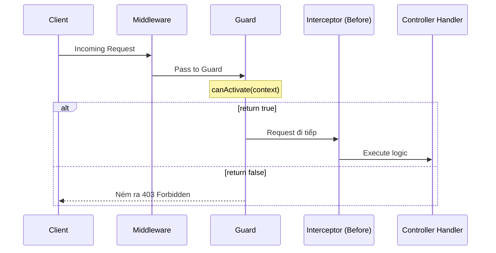

# [NestJS] Guards: Người Gác Cổng Phân Quyền (Authentication & Authorization)

<!--truncate-->

## Agenda

**Thời gian đọc ước tính:** ~12 phút

### Learning outcome:
- **Hiểu** được vai trò duy nhất (Single Responsibility) của Guard và sự khác biệt cơ bản giữa Guard và Middleware.
- **Giải thích** được cơ chế hoạt động của Guard thông qua `ExecutionContext` và `Reflector`.
- **Tự tay** xây dựng được một hệ thống phân quyền theo vai trò (Role-Based Access Control - RBAC) từ đầu.
- **Phân biệt** được khi nào nên trả về `false` và khi nào nên ném ra một Exception cụ thể trong Guard.

---

## Glossary & Vocabulary

**1. Technical Terms (Thuật ngữ kỹ thuật):**
| Term | Vietnamese Meaning & Quick Explain |
| :--- | :--- |
| **Guard** | Lớp bảo vệ (Người gác cổng). Quyết định xem một Request có được phép tiếp cận Route Handler hay không. |
| **Authentication** | Xác thực. Quá trình kiểm tra "Bạn là ai?" (ví dụ: đăng nhập, kiểm tra JWT hợp lệ). |
| **Authorization** | Phân quyền. Quá trình kiểm tra "Bạn có quyền làm việc này không?" (ví dụ: chỉ Admin mới được xóa bài viết). |
| **Metadata** | Siêu dữ liệu. Dữ liệu dùng để mô tả thông tin bổ sung cho code (ví dụ: gắn nhãn `@Roles('admin')` cho một hàm). |
| **ExecutionContext** | Ngữ cảnh thực thi. Cung cấp thông tin chi tiết về request hiện tại và hàm Controller sắp được gọi. |

**2. Vocabulary Support (Từ vựng học thuật/B1+):**
| Word | Meaning in Context (Nghĩa trong ngữ cảnh) |
| :--- | :--- |
| **Declarative (adj)** | Mang tính khai báo. Tức là viết code mô tả kết quả mong muốn thay vì viết các bước thực hiện chi tiết. |
| **Interpose (v)** | Đặt vào giữa, can thiệp vào giữa một quy trình. |
| **Insufficient (adj)** | Không đủ (thường dùng khi nói về quyền hạn: *insufficient privileges*). |

---

## 1. WHY — Tại sao chúng ta cần Guard?

Thực trạng kỹ thuật hiện nay: Trong các ứng dụng Express.js truyền thống, việc xác thực (Authentication) và phân quyền (Authorization) thường được xử lý bằng Middleware.

**Vấn đề phát sinh khi dùng Middleware cho phân quyền:**
1. **Middleware "mù tịt" về đích đến:** Nó chỉ nhận `req`, `res`, gọi hàm `next()` và không hề biết sau hàm `next()` đó, Controller nào hay Route Handler nào sắp được thực thi.
2. **Khó cấu hình linh hoạt:** Vì không biết chính xác route nào đang được gọi, việc thiết lập quyền cho từng hàm cụ thể (ví dụ: hàm `deleteUser()` yêu cầu quyền `admin`, hàm `getUser()` chỉ yêu cầu `user`) thông qua Middleware trở nên rất rườm rà, lặp code và dễ sai sót.

**Giải pháp:** NestJS thiết kế ra **Guards**. Guards sinh ra để giải quyết đúng một bài toán duy nhất (Single Responsibility): Quyết định xem request có được xử lý tiếp hay không. Nhờ được cấp quyền truy cập vào `ExecutionContext`, Guards biết chính xác hàm nào sắp chạy và yêu cầu quyền hạn gì.

---

## 2. WHAT — Guard là cái gì?

### 2.1. Định nghĩa kỹ thuật

Guard là một class được gắn decorator `@Injectable()` và bắt buộc phải implement interface `CanActivate`.


**Definition Anatomy (Giải phẫu định nghĩa):**
- **`@Injectable()`**: Đánh dấu đây là một Provider. Nhờ đó, Guard có thể tiêm (inject) các Dependency khác vào (như `Reflector` hay các Service kiểm tra Database).
- **`CanActivate`**: Giao diện chứa một hàm duy nhất `canActivate()`. Hàm này bắt buộc phải trả về kiểu `boolean` (hoặc `Promise<boolean>`, `Observable<boolean>`).
  - Nếu trả về `true`: Request được phép đi tiếp.
  - Nếu trả về `false`: Request bị chặn đứng, NestJS tự động ném ra lỗi `403 ForbiddenException`.

### 2.2. Vị trí của Guard trong Request Lifecycle



Như bạn thấy trong sơ đồ, Guards chạy **sau** tất cả các Middleware, nhưng **trước** Interceptors và Pipes. Điều này rất hợp lý: Chúng ta không nên tốn tài nguyên server để biến đổi dữ liệu (Pipes) nếu user đó thậm chí còn không có quyền truy cập.

---

## 3. HOW — Xây dựng hệ thống Role-Based Access Control (RBAC)

RBAC (*Phân quyền dựa trên vai trò*) là mô hình phổ biến nhất. Chúng ta sẽ làm theo 3 bước:
1. Tạo Custom Decorator để gắn nhãn vai trò cho từng Route.
2. Tạo RolesGuard để đọc nhãn đó và kiểm tra quyền.
3. Áp dụng vào Controller.

### Bước 1: Tạo Custom Decorator (Đính kèm Metadata)

Chúng ta cần một công cụ để khai báo Declarative (*Mang tính khai báo*) rằng: "Route này chỉ dành cho Admin". NestJS cung cấp `Reflector.createDecorator` để làm việc này rất sạch sẽ.

```typescript
// filename: src/common/decorators/roles.decorator.ts
import { Reflector } from '@nestjs/core';

// Khởi tạo một decorator có tên là @Roles
// Nó chấp nhận đầu vào là một mảng chuỗi (ví dụ: ['admin', 'manager'])
export const Roles = Reflector.createDecorator<string[]>();
```

### Bước 2: Viết RolesGuard

Guard này sẽ làm nhiệm vụ đọc Metadata vừa gắn ở Bước 1 và đối chiếu với quyền của người dùng hiện tại.

```typescript
// filename: src/common/guards/roles.guard.ts
import { Injectable, CanActivate, ExecutionContext } from '@nestjs/common';
import { Reflector } from '@nestjs/core';
import { Roles } from '../decorators/roles.decorator';

@Injectable()
export class RolesGuard implements CanActivate {
  // Inject Reflector để có thể đọc được Metadata từ Controller
  constructor(private reflector: Reflector) {}

  canActivate(context: ExecutionContext): boolean {
    // 1. Lấy danh sách các Roles được yêu cầu từ Route Handler
    const requiredRoles = this.reflector.get(Roles, context.getHandler());
    
    // Nếu Route này không yêu cầu Role nào (không gắn @Roles), cho qua luôn
    if (!requiredRoles) {
      return true;
    }

    // 2. Trích xuất thông tin User từ Request (Giả định đã qua bước Authentication)
    const request = context.switchToHttp().getRequest();
    const user = request.user;

    // Nếu chưa đăng nhập (không có user), từ chối
    if (!user) {
      return false; 
    }

    // 3. Đối chiếu: User hiện tại có nằm trong danh sách requiredRoles không?
    // Giả sử đối tượng user có thuộc tính mảng roles: ['user', 'admin']
    return requiredRoles.some((role) => user.roles?.includes(role));
  }
}
```

### Bước 3: Áp dụng vào Controller

Bạn có thể áp dụng Guard ở cấp độ Global, Controller, hoặc Method. Ở đây, chúng ta áp dụng ở Method.

```typescript
// filename: src/cats/cats.controller.ts
import { Controller, Post, Body, UseGuards } from '@nestjs/common';
import { RolesGuard } from '../common/guards/roles.guard';
import { Roles } from '../common/decorators/roles.decorator';

@Controller('cats')
// Có thể gắn ở đây nếu muốn toàn bộ Controller này đều bị Guard bảo vệ
// @UseGuards(RolesGuard) 
export class CatsController {
  
  @Post()
  @UseGuards(RolesGuard)   // Kích hoạt Guard
  @Roles(['admin'])        // Gắn Metadata: Chỉ Admin mới được tạo Cat
  async create(@Body() createCatDto: CreateCatDto) {
    // Logic thêm mèo mới
    return 'Cat created';
  }
}
```

**Kết quả:** 
Nếu một user bình thường gọi API `POST /cats`, `RolesGuard` sẽ tính toán và trả về `false`. NestJS lập tức chặn request này lại và ném về cho Client một thông báo lỗi tiêu chuẩn:

```json
{
  "statusCode": 403,
  "message": "Forbidden resource",
  "error": "Forbidden"
}
```

### Nâng cao: Tùy chỉnh Exception
Mặc định khi Guard trả về `false`, NestJS sẽ ném ra `ForbiddenException` (HTTP 403). Nếu bạn muốn trả về mã lỗi khác (ví dụ `401 Unauthorized`), bạn có thể trực tiếp Throw Exception bên trong hàm `canActivate()`:

```typescript
canActivate(context: ExecutionContext): boolean {
  // ... logic kiểm tra
  if (!isValid) {
    throw new UnauthorizedException('Token của bạn đã hết hạn, vui lòng đăng nhập lại.');
  }
  return true;
}
```

---

## 4. Discussion Questions

Hãy thử suy luận và trả lời các câu hỏi sau để kiểm tra mức độ nắm bắt kiến thức:

1. **Thứ tự thực thi:** Tại sao Guard phải chạy SAU Middleware nhưng TRƯỚC Interceptors và Pipes? Nếu chúng ta đổi chỗ Guard chạy sau Pipes thì hệ thống sẽ gặp vấn đề gì về tài nguyên?
2. **Global scope Injection:** Nếu đăng ký Guard ở cấp độ Global bằng lệnh `app.useGlobalGuards(new RolesGuard())` trong file `main.ts`, bạn có thể inject các Service khác vào `RolesGuard` thông qua Constructor được không? Tại sao? Làm thế nào để giải quyết vấn đề này? *(Gợi ý: Tìm hiểu về token `APP_GUARD`)*.
3. **Authentication vs Authorization:** Có nên gộp cả logic kiểm tra tính hợp lệ của JWT (Authentication) và logic kiểm tra Role (Authorization) vào chung một Guard duy nhất không? Điều này có vi phạm nguyên tắc SOLID nào không?

---

## References

- Tài liệu chính thức NestJS - [Guards](https://docs.nestjs.com/guards)
- Tài liệu chính thức NestJS - [Execution context](https://docs.nestjs.com/fundamentals/execution-context)
- Hướng dẫn thực hành NestJS - [Authorization](https://docs.nestjs.com/security/authorization)

---

*Made by Anh Tu - Share to be share*
