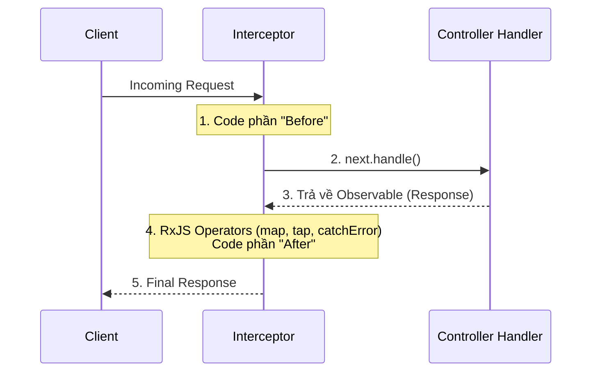

# [NestJS] Interceptors: Quyền Năng Thao Tác Stream (Before & After)

<!--truncate-->

## Agenda

**Thời gian đọc ước tính:** ~15 phút

### Learning outcome:
- **Hiểu** được vai trò của Interceptor và sức mạnh của nó so với các thành phần AOP khác (như Middleware hay Guards).
- **Giải thích** được cơ chế hoạt động của Interceptor thông qua `CallHandler` và RxJS `Observable`.
- **Tự tay** viết được các Interceptor cho các use-case thực tế: Ghi log, Biến đổi Response (Mapping), Biến đổi Lỗi (Exception Mapping), và Caching (Around advice).
- **Phân biệt** được khi nào nên gọi `next.handle()` và khi nào nên chặn hoàn toàn luồng thực thi.

---

## Glossary & Vocabulary

**1. Technical Terms (Thuật ngữ kỹ thuật):**
| Term | Vietnamese Meaning & Quick Explain |
| :--- | :--- |
| **Interceptor** | Kẻ can thiệp. Một lớp (class) có khả năng chặn và biến đổi Request trước khi vào Controller, hoặc Response sau khi từ Controller đi ra. |
| **Observable** | Luồng dữ liệu theo thời gian (thuộc thư viện RxJS). Đại diện cho quá trình xử lý và trả về kết quả của Controller. |
| **Pointcut** | Điểm cắt. Thuật ngữ AOP chỉ điểm mà tại đó logic bổ sung (Interceptor) được chèn vào. Trong NestJS, nó chính là lúc gọi hàm `handle()`. |
| **RxJS Operators** | Các hàm thao tác trên Observable (như `map`, `tap`, `catchError`) để biến đổi dòng dữ liệu. |

**2. Vocabulary Support (Từ vựng học thuật/B1+):**
| Word | Meaning in Context (Nghĩa trong ngữ cảnh) |
| :--- | :--- |
| **Mutate (v)** | Biến đổi. Thay đổi trạng thái hoặc cấu trúc của một đối tượng (ví dụ: biến đổi object thành mảng). |
| **Override (v)** | Ghi đè. Thay thế hoàn toàn hành vi mặc định bằng hành vi mới (ví dụ: trả về dữ liệu từ Cache thay vì gọi Controller). |
| **Interfere (v)** | Can thiệp. Tác động vào một quá trình đang diễn ra (thường mang nghĩa làm thay đổi luồng xử lý). |

---

## 1. WHY — Tại sao Guard và Middleware là chưa đủ?

Chúng ta đã biết cách dùng **Middleware** để cấu hình Headers và dùng **Guards** để chặn những người dùng không có quyền. 

Tuy nhiên, nếu chúng ta gặp phải các bài toán sau thì sao?
1. **Đo thời gian thực thi (Performance Monitoring):** Tôi muốn lưu lại thời điểm *trước khi* Controller chạy, và tính toán thời gian *sau khi* Controller trả về kết quả.
2. **Chuẩn hóa dữ liệu đầu ra (Response Mapping):** Bất kể Controller trả về chuỗi hay số, tôi muốn luôn luôn bọc nó trong một Object có format `{ data: ... }` trước khi gửi về cho Client.
3. **Bộ nhớ đệm (Caching):** Nếu dữ liệu đã có trong Redis, tôi muốn trả về ngay lập tức cho Client và **hủy bỏ hoàn toàn** việc gọi vào Controller để tiết kiệm tài nguyên.

Những tác vụ này đòi hỏi phải can thiệp trực tiếp (wrap) vào điểm giao thoa giữa Đầu vào (Request) và Đầu ra (Response) của hàm. Đó chính là lúc **Interceptors** phát huy sức mạnh tuyệt đối.

---

## 2. WHAT — Interceptor là gì?

### 2.1. Định nghĩa kỹ thuật

Interceptor là một class được gắn decorator `@Injectable()` và bắt buộc phải implement interface `NestInterceptor`. Nó được lấy cảm hứng mạnh mẽ từ kỹ thuật Lập trình hướng khía cạnh (Aspect Oriented Programming - AOP).


**Definition Anatomy (Giải phẫu định nghĩa):**
Mỗi Interceptor bắt buộc phải triển khai hàm `intercept(context, next)`.
- **`ExecutionContext` (context)**: Cung cấp ngữ cảnh hiện tại (chi tiết về Request, Controller, Method đang gọi).
- **`CallHandler` (next)**: Cung cấp hàm `handle()`. Khi bạn gọi `next.handle()`, hệ thống mới bắt đầu kích hoạt Controller. Hàm này trả về một luồng **Observable**, cho phép bạn sử dụng RxJS để xử lý kết quả.

### 2.2. Cơ chế bọc (Wrapping)

Vì bạn là người quyết định *khi nào* gọi `next.handle()`, bạn có thể viết code thực thi TRƯỚC và SAU nó.



---

## 3. HOW — 4 Quyền năng của Interceptors

Dưới đây là 4 Use-cases thực tiễn nhất minh họa sức mạnh thao tác Stream của Interceptor.

### 3.1. Aspect Interception (Ghi log / Đo thời gian)

Sử dụng operator `tap` của RxJS. Nó cho phép bạn thực hiện một hành động "bên lề" (như ghi log) mà không làm biến đổi dữ liệu Response.

```typescript
// filename: src/common/interceptors/logging.interceptor.ts
import { Injectable, NestInterceptor, ExecutionContext, CallHandler } from '@nestjs/common';
import { Observable } from 'rxjs';
import { tap } from 'rxjs/operators';

@Injectable()
export class LoggingInterceptor implements NestInterceptor {
  intercept(context: ExecutionContext, next: CallHandler): Observable<any> {
    console.log('Before... (Trạm kiểm soát TRƯỚC)');
    const now = Date.now();

    return next
      .handle() // Gọi Controller
      .pipe(
        // Hành động này diễn ra SAU khi Controller hoàn tất
        tap(() => console.log(`After... (Trạm kiểm soát SAU) hết ${Date.now() - now}ms`)),
      );
  }
}
```

### 3.2. Response Mapping (Chuẩn hóa cấu trúc dữ liệu)

Sử dụng operator `map`. Bất kể Controller trả về cái gì, Interceptor sẽ "gói" nó lại vào một thuộc tính `data`.

```typescript
// filename: src/common/interceptors/transform.interceptor.ts
import { Injectable, NestInterceptor, ExecutionContext, CallHandler } from '@nestjs/common';
import { Observable } from 'rxjs';
import { map } from 'rxjs/operators';

export interface Response<T> {
  data: T;
}

@Injectable()
export class TransformInterceptor<T> implements NestInterceptor<T, Response<T>> {
  intercept(context: ExecutionContext, next: CallHandler): Observable<Response<T>> {
    return next.handle().pipe(
      // Biến đổi dữ liệu (data) do Controller trả về thành dạng { data: ... }
      map(data => ({ data }))
    );
  }
}
```
*Lưu ý: Nếu API của bạn có chiến lược ghi Response riêng bằng thư viện `@Res()`, thì Response Mapping sẽ không hoạt động.*

### 3.3. Exception Mapping (Biến đổi mã lỗi)

Sử dụng operator `catchError`. Giả sử hệ thống ném ra một lỗi nội bộ không mong muốn, bạn có thể "bắt" nó lại và quăng ra một lỗi mới hợp lý hơn.

```typescript
// filename: src/common/interceptors/errors.interceptor.ts
import { Injectable, NestInterceptor, ExecutionContext, BadGatewayException, CallHandler } from '@nestjs/common';
import { Observable, throwError } from 'rxjs';
import { catchError } from 'rxjs/operators';

@Injectable()
export class ErrorsInterceptor implements NestInterceptor {
  intercept(context: ExecutionContext, next: CallHandler): Observable<any> {
    return next.handle().pipe(
      // Nếu có bất kỳ lỗi nào xảy ra trong Controller
      catchError(err => throwError(() => new BadGatewayException('Hệ thống bên thứ 3 đang lỗi!')))
    );
  }
}
```

### 3.4. Stream Overriding (Ghi đè luồng - Caching)

Đây là trường hợp bạn **không gọi `next.handle()`**. Khi đó, Controller sẽ bị bỏ qua hoàn toàn. Bạn dùng toán tử `of` của RxJS để tạo ra một luồng dữ liệu giả định và trả về ngay.

```typescript
// filename: src/common/interceptors/cache.interceptor.ts
import { Injectable, NestInterceptor, ExecutionContext, CallHandler } from '@nestjs/common';
import { Observable, of } from 'rxjs';

@Injectable()
export class CacheInterceptor implements NestInterceptor {
  intercept(context: ExecutionContext, next: CallHandler): Observable<any> {
    const isCached = true; // Trong thực tế, bạn sẽ check Redis/Memcache ở đây

    if (isCached) {
      // Trả về dữ liệu trong Cache ngay lập tức.
      // Do không gọi next.handle(), Controller sẽ KHÔNG bị kích hoạt!
      return of([{ id: 1, name: 'Dữ liệu lấy từ Cache' }]);
    }

    // Nếu không có cache, cho phép request đi tiếp vào Controller
    return next.handle();
  }
}
```

Tương tự, bạn cũng có thể dùng operator `timeout(5000)` để bắt buộc hủy bỏ Request nếu Controller xử lý quá 5 giây.

### Đăng ký Interceptor

Cũng giống như Guards, bạn có thể áp dụng Interceptor ở cấp độ Global, Controller hoặc Method:

```typescript
// Cấp độ Method hoặc Controller
@UseInterceptors(LoggingInterceptor)
export class CatsController {}

// Cấp độ Global (trong main.ts)
app.useGlobalInterceptors(new LoggingInterceptor());
```

---

## 4. Discussion Questions

Hãy thử suy luận và trả lời các câu hỏi sau để kiểm tra kiến thức của bạn:

1. **Hiệu ứng củ hành (Onion Model):** Giả sử bạn áp dụng 2 Interceptors cho cùng một Route: `Interceptor A` (ở cấp Controller) và `Interceptor B` (ở cấp Method). Thứ tự thực thi của các khối mã `Before` và `After` sẽ diễn ra theo trình tự như thế nào?
2. **RxJS vs Promises:** Tại sao NestJS lại bắt buộc sử dụng `Observable` của RxJS trong Interceptors thay vì dùng `async/await` với `Promise` thông thường? RxJS cung cấp lợi thế gì (như việc kết hợp `timeout`, `retry`) mà Promise khó làm được một cách thanh lịch?
3. **Pipes vs Interceptors:** Nếu bạn muốn chặn và format dữ liệu người dùng gửi lên (ví dụ: in hoa toàn bộ username từ Request Body), bạn nên dùng `Pipe` hay `Interceptor (phần Before)`? Tại sao?

---

## References

- Tài liệu chính thức NestJS - [Interceptors](https://docs.nestjs.com/interceptors)
- Tài liệu chính thức NestJS - [Execution context](https://docs.nestjs.com/fundamentals/execution-context)
- RxJS Documentation - [Operators](https://rxjs.dev/guide/operators)

---

*Made by Anh Tu - Share to be share*
