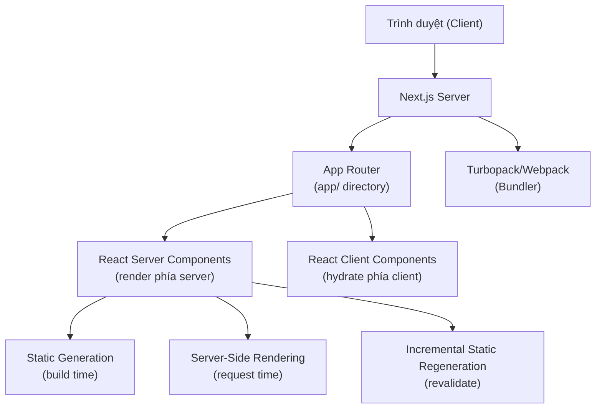
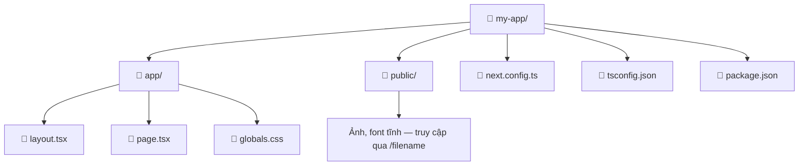

## Agenda

**Thời gian đọc ước tính:** ~15 phút

### Learning Outcomes

- **Giải thích** được Next.js là gì và tại sao nó ra đời từ nhu cầu thực tế của React
- **Tự tay** cài đặt và khởi chạy một Next.js project từ đầu bằng `create-next-app`
- **Phân biệt** được vai trò của `layout.tsx` và `page.tsx` trong App Router
- **Cấu hình** được TypeScript, ESLint, và Module Path Aliases đúng cách

---

## Glossary & Vocabulary

**1. Technical Terms (Thuật ngữ kỹ thuật):**

| Term | Vietnamese Meaning & Quick Explain |
| :--- | :--- |
| **App Router** | Hệ thống định tuyến mới của Next.js (từ v13+), dựa trên thư mục `app/`, hỗ trợ React Server Components. Khác với Pages Router cũ dùng thư mục `pages/`. |
| **Scaffolding** | Tạo khung dự án tự động — công cụ tạo sẵn toàn bộ cấu trúc folder/file theo chuẩn. |
| **Turbopack** | Bundler (*trình đóng gói module*) thế hệ mới của Vercel, viết bằng Rust, thay thế Webpack trong môi trường dev. |
| **Root Layout** | File `app/layout.tsx` đặt ở gốc thư mục `app/` — layout bắt buộc, bao bọc toàn bộ ứng dụng, phải chứa thẻ `<html>` và `<body>`. |
| **Module Path Alias** | Tên rút gọn đại diện cho một đường dẫn thư mục dài, VD: `@/` thay cho `../../`. |
| **File-system Routing** | Cơ chế định tuyến dựa trên cấu trúc thư mục — mỗi folder/file tương ứng với một URL segment. |

**2. Vocabulary Support (Từ vựng học thuật B1+):**

| Word | Meaning in Context |
| :--- | :--- |
| **Convention (n)** | Quy ước, cách làm được thống nhất chung. |
| **Scaffold (v)** | Tạo khung cấu trúc tự động cho dự án. |
| **Bundler (n)** | Trình đóng gói — công cụ gom nhiều file JS/CSS thành bundle để trình duyệt tải. |
| **Incremental compilation (n)** | Biên dịch tăng dần — chỉ re-compile những phần thay đổi, thay vì compile lại toàn bộ. |
| **Interoperability (n)** | Khả năng tương tác, hoạt động cùng nhau giữa các hệ thống khác nhau. |

---

## 1. WHY — Tại sao Next.js tồn tại?

Khi xây dựng ứng dụng React thuần (*vanilla React*), developer phải tự giải quyết hàng loạt vấn đề mà React core không cung cấp sẵn:

**Pain points của React thuần:**
- Không có hệ thống routing tích hợp — phải cài `react-router` và cấu hình thủ công.
- Không có Server-Side Rendering (SSR) — toàn bộ render xảy ra ở client, ảnh hưởng SEO và Time to First Byte.
- Không có tối ưu ảnh, font, hay script tự động — developer phải tự implement hoặc tìm thư viện bên ngoài.
- Không có cấu hình bundler — phải tự cấu hình Webpack hoặc Vite, phức tạp và tốn thời gian.
- Không có cơ chế caching hay data fetching chuẩn hóa.

**Next.js giải quyết tất cả những vấn đề trên trong một framework duy nhất**, đồng thời giữ nguyên React làm nền tảng UI. Developer tập trung vào product, không phải infrastructure.

---

## 2. WHAT — Next.js là gì?

> **Định nghĩa chính thức:** Next.js là một React framework (*khung làm việc*) cho phép xây dựng full-stack web applications, sử dụng React Components để xây dựng giao diện và Next.js cho các tính năng bổ sung, tối ưu hóa.

### 2.1. Definition Anatomy

Giải phẫu từng thành phần trong định nghĩa:

- **React framework**: Không phải thư viện độc lập — Next.js *xây dựng trên React*, mở rộng capabilities của React mà không thay thế nó. React vẫn là tầng UI.
- **full-stack**: Xử lý được cả frontend (giao diện) lẫn backend logic (API routes, Server Functions) trong cùng một codebase.
- **additional features and optimizations**: Routing, SSR/SSG, Image Optimization, Font Optimization, Metadata API, Caching — những thứ React core không có.

### 2.2. Kiến trúc tổng quan



### 2.3. Yêu cầu hệ thống

| Yêu cầu | Phiên bản tối thiểu | Lý do |
| :--- | :--- | :--- |
| Node.js | 20.9+ | Next.js 15+ dùng các API mới của Node.js liên quan đến async streams và caching |
| TypeScript | 5.1.0+ | Hỗ trợ decorator mới và type-checking improvements |
| Trình duyệt | Chrome/Edge/Firefox 111+, Safari 16.4+ | Hỗ trợ các Web APIs hiện đại (ReadableStream, Web Crypto...) |

---

## 3. HOW — Cài đặt và cấu hình Next.js

### 3.1. Tạo project bằng create-next-app CLI

Cách được khuyến nghị: dùng `create-next-app` — công cụ scaffolding chính thức.

```bash
# filename: terminal
# Tạo project mới — --yes bỏ qua tất cả prompt, dùng cấu hình mặc định
# Cấu hình mặc định: TypeScript + Tailwind CSS + ESLint + App Router + Turbopack + alias @/*
npx create-next-app@latest my-app --yes

cd my-app
npm run dev
# => Mở http://localhost:3000
```

Nếu muốn tùy chỉnh từng lựa chọn, bỏ flag `--yes`:

```bash
npx create-next-app@latest my-app
# Sẽ hiện các prompt:
# Would you like to use TypeScript? → Yes
# Would you like to use ESLint? → Yes
# Would you like to use Tailwind CSS? → Yes
# Would you like your code inside a src/ directory? → No (thường chọn No)
# Would you like to use App Router? → Yes (QUAN TRỌNG: chọn Yes để dùng App Router)
# Would you like to use Turbopack for next dev? → Yes
# Would you like to customize the import alias? → No (mặc định là @/*)
```

### 3.2. Scripts trong package.json

```json
// filename: package.json
{
  "scripts": {
    "dev": "next dev",
    // WHY Turbopack là default từ Next.js 15: nhanh hơn Webpack 10x trong dev
    // nhờ incremental compilation — chỉ re-compile file thay đổi, không compile lại cả app.
    // Muốn dùng Webpack: "next dev --webpack"

    "build": "next build",
    // WHY tách biệt build và dev: môi trường production cần tối ưu hóa
    // (tree-shaking, minification) không cần thiết trong dev.

    "start": "next start",
    // WHY start sau build: chạy production server từ output của "next build".
    // KHÔNG dùng "next start" trong CI/CD trực tiếp — phải build trước.

    "lint": "next lint"
    // WHY: Next.js 16+ không tự động chạy lint trong "next build" nữa.
    // Phải gọi thủ công hoặc tích hợp vào CI pipeline.
  }
}
```

### 3.3. Cấu trúc thư mục sau khi cài

Hai file cốt lõi bắt buộc phải hiểu:



```tsx
// filename: app/layout.tsx
// WHY bắt buộc có html + body: Next.js inject metadata vào <head>
// và cần <body> để mount toàn bộ React tree.
// Nếu thiếu layout.tsx, Next.js TỰ ĐỘNG tạo file này khi chạy next dev.
export default function RootLayout({
  children,
}: {
  children: React.ReactNode
}) {
  return (
    <html lang="vi">
      <body>{children}</body>
    </html>
  )
}
```

```tsx
// filename: app/page.tsx
// WHY file tên "page": Next.js chỉ expose route ra public khi có file "page.tsx".
// Folder không có page.tsx = không phải route — dùng để chứa components, utils...
export default function HomePage() {
  return <h1>Xin chào Next.js!</h1>
}
```

**Ảnh minh họa từ tài liệu chính thức:**


### 3.4. Cấu hình TypeScript

Next.js tích hợp sẵn TypeScript — không cần cài riêng. Chỉ cần đổi tên file sang `.ts`/`.tsx` và chạy `next dev`:

```bash
# Next.js sẽ tự động thực hiện:
# 1. Cài @types/react, @types/node
# 2. Tạo tsconfig.json với recommended config
# 3. Tạo next-env.d.ts — KHÔNG chỉnh file này, nó được auto-generated
```

**Plugin TypeScript trong VS Code:** Next.js có plugin riêng hiểu được context của framework (route params, layout props...). Kích hoạt:

1. Mở Command Palette (`Cmd+Shift+P`)
2. Tìm `"TypeScript: Select TypeScript Version"`
3. Chọn `"Use Workspace Version"`


### 3.5. Cấu hình Module Path Aliases

```json
// filename: tsconfig.json
{
  "compilerOptions": {
    "baseUrl": ".",
    "paths": {
      // WHY "@/*" thay vì "../../../":
      // "@" không phải ký tự hợp lệ trong tên folder hệ thống,
      // nên IDE phân biệt được đây là alias, không phải relative path thật.
      // create-next-app đã cấu hình sẵn alias này mặc định.
      "@/*": ["./*"]
    }
  }
}
```

```tsx
// filename: app/components/ProductCard.tsx

// Trước: relative path — dễ sai khi refactor, khó đọc
import { Button } from '../../../components/ui/Button'

// Sau: absolute alias — rõ ràng, không phụ thuộc vị trí file hiện tại
import { Button } from '@/components/ui/Button'
```

### 3.6. Cấu hình ESLint và Biome

Next.js hỗ trợ cả ESLint (toàn diện hơn) và Biome (nhanh hơn):

```bash
# ESLint — comprehensive rules
npx next lint

# Biome — fast linter + formatter (thay thế cả ESLint + Prettier)
npx @biomejs/biome check .
```

Lưu ý quan trọng: **Từ Next.js 16, `next build` không tự động chạy linter nữa.** Phải cấu hình chạy riêng trong CI pipeline.

---

## 4. Trade-offs & Limitations

| Aspect | Chi tiết |
| :--- | :--- |
| **Vendor lock-in** | `create-next-app` tạo cấu trúc opinionated — khó migrate sang framework khác so với Vite React. |
| **Turbopack stability** | Turbopack vẫn đang phát triển — một số Webpack plugins chưa tương thích. Nếu gặp lỗi, dùng `next dev --webpack` để fallback. |
| **Build time** | `next build` chậm hơn Vite đáng kể trên project lớn do phải phân tích static/dynamic routes. |
| **Cold start** | Serverless deployment (Vercel, AWS Lambda) có thể bị cold start — không phải vấn đề nếu self-host trên Node.js server thường xuyên. |

---

## 5. Discussion Questions

1. Trong một dự án thực tế, khi nào bạn nên chọn **Turbopack** và khi nào nên fallback về **Webpack**? Liệt kê các trường hợp cụ thể.

2. Next.js và Remix đều giải quyết bài toán full-stack React. Dựa vào cấu trúc project và convention của Next.js App Router vừa học, bạn nghĩ Next.js ưu tiên đánh đổi gì (tốc độ phát triển? Flexibility? Performance?) so với Remix?

3. Nếu một dự án legacy đang dùng Pages Router (`pages/`) muốn migrate sang App Router (`app/`), những file nào sẽ cần thay đổi đầu tiên dựa trên những gì bạn vừa học về cấu trúc thư mục?

---

## References

- [Next.js Official Docs — Installation](https://nextjs.org/docs/app/getting-started/installation) *(Crawled: 2026-06-25)*
- [create-next-app CLI Reference](https://nextjs.org/docs/app/api-reference/cli/create-next-app)
- [Turbopack Documentation](https://nextjs.org/docs/app/api-reference/turbopack)
- [TypeScript Reference — next-env.d.ts](https://nextjs.org/docs/app/api-reference/config/typescript#next-envdts)
- [ESLint Plugin Configuration](https://nextjs.org/docs/app/api-reference/config/eslint)

---

*Made by Anh Tu - Share to be share*
