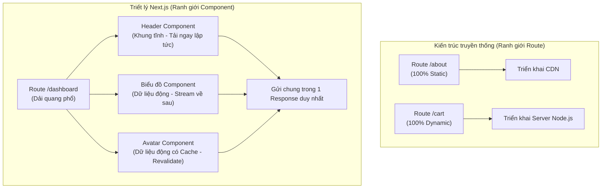

## Agenda

**Thời gian đọc ước tính:** ~15 phút

### Learning Outcomes

- **Hiểu** được triết lý "Quang phổ kết xuất" (Spectrum) của Next.js khác biệt thế nào so với ranh giới cấp độ Route truyền thống.
- **Giải thích** được sự đánh đổi (Trade-off) giữa độ linh hoạt của mã nguồn và độ phức tạp của hạ tầng máy chủ.
- **Phân biệt** được Fidelity về mặt chức năng và Fidelity về mặt hiệu năng khi triển khai (deploy) Next.js.
- **Nhận diện** được lý do tại sao Next.js bắt buộc phải có cơ chế Streaming.

---

## Glossary & Vocabulary

**1. Technical Terms (Thuật ngữ kỹ thuật):**

| Term | Vietnamese Meaning & Quick Explain |
| :--- | :--- |
| **Prerendering** | Kết xuất trước (tại thời điểm build). Tạo sẵn file HTML tĩnh tĩnh ngay trên máy chủ trước khi có bất kỳ request nào từ người dùng. |
| **Server-rendering** | Kết xuất tại máy chủ (tại thời điểm request). Tạo file HTML theo thời gian thực mỗi khi có người dùng truy cập. |
| **Spectrum** | Quang phổ / Dải quang phổ. Ý nói một tập hợp các điểm chuyển tiếp liên tục, không phải là lựa chọn nhị phân (Binary) trắng-hoặc-đen. |
| **Fidelity** | Độ trung thực / Độ trung thành. Khả năng một nền tảng (Platform) chạy đúng và tối ưu mọi tính năng của Next.js so với nguyên bản. |
| **Streaming** | Luồng dữ liệu. Kỹ thuật gửi dữ liệu theo từng mảnh (chunks) từ Server về Client ngay khi chúng sẵn sàng, thay vì chờ đợi toàn bộ dữ liệu. |

**2. Vocabulary Support (Từ vựng học thuật/B1+):**

| Word | Meaning in Context (Nghĩa trong ngữ cảnh) |
| :--- | :--- |
| **Boundary (n)** | Ranh giới, giới hạn chia tách giữa hai phần (ví dụ: giữa Static và Dynamic). |
| **Granular (adj)** | Tinh tế, chi tiết ở mức độ nhỏ nhất (ví dụ: Granular caching - Caching từng phần nhỏ thay vì cả trang). |
| **Coexist (v)** | Cùng tồn tại. Tĩnh và Động có thể tồn tại chung trên cùng một phản hồi. |
| **Propagation (n)** | Sự lan truyền. Lan truyền việc xóa cache qua nhiều máy chủ khác nhau. |
| **Bespoke (adj)** | Thiết kế riêng biệt, tùy chỉnh cao cho một hệ thống cụ thể. |

---

## 1. WHY — Vấn đề của các kiến trúc Web hiện tại

Phần lớn các web framework hiện đại (kể cả Next.js trong quá khứ với Pages Router) thường vạch ra một ranh giới rất cứng nhắc: **Tĩnh (Static) hoặc Động (Dynamic) ở cấp độ Route (đường dẫn).**

**Thực trạng kiến trúc truyền thống:**
- **Build-time prerendering (Chỉ render lúc Build):** Mọi trang đều được tạo ra ở dạng HTML tĩnh. Ưu điểm là triển khai cực dễ lên CDN (*Mạng phân phối nội dung*), tải cực nhanh. Nhưng nhược điểm là nếu muốn thay đổi chỉ một con số (như số lượt xem), bạn phải build lại toàn bộ website.
- **Route-level boundaries (Ranh giới ở cấp độ Route):** Bạn phải chọn một route là Tĩnh hay Động. Nếu chọn Tĩnh, nó lên CDN. Nếu chọn Động, nó chạy qua Server. Vấn đề phát sinh khi một trang web chủ yếu là tĩnh (như trang bài viết Blog), nhưng lại có một thành phần động nhỏ xíu (hiển thị "Chào Anh Tú"). Vì thành phần nhỏ xíu này, toàn bộ trang Blog phải bị đánh dấu là "Động" và phải render lại từ đầu cho mỗi user, lãng phí tài nguyên vô ích.

**Next.js App Router thay đổi điều đó.** Next.js không bắt bạn chọn nhị phân. Nó cho phép Tĩnh và Động tồn tại chung trên cùng một trang.

---

## 2. WHAT — Triết lý kết xuất của Next.js

> **Định nghĩa cốt lõi:** Next.js xem Static và Dynamic không phải là một sự lựa chọn nhị phân ở cấp độ Route, mà là một **Dải quang phổ (Spectrum) ở cấp độ Component**. Một trang duy nhất có thể có bộ khung tĩnh tải ngay lập tức, và các phần động được truyền dần (stream) khi dữ liệu sẵn sàng.

### 2.1. Definition Anatomy (Giải phẫu định nghĩa)

- **nhị phân ở cấp độ Route** (*route-level binary*): Hoặc toàn bộ trang `/blog` là Tĩnh, hoặc toàn bộ là Động.
- **quang phổ (Spectrum)**: Một dải liền mạch. Ở một đầu cực tĩnh (100% Static HTML), ở đầu kia cực động (100% Server rendering). Các trang của Next.js thường nằm ở giữa dải quang phổ này (ví dụ: 80% tĩnh, 20% động).
- **cấp độ Component** (*component-level*): Từng Component riêng lẻ tự quyết định nó là tĩnh hay động (nhờ vào việc nó có gọi Database hay đọc Request hay không), không phụ thuộc vào các Component khác.

### 2.2. Trực quan hóa Kiến trúc (Visual Architecture)

### 2.3. Điều này mang lại lợi ích gì?

1. **Tốc độ tải nhận thức nhanh hơn (Faster perceived load times):** Khung tĩnh hiển thị ngay lập tức, người dùng không phải nhìn màn hình trắng.
2. **Caching chi tiết (Granular caching):** Bạn có thể cache một truy vấn cơ sở dữ liệu đắt đỏ, nhưng vẫn để các thành phần khác trên trang chạy động. Việc xóa cache cũng chỉ xóa đúng dữ liệu của phần đó (`revalidateTag`), không phải xóa toàn bộ trang.

---

## 3. HOW — Sự đánh đổi của triết lý này (The Trade-Off)

Việc chuyển ranh giới từ Route xuống Component mang lại trải nghiệm tuyệt vời cho User và Developer, nhưng **Cái giá phải trả là sự phức tạp khổng lồ của Hạ tầng máy chủ (Infrastructure)**.

Khi bạn chuyển sự phức tạp khỏi mã nguồn, bạn đang đẩy sự phức tạp đó cho nền tảng Hosting (như Vercel, AWS, v.v.).

### 3.1. Các yêu cầu hạ tầng bắt buộc (Infrastructure Implications)

Để chạy được mô hình này, máy chủ Hosting của bạn **BẮT BUỘC** phải hỗ trợ:

- **Streaming:** Máy chủ không thể chờ render xong cả trang mới gửi đi. Nó phải gửi ngay Header tĩnh, giữ kết nối mở, và "bắn" tiếp dữ liệu biểu đồ khi Database trả về.
- **Cache coordination (Điều phối cache):** Khi có nhiều máy chủ chạy song song, nếu bạn gọi lệnh xóa cache ở Server A, hệ thống phải báo cho Server B cũng xóa cache đó ngay lập tức.
- **Cache consistency (Tính nhất quán của cache):** Next.js sinh ra 2 thứ: HTML (để hiển thị) và RSC Payload (dữ liệu JSON để React thao tác). Máy chủ phải đảm bảo 2 thứ này luôn đồng bộ, nếu không người dùng sẽ thấy dữ liệu cũ khi bấm chuyển trang.

### 3.2. Tính di động và Độ trung thực (Portability and Fidelity)

Vì Next.js là một tiến trình Node.js, nó có thể chạy trên MỌI máy chủ có cài Node.js. Nhưng để chạy "tối ưu", chúng ta phân biệt 2 loại Độ trung thực (Fidelity):

1. **Functional fidelity (Độ trung thực về chức năng):** Nền tảng đảm bảo mọi tính năng của Next.js đều hoạt động không lỗi. Đây là lựa chọn nhị phân: Hoặc Đạt, hoặc Trượt. Next.js có cung cấp bộ Test Suite để các nền tảng tự kiểm tra.
2. **Performance fidelity (Độ trung thực về hiệu năng):** Đây là yếu tố phân hóa. Ví dụ: Tính năng PPR (Partial Prerendering) có thể chạy trên máy chủ Node.js thường, nhưng nó sẽ phản hồi ở *độ trễ của máy chủ gốc*. Tuy nhiên, nếu triển khai trên một hạ tầng tối ưu (như Vercel), bộ khung tĩnh của PPR sẽ được phục vụ từ mạng CDN gần người dùng nhất với *độ trễ bằng 0*, trong khi phần động vẫn được xử lý ở máy chủ gốc. Đây là điểm tạo nên sự khác biệt giữa các dịch vụ Cloud.

---

## 4. Discussion Questions

1. Theo bạn, tại sao việc kết hợp cả phần Tĩnh và phần Động trong cùng một Response lại đòi hỏi phải có cơ chế Streaming? Nếu không có Streaming, hệ thống sẽ bị thắt cổ chai (bottleneck) ở đâu?
2. Hãy tưởng tượng bạn đang chạy Next.js trên 3 máy chủ EC2 của AWS phía sau một Load Balancer. Khi một Admin nhấn nút "Cập nhật giá sản phẩm", bạn gọi `revalidateTag('product')`. Làm thế nào để cả 3 máy chủ EC2 đều biết rằng chúng cần xóa cache cục bộ của mình? (Đây chính là bài toán Cache Coordination).
3. Nếu bạn chỉ cần làm một trang Landing Page giới thiệu công ty (chỉ có HTML/CSS/JS tĩnh), việc sử dụng Next.js App Router (vốn mạnh về Dynamic Spectrum) có phải là "dùng dao mổ trâu giết gà"? Tại sao có hay tại sao không?

---

## References

- [Next.js Official Docs — Rendering Philosophy](https://nextjs.org/docs/app/guides/rendering-philosophy) *(Crawled: 2026-06-25)*
- [Partial Prerendering (PPR) Platform Guide](https://nextjs.org/docs/app/guides/ppr-platform-guide)

---

*Made by Anh Tu - Share to be share*
