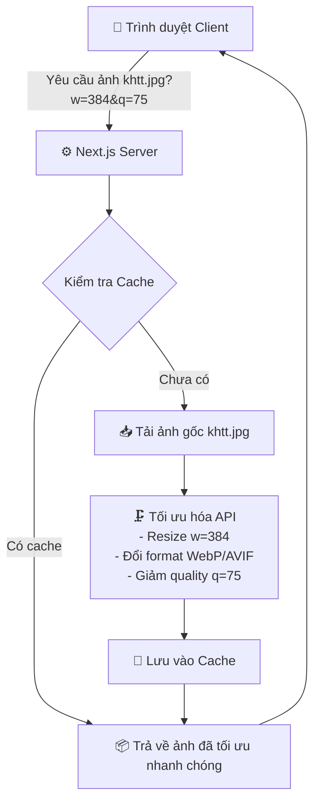
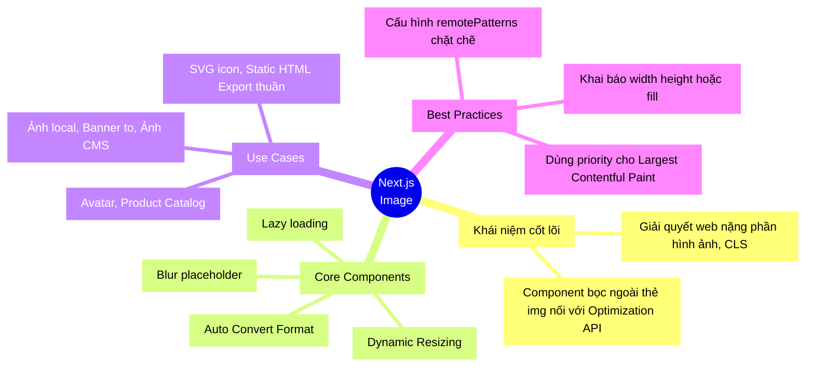

## 1. Mở đầu (Hook) 🎣

Bạn đã bao giờ vào một trang web, chờ mỏi mòn 5-10 giây chỉ để cái banner load xong chưa? Theo thống kê, hình ảnh thường chiếm đến 50-70% dung lượng của một trang web tải xuống. Nếu không tối ưu hình ảnh, website của bạn không chỉ chậm, trải nghiệm người dùng tệ mà còn bị Google đánh tụt hạng không thương tiếc.

Nhưng đừng lo, với **Next.js Image Optimization**, mọi thứ đã được giải quyết ở "cấp độ vũ trụ" chỉ với một component `<Image />`. 

---

## 2. Kẻ thù số 1 của Web UX: Cumulative Layout Shift (CLS) 🦹

Theo [tài liệu chính thức của Next.js](https://nextjs.org/learn/dashboard-app/optimizing-fonts-images), **Cumulative Layout Shift (CLS)** là một chỉ số (metric) đo lường do Google đặt ra nhằm đánh giá hiệu năng và trải nghiệm người dùng (UX) của website. Khái niệm này liên kết rất chặt chẽ với SEO (Core Web Vitals).

Hiểu đơn giản: **Layout Shift (Sự xê dịch bố cục)** xảy ra khi nội dung trên trang web đột ngột bị đẩy đi chỗ khác trong lúc trang đang tải.
* **Ví dụ kinh điển:** Bạn đang định bấm vào nút "Mua hàng", nhưng đột nhiên một tấm hình banner (to và nặng) ở phía trên vừa tải xong, nó chèn vào và giật nguyên cái nút "Mua hàng" tụt xuống dưới. Kết quả? Bạn bấm nhầm vào nút "Huỷ đơn hàng"! 😡

**Tại sao CLS lại kinh khủng đến vậy?**
Vì trình duyệt mặc định không biết kích thước của tấm hình, hoặc khoảng trống dành cho font chữ cho đến khi chúng tải xong hoàn toàn. Khi tải xong, trình duyệt phải "nhường chỗ" cho chúng, đẩy các thành phần HTML khác đi chỗ khác.

Đây là lý do sống còn mà Next.js phải tạo ra 3 vũ khí tối thượng để trị CLS:
1. `<Image />` component: Khai báo kích thước trước để giữ chỗ, chống xê dịch do hình ảnh.
2. `next/font` module: Load font từ local ở Server, bóp font fallback chống xê dịch chữ (FOUT/FOIT).
3. `Metadata API` (thẻ `<head>`): Giúp trình duyệt và Social Crawler nhận cấu trúc DOM sớm nhất có thể định hình page.

---

## 3. Ẩn dụ cốt lõi (Analogy) 🔄

Hãy tưởng tượng bạn là phụ bếp trong một nhà hàng sinh thái (Website).
- **Cách cũ (Thẻ `` truyền thống):** Mỗi khi khách gọi món Salad (load trang), bạn phải ra vườn nhổ nguyên một cây bắp cải khổng lồ 5kg, bê vào bàn ăn của khách, rồi khách tự dùng dao thái ra để ăn. Quá cồng kềnh, tốn sức và lãng phí!
- **Cách của Next.js (Component `<Image />`):** Khách dùng điện thoại nhỏ, bạn thái sẵn khẩu phần 100g. Khách dùng ipad, bạn thái 200g. Hơn nữa, bạn đổi sang loại rau thế hệ mới (WebP/AVIF) nhẹ gọn hơn nhiều. Thậm chí, khách chưa kéo menu tới món đó (Lazy load) thì bạn thong thả chưa cần chuẩn bị.

Đó chính xác là những gì Next.js làm với hình ảnh của bạn!

---

## 4. Deep Dive & Kiến trúc hoạt động 🔬

Component `next/image` không chỉ là một cái bọc của thẻ ``, nó là công cụ giao tiếp với Image Optimization API được tích hợp sẵn trên server của Next.js (hoặc Vercel).



### 3 "Phép thuật" chính của Next.js Image:
1. **Size Optimization:** Tự động chuyển đổi định dạng ảnh sang WebP hoặc AVIF cho dung lượng nhỏ hơn 30% với chất lượng tương đương JPEG/PNG.
2. **Visual Stability:** Ngăn chặn hiện tượng **Cumulative Layout Shift (CLS)** (Nội dung bị giật, nhảy lung tung khi ảnh load xong) bằng cách yêu cầu cung cấp cố định `width` và `height` (hoặc `fill`).
3. **Faster Page Loads:** Tự động **Lazy loading** (chỉ tải khi ảnh xuất hiện trong viewport).

---

## 5. Thực hành (Practice) 💻

Dưới đây là cách sử dụng thực tế. Nhớ đọc phần comment "Tại sao" nhé!

```tsx
// ❌ Sai: Dùng thẻ img truyền thống (Tải nguyên ảnh gốc 5MB)


// ✅ Đúng: Sử dụng next/image
import Image from 'next/image';

export default function Home() {
  return (
    <div>
      {/* Tính năng Static Import: Nextjs tự động biết width/height của local image */}
      <Image
        src="/hero-banner.jpg"
        alt="Hero Banner sinh động"
        // 💡 placeholder="blur" để hiển thị hiệu ứng mờ nhòe trong lúc chờ ảnh load
        // Trải nghiệm người dùng mượt mà hơn cực kỳ nhiều!
        placeholder="blur" 
        priority // 💡 Dùng cho các ảnh LCP (Largest Contentful Paint) ngay màn hình đầu để không bị lazy load
      />
      
      <div style={{ position: 'relative', width: '300px', height: '400px' }}>
         {/* 💡 Thuộc tính fill: Rất mạnh khi bạn không biết kích thước chính xác 
              nhưng muốn ảnh tự động full phần tử cha. */}
         <Image
           src="https://external-domain.com/random-pic.jpg"
           alt="Remote Image"
           fill
           style={{ objectFit: 'cover' }}
         />
      </div>
    </div>
  )
}
```

> **⚠️ Lưu ý cực kỳ quan trọng đối với Remote Images:**
> Để dùng URL ảnh từ domain bên ngoài (VD: `https://external-domain.com`), bạn **BẮT BUỘC** phải khai báo domain đó an toàn trong file `next.config.mjs`. Điều này để chống lại rủi ro bị hacker lợi dụng (DDoS Optimization API).

```javascript
// next.config.mjs
/** @type {import('next').NextConfig} */
const nextConfig = {
  images: {
    remotePatterns: [
      {
        protocol: 'https',
        hostname: 'external-domain.com',
        port: '',
        pathname: '/**',
      },
      {
        protocol: 'https',
        hostname: '*.githubusercontent.com', // Cú pháp wildcard match nhiều subdomains
      }
    ],
  },
};
export default nextConfig;
```

---

## 6. Đánh giá (Usecase & Trade-off) ⚖️

Mạnh mẽ là thế, nhưng không phải lúc nào cũng mù quáng sử dụng. Nhớ tư duy phản biện!

| Trường hợp | Có nên dùng `<Image/>`? | Lời khuyên 💡 |
|---|---|---|
| **Ảnh Local trong project** | ✅ Có | Rất nên dùng, cấu hình dễ, có sẵn width/height tự động. |
| **Ảnh Remote từ CMS/S3** | ✅ Có | Luôn dùng để tiết kiệm băng thông khổng lồ, nhớ setting `remotePatterns`. |
| **Ảnh SVG, Icon** | ❌ Không, hoặc tuỳ | SVG bản chất là vector code nên đã rất nhẹ và scale tốt rồi. Dùng thẻ `` thông thường hoặc SVG component là đủ. Chạy qua API optimization vừa không cần thiết lại lãng phí CPU của server. |
| **Build dạng Static Export** | ⚠️ Cẩn thận | Nếu bạn build dạng `output: 'export'` (không có Nodejs Server), Next API tối ưu ảnh theo thời gian thực sẽ **không chạy được**. Cần dùng custom Image Loader (như Cloudinary, Imgix) hoặc quay lại với thẻ ``. |

---

## 7. Tổng hợp (MECE Mindmap) 🧩

Để ghi nhớ 100% kiến thức lúc đi phỏng vấn hay lúc làm dự án, hãy sử dụng sơ đồ dưới đây:



---
*Made by Anh Tu - Share to be share*
