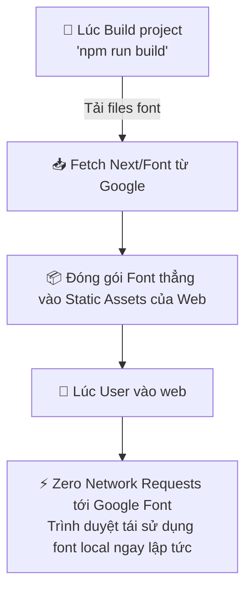
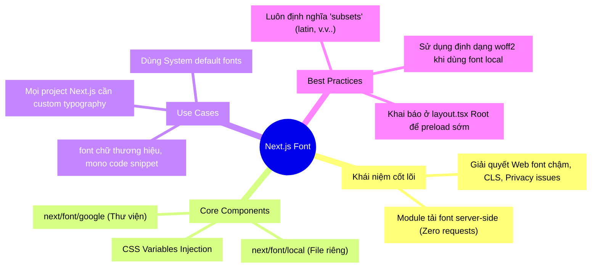

## 1. Mở đầu (Hook) 🎣

Bạn đã bao giờ vào một trang web báo chí, đang say sưa đọc dòng chữ đầu tiên bằng font Arial mặc định, bỗng nhiên 2 giây sau toàn bộ chữ biến thành font Roboto xịn xò, kéo theo cả bố cục trang web giật tung lên (hiện tượng Cumulative Layout Shift - CLS)?

Hoặc tệ hơn, màn hình trắng xoá không có cả một chữ nào trong vài giây đầu vì font đang được tải về từ Google Fonts (Flash of Invisible Text - FOIT)?

Đây chính là những "cơn ác mộng" về trải nghiệm người dùng mà Next.js Font Optimization (`next/font`) giải quyết triệt để. Điểm tuyệt vời? Không cần phải gửi bất kỳ request nào đến Google để fetch font từ phía client (trình duyệt) nữa!

---

## 2. Ẩn dụ cốt lõi (Analogy) 🔄

Hãy tưởng tượng trình duyệt của bạn là một **Người thợ khắc đá** đang cần khắc một bức thư lên tường.

- **Cách cũ (Include Google Fonts qua thẻ `<link>`):** Người thợ nhận nội dung thư (HTML), nhưng lại không có "bộ dao khắc đặc biệt" (Font). Anh ta đành khắc tạm bằng dao nhà trước (hiện tượng nhảy font), hoặc cứ ngồi chờ khi nào shipper giao dao khắc từ Mỹ (Google) về mới làm (hiện tượng chữ vô hình).  
- **Cách của Next.js (`next/font`):** Người quản lý nhà máy (Next.js Server) trong lúc chuẩn bị thư (Lúc Build) đã cất công tự đi lấy bộ dao khắc về, rồi **đóng gói bộ dao đó kèm luôn vào trong bức thư** trước khi gửi tới vị trí của người thợ. Người thợ mở thư ra là có sẵn dao để khắc liền, không chờ đợi một giây nào!

---

## 3. Deep Dive & Kiến trúc hoạt động 🔬

Next.js giới thiệu module `next/font` xử lý hoàn toàn bài toán tải font bằng cơ chế **Automatic Self-Hosting** (Tự động tự lưu trữ).



### 3 Điểm ưu việt của `next/font`:
1. **Zero Requests đến Domain bên ngoài:** Next.js download file font ở thời điểm *build time* (hoặc lần request đầu nếu xài dev). Khi deploy, font chữ là một file nằm ngay trong server của bạn. Không còn privacy issues, không còn lo rớt mạng Google. 
2. **Zero Cumulative Layout Shift (CLS):** `next/font` sử dụng thuộc tính CSS `size-adjust` do Next.js tự động tính toán dưới nền. Nó bóp kích thước font fallback (font mặc định) sao cho khớp chính xác đến từng pixel so với Google Font. Do đó, khi font chính thức load xong đè lên, nội dung không bị "giật" form layout chút nào.
3. **Subsetting tự động:** Bạn chỉ lấy chữ cái Latin? Next.js sẽ vứt các tệp tiếng Hàn, tiếng Nhật đi giúp file font giảm dung lượng từ 300KB xuống chỉ còn khoảng 20KB.

---

## 4. Thực hành (Practice) 💻

Dưới đây là cách setup `next/font/google` (Hoặc nếu bạn mua font công ty thì dùng `next/font/local`).

```tsx
// ❌ Sai: Cách cũ nhúng thẻ head gây render-blocking và CLS
<head>
  <link href="https://fonts.googleapis.com/css2?family=Inter&display=swap" rel="stylesheet" />
</head>

// ✅ Đúng: Cách chuẩn với Next.js App Router (app/layout.tsx)
import { Inter, Roboto_Mono } from 'next/font/google';

// 💡 Subsetting: Yêu cầu Nextjs chỉ bóc dỡ bộ chữ Latin để giảm dung lượng
// 💡 Variable CSS: Định nghĩa tên biến CSS để dùng trong Tailwind/CSS module
const inter = Inter({
  subsets: ['latin'],
  display: 'swap', // Tối ưu hoá việc hiển thị font thay thế một cách tinh tế
  variable: '--font-inter',
});

const robotoMono = Roboto_Mono({
  subsets: ['latin'],
  display: 'swap',
  variable: '--font-roboto-mono',
});

export default function RootLayout({ children }: { children: React.ReactNode }) {
  return (
    // Biến CSS sẽ được trích xuất và gán thẳng vào html element
    <html lang="en" className={`${inter.variable} ${robotoMono.variable}`}>
      <body>{children}</body>
    </html>
  );
}
```

Nếu muốn sử dụng Tailwind CSS, bạn cấu hình thêm một chút bên trong file `tailwind.config.js`:

```javascript
// tailwind.config.ts
import type { Config } from 'tailwindcss';

const config: Config = {
  content: ['./src/**/*.{js,ts,jsx,tsx}'],
  theme: {
    extend: {
      fontFamily: {
        // Tận dụng biến CSS Nextjs tạo ra
        sans: ['var(--font-inter)'],
        mono: ['var(--font-roboto-mono)'],
      },
    },
  },
}
export default config;
```

---

## 5. Đánh giá (Usecase & Trade-off) ⚖️

Luôn có đánh đổi trong kiến trúc.

| Trường hợp | Khuyên dùng | Lý do & Đánh đổi 💡 |
|---|---|---|
| **Dự án nhỏ, dùng Google Fonts phổ biến** | ✅ `next/font/google` | Tiện tuyệt đối. Setup 3 dòng, server tự lo liệu từ việc tải tải file, caching, bóp fallback. Vừa nhanh vừa chống CLS tuyệt vời. |
| **Doanh nghiệp có Custom Font (File .woff2/.ttf)** | 👍 `next/font/local` | Bạn sẽ phải upload file lên thư mục `/public` hoặc `src/fonts`. Vẫn được Next.js tối ưu chống CLS theo tỷ lệ metric fallback. Khuyến cáo dùng định dạng `.woff2`. |
| **Dự án dùng Google Fonts nhưng không support subset** | ⚠️ Thận trọng | Một số font quá dị/đặc biệt trên thư viện có thể không hỗ trợ bóc tách subset chuẩn khi build, làm file phình to. Phải test size lúc build! |
| **Dự án cần nhúng Font từ hệ thống User (System UI)** | ❌ System Fonts | Nếu project chỉ cần giao diện gọn nhẹ, đôi khi không gọi bất cứ Google font nào, sử dụng `font-family: system-ui, -apple-system` sẽ nhanh hơn toàn bộ các cơ chế optimization trên cộng lại. Đừng lạm dụng custom font nếu không thật sự cần thiết cho branding. |

---

## 6. Tổng hợp (MECE Mindmap) 🧩



---
*Made by Anh Tu - Share to be share*
