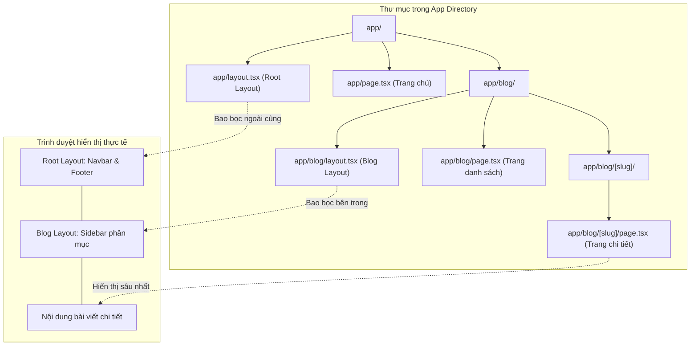
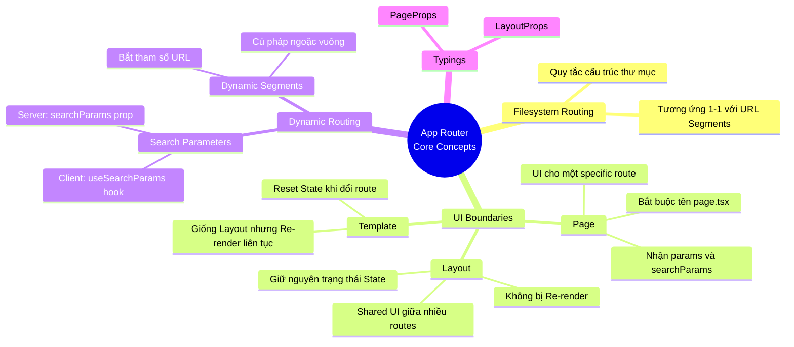

# 01. Layouts and Pages

Khi chuyển từ React thuần (sử dụng Client-side routing như `react-router-dom`) sang Next.js App Router, sự thay đổi lớn nhất bạn sẽ đối mặt là cách thiết kế kiến trúc Routing. Thay vì định nghĩa Route qua các file cấu hình Javascript, Next.js sử dụng File-system Based Routing (*Định tuyến dựa trên hệ thống file*). Trong bài viết này, chúng ta sẽ đi sâu vào việc giải phẫu hai thành phần cốt lõi nhất của kiến trúc này: Page và Layout, đồng thời khám phá các cơ chế nâng cao như Dynamic Segments và Search Params.

## Agenda

**Thời gian đọc ước tính:** ~15 phút

### Learning outcome:
- **Hiểu** được sự khác biệt cốt lõi về vòng đời và chức năng giữa Page và Layout.
- **Giải thích** được cơ chế File-system Based Routing và Partial Rendering bằng ngôn ngữ đơn giản.
- **Tự tay** thiết lập Nested Layouts, Dynamic Segments và truy xuất dữ liệu từ URL.
- **Phân biệt** được khi nào nên dùng `searchParams` (Server) và `useSearchParams` (Client) trong các kịch bản thực tế.

## Glossary & Vocabulary

**1. Technical Terms (Thuật ngữ kỹ thuật):**
| Term | Vietnamese Meaning & Quick Explain |
| :--- | :--- |
| **File-system Based Routing** | *Định tuyến dựa trên file*. URL của trang web được xác định hoàn toàn bởi cấu trúc thư mục (folders) trong codebase. |
| **Nested Routing** | *Định tuyến lồng nhau*. URL gồm nhiều phân đoạn (segments) lồng vào nhau, tương ứng với cấu trúc thư mục lồng nhau. |
| **Partial Rendering** | *Render một phần*. Khi chuyển trang trong cùng một layout, chỉ có Page thay đổi, còn Layout giữ nguyên trạng thái và không bị re-render. |
| **Dynamic Segments** | *Phân đoạn động*. Khai báo thư mục có dạng `[slug]`, giúp một route có thể khớp với nhiều URL khác nhau dựa trên dữ liệu. |

**2. Vocabulary Support (Từ vựng học thuật/B1+):**
| Word | Meaning in Context (Nghĩa trong ngữ cảnh) |
| :--- | :--- |
| **Segment (n)** | Một phân đoạn, một phần cụ thể của đường dẫn URL (vd: `/blog/post-1` có 2 segments). |
| **Hierarchy (n)** | Cấu trúc phân cấp, thứ bậc lồng nhau từ trên xuống dưới (cây thư mục). |
| **Infer (v)** | Suy luận, suy ra (trong ngữ cảnh TypeScript tự động suy luận kiểu dữ liệu). |

---

## 1. WHY — Vấn đề kỹ thuật

Thực trạng kỹ thuật khi xây dựng ứng dụng React quy mô lớn với các thư viện định tuyến truyền thống:
1. **Cấu hình phức tạp:** Bạn phải tự tay ánh xạ (map) từng URL với từng component tương ứng trong một file cấu hình tập trung khổng lồ, rất khó bảo trì khi dự án phình to.
2. **Quản lý UI dùng chung (Shared UI) cồng kềnh:** Việc chia sẻ Navbar, Sidebar hay Footer giữa các trang yêu cầu bạn phải lồng ghép component thủ công ở mọi nơi hoặc sử dụng các mẫu thiết kế phức tạp như Higher Order Components (HOC).
3. **Hiệu năng và Trải nghiệm người dùng kém (State Loss):** Khi chuyển qua lại giữa các trang có chung bố cục, component bố cục thường bị render lại (re-render) không cần thiết, làm mất các trạng thái quan trọng phía client (như thanh cuộn bị giật về đầu trang, dữ liệu form đang nhập bị xóa sạch).

**Giải pháp của Next.js:** App Router giải quyết triệt để những bài toán trên bằng cơ chế **File-system Based Routing** thông qua hai ranh giới vô hình nhưng vô cùng mạnh mẽ: `page.tsx` và `layout.tsx`.

---

## 2. WHAT — Nó là cái gì?

### 2.1 Định nghĩa Page và Layout

**Page (Trang)**
Định nghĩa: *A page is UI that is rendered on a specific route.*
- **UI** (*Giao diện*): Nó chịu trách nhiệm trả về các thẻ HTML/JSX để hiển thị nội dung trực tiếp tới người dùng.
- **rendered on a specific route** (*được hiển thị ở một đường dẫn cụ thể*): Component này chỉ được khởi tạo và xuất hiện khi người dùng truy cập khớp hoàn toàn vào một URL duy nhất (VD: `/blog/tech`). Không có URL đó, Page không tồn tại.
- **Convention (Quy ước):** Bạn bắt buộc phải tạo file có tên chính xác là `page.js` hoặc `page.tsx` và `export default` một React Component.


**Layout (Bố cục)**
Định nghĩa: *A layout is UI that is shared between multiple pages. On navigation, layouts preserve state, remain interactive, and do not rerender.*
- **shared between multiple pages** (*chia sẻ giữa nhiều trang*): Nó hoạt động như một lớp vỏ bọc (wrapper) chứa các UI dùng chung (như Navbar) bên ngoài các Page con.
- **preserve state, remain interactive, and do not rerender** (*giữ nguyên trạng thái, duy trì tương tác và không render lại*): Đây là ma thuật của Next.js. Khi bạn điều hướng giữa trang A và trang B (cùng nằm trong một Layout), bản thân Layout đó đứng im, không bị phá hủy và tái tạo lại.
- **Convention:** Bắt buộc tạo file tên `layout.js` hoặc `layout.tsx` và component phải nhận vào prop `children`.


### 2.2 Sơ đồ Kiến trúc Nested Routing (Visual First)

Để hình dung rõ nhất cách Next.js chuyển đổi từ các folder vô tri thành giao diện lồng nhau, hãy xem sơ đồ cấu trúc dưới đây.



**Phân tích sự lồng nhau (Nesting):**
Trong ví dụ trên, khi người dùng truy cập vào `/blog/react-hooks`, Next.js sẽ tự động lồng ghép UI theo thứ tự từ ngoài vào trong: `Root Layout` -> `Blog Layout` -> `Blog Post Page`.

---

## 3. HOW — Làm nó như thế nào?

### 3.1 Khởi tạo Root Layout (Bắt buộc)

Trong thư mục `app/`, Root Layout là file tối quan trọng. Nó bắt buộc phải chứa các thẻ HTML gốc. Nếu bạn quên tạo, Next.js sẽ tự động tạo cho bạn.

```tsx
// filename: app/layout.tsx
import './global.css';

export default function RootLayout({
  children, 
}: {
  children: React.ReactNode; // Định nghĩa rõ type cho children
}) {
  // Bao bọc toàn bộ ứng dụng bằng thẻ html và body bắt buộc
  return (
    <html lang="vi">
      <body>
        <nav>Đây là Navbar toàn cục</nav>
        {/* Điểm neo để hiển thị các Layout con hoặc Page con */}
        <main>{children}</main>
        <footer>Đây là Footer toàn cục</footer>
      </body>
    </html>
  );
}
```

### 3.2 Khởi tạo Page và Route lồng nhau (Nested Route)

Để tạo ra URL `/blog`, bạn tạo thư mục `blog` và đặt `page.tsx` vào trong đó.


```tsx
// filename: app/blog/layout.tsx
export default function BlogLayout({ children }: { children: React.ReactNode }) {
  // Layout con này sẽ tự động được đưa vào biến 'children' của RootLayout
  return (
    <div style={{ display: 'flex' }}>
      <aside>Menu điều hướng riêng của khu vực Blog</aside>
      <section>{children}</section>
    </div>
  );
}

// filename: app/blog/page.tsx
export default function BlogListPage() {
  return <h1>Danh sách tất cả bài viết trên hệ thống</h1>;
}
```

### 3.3 Dynamic Segments (Định tuyến động)

Thực tế, bạn không thể tạo tay hàng ngàn thư mục cho hàng ngàn bài viết. Bạn cần **Dynamic Segments**. Cách làm là bọc tên thư mục trong dấu ngoặc vuông `[ ]`. 


Khi khởi tạo `app/blog/[slug]/page.tsx`, Next.js sẽ tự động truyền các giá trị thay đổi trên URL vào prop `params` của component.

```tsx
// filename: app/blog/[slug]/page.tsx

// Khai báo kiểu dữ liệu cho PageProps helper tích hợp sẵn
type Props = {
  params: { slug: string };
};

export default function BlogPostDetail({ params }: Props) {
  // Nếu URL là /blog/hoc-nextjs, params.slug sẽ có giá trị "hoc-nextjs"
  return (
    <article>
      <h1>Nội dung bài viết: {params.slug}</h1>
    </article>
  );
}
```

> **Lưu ý nâng cao:** Không chỉ Page mới nhận được `params`, mà các Nested Layout nằm cùng thư mục hoặc thư mục con cũng có thể truy xuất `params` thông qua prop của nó. Tuy nhiên, Root Layout thì không nhận được các params động này.

### 3.4 Truy xuất Search Params (Query Strings)

Search params (ví dụ: `/blog?sort=desc&page=2`) là một phần cực kỳ quan trọng. Next.js cung cấp 2 cách thức hoàn toàn khác biệt để truy xuất, phụ thuộc vào việc component của bạn chạy trên Server hay Client.

**Cách 1: Xử lý trên Server Component (Mặc định)**
Mọi Page trong App Router mặc định là Server Component. Bạn có thể lấy trực tiếp qua prop `searchParams`. Việc sử dụng `searchParams` sẽ ép trang web của bạn chuyển sang chế độ **Dynamic Rendering** (Render động tại thời điểm có request) vì server cần đợi request thực tế bay tới mới biết user đang filter cái gì.

```tsx
// filename: app/products/page.tsx
type Props = {
  searchParams: { [key: string]: string | string[] | undefined };
};

export default function ProductsPage({ searchParams }: Props) {
  // Đọc thông số page trực tiếp trên Server để fetch Database
  const currentPage = searchParams.page || '1';
  
  return <h1>Trang sản phẩm số {currentPage}</h1>;
}
```

**Cách 2: Xử lý trên Client Component**
Nếu bạn có một ô Input dùng để filter danh sách sản phẩm ngay tại trình duyệt mà không cần tải lại toàn bộ trang, bạn nên dùng hook `useSearchParams`.

```tsx
// filename: app/products/SearchFilter.tsx
'use client'; // Bắt buộc khai báo để biến thành Client Component

import { useSearchParams } from 'next/navigation';

export default function SearchFilter() {
  const searchParams = useSearchParams();
  // Chỉ lấy giá trị tại client-side
  const query = searchParams.get('q');

  return <input defaultValue={query || ''} placeholder="Tìm kiếm..." />;
}
```

**Tóm tắt nguyên tắc (What to use and when):**
- **Server:** Dùng prop `searchParams` khi bạn cần giá trị này để chọc vào Database hoặc gọi API backend nhằm lấy dữ liệu khởi tạo cho trang.
- **Client:** Dùng `useSearchParams` khi các parameters này chỉ dùng để tương tác UI trên trình duyệt (như toggle tab, filter danh sách tĩnh đã tải sẵn).

### 3.5 Các Utility Types (Route Props Helpers)

Khi viết TypeScript, việc định nghĩa type cho `params` hay `searchParams` đôi khi khá lặp lại. Next.js cung cấp sẵn các type toàn cục (global types) được sinh ra tự động khi bạn chạy lệnh `next dev` hoặc `next build`:
- **`PageProps`**: Chứa sẵn định nghĩa cho cả `params` và `searchParams`.
- **`LayoutProps`**: Chứa sẵn định nghĩa cho `children` và `params`.

Bạn không cần phải import chúng, Next.js đã inject chúng vào môi trường TypeScript của dự án. Điều này giúp code gọn gàng hơn rất nhiều đối với các team dev ưa thích sự an toàn của kiểu dữ liệu.

---

## 4. WHAT IF — Khám phá & Trade-offs

### Đánh đổi (Trade-offs)
- **Ưu điểm Tuyệt đối:** File-system Based Routing ép toàn bộ team phải tuân thủ một cấu trúc thư mục cực kỳ chặt chẽ và nhất quán. Khi dự án có hàng trăm màn hình, bất cứ lập trình viên nào mới vào dự án cũng có thể dự đoán chính xác UI của URL `/dashboard/settings/profile` nằm ở vị trí nào trong thư mục. Cơ chế Partial Rendering tích hợp sẵn giúp tối ưu hiệu năng vô cùng lớn mà không cần cấu hình bằng tay.
- **Nhược điểm & Rủi ro:** Vấn đề **Deep Nesting** (Thư mục lồng nhau quá sâu). Khi dự án phức tạp, bạn sẽ thấy mình phải mở liên tục các thư mục lồng nhau hàng chục cấp độ. Bên cạnh đó, việc có quá nhiều file trùng tên nhau là `page.tsx` và `layout.tsx` sẽ khiến bạn cực kỳ dễ nhầm lẫn khi thao tác mở nhiều tab trên VSCode (Bạn có thể khắc phục bằng cách cài extension phân biệt tên tab theo tên thư mục cha).

### Nhắc qua về Templates (Sự thay thế Layout)
Layout có một đặc tính cốt lõi: **Không re-render khi chuyển trang**. Nhưng nếu bạn thực sự *muốn* component bố cục phải khởi tạo lại hoàn toàn (reset mọi state, chạy lại toàn bộ animation hay useEffect) mỗi khi URL thay đổi?
Đó là lúc bạn dùng file `template.tsx`. Nó hoạt động y hệt `layout.tsx`, bọc các con bên trong, nhưng nó phá vỡ quy tắc Partial Rendering bằng cách tạo ra một component instance hoàn toàn mới trong mỗi lần điều hướng. Trừ khi bạn có một lý do cực kỳ đặc thù (như reset form metrics, enter/exit animations), hãy luôn luôn ưu tiên sử dụng `layout.tsx` để đảm bảo hiệu suất.

### Discussion Questions
1. Nếu bạn có một trang Admin Dashboard (bắt buộc phải đăng nhập bằng Token) và một trang Landing Page (Public cho khách). Bạn sẽ thiết kế cấu trúc Layout ở thư mục `app/` như thế nào để Root Layout không bị ôm đồm quá nhiều logic kiểm tra quyền? Liệu có cách nào gộp nhóm các trang Admin lại mà không làm thay đổi URL hiển thị trên trình duyệt không?
2. Tại sao Next.js lại bắt buộc phải tách riêng `layout.tsx` và `page.tsx` thành hai ranh giới vật lý thay vì cho phép lập trình viên gộp chung một component duy nhất như các framework cũ? Mục đích sâu xa về kiến trúc Server Components là gì?
3. Bạn truyền một hàm callback từ `layout.tsx` (Server Component) xuống `page.tsx` (Client Component) qua props. Điều gì sẽ xảy ra và tại sao?

---

## 5. Mindmap Tổng kết (MECE)

Dưới đây là sơ đồ tư duy phân rã các khái niệm theo chuẩn MECE (Mutually Exclusive, Collectively Exhaustive), đảm bảo không chồng chéo và không bỏ sót bất kỳ thành phần nào của hệ thống Routing cốt lõi.



---

*Made by Anh Tu - Share to be share*
