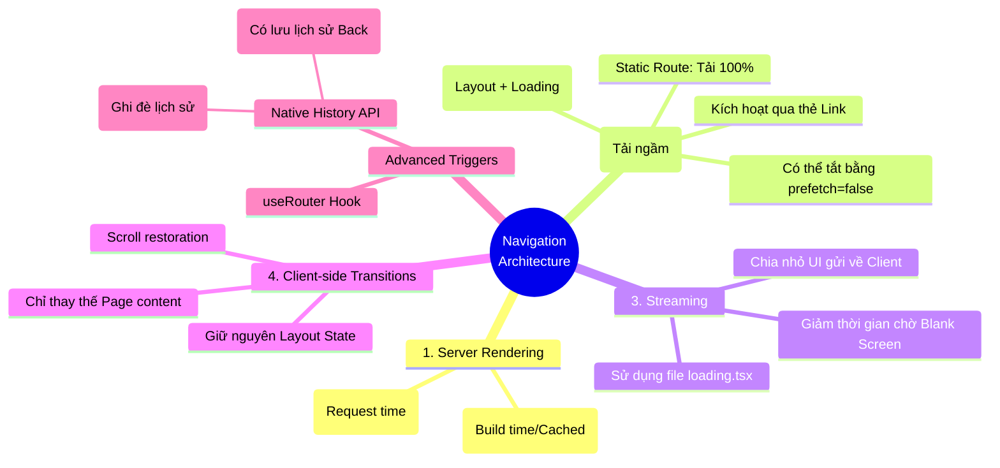

# 02. Linking and Navigating

Trong các ứng dụng React truyền thống (Single Page Application - SPA), việc chuyển trang diễn ra tức thì trên trình duyệt nhưng lại gặp rào cản lớn về SEO và thời gian tải JavaScript ban đầu. Ngược lại, các website Server-Rendered (MPA) truyền thống lại bắt người dùng phải chờ tải lại toàn bộ trang (full page reload) mỗi lần click link. Next.js App Router mang đến một giải pháp lai (hybrid) hoàn hảo: Giữ lại sức mạnh của Server Rendering nhưng lại mang đến cảm giác mượt mà tức thì của Client-side routing. Bài viết này sẽ giải mã "phép thuật" đằng sau cơ chế điều hướng của Next.js.

## Agenda

**Thời gian đọc ước tính:** ~15 phút

### Learning outcome:
- **Hiểu** được 4 trụ cột tạo nên trải nghiệm điều hướng của Next.js (Server Rendering, Prefetching, Streaming, Client-side transitions).
- **Giải thích** được cách Next.js tải ngầm dữ liệu (Prefetching) hoạt động ra sao đối với Route tĩnh và Route động.
- **Tự tay** thiết lập `loading.tsx` để kích hoạt Streaming và tối ưu cảm giác chờ đợi.
- **Phân biệt** được khi nào dùng `<Link>`, khi nào can thiệp bằng Native History API.

## Glossary & Vocabulary

**1. Technical Terms (Thuật ngữ kỹ thuật):**
| Term | Vietnamese Meaning & Quick Explain |
| :--- | :--- |
| **Prefetching** | *Tải ngầm trước*. Kỹ thuật tải sẵn dữ liệu và code của một trang đích ở background ngay cả trước khi người dùng click vào link. |
| **Streaming** | *Truyền phát dữ liệu*. Kỹ thuật gửi từng phần giao diện từ Server xuống Client ngay khi nó sẵn sàng, thay vì chờ toàn bộ trang render xong mới gửi một cục. |
| **Client-side Transition** | *Chuyển cảnh phía Client*. Quá trình thay đổi nội dung trang web bằng JavaScript mà không làm mới (reload) lại toàn bộ trình duyệt, giúp giữ nguyên các Layout chung. |
| **Hydration** | *Bù nước (Gắn kết tương tác)*. Quá trình React đính kèm các event listeners (như onClick) vào HTML tĩnh do Server trả về để biến nó thành ứng dụng tương tác được. |

**2. Vocabulary Support (Từ vựng học thuật/B1+):**
| Word | Meaning in Context (Nghĩa trong ngữ cảnh) |
| :--- | :--- |
| **Subsequent (adj)** | Xảy ra sau đó, tiếp theo (VD: subsequent navigations - các lần chuyển trang tiếp theo). |
| **Interruptible (adj)** | Có thể bị gián đoạn, có thể hủy bỏ giữa chừng (khi người dùng đổi ý click link khác lúc trang đang tải). |
| **Mitigate (v)** | Làm giảm nhẹ, làm dịu bớt (VD: mitigate hydration delay - giảm thiểu độ trễ khi hydration). |

---

## 1. WHY — Vấn đề kỹ thuật

Thực trạng kỹ thuật khi xử lý chuyển trang:
1. **Full Page Reload:** Ở các ứng dụng web cổ điển (như PHP, Ruby on Rails), mỗi lần click vào một thẻ `<a>`, trình duyệt sẽ xóa trắng màn hình (blank screen) và tải lại từ đầu (CSS, JS, Header, Footer). Điều này gây ra hiện tượng "chớp" màn hình (flash) cực kỳ khó chịu.
2. **Heavy Client Routing:** Với React Router truyền thống, trình duyệt phải tải về một cục JavaScript khổng lồ (bundle) ngay từ đầu để biết cách chuyển trang, gây chậm chạp ở lần truy cập đầu tiên (Low First Contentful Paint).
3. **Phản hồi chậm trên mạng yếu:** Kể cả khi dùng React, nếu người dùng click vào một trang yêu cầu gọi API nặng, hệ thống sẽ bị "đơ" hoặc phải hiển thị một vòng xoay (spinner) toàn màn hình chờ đợi rất lâu.

**Giải pháp của Next.js:** Next.js kết hợp thẻ `<Link>` tối ưu hóa, khả năng tải ngầm (Prefetching) và ranh giới tải (Streaming với `loading.tsx`) để tạo ra trải nghiệm chuyển trang tức thì, giữ nguyên State của Layout mà vẫn đảm bảo SEO tốt từ Server.

---

## 2. WHAT — Nó là cái gì?

Để Next.js đạt được trải nghiệm điều hướng thần tốc, nó dựa trên một nền tảng gồm **4 trụ cột chính**. Chúng ta sẽ "giải phẫu" từng khái niệm này.

### Trụ cột 1: Server Rendering (Render trên Server)

Định nghĩa: *In Next.js, Layouts and Pages are React Server Components by default. Server Component Payload is generated on the server before being sent to the client.*
- **React Server Components (RSC):** Component chạy hoàn toàn trên server. Nghĩa là mọi thao tác kết nối Database (SQL, Prisma) đều xong xuôi trước khi HTML được gửi về trình duyệt.
- Quá trình này chia làm 2 loại:
  - **Prerendering:** Render sẵn từ lúc build code (Static). Tốc độ trả về gần như bằng 0ms vì file đã nằm sẵn ở CDN.
  - **Dynamic Rendering:** Chờ có người truy cập mới bắt đầu render. Đánh đổi lại, Client phải chờ Server phản hồi.

### Trụ cột 2: Prefetching (Tải ngầm trước)

Định nghĩa: *Prefetching is the process of loading a route in the background before the user navigates to it.*
- **loading a route in the background** (*tải ngầm một route*): Khi một thẻ `<Link>` xuất hiện trên màn hình hiển thị (viewport) của người dùng, Next.js âm thầm gửi request để kéo sẵn dữ liệu của trang đó về máy.
- Kết quả: Khi người dùng thực sự click vào link, dữ liệu đã có sẵn trong RAM của trình duyệt. Trang web hiện ra **ngay lập tức** (instant feeling).
- Cách Next.js ứng xử:
  - **Static Route:** Tải ngầm TOÀN BỘ trang.
  - **Dynamic Route:** Tải ngầm MỘT PHẦN (chỉ tải Layout chung và `loading.tsx`), tránh làm Server quá tải nếu người dùng không click.

### Trụ cột 3: Streaming (Truyền phát từng phần)

Để khắc phục nhược điểm của Dynamic Rendering (Client phải chờ Server xử lý xong toàn bộ mới thấy giao diện), Next.js giới thiệu Streaming thông qua file `loading.tsx`.

Định nghĩa: *Streaming allows the server to send parts of a dynamic route to the client as soon as they're ready.*
- Thay vì chờ trang A load xong 100%, Server gửi ngay lập tức phần Header, Sidebar và UI của file `loading.tsx`.
- Lúc này, người dùng ngay lập tức thấy giao diện đang tải (skeleton), trong khi nội dung chính vẫn đang được Server xử lý.


*(Hình 1: Khi không có Streaming, người dùng phải chịu cảnh Blank Screen khá lâu)*


*(Hình 2: Với Streaming, giao diện bộ khung xuất hiện ngay lập tức, dữ liệu nặng được "chảy" xuống sau)*

### Trụ cột 4: Client-side Transitions (Chuyển cảnh phía Client)

Khi bạn click `<Link>`, thay vì để trình duyệt thực hiện thao tác "Request document" (như thẻ `<a>` thuần), Next.js chặn hành động đó lại và sử dụng JavaScript để:
- Giữ nguyên các Layout dùng chung (Navbar không hề chớp).
- Dùng dữ liệu đã Prefetch được để thay lõi nội dung ở giữa (Page).
- Cuộn trang lên vị trí trên cùng (Scroll to top).

---

## 3. HOW — Làm nó như thế nào?

### 3.1 Sử dụng thẻ `<Link>`

Thẻ `<Link>` là "vũ khí tối thượng" của Next.js. Đừng bao giờ dùng thẻ `<a>` thuần (trừ khi link ra ngoài trang web của bạn). `<Link>` tự động kích hoạt Prefetching và Client-side transition.

```tsx
// filename: app/page.tsx
import Link from 'next/link';

export default function HomePage() {
  return (
    <nav>
      {/* Prefetch tự động kích hoạt khi link này lọt vào tầm nhìn người dùng */}
      <Link href="/dashboard">Vào Trang Quản Trị</Link>
      
      {/* Tắt prefetch nếu đây là một danh sách link quá dài, tiết kiệm băng thông */}
      <Link href="/blog/heavy-post" prefetch={false}>
        Đọc bài viết siêu nặng
      </Link>
    </nav>
  );
}
```
*Lưu ý: Ngay cả khi `prefetch={false}`, Next.js vẫn sẽ thực hiện prefetch ngay khi bạn **hover** chuột lên thẻ link.*

### 3.2 Kích hoạt Streaming với `loading.tsx`

Đối với các trang Dynamic (phải gọi Database chậm), nếu bạn không có `loading.tsx`, khi click vào `<Link>`, ứng dụng sẽ trông như bị "đơ" một vài giây trước khi chuyển trang.

Để sửa lỗi này, hãy tạo file `loading.tsx` cùng cấp với `page.tsx`.


```tsx
// filename: app/blog/loading.tsx
export default function Loading() {
  // Trả về một Skeleton UI. 
  // UI này sẽ được Next.js bọc tự động vào <Suspense> và gửi ngay lập tức (Streaming)
  return (
    <div className="skeleton-wrapper">
      <div className="skeleton-title">Đang tải bài viết...</div>
      <div className="skeleton-content"></div>
    </div>
  );
}
```

```tsx
// filename: app/blog/page.tsx
export default async function BlogPage() {
  // Giả lập Server xử lý chậm mất 3 giây
  await new Promise((resolve) => setTimeout(resolve, 3000));
  
  return <article>Đây là bài viết đã load xong sau 3s</article>;
}
```
*Trải nghiệm thực tế:* Click vào `/blog`, URL thay đổi ngay lập tức, `Loading` component hiện ra ngay lập tức. Sau 3 giây, nội dung thay thế chữ Loading. Cảm giác cực kỳ mượt mà.

### 3.3 Điều hướng bằng Native History API (Nâng cao)

Đôi khi bạn muốn cập nhật URL (ví dụ: thêm query string `?sort=asc`) nhưng không muốn chuyển trang hay reload, Next.js cho phép bạn can thiệp trực tiếp vào History API của trình duyệt.

```tsx
// filename: app/products/SortButton.tsx
'use client'; // Chỉ chạy trên Client

import { useSearchParams, usePathname } from 'next/navigation';

export default function SortButton() {
  const searchParams = useSearchParams();
  const pathname = usePathname();

  function updateSort() {
    // 1. Lấy parameter hiện tại
    const params = new URLSearchParams(searchParams.toString());
    
    // 2. Chỉnh sửa
    params.set('sort', 'asc');
    
    // 3. Đẩy URL mới vào trình duyệt mà KHÔNG làm tải lại trang
    // History API này đã được tích hợp hoàn hảo với Next.js App Router
    window.history.pushState(null, '', `${pathname}?${params.toString()}`);
  }

  return <button onClick={updateSort}>Sắp xếp tăng dần</button>;
}
```
*Tại sao dùng `window.history.pushState` thay vì `useRouter().push()`?*
Bởi vì `pushState` chạy độc lập với React lifecycle, nó cập nhật thanh địa chỉ URL cực kỳ nhanh mà không trigger bất kỳ quá trình re-render vô ích nào cho đến khi bạn chủ động xử lý dữ liệu.

---

## 4. WHAT IF — Khám phá & Trade-offs

### Những yếu tố làm chậm quá trình chuyển trang

Ngay cả với 4 trụ cột tối ưu trên, quá trình chuyển trang đôi khi vẫn *cảm giác* bị chậm do các thiết kế sai lầm:

1. **Thiếu file `loading.tsx` ở Dynamic Routes:**
   - *Hậu quả:* Khi click vào trang động, Server phải chạy Database xong mới trả HTML về. Vì không có Loading UI, Client bấm vào nút và không thấy chuyện gì xảy ra, tưởng app bị treo.
   - *Giải quyết:* Luôn tạo `loading.tsx` cho các tác vụ lấy dữ liệu bất đồng bộ.

2. **Hydration chưa hoàn tất (Hydration Blocking):**
   - *Hậu quả:* Thẻ `<Link>` cần JavaScript chạy xong (Hydrate) mới bắt đầu Prefetch được. Nếu bạn gửi xuống Client một cục JS quá lớn (ví dụ import cả thư viện `lodash` hay `three.js` to đùng vào Root Layout), trình duyệt bận parse JS và hoãn việc kích hoạt `<Link>`.
   - *Giải quyết:* Chuyển tối đa logic lên Server Components. Dùng `@next/bundle-analyzer` để cắt giảm JS gửi xuống client.

3. **Mạng quá chậm (Slow Networks):**
   - *Hậu quả:* Dù có `loading.tsx` nhưng mạng 3G quá chậm, ngay cả file `loading` còn chưa kịp prefetch về máy. Người dùng click vào link và vẫn phải chờ tải `loading.tsx` từ server.
   - *Giải quyết:* Sử dụng hook `useLinkStatus` (mới của Next.js) để hiển thị một spinner nhỏ (như thanh loading bar trên cùng màn hình giống YouTube) ngay khi sự kiện click xảy ra, tạo phản hồi tức thì.

### Discussion Questions
1. Theo bạn, nếu chúng ta có một bảng chứa 1000 thẻ `<Link>` trỏ tới 1000 trang chi tiết. Việc Next.js tự động Prefetch toàn bộ 1000 trang đó khi cuộn chuột qua sẽ gây ra thảm họa gì về tài nguyên? Next.js giải quyết bài toán này như thế nào? (Gợi ý: Tìm hiểu sự khác biệt khi prefetch Route Tĩnh và Route Động).
2. Khi dùng `window.history.pushState`, URL thay đổi nhưng trang không re-render. Vậy làm sao Server biết để trả về danh sách sản phẩm đã được "Sắp xếp tăng dần" (sort=asc)?

---

## 5. Mindmap Tổng kết (MECE)



---

*Made by Anh Tu - Share to be share*
