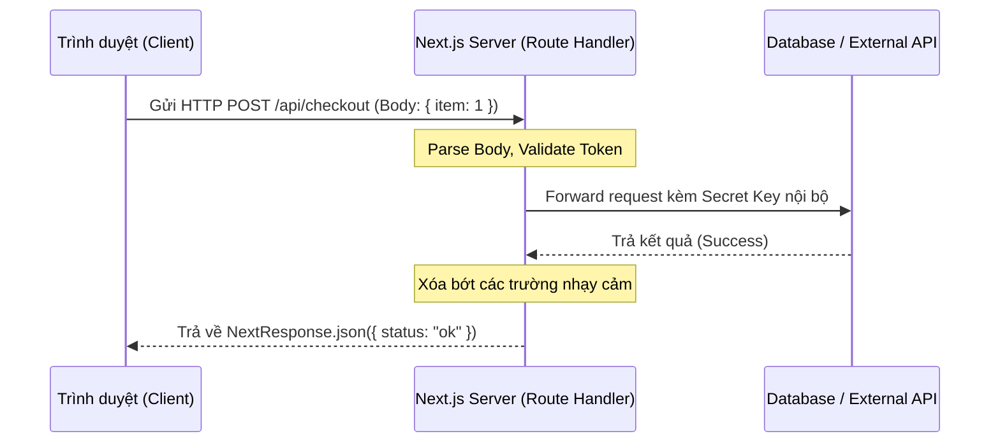
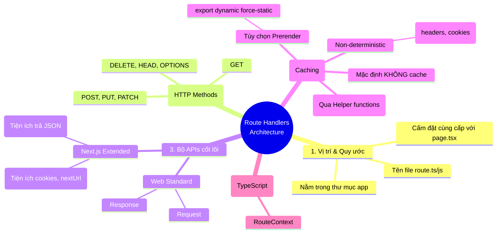

# 03. Route Handlers

Trong quá trình phát triển ứng dụng Web, không phải lúc nào chúng ta cũng chỉ trả về giao diện người dùng (UI - HTML/CSS). Sẽ có những lúc bạn cần một endpoint để nhận dữ liệu Webhook từ đối tác (như Stripe, Paypal), tạo API cho Mobile App gọi vào, hoặc xây dựng một Backend-for-Frontend (BFF) nhỏ nhẹ giấu kín các Secret Keys. Thay vì phải dựng riêng một server Node.js/Express, Next.js App Router cung cấp cho bạn một công cụ cực kỳ mạnh mẽ tích hợp sẵn: **Route Handlers**.

## Agenda

**Thời gian đọc ước tính:** ~15 phút

### Learning outcome:
- **Hiểu** được bản chất Route Handlers là gì và nó thay thế cho API Routes cũ (thuộc Pages Router) như thế nào.
- **Giải thích** được vòng đời xử lý của một Web Request/Response tiêu chuẩn.
- **Tự tay** thiết lập các HTTP Methods (GET, POST...) và trích xuất dữ liệu từ NextRequest.
- **Phân biệt** được các cơ chế Caching (Static, Dynamic) bên trong Route Handlers để tối ưu hiệu năng.

## Glossary & Vocabulary

**1. Technical Terms (Thuật ngữ kỹ thuật):**
| Term | Vietnamese Meaning & Quick Explain |
| :--- | :--- |
| **Route Handlers** | *Trình xử lý tuyến đường*. Các file đặc biệt trong Next.js (`route.ts`) dùng để xử lý các HTTP requests và trả về dữ liệu (JSON, Text, XML...) thay vì trả về giao diện UI. |
| **API Routes** | Thuật ngữ cũ của Next.js (ở thư mục `pages/api`) dùng để tạo API. Hiện nay Route Handlers là phiên bản thay thế mạnh mẽ hơn trong `app` directory. |
| **Prerendering** | *Kết xuất trước*. Quá trình Next.js gọi hàm GET ngay từ lúc build code để lưu lại kết quả tĩnh, giúp phản hồi nhanh chóng mà không cần chạy lại hàm. |
| **Web Request/Response API** | Tiêu chuẩn cốt lõi của trình duyệt web (MDN Web Docs) quy định cách tạo và xử lý các luồng dữ liệu HTTP. |

**2. Vocabulary Support (Từ vựng học thuật/B1+):**
| Word | Meaning in Context (Nghĩa trong ngữ cảnh) |
| :--- | :--- |
| **Equivalent (adj)** | Tương đương, có giá trị hoặc chức năng tương tự. |
| **Complement (v)** | Bổ sung, làm hoàn thiện thêm (VD: Route Handlers complement your frontend). |
| **Deterministic (adj)** | Có tính quyết định, có thể dự đoán trước kết quả (luôn trả về cùng một kết quả cho cùng một input). Trái nghĩa là *Non-deterministic* (VD: `Math.random()`). |

---

## 1. WHY — Vấn đề kỹ thuật

Thực trạng kỹ thuật khi xây dựng hệ thống Fullstack:
1. **Phân mảnh dự án:** Thông thường, Frontend team dùng React/Next.js, Backend team dùng Express/NestJS. Có những tác vụ siêu nhỏ (như gửi email liên hệ, proxy một request API để giấu API Key) mà phải sang tận repo Backend để viết code thì quá cồng kềnh.
2. **Môi trường (Environment) khác biệt:** Các giải pháp API cũ thường dính chặt với môi trường Node.js (dùng `req`, `res` của Express). Điều này khiến code khó có thể chạy trên các môi trường hiện đại như Edge Runtime (Cloudflare Workers, Vercel Edge).
3. **Quản lý Caching thủ công:** Việc thiết lập cache cho một API endpoint thường đòi hỏi cài đặt thêm Redis hoặc lạm dụng CDN Headers phức tạp.

**Giải pháp:** Next.js giới thiệu Route Handlers. Được xây dựng hoàn toàn dựa trên chuẩn Web Standard APIs (không phụ thuộc Node.js), hỗ trợ sẵn TypeScript và tự động tích hợp sâu với cơ chế Caching thần thánh của Next.js.

---

## 2. WHAT — Nó là cái gì?

Định nghĩa chính thức: *Route Handlers allow you to create custom request handlers for a given route using the Web Request and Response APIs.*

**Definition Anatomy (Giải phẫu định nghĩa):**
- **custom request handlers** (*trình xử lý request tùy chỉnh*): Nghĩa là bạn có toàn quyền quyết định khi có một request (như GET, POST) gửi tới một URL cụ thể, server sẽ làm gì (kết nối DB, gọi API bên thứ ba) và trả về cái gì (JSON, XML).
- **Web Request and Response APIs** (*API tiêu chuẩn Web*): Next.js không chế ra các object `req/res` riêng, mà sử dụng đúng chuẩn `Request` và `Response` gốc của nền tảng Web (giống hệt chuẩn Fetch API mà bạn hay dùng trên trình duyệt). Điều này giúp code chạy được ở mọi nơi (Node.js, Edge).

### 2.1 File Convention (Quy ước Đặt tên)

Giống như Page thì phải là file `page.tsx`, Route Handler BẮT BUỘC phải là file có tên `route.ts` hoặc `route.js`. 


**Quy tắc sinh tử:**
- Chúng chỉ được phép nằm trong thư mục `app/`.
- Có thể lồng ghép ở bất kỳ đâu (VD: `app/api/users/route.ts`).
- **Xung đột:** Tuyệt đối KHÔNG được đặt `route.ts` nằm cùng cấp (cùng một thư mục) với `page.tsx`. Vì Next.js sẽ không biết URL đó là để trả về giao diện Web (Page) hay trả về dữ liệu (Route).

Bảng đối chiếu xung đột:
| Cấu trúc File | URL Truy cập | Kết quả |
| :--- | :--- | :--- |
| `app/page.js` và `app/route.js` | `/` | **Conflict (Lỗi)** |
| `app/page.js` và `app/api/route.js` | UI: `/`, API: `/api` | **Valid (Hợp lệ)** |

### 2.2 Sơ đồ Kiến trúc Request Flow (Visual First)

Để hình dung vị trí và vai trò của Route Handlers, hãy xem sơ đồ xử lý Request dưới đây:



---

## 3. HOW — Làm nó như thế nào?

### 3.1 Khởi tạo HTTP Methods cơ bản

Một file `route.ts` có thể export các hàm (hành động) tương ứng với các [HTTP Methods](https://developer.mozilla.org/docs/Web/HTTP/Methods) gồm: `GET`, `POST`, `PUT`, `PATCH`, `DELETE`, `HEAD`, `OPTIONS`. Nếu người dùng gọi một Method không được export, Next.js tự động trả lỗi `405 Method Not Allowed`.

```tsx
// filename: app/api/hello/route.ts

import { NextResponse } from 'next/server';

// Xử lý request đọc dữ liệu
export async function GET() {
  return NextResponse.json({ message: 'Xin chào thế giới!' });
}

// Xử lý request ghi/tạo mới dữ liệu
export async function POST(request: Request) {
  // Vì tuân thủ chuẩn Web, ta dùng request.json() để parse body
  const body = await request.json(); 
  
  return NextResponse.json(
    { message: 'Đã nhận dữ liệu', data: body }, 
    { status: 201 } // Thiết lập HTTP Status Code
  );
}
```

### 3.2 Khai thác NextRequest và NextResponse

Next.js cung cấp `NextRequest` (kế thừa từ `Request`) và `NextResponse` (kế thừa từ `Response`) cung cấp thêm nhiều helpers mạnh mẽ để thao tác với Cookies, Headers và URL.

```tsx
// filename: app/api/search/route.ts
import { NextRequest, NextResponse } from 'next/server';

export async function GET(request: NextRequest) {
  // 1. Trích xuất Query Params dễ dàng qua NextRequest.nextUrl
  const searchParams = request.nextUrl.searchParams;
  const keyword = searchParams.get('q');

  // 2. Trích xuất Headers hoặc Cookies
  const token = request.headers.get('authorization');
  const themeCookie = request.cookies.get('theme');

  // Logic kết nối Database ở đây...

  // 3. Set Cookie vào Response trước khi trả về
  const response = NextResponse.json({ result: `Kết quả cho ${keyword}` });
  response.cookies.set('last-search', keyword || '');

  return response;
}
```

### 3.3 Cơ chế Caching siêu việt

Đây là phần phức tạp nhưng đáng giá nhất của Route Handlers.
Theo mặc định, Route Handlers **KHÔNG** được cache (nó sẽ chạy lại logic mỗi khi có request tới). Tuy nhiên, riêng method `GET`, bạn có thể can thiệp để yêu cầu Next.js biến nó thành Static.

**Cách 1: Route Config (Prerender toàn bộ file)**
Khi bạn export biến `dynamic = 'force-static'`, Next.js sẽ gọi hàm GET này MỘT LẦN DUY NHẤT lúc build project, lưu kết quả JSON thành file tĩnh. Những người dùng sau đó sẽ nhận JSON tĩnh cực nhanh.

```tsx
// filename: app/api/config/route.ts
import { NextResponse } from 'next/server';

// Ép Next.js render sẵn nội dung này lúc build
export const dynamic = 'force-static';

export async function GET() {
  // Giả sử gọi Database lấy danh sách danh mục (ít thay đổi)
  const categories = await db.getCategories(); 
  return NextResponse.json(categories);
}
```

**Cách 2: Tính chất Non-deterministic (Tính không xác định)**
Prerendering (cache lúc build) sẽ TỰ ĐỘNG BỊ HỦY nếu Next.js phát hiện code của bạn chứa các yếu tố "động":
- Bạn sử dụng các biến thay đổi liên tục: `Math.random()`, `Date.now()`.
- Bạn đọc dữ liệu từ request: `request.url`, `request.cookies`, hoặc dùng các hàm `headers()`, `cookies()`.

Khi đó, Route Handler sẽ tự động chuyển về dạng Request-time (chờ người dùng gọi mới chạy).

```tsx
// filename: app/api/user/route.ts
import { headers } from 'next/headers';
import { NextResponse } from 'next/server';

export async function GET() {
  // Việc gọi hàm headers() mang tính runtime data
  // Next.js tự hiểu: "À, hàm này động, không thể cache lúc build được"
  const headersList = await headers();
  const userAgent = headersList.get('user-agent');
  
  return NextResponse.json({ browser: userAgent });
}
```

**Cách 3: Using `use cache` (Sử dụng Cache Component)**
Nếu bạn muốn API vừa động (nhận request) nhưng kết quả xử lý nặng bên trong lại muốn lưu cache một thời gian? Bạn có thể trích xuất phần logic nặng ra một hàm helper và dùng lệnh `use cache`.

```tsx
// helper.ts
export async function getHeavyData() {
  'use cache'; // Lưu kết quả của hàm này vào Cache System của Next.js
  const data = await db.query('SELECT * FROM huge_table');
  return data;
}

// app/api/stats/route.ts
import { getHeavyData } from './helper';

export async function GET() {
  // Dù có hàng ngàn người gọi API này, database query chỉ chạy 1 lần
  const data = await getHeavyData();
  return NextResponse.json(data);
}
```

### 3.4 Route Context Helper (TypeScript)

Khi route của bạn nằm trong Dynamic Segment (VD: `app/api/users/[id]/route.ts`), bạn sẽ muốn lấy được tham số `id`. Next.js cung cấp type `RouteContext` để hỗ trợ TypeScript tự động nhận diện.

```tsx
// filename: app/api/users/[id]/route.ts
import { NextRequest, NextResponse } from 'next/server';
import type { RouteContext } from 'next';

export async function GET(
  request: NextRequest,
  // Sử dụng RouteContext để TypeScript hiểu params chứa 'id'
  context: RouteContext
) {
  // Do context.params là Promise, bạn cần await
  const { id } = await context.params;
  
  return NextResponse.json({ userId: id });
}
```

---

## 4. WHAT IF — Khám phá & Trade-offs

### Đánh đổi (Trade-offs)
- **Ưu điểm:** Route Handlers hoàn hảo cho chiến lược Backend-for-Frontend (BFF). Nó giúp che giấu API keys an toàn trên Server, cho phép Frontend gọi một endpoint nội bộ nhẹ nhàng mà không sợ lộ thông tin (vì bản chất code này chạy trên Node.js/Edge). Việc tích hợp chuẩn Web Request giúp code cực kỳ nhất quán với hàm `fetch()` quen thuộc.
- **Nhược điểm:** Route Handlers KHÔNG phải là một hệ thống Backend toàn diện. Bạn không có các cơ chế Middleware đồ sộ như Express, NestJS (như Dependency Injection, Global Error Handler cho từng API). Nếu ứng dụng của bạn đòi hỏi xử lý nghiệp vụ backend khổng lồ, chia nhỏ Microservices, Route Handlers sẽ trở nên quá rải rác và khó kiểm soát.

### Discussion Questions
1. Nếu bạn lỡ tạo một file `route.ts` và một file `page.tsx` trong cùng thư mục `app/profile/`, tại sao Next.js lại báo lỗi xung đột (Conflict)? Về mặt giao thức HTTP, khi người dùng nhập URL `/profile` lên trình duyệt, Next.js sẽ bị "bối rối" ở điểm nào?
2. Giả sử bạn tạo API bằng Route Handlers cho Mobile App truy xuất danh sách bài viết (`GET /api/posts`). Mobile team phàn nàn rằng dù họ có tạo bài viết mới (thông qua hệ thống CMS), API vẫn trả về dữ liệu cũ suốt 1 tiếng đồng hồ. Lỗi Caching nào có thể đang xảy ra và cách khắc phục bằng Route Config là gì?

---

## 5. Mindmap Tổng kết (MECE)



---

*Made by Anh Tu - Share to be share*
