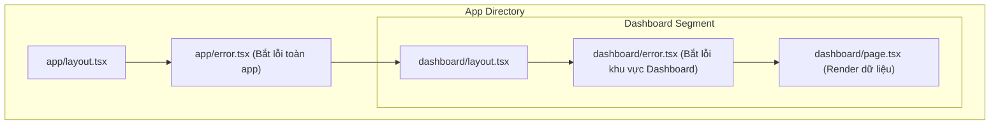

# 04. Error Handling

Bất kỳ ứng dụng nào cũng sẽ gặp lỗi, cho dù code của bạn có hoàn hảo đến đâu (do rớt mạng, do server database phản hồi chậm, hoặc do người dùng cố tình nhập sai URL). Quản lý lỗi (Error Handling) không chỉ là việc bắt (catch) lỗi để app không bị sập (crash), mà còn là nghệ thuật cung cấp phản hồi (feedback) thân thiện để giữ chân người dùng. Trong kiến trúc App Router, Next.js phân chia lỗi thành hai thế giới rõ rệt và cung cấp các công cụ chuyên biệt để xử lý từng loại.

## Agenda

**Thời gian đọc ước tính:** ~15 phút

### Learning outcome:
- **Hiểu** được sự phân định rạch ròi giữa "Expected Errors" (Lỗi dự kiến) và "Uncaught Exceptions" (Ngoại lệ không lường trước).
- **Giải thích** được cơ chế nổi bọt (bubble up) của Nested Error Boundaries bằng ngôn ngữ đơn giản.
- **Tự tay** thiết lập `error.tsx` để khoanh vùng sự cố và tạo nút "Thử lại" (Recover).
- **Phân biệt** được khi nào dùng `error.tsx`, khi nào dùng `not-found.tsx` và `global-error.tsx`.

## Glossary & Vocabulary

**1. Technical Terms (Thuật ngữ kỹ thuật):**
| Term | Vietnamese Meaning & Quick Explain |
| :--- | :--- |
| **Expected Errors** | *Lỗi dự kiến*. Những lỗi mà lập trình viên biết trước CÓ THỂ xảy ra (VD: Sai mật khẩu, trùng email, validation form). Bạn KHÔNG nên làm crash app vì những lỗi này. |
| **Uncaught Exceptions** | *Ngoại lệ không lường trước (Lỗi chưa bắt)*. Những lỗi ngầm bên dưới chỉ ra bug của code hoặc sự cố hạ tầng (VD: Đứt kết nối Database, biến `undefined` không đọc được thuộc tính). |
| **Error Boundary** | *Ranh giới lỗi*. Một cơ chế của React. Nếu một component con bị crash, Error Boundary sẽ "hứng" lỗi đó, chặn không cho nó lan ra làm sập toàn bộ ứng dụng và hiển thị UI dự phòng (Fallback UI). |
| **Fallback UI** | *Giao diện dự phòng*. Giao diện hiển thị thay thế khi giao diện chính bị sập. |

**2. Vocabulary Support (Từ vựng học thuật/B1+):**
| Word | Meaning in Context (Nghĩa trong ngữ cảnh) |
| :--- | :--- |
| **Granular (adj)** | Nhỏ lẻ, chi tiết, từng phần (VD: Granular error handling - Xử lý lỗi cho từng phần tử nhỏ thay vì cả trang). |
| **Bubble up (v)** | Nổi bọt. Trong lập trình, nó ám chỉ việc một lỗi xảy ra ở thành phần con sẽ từ từ dội ngược lên các thành phần cha cho tới khi bị ai đó bắt lại (catch). |

---

## 1. WHY — Vấn đề kỹ thuật

Thực trạng kỹ thuật khi xử lý lỗi trong các ứng dụng Web truyền thống:
1. **White Screen of Death (Màn hình trắng chết chóc):** Trong React, nếu một component nhỏ bé (ví dụ: Avatar của user) bị lỗi do biến `undefined`, toàn bộ trang web sẽ biến thành một màu trắng xóa. Người dùng không biết chuyện gì xảy ra.
2. **Lạm dụng try/catch:** Để tránh crash app, lập trình viên bọc `try/catch` ở khắp mọi nơi. Việc này làm code trở nên rối rắm (callback hell) và rất khó tái sử dụng các mẫu UI báo lỗi chung.
3. **Mất bối cảnh (Context loss):** Khi xảy ra lỗi 404 hoặc 500, user bị đá sang một trang error hoàn toàn mới, mất đi thanh điều hướng (Navbar, Sidebar), khiến họ phải gõ lại URL từ đầu để tiếp tục sử dụng app.

**Giải pháp của Next.js:** Chia rẽ rõ ràng giữa việc báo lỗi logic (Expected) qua State và việc bọc ranh giới chặn crash (Uncaught) qua file đặc biệt `error.tsx`. Tất cả đều giữ lại được Layout chung của ứng dụng.

---

## 2. WHAT — Nó là cái gì?

### 2.1 Xử lý Expected Errors (Lỗi dự kiến)

Đây không phải là lỗi hệ thống. Đây là lỗi kinh doanh (Business Logic). Ví dụ: Form đăng ký báo "Email đã tồn tại". 
Trong Next.js App Router, chúng ta KHÔNG dùng `throw new Error()` cho các lỗi này. Thay vào đó, chúng ta xem chúng như những **Giá trị trả về (Return Values)** và quản lý bằng State.

Đối với các Server Functions (Server Actions), Next.js cung cấp hook `useActionState` (từ React 19) để hiển thị thông báo lỗi một cách mượt mà mà không làm vỡ giao diện.

### 2.2 Xử lý Uncaught Exceptions (Lỗi hệ thống/Bug)

Đây là những lỗi khiến code không thể chạy tiếp (VD: Truy vấn SQL thất bại). Lúc này bạn buộc phải `throw` lỗi.
Khi lỗi bị ném ra trong quá trình render, file `error.tsx` sẽ ra tay.

Định nghĩa: *Error boundaries catch errors in their child components and display a fallback UI instead of the component tree that crashed.*

**Definition Anatomy (Giải phẫu định nghĩa):**
- **catch errors in their child components** (*bắt lỗi ở các thành phần con*): Nó đóng vai trò như một bức tường lửa. Lỗi xảy ra ở bên trong bức tường sẽ không lan ra ngoài.
- **fallback UI** (*giao diện dự phòng*): Nó hiển thị một giao diện thay thế thân thiện (như "Đã có lỗi xảy ra, thử lại sau") để che đi cái component bị hỏng.
- **instead of the component tree that crashed** (*thay vì cái cây component bị sập*): Phần không bị lỗi (Navbar, Sidebar của file `layout.tsx` nằm ngoài bức tường) vẫn hoạt động bình thường, không hề bị ảnh hưởng.

### 2.3 Sơ đồ Kiến trúc Nested Error Component (Visual First)



Nhìn vào sơ đồ trên, nếu `dashboard/page.tsx` bị crash:
1. Lỗi sẽ **nổi bọt (bubble up)** lên tìm bức tường gần nhất.
2. Nó đụng trúng `dashboard/error.tsx`. File này kích hoạt và hiển thị giao diện báo lỗi.
3. Phần `dashboard/layout.tsx` (như thanh menu ngang của dashboard) và `app/layout.tsx` (như footer) VẪN HIỂN THỊ và tương tác bình thường. Đây gọi là Granular Error Handling (Xử lý lỗi theo từng phân vùng nhỏ).

Nếu bạn không có file `dashboard/error.tsx`, lỗi tiếp tục nổi bọt lên trên và đụng trúng `app/error.tsx`. Lúc này toàn bộ nội dung dashboard sẽ bị thay bằng giao diện lỗi, chỉ còn lại Layout gốc.


---

## 3. HOW — Làm nó như thế nào?

### 3.1 Khởi tạo Error Boundary (`error.tsx`)

File `error.tsx` BẮT BUỘC phải là Client Component (vì quá trình bắt lỗi và phục hồi cần tương tác phía client). Nó tự động nhận vào 2 props: `error` (đối tượng lỗi chứa message) và `reset` (một hàm để thử render lại component bị sập).

```tsx
// filename: app/dashboard/error.tsx
'use client'; // Bắt buộc phải có

import { useEffect } from 'react';

export default function DashboardError({
  error,
  reset,
}: {
  error: Error & { digest?: string };
  reset: () => void;
}) {
  useEffect(() => {
    // Log lỗi vào các hệ thống theo dõi (như Sentry, Datadog)
    console.error('Dashboard Error:', error);
  }, [error]);

  return (
    <div className="error-box">
      <h2>Có lỗi xảy ra trong khu vực Dashboard!</h2>
      {/* 
        Hàm reset() sẽ yêu cầu Next.js render lại nội dung của route này.
        Rất hữu ích nếu lỗi là do mạng chập chờn, thử lại có thể thành công.
      */}
      <button onClick={() => reset()}>
        Thử tải lại dữ liệu
      </button>
    </div>
  );
}
```

### 3.2 Khởi tạo trang Không tìm thấy (`not-found.tsx`)

Lỗi 404 (Not Found) cũng là một dạng lỗi đặc biệt. Khi bạn fetch data mà không thấy bản ghi nào (ví dụ user nhập URL bài viết không tồn tại), bạn có thể chủ động gọi hàm `notFound()`.

```tsx
// filename: app/blog/[slug]/page.tsx
import { notFound } from 'next/navigation';

export default async function BlogPost({ params }: { params: { slug: string } }) {
  const post = await db.getPost(params.slug);
  
  if (!post) {
    // Khi gọi hàm này, Next.js dừng render page và hiển thị UI not-found gần nhất
    notFound(); 
  }
  
  return <h1>{post.title}</h1>;
}
```

Và đây là giao diện 404 tùy chỉnh:

```tsx
// filename: app/blog/not-found.tsx
import Link from 'next/link';

export default function NotFound() {
  return (
    <div style={{ textAlign: 'center' }}>
      <h2>Không tìm thấy bài viết</h2>
      <p>Bài viết bạn tìm có thể đã bị xóa hoặc sai đường dẫn.</p>
      {/* Khuyến khích user quay lại luồng chính thay vì đóng tab */}
      <Link href="/blog">Quay về danh sách Blog</Link>
    </div>
  );
}
```

### 3.3 Global Error (`global-error.tsx`)

Sẽ ra sao nếu chính cái file `app/layout.tsx` (Root Layout) của bạn chứa lỗi (ví dụ lỗi import font)? Lúc này `app/error.tsx` không thể bắt được lỗi đó (vì error boundary chỉ bọc component CON của layout, chứ không bọc chính bản thân layout).
Đây là lúc bạn cần "Vũ khí dự phòng cuối cùng" mang tên `global-error.tsx`.

```tsx
// filename: app/global-error.tsx
'use client';

export default function GlobalError({
  error,
  reset,
}: {
  error: Error & { digest?: string };
  reset: () => void;
}) {
  // Vì nó thay thế RootLayout, nó phải TỰ CHỨA thẻ <html> và <body>
  return (
    <html lang="vi">
      <body>
        <h1>Lỗi hệ thống toàn cầu!</h1>
        <button onClick={() => reset()}>Khởi động lại toàn bộ App</button>
      </body>
    </html>
  );
}
```

---

## 4. WHAT IF — Khám phá & Trade-offs

### Đánh đổi (Trade-offs)
- **Ưu điểm:** Khái niệm Error Boundaries dạng file mang lại trải nghiệm người dùng vô song. Các phần không liên quan (như Sidebar, Header đang phát nhạc) không bị gián đoạn dù một nội dung nhỏ bên trong bị sập. Việc thêm nút "Thử lại" trực tiếp vào UI lỗi cũng giúp tăng tỷ lệ phục hồi tự động mà không cần người dùng tự nhấn F5 (Refresh trình duyệt).
- **Nhược điểm (Pitfalls):** 
  - `error.tsx` KHÔNG bắt được lỗi nằm trong event handlers (ví dụ lỗi xảy ra khi bấm nút `onClick`). Event handler chạy sau khi component đã render xong. Nếu có lỗi khi bấm nút, bạn vẫn phải tự dùng `try/catch` ở trong hàm xử lý sự kiện đó và tự lưu state để báo lỗi.
  - Việc thiết kế quá nhiều `error.tsx` ở từng ngóc ngách có thể làm codebase phình to và khiến Designer phải thiết kế hàng chục giao diện Fallback UI khác nhau gây tốn thời gian. (Best practice: Chỉ nên tạo `error.tsx` ở các ranh giới tính năng lớn như `/dashboard`, `/checkout`).

### Discussion Questions
1. Tại sao file `error.tsx` bắt buộc phải là Client Component (`'use client'`)? Nếu nó là Server Component, điều gì sẽ cản trở cơ chế hiển thị lỗi và nút "Thử lại"?
2. Theo sơ đồ Component Hierarchy, nếu lỗi xảy ra bên trong `app/layout.tsx`, tại sao file `app/error.tsx` không thể bắt được lỗi đó? Cơ chế lồng nhau (nesting) đằng sau Next.js hoạt động thế nào để giải thích hiện tượng này?
3. Bạn có một biểu mẫu đăng ký nhận bản tin (Newsletter). Người dùng nhập email sai định dạng. Đây là Expected Error hay Uncaught Exception? Bạn sẽ dùng `error.tsx` hay `useActionState` để thông báo lỗi cho người dùng? Tại sao?

---

## 5. Mindmap Tổng kết (MECE)

```mermaid
mindmap
  root((Error Handling
  Architecture))
    1. Expected Errors (Lỗi dự kiến)
      Là hệ quả của Business Logic
      Xử lý không làm crash app
      Công cụ sử dụng
        useActionState (Cho Server Actions)
        Conditional Rendering (if/else)
    2. Uncaught Exceptions (Lỗi hệ thống)
      Là Bug hoặc sự cố ngoài ý muốn
      Xử lý bằng Error Boundaries
      Các file đặc biệt
        error.tsx (Bắt lỗi Route cụ thể)
        global-error.tsx (Bắt lỗi RootLayout)
    3. Not Found (Lỗi 404)
      Khi truy xuất dữ liệu rỗng
      Cơ chế kích hoạt
        Gọi hàm notFound()
      UI thay thế
        not-found.tsx
    4. Đặc tính kỹ thuật
      error.tsx bắt buộc là Client Component
      Lỗi sẽ nổi bọt (Bubble up) lên cha gần nhất
      Không bắt lỗi trong Event Handlers (onClick)
```

---

*Made by Anh Tu - Share to be share*
