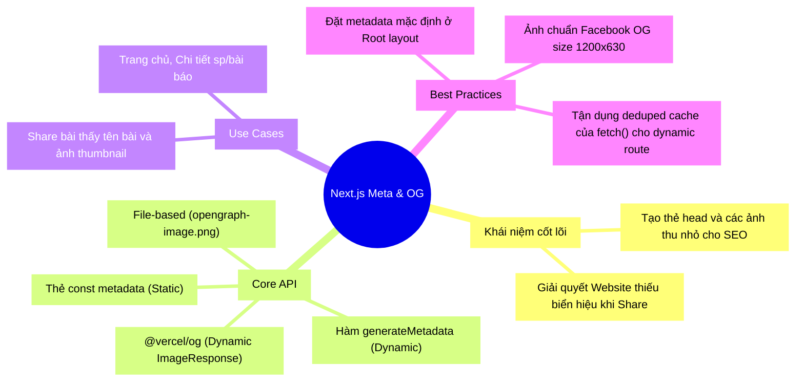

## 1. Mở đầu (Hook) 🎣

Bạn vừa viết xong một bài blog siêu tâm huyết, copy đường link dán vào Zalo/Facebook để khoe với bạn bè. Nhưng ôi thôi... nó hiện ra một dòng chữ nhàm chán, không có hình ảnh thu nhỏ (thumbnail), tiêu đề cụt lủn và chả ai buồn click vào. Vấn đề là do đâu? Do bạn chưa tối ưu hoá **Metadata và Open Graph (OG) Images**!

Trong thế giới SEO (Tối ưu hoá công cụ tìm kiếm) và Social chia sẻ mạng xã hội, có một quy tắc ngầm: "Hình thức quan trọng không kém nội dung". Next.js 13+ App Router mang đến một cuộc cách mạng có tên là **Metadata API**, giúp bạn xử lý vấn đề này trơn tru đến khó tin.

---

## 2. Ẩn dụ cốt lõi (Analogy) 🔄

Hãy tưởng tượng Website của bạn là một **Nhà Hàng Cao Cấp**.
- Nội dung (Content) bên trong nhà hàng có thể xuất sắc đến mấy, nhưng nếu ở ngoài cửa rỗng tuếch, khách đi ngang (Googlebot, Facebook crawler) sẽ nhìn vào và tự hỏi: "Dưới đó bán món gì vậy?". Họ sẽ bỏ qua!
- **Metadata** chính là **Tấm Biển Hiệu**. Trông nó có chữ "Nhà Hàng Hải Sản Ngon Nhất". Khách đi qua nhìn thấy chữ phát, vô liền. 
- Còn **OG Image** (Open Graph Image)? Nó giống như một **Hình Bát Phở Khổng Lồ, Bốc Khói Nghi Ngút** trên tấm menu ngoài cửa. Ai lướt Facebook qua tấm hình đó cũng tứa nước miếng và "Click".

Với Next.js, mỗi bàn ăn (Page) đều có thể tự động in ra một cái Biển Hiệu (Title/Description) và Hình Tôm Hùm (OG Image) được thiết kế riêng biệt cực nhanh!

---

## 3. Deep Dive & Kiến trúc hoạt động 🔬

Next.js cung cấp Metadata API tích hợp ngay vào Server Components (React Server Components). Bạn không cần phải render `<head>` một cách thủ công qua `useEffect` như các framework React cũ nữa.

```mermaid
flowchart TD
    Request[🖥️ Trình duyệt / Bot Crawler\nVí dụ: Mở bài Blog Số 1] --> NextJS[⚙️ Next.js Server (App Router)]
    
    NextJS --> |Lấy data bài viết| API[(Database)]
    API --> NextJS
    
    NextJS --> GenMeta{Gọi hàm generateMetadata()}
    GenMeta --> |Tạo Title, Desc, OG Image| MergeMeta["🛠️ Gộp HTML &lt;head&gt;"]
    
    NextJS --> GenPage{Gọi hàm Page()}
    GenPage --> |Tạo nội dung| MergeMeta
    
    MergeMeta --> Result[📄 Trả về Full HTML\nHoàn hảo cho SEO]
    Result --> Request
```

### 3 Phương pháp định nghĩa Metadata của Next.js:
1. **Static Metadata (Tĩnh):** Gắn thẳng hằng số `export const metadata = {...}` vào `layout.tsx` hoặc `page.tsx` cho các trang không đổi (như Trang chủ, Giới thiệu).
2. **Dynamic Metadata (Động):** Dùng hàm async `export async function generateMetadata({ params })`. Gọi database lấy thông tin bài viết (VD: title bài báo) rồi trả ra Metadata khớp từng bài. Rất mạnh mẽ!
3. **File-based Metadata:** Thả lạch cạch file `favicon.ico`, `opengraph-image.png` vào thư mục `app/` là Next.js **tự động** đọc và sinh thẻ `<meta>` mà bạn không cần code một chữ nào.

---

## 4. Thực hành (Practice) 💻

### 💡 4.1. Static Metadata (Trang chủ / Layout chung)

```tsx
// app/layout.tsx
import type { Metadata } from 'next';

export const metadata: Metadata = {
  // Config Title Template 
  // VD: Trang con có title "About" -> Hiển thị "About | Của Tú"
  title: {
    template: '%s | Của Tú',
    default: 'Trang chủ Blog | Của Tú',
  },
  description: 'Chia sẻ kiến thức lập trình Next.js đỉnh cao.',
  // Cấu hình Open Graph chuẩn cho SEO Social
  openGraph: {
    title: 'Blog Của Tú',
    description: 'Chia sẻ kiến thức lập trình Next.js đỉnh cao.',
    url: 'https://vuanhtu.com',
    siteName: 'Tu Tech Blog',
    //! Đừng quên ảnh OG cho banner share Facebook
    images: [
      {
        url: 'https://vuanhtu.com/og-default.jpg', // Kích thước khuyên dùng: 1200x630
        width: 1200,
        height: 630,
      },
    ],
    locale: 'vi_VN',
    type: 'website',
  },
};

export default function RootLayout({ children }) {
  // ...
}
```

### 💡 4.2. Dynamic Metadata (Trang Chi Tiết Bài Viết)

```tsx
// app/blog/[slug]/page.tsx
import { Metadata, ResolvingMetadata } from 'next';

type Props = {
  params: { slug: string }
};

// Next.js tự động gọi vào hàm này ĐẦU TIÊN để lấy Metadata
// Sau đó sẽ tái sử dụng lại (deduped cache) Request cho hàm Page()
export async function generateMetadata(
  { params }: Props,
  parent: ResolvingMetadata
): Promise<Metadata> {
  // 1. Lấy dữ liệu bài báo từ slug
  const post = await fetchPost(params.slug);
  
  // 2. Chế biến ảnh OG riêng cho từng bài (Có thể dùng thư viện @vercel/og để gen ảnh động)
  const ogImageUrl = post.coverImage || '/default-post-bg.png';

  // 3. Trả về Metadata!
  return {
    title: post.title, 
    description: post.excerpt,
    openGraph: {
      title: post.title,
      images: [ogImageUrl],
    },
  };
}

export default async function BlogPostPage({ params }: Props) {
  const post = await fetchPost(params.slug); // Không lo tốn 2 lần network call nhờ fetch memoization!
  return <h1>{post.title}</h1>;
}
```

---

## 5. Đánh giá (Usecase & Trade-off) ⚖️

| Loại Metadata | Khuyên dùng | Lời khuyên 💡 |
|---|---|---|
| **Static Hằng số (`metadata`)** | ✅ Các trang nội dung cố định (`/`, `/about`, `/contact`). | Luôn phải có ở Cấp độ `RootLayout` như một "mạng lưới an toàn" (Fallback). Nếu trang con quên định nghĩa meta, trang cha sẽ báo kê. |
| **Dynamic Hàm (`generateMetadata`)** | ✅ Các trang có biến url / slug (`/blog/[slug]`, `/product/[id]`). | Rất tốt vì Next.js Memoize `fetch()`. Tuy nhiên, nếu hàm fetch của bạn chậm (VD gọi DB mất 2s) thì **toàn bộ lúc render header** cũng bị delay 2s vì Metadata là render-blocking. Đánh đổi cân nhắc cẩn thận Backend! |
| **Tạo Ảnh OG Động bằng Code (`ImageResponse` sài *@vercel/og*)** | ⚠️ Thận trọng | Rất ngầu (tự bóc text in lên ảnh). Thế nhưng, Gen hình bằng Edge Function/Server khá tốn CPU/Computing. Nếu blog nhỏ, vẽ hình sẵn bằng Canva cho nhẹ đầu. |

---

## 6. Tổng hợp (MECE Mindmap) 🧩

Để ghi lại, chỉ cần nhớ sơ đồ này:



---
*Made by Anh Tu - Share to be share*
