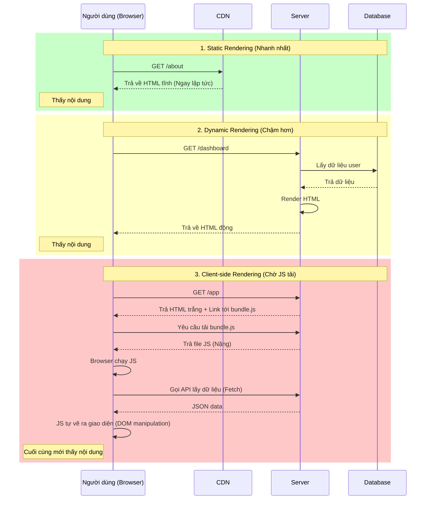

## Agenda

**Thời gian đọc ước tính:** ~15 phút

### Learning Outcomes
- **Hiểu** được bản chất của 3 chiến lược Rendering phổ biến nhất hiện nay: CSR, Static Rendering và Dynamic Rendering.
- **Phân biệt** được ưu nhược điểm (Trade-offs) của từng chiến lược đối với hiệu năng và SEO.
- **Giải thích** được cách Next.js tự động quyết định sử dụng Static hay Dynamic Rendering dựa trên mã nguồn của bạn.

---

## Glossary & Vocabulary

**1. Technical Terms (Thuật ngữ kỹ thuật):**

| Term | Vietnamese Meaning & Quick Explain |
| :--- | :--- |
| **CSR (Client-side Rendering)** | Kết xuất phía Client (Trình duyệt). Máy chủ chỉ trả về một file HTML trắng và một cục JavaScript rất nặng. Trình duyệt phải tự tải và chạy JS để vẽ ra giao diện. |
| **Static Rendering (SSG)** | Kết xuất tĩnh. Máy chủ tạo ra sẵn các file HTML hoàn chỉnh ngay tại thời điểm Build (trước khi ai đó truy cập). Cực kỳ nhanh vì có thể lưu trên CDN. |
| **Dynamic Rendering (SSR)** | Kết xuất động. Máy chủ chỉ tạo ra file HTML khi có yêu cầu (Request) từ người dùng. Chậm hơn Static nhưng dữ liệu luôn mới nhất. |
| **FCP (First Contentful Paint)** | Thời gian từ lúc bắt đầu tải trang đến khi bất kỳ phần nội dung nào (chữ, ảnh) được vẽ ra màn hình. |

**2. Vocabulary Support (Từ vựng học thuật/B1+):**

| Word | Meaning in Context (Nghĩa trong ngữ cảnh) |
| :--- | :--- |
| **Monolithic (adj)** | Khối thống nhất, nguyên khối (ví dụ: một cục JavaScript khổng lồ). |
| **Prerender (v)** | Kết xuất trước (chuẩn bị sẵn HTML trên server trước khi trình duyệt tải). |
| **Trade-off (n)** | Sự đánh đổi (được cái này, mất cái kia). |

---

## 1. WHY — Bài toán lịch sử của các ứng dụng Web

Khi nói về kiến trúc Web, câu hỏi lớn nhất luôn là: **"Viết code ở đâu và Vẽ giao diện (Render) ở đâu?"**.

Thực trạng kỹ thuật trải qua 3 giai đoạn với 3 nỗi đau khác nhau:
1. **Giai đoạn sơ khai (Traditional SSR):** Mọi thứ đều vẽ trên Server (như PHP, Ruby on Rails). Mỗi lần chuyển trang, trình duyệt phải tải lại trắng xóa toàn bộ trang. Trải nghiệm người dùng rất giật cục.
2. **Giai đoạn bùng nổ SPA (Strict SPAs):** React.js ra đời thúc đẩy Client-side Rendering (CSR). Trình duyệt làm mọi thứ. Chuyển trang mượt mà nhưng lại sinh ra nỗi đau mới: SEO kém (Google Bot không đọc được HTML trắng) và màn hình trắng rất lâu ở lần tải đầu tiên do phải chờ tải file JavaScript khổng lồ.
3. **Giai đoạn hiện tại:** Cần một giải pháp kết hợp. Vừa muốn có SEO tốt, tốc độ tải lần đầu chớp nhoáng (như SSR cổ điển), nhưng vừa muốn chuyển trang mượt mà không cần tải lại (như SPA).

Đó là lý do Next.js ra đời, cung cấp cả **Static Rendering** và **Dynamic Rendering** làm nền tảng, đồng thời hỗ trợ chuyển trang mượt mà ở Client.

---

## 2. WHAT — Phân tích 3 chiến lược Rendering

### 2.1. Client-side Rendering (CSR)

> **Định nghĩa:** CSR là chiến lược mà toàn bộ ứng dụng được phục vụ bởi một file HTML duy nhất (thường trống rỗng hoặc chỉ có khung sườn). Mọi thao tác vẽ giao diện (routing, data fetching) đều do JavaScript thực thi trực tiếp trên trình duyệt của người dùng.

**Definition Anatomy (Giải phẫu định nghĩa):**
- **file HTML duy nhất** (*single HTML file*): Dù bạn có 100 trang, máy chủ luôn chỉ trả về đúng file `index.html`.
- **do JavaScript thực thi** (*handled by JavaScript*): Trình duyệt tải file JS về, sau đó JS tự gọi API lấy dữ liệu và thao tác DOM để vẽ ra các thẻ HTML thực sự.

**Đặc điểm:**
- ❌ **Tốc độ tải lần đầu (Initial Load):** Rất chậm. Người dùng phải nhìn màn hình trắng (hoặc spinner) cho đến khi file JS khổng lồ được tải xong.
- ❌ **SEO:** Kém. Các Crawler (như Googlebot) thường không có đủ thời gian hoặc khả năng chờ JS chạy xong để đọc nội dung.
- ✅ **Chuyển trang (Navigation):** Rất nhanh và mượt (không cần tải lại trang).

### 2.2. Static Rendering (SSG)

> **Định nghĩa:** Static Rendering (Kết xuất tĩnh) là chiến lược mà máy chủ thực hiện việc tạo ra các file HTML hoàn chỉnh ngay tại thời điểm Build (Lúc bạn chạy lệnh `npm run build`).

**Đặc điểm:**
- ✅ **Tốc độ:** Tốc độ tuyệt đối. File HTML tĩnh được đẩy lên CDN (*Mạng phân phối nội dung*). Khi người dùng truy cập, CDN trả file về ngay lập tức với độ trễ gần như bằng 0.
- ✅ **Chi phí máy chủ:** Bằng không. Bạn không cần một máy chủ Node.js chạy 24/7 để phục vụ file tĩnh.
- ❌ **Tính thời sự (Data freshness):** Kém. Dữ liệu bị "đóng băng" tại thời điểm Build. Nếu bạn đổi giá sản phẩm trong Database, người dùng vẫn thấy giá cũ cho đến khi bạn Build lại trang.

### 2.3. Dynamic Rendering (SSR)

> **Định nghĩa:** Dynamic Rendering (Kết xuất động) là chiến lược mà máy chủ tạo ra file HTML riêng biệt **chỉ khi** có yêu cầu (Request) từ người dùng.

**Đặc điểm:**
- ✅ **Tính thời sự:** Tuyệt vời. Dữ liệu luôn là mới nhất vì mỗi lần User truy cập, Server lại truy vấn Database và vẽ lại HTML.
- ✅ **Cá nhân hóa:** Cho phép vẽ giao diện tùy biến cho từng người (ví dụ: Hiển thị giỏ hàng của User A khác với User B).
- ❌ **Tốc độ:** Chậm hơn Static. Người dùng phải chờ thời gian Server xử lý logic, gọi Database, và tạo HTML.

### 2.4. Trực quan hóa so sánh (Timeline Diagram)



---

## 3. HOW — Next.js tự động chọn chiến lược như thế nào?

Điểm đặc biệt của Next.js (App Router) là bạn không cần phải khai báo thủ công trang này là Static hay Dynamic. **Next.js sẽ tự động phân tích code của bạn.**

### Khởi điểm luôn là Static
Theo mặc định, Next.js sẽ cố gắng **Static Render** mọi route để tối ưu hiệu năng tối đa. 

### Chuyển sang Dynamic khi nào?
Next.js sẽ tự động âm thầm chuyển một route từ Static sang Dynamic Render nếu nó phát hiện bạn sử dụng các **Dynamic Functions** (Hàm thời gian thực).

Dynamic Functions là các hàm phải đợi đến lúc người dùng gửi Request mới có thể tính toán được:
1. `cookies()`: Đọc Cookie của người dùng gửi lên. (Lúc Build làm sao biết User A có cookie gì?).
2. `headers()`: Đọc Header của HTTP Request.
3. Tham số `searchParams`: Đọc query URL (ví dụ: `?page=2&sort=asc`).

#### Ví dụ: Trang này sẽ được Render TĨNH (Static)

```tsx
// app/blog/page.tsx
export default async function BlogPage() {
  // Lấy danh sách bài viết. Hàm fetch không chứa tham số dynamic nào.
  // Next.js sẽ tự động cache kết quả fetch này và render ra HTML tĩnh lúc Build.
  const res = await fetch('https://api.example.com/posts');
  const posts = await res.json();

  return (
    <ul>
      {posts.map((post: any) => (
        <li key={post.id}>{post.title}</li>
      ))}
    </ul>
  );
}
```

#### Ví dụ: Trang này sẽ tự động chuyển sang ĐỘNG (Dynamic)

```tsx
// app/dashboard/page.tsx
import { cookies } from 'next/headers'

export default async function DashboardPage() {
  // Sự xuất hiện của hàm cookies() khiến Next.js nhận ra: 
  // "À, trang này phụ thuộc vào User cụ thể. Tôi không thể build tĩnh nó được!"
  const cookieStore = await cookies();
  const theme = cookieStore.get('theme');

  return (
    <div className={theme?.value === 'dark' ? 'bg-black' : 'bg-white'}>
      <h1>Welcome to your Dashboard</h1>
    </div>
  );
}
```

---

## 4. Discussion Questions

1. Nếu một trang web bán hàng (E-commerce) có danh mục hàng chục ngàn sản phẩm, việc sử dụng 100% Static Rendering sẽ gây ra "nỗi đau" (Pain point) gì cho đội ngũ lập trình và hạ tầng?
2. Tại sao việc đọc URL query string (`searchParams`) lại buộc trang web phải chuyển sang Dynamic Rendering? Tại sao không thể chuẩn bị sẵn các trang này ở thời điểm Build (Prerender)?
3. **Trade-off:** CSR khiến lần tải đầu tiên (Initial Load) rất chậm, nhưng tại sao rất nhiều ứng dụng nội bộ doanh nghiệp (Internal Dashboards) vẫn sử dụng CSR 100% (ví dụ viết bằng Create React App / Vite) mà không cần đến Next.js?

---

## References

- [Next.js Official Docs — Single-page Applications](https://nextjs.org/docs/app/guides/single-page-applications) *(Crawled: 2026-06-25)*
- [Next.js Official Docs — Rendering Philosophy](https://nextjs.org/docs/app/guides/rendering-philosophy) *(Crawled: 2026-06-25)*

---

*Made by Anh Tu - Share to be share*
