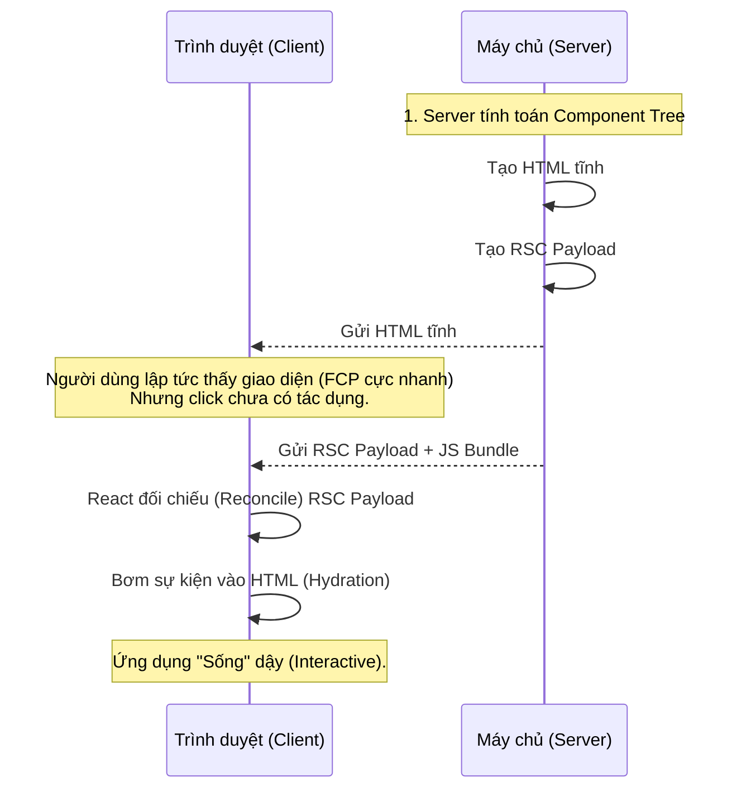
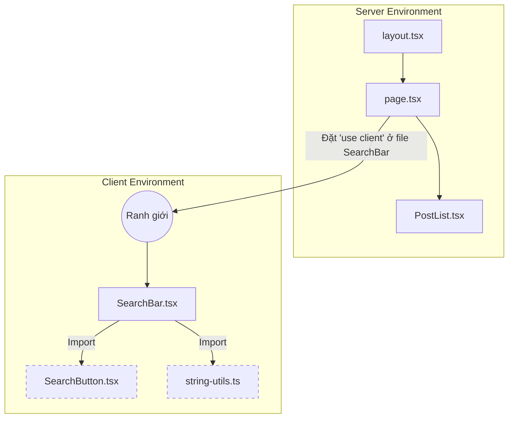

## Agenda

**Thời gian đọc ước tính:** ~20 phút

### Learning Outcomes
- **Hiểu** được sự khác biệt cốt lõi giữa Server Component và Client Component.
- **Giải thích** được RSC Payload là gì và Hydration diễn ra như thế nào.
- **Áp dụng** được các Pattern đan xen (Interleaving) giữa Server và Client Component.
- **Phân biệt** được lúc nào nên dùng `"use client"` và lúc nào không nên.
- **Bảo vệ** ứng dụng khỏi "Environment Poisoning" bằng `server-only` và `client-only`.

---

## Glossary & Vocabulary

**1. Technical Terms (Thuật ngữ kỹ thuật):**

| Term | Vietnamese Meaning & Quick Explain |
| :--- | :--- |
| **RSC Payload** | (React Server Component Payload) Phiên bản nén dạng nhị phân (binary) của các Component được render trên Server. Nó giống như một "Bản đồ thi công". |
| **Hydration** | Quá trình React gắn các sự kiện (event handlers như `onClick`) vào HTML tĩnh trên trình duyệt để làm cho trang web trở nên "Sống" (Interactive). |
| **Interleaving** | Đan xen. Kỹ thuật lồng ghép Server Component vào bên trong Client Component (hoặc ngược lại) một cách an toàn. |
| **Boundary** | Ranh giới. Nơi tách biệt giữa thế giới Server (không có window, DOM) và thế giới Client (có window, DOM). |

**2. Vocabulary Support (Từ vựng học thuật/B1+):**

| Word | Meaning in Context (Nghĩa trong ngữ cảnh) |
| :--- | :--- |
| **Orchestrate (v)** | Điều phối, sắp xếp các thành phần hoạt động nhịp nhàng với nhau. |
| **Reconcile (v)** | Đối chiếu và hợp nhất (Ví dụ: React đối chiếu cây Component ở Server và Client để gộp lại). |
| **Poisoning (n)** | Sự nhiễm độc. Ở đây ý nói việc vô tình mang mã code bí mật của Server (như API Key) chạy trên Client. |

---

## 1. WHY — Tại sao phải chia ra Server và Client Components?

Như bài trước đã đề cập, để có được hiệu năng tải trang tĩnh (HTML ngay lập tức) nhưng vẫn giữ được tính tương tác (chuyển trang mượt, có sự kiện click), Next.js và React 18+ đã giới thiệu **React Server Components (RSC)**.

**Vấn đề cốt lõi:**
1. Trình duyệt (Client) có thể xử lý tương tác người dùng (`onClick`), nhưng nó tải dữ liệu rất chậm vì khoảng cách từ trình duyệt đến Database quá xa.
2. Máy chủ (Server) lấy dữ liệu cực nhanh (gần Database), nhưng nó không có DOM (Document Object Model) nên không thể gắn sự kiện `onClick` hay `useState`.

**Giải pháp:**
Chia Component thành 2 loại:
- **Server Components:** Chạy trên máy chủ, lấy dữ liệu nhanh, bảo mật. Đầu ra là HTML tĩnh.
- **Client Components:** Chạy trên trình duyệt (thực ra là chạy cả ở Server lần đầu, sau đó chạy lại ở trình duyệt), đảm nhận tương tác người dùng.

> [!WARNING] Cảnh báo nhầm lẫn phổ biến
> 1. **Server Component KHÔNG CÓ NGHĨA LÀ Server-side Rendering (SSR).** Server Component có thể được render lúc Build (Static Rendering) hoặc lúc Request (Dynamic Rendering).
> 2. **Client Component KHÔNG CÓ NGHĨA LÀ chỉ chạy trên Client.** Ở lần tải trang đầu tiên (Initial Load), Client Component vẫn được render thành HTML tĩnh trên Server để SEO tốt. Nó chỉ thực sự "thuần Client" ở các lần chuyển trang (Navigation) tiếp theo.

---

## 2. WHAT — Cơ chế hoạt động của Server & Client Components

### 2.1. Decision Matrix (Khi nào dùng cái nào?)

Mặc định, **MỌI COMPONENT trong App Router đều là Server Component**. Bạn chỉ chuyển thành Client Component (bằng `"use client"`) khi thực sự cần thiết.

| Bạn cần làm gì? | Server Component | Client Component |
| :--- | :--- | :--- |
| Gọi Database, đọc file hệ thống | ✅ Trực tiếp | ❌ Không thể |
| Bảo vệ Secret Keys (API Token) | ✅ An toàn | ❌ Lộ ra trình duyệt |
| Giữ Bundle Size JS nhỏ | ✅ Không gửi JS xuống Client | ❌ Gửi JS xuống Client |
| Dùng `useState`, `useEffect` | ❌ Báo lỗi | ✅ Hỗ trợ |
| Dùng sự kiện `onClick`, `onChange` | ❌ Báo lỗi | ✅ Hỗ trợ |
| Dùng API trình duyệt (`window`, `localStorage`) | ❌ Báo lỗi | ✅ Hỗ trợ |
| Dùng Custom Hooks (phụ thuộc state) | ❌ Báo lỗi | ✅ Hỗ trợ |

### 2.2. Cơ chế Render & Initial Load (Lần tải đầu tiên)

Lần tải đầu tiên diễn ra qua 3 bước cốt lõi. Hãy dùng ẩn dụ sư phạm để dễ hiểu:

**Definition Anatomy (Giải phẫu định nghĩa):**
- **HTML tĩnh:** Giống như một **Hình nộm (Mannequin)**. Nó trông giống hệt ứng dụng thật, nhưng bạn click vào không có tác dụng gì (vì chưa có sự kiện).
- **RSC Payload (React Server Component Payload):** Giống như **Bản đồ thi công**. Nó là một file dạng nhị phân (binary) chứa thông tin: "Góc trái màn hình là Header, ở giữa là một khoảng trống dành cho Client Component, góc phải là Footer".
- **Hydration:** (Hydrate = Cấp nước). Giống như việc **Bơm máu vào hình nộm**. React dùng RSC Payload và file JavaScript để gắn các dây thần kinh (`onClick`, `onChange`) vào bức HTML tĩnh, biến nó thành một ứng dụng sống động.



### 2.3. Ranh giới `"use client"` (Module Boundary)

`"use client"` không phải là cờ đánh dấu "Component này là Client Component". Nó là một **Ranh giới (Boundary)** chia cắt thế giới Server và Client.

Khi bạn đặt `"use client"` ở đầu file:
- File đó trở thành Client Component.
- **TẤT CẢ** các module mà file đó import vào cũng tự động trở thành Client Component (dù chúng không có `"use client"`).


*(SearchButton và Utils tự động trở thành Client Component vì bị SearchBar kéo qua ranh giới, dù không có dòng `"use client"`)*.

---

## 3. HOW — Các Pattern lập trình với Component

### 3.1. Kỹ thuật "Đẩy Client Component xuống ngọn lá" (Push Client Down)

Để giảm thiểu dung lượng JS gửi xuống trình duyệt, hãy đặt `"use client"` ở mức sâu nhất có thể trong cây Component.

**Ví dụ:** Một `Layout` có Logo, Menu (tĩnh) và một thanh Search Bar (động).
**Đừng** đặt `"use client"` cho toàn bộ `Layout`. Hãy tách `SearchBar` ra thành component riêng.

```tsx
// app/layout.tsx (Server Component)
import SearchBar from './search-bar';
import Logo from './logo';

export default function Layout({ children }: { children: React.ReactNode }) {
  return (
    <nav>
      <Logo /> {/* Render 100% trên Server, 0 KB JS */}
      <SearchBar /> {/* Chỉ phần này tải JS về trình duyệt */}
    </nav>
  );
}
```

### 3.2. Đan xen (Interleaving) qua `children` slot

**Quy tắc bất di bất dịch:** Bạn **KHÔNG THỂ** import một Server Component trực tiếp vào một Client Component. Nếu làm vậy, Server Component đó sẽ bị kéo qua ranh giới và biến thành Client Component (gây lỗi nếu nó có gọi Database).

**Cách giải quyết:** Truyền Server Component dưới dạng `children` (React Node) vào Client Component.

```tsx
// 1. Client Component: components/modal.tsx
'use client'
import { useState } from 'react'

export default function Modal({ children }: { children: React.ReactNode }) {
  const [isOpen, setIsOpen] = useState(false);
  
  return (
    <>
      <button onClick={() => setIsOpen(true)}>Open Modal</button>
      {/* 
        Modal không quan tâm children là gì. 
        Nó chỉ nhận HTML đã được Server render sẵn và chèn vào đây.
      */}
      {isOpen && <div>{children}</div>}
    </>
  );
}
```

```tsx
// 2. Server Component: app/page.tsx
import Modal from '@/components/modal';
import UserProfile from '@/components/user-profile'; // Server Component lấy từ DB

export default function Page() {
  return (
    // Truyền UserProfile vào Modal thông qua children
    <Modal>
      <UserProfile /> 
    </Modal>
  );
}
```

### 3.3. Xử lý Context Providers

`createContext` là API của React cần state, nên Context Providers bắt buộc phải là Client Component. Tuy nhiên, bạn thường phải bọc Provider ở tận `app/layout.tsx` (Root Layout - Server Component). Làm sao để thực hiện?

**Giải pháp:** Tạo một Client Component bọc Provider, rồi gọi nó ở Layout.

```tsx
// 1. Tạo Client Wrapper: components/theme-provider.tsx
'use client'
import { createContext } from 'react'

export const ThemeContext = createContext({});

export default function ThemeProvider({ children }: { children: React.ReactNode }) {
  return (
    <ThemeContext.Provider value="dark">
      {children}
    </ThemeContext.Provider>
  )
}
```

```tsx
// 2. Dùng ở Server Layout: app/layout.tsx
import ThemeProvider from '@/components/theme-provider';

export default function RootLayout({ children }: { children: React.ReactNode }) {
  return (
    <html>
      <body>
        <ThemeProvider>
          {children} {/* Trẻ con bên trong vẫn là Server Component! */}
        </ThemeProvider>
      </body>
    </html>
  );
}
```

### 3.4. Gói thư viện bên thứ ba (Third-party Components)

Nhiều thư viện NPM cũ (như Carousel, Chart) có dùng `useState` nhưng chưa chịu thêm `"use client"` ở đầu file. Nếu bạn import trực tiếp chúng vào Server Component, Next.js sẽ báo lỗi.

**Giải pháp:** Bọc chúng vào một Client Component của riêng bạn.

```tsx
// components/carousel-wrapper.tsx
'use client'

// Thư viện này chưa có "use client", ta bọc nó lại để khai báo ranh giới
import { Carousel } from 'acme-carousel'; 

export default function CarouselWrapper(props) {
  return <Carousel {...props} />;
}
```

### 3.5. Ngăn chặn Nhiễm độc môi trường (Environment Poisoning)

Việc dùng chung các hàm Utils giữa Server và Client rất dễ dẫn đến lỗi vô tình import hàm chứa API Key (chỉ dùng cho Server) vào Client Component. Khi ranh giới `"use client"` lan tới, API Key này bị đóng gói gửi thẳng xuống trình duyệt của người dùng!

**Giải pháp:** Sử dụng package `server-only` để bảo vệ các hàm tuyệt mật.

```bash
npm install server-only
```

```typescript
// lib/data.ts
import 'server-only' // Khóa hàm này lại ở Server!

export async function getSecretData() {
  const apiKey = process.env.SECRET_API_KEY; // Nếu bị lọt xuống Client sẽ lộ Key
  const res = await fetch(`https://api.example.com?key=${apiKey}`);
  return res.json();
}
```
Nếu một Dev khác lỡ tay import `getSecretData` vào một file có `"use client"`, quá trình Build sẽ **báo lỗi đỏ lòm và dừng lại ngay lập tức**, cứu dự án một bàn thua trông thấy.

---

## 4. Discussion Questions

1. Tại sao RSC Payload lại sử dụng định dạng nhị phân (Binary) thay vì JSON thuần túy để truyền tải cây Component từ Server xuống Client?
2. Nếu bạn có một `<Header>` là Client Component (vì chứa Nút Toggle Dark Mode), và bên trong Header chứa `<Logo>` (không cần state). Theo quy tắc lan truyền Boundary, `<Logo>` cũng biến thành Client Component. Bạn sẽ thiết kế (Refactor) lại cấu trúc thế nào để cứu `<Logo>` trở về Server Component?
3. **Trade-off:** Việc bọc toàn bộ ứng dụng trong nhiều Context Providers (`<ReduxProvider>`, `<ThemeProvider>`, `<AuthProvider>`) ở Root Layout có ảnh hưởng đến khả năng tối ưu Server Component của Next.js không? Tại sao Next.js khuyên nên "render providers as deep as possible in the tree"?

---

## References

- [Next.js Official Docs — Server and Client Components](https://nextjs.org/docs/app/getting-started/server-and-client-components) *(Crawled: 2026-06-25)*

---

*Made by Anh Tu - Share to be share*
