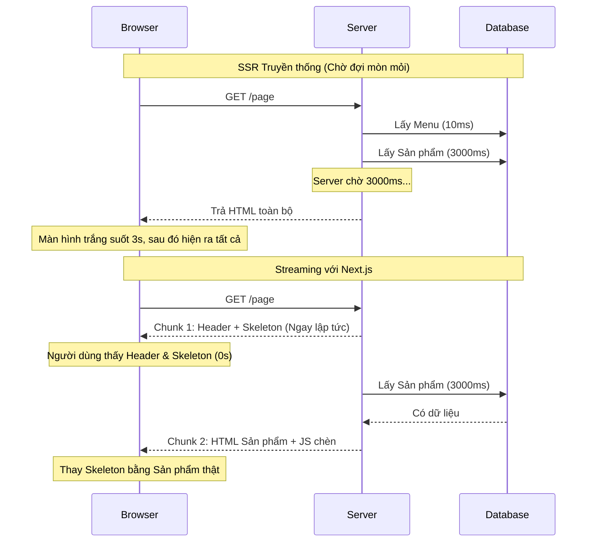

## Agenda

**Thời gian đọc ước tính:** ~25 phút

### Learning Outcomes
- **Hiểu** được Streaming là gì và tại sao nó giải quyết được điểm yếu chí mạng của Dynamic Rendering (Traditional SSR).
- **Phân biệt** được 3 thành phần của Initial Load: HTML stream, Component Payload và Static Shell.
- **Tự tay** áp dụng được Page-level Streaming (`loading.tsx`) và Granular Streaming (`<Suspense>`).
- **Áp dụng** được kỹ thuật "Push Dynamic Access Down" để tối ưu hóa hiệu năng.
- **Giải thích** được tác động của Streaming lên các chỉ số Web Vitals (TTFB, FCP, LCP).

---

## Glossary & Vocabulary

**1. Technical Terms (Thuật ngữ kỹ thuật):**

| Term | Vietnamese Meaning & Quick Explain |
| :--- | :--- |
| **Streaming** | Truyền phát dữ liệu. Kỹ thuật gửi HTML từ Server về Client theo từng phần nhỏ (chunks) ngay khi chúng sẵn sàng, thay vì chờ render xong toàn bộ trang. |
| **Chunked Transfer Encoding** | Cơ chế của giao thức HTTP/1.1 cho phép Server gửi dữ liệu thành nhiều khối (chunks) liên tiếp nhau trên cùng một kết nối. |
| **Static Shell** | (Vỏ bọc tĩnh). Phần khung giao diện (Header, Sidebar, Skeleton) không phụ thuộc vào dữ liệu động. Nó được gửi về ngay lập tức ở chunk đầu tiên. |
| **Web Vitals** | Bộ chỉ số đo lường trải nghiệm người dùng của Google (TTFB, FCP, LCP, CLS, INP). |

**2. Vocabulary Support (Từ vựng học thuật/B1+):**

| Word | Meaning in Context (Nghĩa trong ngữ cảnh) |
| :--- | :--- |
| **Granular (adj)** | Nhỏ nhặt, chi tiết, ở mức độ hạt (Ví dụ: Granular streaming = Chia nhỏ trang thành nhiều vùng để stream độc lập). |
| **Decoupled (adj)** | Tách rời, không bị phụ thuộc vào nhau. |
| **Degradation (n)** | Sự suy giảm. Graceful degradation nghĩa là hệ thống vẫn hoạt động (dù chậm hơn hoặc bớt tính năng) thay vì sập hoàn toàn khi gặp lỗi. |

---

## 1. WHY — Nỗi đau của Traditional SSR

Ở bài 1, chúng ta đã biết Dynamic Rendering (SSR truyền thống) có ưu điểm là dữ liệu luôn mới, nhưng nhược điểm chí mạng là **chậm**.

**Vấn đề:** 
Máy chủ (Server) phải tạo ra **TOÀN BỘ** file HTML rồi mới gửi về cho trình duyệt. 
Nếu trang web của bạn có 3 phần: Header (tĩnh), Bài viết (mất 50ms để lấy từ DB), và Gợi ý sản phẩm (mất 3000ms để gọi AI API).
→ Trình duyệt phải chờ đúng 3000ms nhìn màn hình trắng xóa chỉ vì phần "Gợi ý sản phẩm" quá chậm. Một "nút thắt cổ chai" (bottleneck) kéo lùi toàn bộ hệ thống.

**Giải pháp của Next.js (Streaming):**
Đừng chờ nữa! Có gì gửi nấy.
- Gửi ngay Header (0ms) -> Trình duyệt vẽ Header.
- Gửi tiếp Bài viết (50ms) -> Trình duyệt vẽ Bài viết.
- 3000ms sau gửi nốt Gợi ý sản phẩm. 
Người dùng không bao giờ phải nhìn màn hình trắng.

---

## 2. WHAT — Streaming hoạt động thế nào?

### 2.1. Kiến trúc luồng dữ liệu (Data Flow)

Khi một trình duyệt yêu cầu một trang, Next.js sẽ chia phản hồi thành 3 thành phần chính:

1. **The Static Shell (Khung vỏ tĩnh):** Tất cả những gì không phải đợi (Layout, Navigation, và các Fallback Loading). Phần này được gửi ngay lập tức.
2. **The HTML Stream:** Khi một Server Component chứa dữ liệu động (như Gợi ý sản phẩm) tính toán xong, Next.js sẽ stream HTML của nó xuống, kèm theo một đoạn `<script>` nhỏ để chèn đúng vào vị trí Loading ban đầu.
3. **The Component Payload (RSC Payload):** Chứa dữ liệu JSON để React biết cách "Hydrate" (gắn sự kiện) vào phần HTML vừa stream tới.

**Definition Anatomy (Giải phẫu định nghĩa Static Shell):**
- **Static** (*tĩnh*): Không phụ thuộc vào Database hay API. Có thể cache trên CDN.
- **Shell** (*vỏ bọc*): Nó chỉ là cái khung bên ngoài, đục các "lỗ hổng" (Suspense boundaries) bên trong để đợi dữ liệu động điền vào sau.

### 2.2. Trực quan hóa kiến trúc


*(Hình ảnh từ tài liệu gốc minh họa sự khác biệt giữa SSR truyền thống và Streaming)*



---

## 3. HOW — 2 Cách triển khai Streaming

### 3.1. Page-level Streaming với `loading.tsx` (Đơn giản nhất)

Cách dễ nhất để dùng Streaming là tạo một file `loading.tsx` đặt ngang hàng với `page.tsx`.


**Bản chất:** Next.js sẽ tự động lấy component trong `loading.tsx` làm Fallback UI và bọc toàn bộ `page.tsx` vào trong một `<Suspense>`.

```tsx
// app/dashboard/loading.tsx
export default function Loading() {
  // Trả về một giao diện khung xương (Skeleton)
  return <div>Đang tải Dashboard...</div>
}
```

**Ưu điểm:** Dễ setup, tự động hoàn toàn.
**Nhược điểm:** Toàn bộ trang bị block cho đến khi CẢ TRANG load xong (nếu trang có 3 phần, phần chậm nhất sẽ quyết định khi nào Loading biến mất).

### 3.2. Granular Streaming với `<Suspense>` (Kiểm soát chi tiết)

Để tối ưu, hãy xóa `loading.tsx` đi và tự bọc `<Suspense>` vào chính xác những Component bị chậm.

```tsx
// app/dashboard/page.tsx
import { Suspense } from 'react'
import { RevenueChart, RecentOrders } from '@/components'

export default function Dashboard() {
  return (
    <section>
      <h1>Bảng điều khiển</h1> {/* Phần này gửi ngay lập tức */}
      
      {/* 2 Component này sẽ stream độc lập song song */}
      <Suspense fallback={<p>Đang tải Biểu đồ...</p>}>
        <RevenueChart />
      </Suspense>

      <Suspense fallback={<p>Đang tải Đơn hàng...</p>}>
        <RecentOrders />
      </Suspense>
    </section>
  )
}
```
**Điều gì xảy ra?**
`<h1>` được gửi ngay trong Chunk 1. Nếu `RevenueChart` mất 2 giây và `RecentOrders` mất 5 giây, Biểu đồ sẽ hiện ra trước, 3 giây sau Đơn hàng mới hiện ra. Trải nghiệm người dùng tuyệt vời!

### 3.3. Kỹ thuật nâng cao: Push Dynamic Access Down

Đây là nguyên tắc quan trọng nhất khi làm việc với App Router. **"Nếu bạn gọi await ở đỉnh cây, toàn bộ cây sẽ bị block".**

**❌ Cách làm sai (Chặn toàn bộ trang):**
```tsx
// app/layout.tsx
import { cookies } from 'next/headers'

export default async function Layout({ children }: { children: React.ReactNode }) {
  // Sai lầm: Gọi await cookies() ở Root Layout!
  // Toàn bộ ứng dụng không thể stream được chunk đầu tiên cho đến khi đọc xong cookie.
  const theme = (await cookies()).get('theme')
  
  return (
    <body className={theme?.value}>
      <Nav />
      {children}
    </body>
  )
}
```

**✅ Cách làm đúng (Đẩy truy cập động xuống lá):**
Hãy tách phần đọc Cookie vào một Component riêng và bọc nó trong Suspense.

```tsx
// app/layout.tsx
import { Suspense } from 'react'
import UserTheme from './user-theme'

export default function Layout({ children }: { children: React.ReactNode }) {
  // Root Layout hoàn toàn không có await!
  return (
    <body>
      <Nav />
      {/* Chỉ phần này bị chặn */}
      <Suspense fallback={<DefaultTheme />}>
        <UserTheme /> 
      </Suspense>
      {children}
    </body>
  )
}
```

---

## 4. Tác động tới Web Vitals & Ràng buộc hệ thống

Streaming làm thay đổi hoàn toàn cách chúng ta đo lường Web Vitals:

1. **TTFB (Time to First Byte):** Thay vì chờ DB query xong mới gửi byte đầu tiên, Server gửi Header/Layout tĩnh (Static Shell) ngay lập tức. TTFB trở nên cực thấp.
2. **FCP (First Contentful Paint):** Tương tự, trình duyệt vẽ ngay được Static Shell.
3. **LCP (Largest Contentful Paint):** Nếu ảnh/banner lớn nhất (Hero Image) nằm bên trong một `<Suspense>` bị chậm, LCP sẽ rất tệ. **Rule of thumb:** Luôn để thành phần LCP nằm NGOÀI các Suspense boundary.
4. **CLS (Cumulative Layout Shift):** Khi dữ liệu load xong và thay thế thẻ `loading`, layout có thể bị giật (shift). Hãy đảm bảo CSS của Skeleton có kích thước (height/width) hệt như nội dung thật.

### The HTTP Contract (Ràng buộc Giao thức)

Một khi Streaming bắt đầu (Chunk đầu tiên của HTML tĩnh đã rời khỏi Server), **mã trạng thái HTTP (Status Code) đã bị chốt chặt là `200 OK`**.

Bạn **KHÔNG THỂ** gọi `notFound()` hay `redirect()` ở bên trong các Component bị Suspense (bởi vì chúng render sau). HTTP Header không thể sửa lại thành `404` hay `302` khi nó đã được gửi đi 3 giây trước đó!
- **Hệ quả:** Nếu có lỗi xảy ra mid-stream, Next.js sẽ dùng Error Boundary (`error.tsx`) để hiển thị cục bộ chỗ đó bị lỗi, nhưng Search Engine vẫn nhận được HTTP `200 OK`.

---

## 5. Discussion Questions

1. Nếu bạn bọc 3 Component A, B, C vào CÙNG MỘT thẻ `<Suspense fallback={...}>`. Component A mất 1s, B mất 2s, C mất 5s. Theo bạn, thời điểm nào thì 3 Component này xuất hiện trên màn hình? (Từng cái một hay cả 3 cùng lúc?).
2. CDN hoặc Nginx Proxy đôi khi làm hỏng tính năng Streaming vì tính năng "Buffering" (gom đủ dữ liệu mới gửi đi một thể). Nếu bạn deploy Next.js lên một VPS cài sẵn Nginx và thấy màn hình trắng 3 giây thay vì thấy Skeleton ngay lập tức, bạn sẽ tìm hiểu cấu hình nào của Nginx?
3. **Trade-off:** Việc đục quá nhiều "lỗ hổng" `<Suspense>` trên một trang có thể gây tác dụng phụ gì cho trải nghiệm người dùng (UX) so với việc chỉ dùng 1 `loading.tsx`? (Gợi ý: Cảm giác trang web đang "lắp ráp" liên tục).

---

## References

- [Next.js Official Docs — Streaming](https://nextjs.org/docs/app/guides/streaming) *(Crawled: 2026-06-25)*

---

*Made by Anh Tu - Share to be share*
