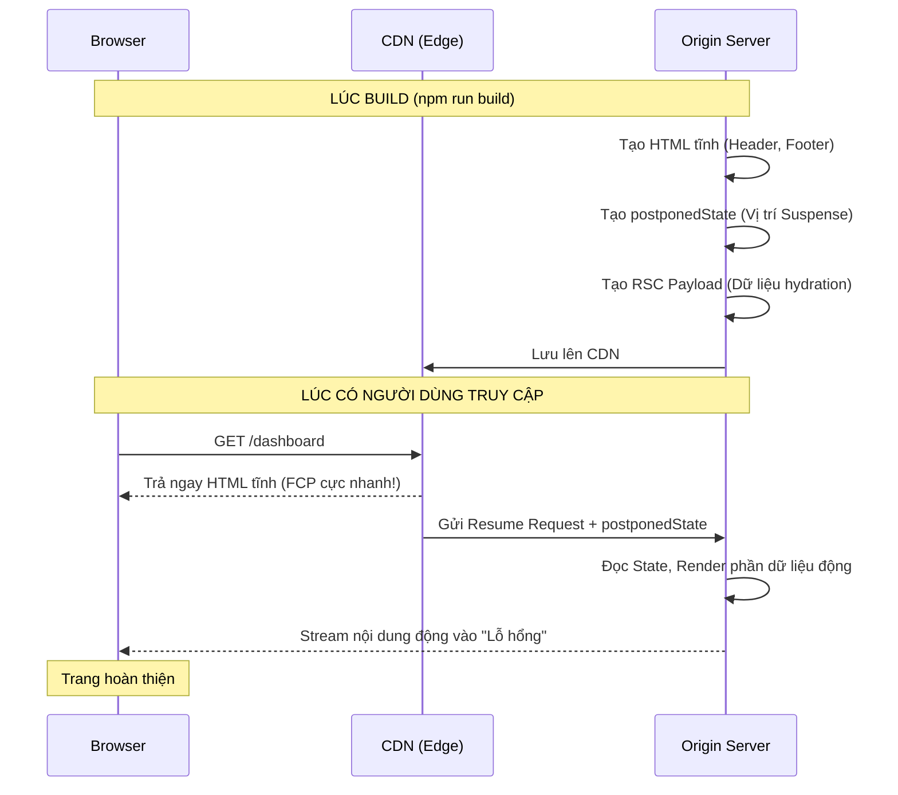

## Agenda

**Thời gian đọc ước tính:** ~25 phút

### Learning Outcomes
- **Hiểu** được Partial Prerendering (PPR) là gì và tại sao nó là "Chén thánh" của Web Rendering.
- **Giải thích** được cơ chế chia tách một trang thành "Static Shell" và "Dynamic Holes".
- **Biết cách** kích hoạt và sử dụng PPR trong Next.js 15+, bao gồm cấu trúc Suspense hợp lý.
- **Hiểu** được những đòi hỏi khắt khe về hạ tầng (Resume Protocol) để chạy được PPR.
- **Phân biệt** được 2 mức triển khai PPR: Origin-Only (đơn giản) và CDN + Origin (tối ưu).
- **Nhận diện** được các lỗi thường gặp khi triển khai PPR và cách khắc phục.

---

## Glossary & Vocabulary

**1. Technical Terms (Thuật ngữ kỹ thuật):**

| Term | Vietnamese Meaning & Quick Explain |
| :--- | :--- |
| **PPR (Partial Prerendering)** | Kết xuất trước một phần. Kỹ thuật cho phép render sẵn một nửa trang web (phần tĩnh) lúc Build, và render nửa còn lại (phần động) lúc Request. |
| **postponedState** | Một đoạn dữ liệu (blob) sinh ra lúc Build, dùng để báo cho Server biết: "Hôm trước tôi đã render đến đoạn này rồi, giờ có Request thì anh render tiếp phần còn lại nhé". |
| **RSC Payload** | Dữ liệu JSON mà React Server Component sinh ra, dùng để React phía Client biết cách hydrate (gắn tương tác) vào HTML đã nhận. |
| **Origin Compute** | Máy chủ gốc (thường là Server Node.js của bạn), nơi thực sự xử lý các logic nặng và kết nối Database, trái ngược với Edge/CDN (chỉ lưu file tĩnh). |
| **Dynamic APIs** | Nhóm hàm chỉ có thể thực thi lúc có Request: `cookies()`, `headers()`, `searchParams`, `connection()`. Sự xuất hiện của chúng quyết định component là Static hay Dynamic. |
| **Graceful Degradation** | Sự suy giảm nhẹ nhàng. Hệ thống vẫn hoạt động (dù mất tối ưu) thay vì sập hoàn toàn khi một phần bị lỗi. |

**2. Vocabulary Support (Từ vựng học thuật/B1+):**

| Word | Meaning in Context (Nghĩa trong ngữ cảnh) |
| :--- | :--- |
| **Sophistication (n)** | Sự tinh vi, phức tạp (Ví dụ: mức độ tinh vi của nền tảng Hosting). |
| **Opaque (adj)** | Đục, mờ đục. Nghĩa bóng trong IT: Dữ liệu dạng hộp đen, bạn chỉ việc truyền đi chứ không được phép đọc hay sửa (như `postponedState`). |
| **Degradation (n)** | Sự suy giảm. Graceful degradation nghĩa là hệ thống vẫn hoạt động (dù chậm hơn) thay vì sập hoàn toàn. |
| **Atomically (adv)** | Một cách nguyên tử, không thể chia cắt. Trong IT: hai thao tác phải xảy ra cùng lúc hoặc không xảy ra gì cả (VD: cập nhật Shell và postponedState phải đồng bộ). |

---

## 1. WHY — "Chén thánh" của Web Rendering

Trong bài 1 (Rendering Strategies), chúng ta đã học:
- **Static Rendering:** Performance rất tốt (Static file được cache CDN), thường là các nội dung chung, phổ thông.
- **Dynamic Rendering:** Có dữ liệu liên quan đến người dùng, nhưng chậm (từ Origin Server).

Trong bài 3 (Streaming), chúng ta học cách giảm thiểu sự chậm chạp của Dynamic bằng cách gửi Header/Layout trước (Static Shell). Tuy nhiên, **ngay cả cái Static Shell đó cũng phải được tạo ra và gửi từ Origin Server lúc có Request**. Mất ít nhất 50-100ms.

**Vấn đề:** Làm sao để Static Shell được gửi từ CDN (0ms), nhưng phần dữ liệu động vẫn được stream vào từ Server?
Đó chính là câu hỏi đã khai sinh ra **Partial Prerendering (PPR)**. Nó kết hợp đỉnh cao của cả 2 thế giới.

---

## 2. WHAT — Partial Prerendering là gì?

> **Định nghĩa:** Partial Prerendering (PPR) là tính năng tối ưu hóa rendering cho phép một trang web vừa có những phần được render tĩnh lúc Build (Static Shell), vừa có những phần được render động lúc Request (Dynamic Holes) bằng Suspense.

### 2.1. Cơ chế hoạt động (Build Time & Request Time)

**Definition Anatomy (Giải phẫu định nghĩa):**
- **Static Shell** (*Vỏ bọc tĩnh*): Tất cả các component không gọi dữ liệu động (không dùng `cookies()`, `headers()`, `searchParams`, `connection()`, uncached `fetch()`).
- **Dynamic Holes** (*Lỗ hổng động*): Các Component được bọc bởi `<Suspense>` **và** sử dụng Dynamic APIs (`cookies()`, `headers()`, `searchParams`, `connection()`, uncached `fetch()`) bên trong. Next.js sẽ coi đó là một "lỗ hổng" chưa được render, và để dành cho Request time.

**Lúc Build (Build time):**
Thay vì gặp `cookies()` rồi chuyển nguyên trang thành Dynamic như trước đây, với PPR, Next.js sẽ:
1. Render ra file HTML của Static Shell.
2. Sinh ra một file `postponedState` (Trạng thái tạm hoãn). Nó chứa thông tin vị trí các Suspense boundary đang bị bỏ trống.
3. Sinh ra **RSC Payload** (*React Server Component Payload*) cho phần tĩnh — chứa dữ liệu JSON để React biết cách hydrate (gắn sự kiện tương tác) vào Static Shell phía Client.

**Lúc Request (Request time):**
1. CDN sẽ vứt thẳng file HTML tĩnh (Static Shell) vào mặt trình duyệt ngay lập tức (Thời gian trễ gần như 0ms).
2. Song song đó, CDN gửi cái `postponedState` về cho Origin Server.
3. Origin Server đọc `postponedState`, bắt đầu lấy dữ liệu động và stream nốt các phần còn thiếu (Dynamic Holes) qua giao thức HTTP Chunked Transfer.

### 2.2. Trực quan hóa kiến trúc PPR



### 2.3. So sánh hiệu năng: Streaming SSR vs PPR

Sự khác biệt cốt lõi giữa Streaming SSR (Bài 3) và PPR nằm ở **nguồn gốc của Static Shell**:

| Chỉ số | Streaming SSR (Dynamic) | PPR (CDN + Origin) |
| :--- | :--- | :--- |
| **Static Shell đến từ** | Origin Server (tính toán lúc Request) | CDN Edge (đã build sẵn) |
| **TTFB** | 50-200ms (tùy vị trí Server) | ~20-50ms (tốc độ CDN Edge) |
| **FCP** | Phụ thuộc TTFB | Gần như tức thì |
| **Dynamic Data** | Stream từ Origin Server | Stream từ Origin Server |
| **Yêu cầu hạ tầng** | Bất kỳ Node.js server | Node.js server (tối ưu: + CDN hỗ trợ Resume Protocol) |

**Điểm mấu chốt:** Với Streaming SSR thuần túy, ngay cả cái khung Loading Skeleton cũng phải đợi Origin Server tạo ra rồi mới gửi. Với PPR, cái khung đó đã nằm sẵn trên CDN gần người dùng nhất.

---

## 3. HOW — Kích hoạt và Sử dụng PPR

*Lưu ý: Tính đến Next.js 15, PPR vẫn đang là tính năng Experimental (Thử nghiệm). Kể từ Next.js 16 (October 2025), PPR đã chuyển sang stable thông qua tính năng Cache Components với config `cacheComponents: true` — cần kiểm chứng thêm từ Official Docs.*

### Bước 1: Bật cờ (Flag) trong Config
Bạn phải bật tính năng này trong `next.config.ts`:

```typescript
// next.config.ts
import type { NextConfig } from 'next';

const nextConfig: NextConfig = {
  experimental: {
    ppr: 'incremental', // Cho phép bật PPR trên từng route cụ thể
  },
};

export default nextConfig;
```

### Bước 2: Kích hoạt ở cấp độ Route
Thêm config `experimental_ppr` vào trang bạn muốn sử dụng.

```tsx
// app/dashboard/page.tsx
import { Suspense } from 'react'
import { cookies } from 'next/headers'

// Bật PPR cho riêng trang này
export const experimental_ppr = true

// Thành phần tĩnh (Static Shell)
function DashboardHeader() {
  return <h1>Xin chào! Đây là phần chung của mọi người.</h1>
}

// Thành phần động (Dynamic Hole)
async function UserCart() {
  const cookieStore = await cookies()
  const cartId = cookieStore.get('cartId')
  // ... fetch dữ liệu giỏ hàng ...
  return <div>Giỏ hàng của bạn có 3 món</div>
}

export default function Dashboard() {
  return (
    <main>
      {/* Sẽ được đẩy lên CDN lúc Build */}
      <DashboardHeader /> 

      {/* Sẽ bị bỏ trống lúc Build, và Stream từ Server lúc Request */}
      <Suspense fallback={<p>Đang tải giỏ hàng...</p>}>
        <UserCart />
      </Suspense>
    </main>
  )
}
```

### 3.1. Nhận diện Static vs Dynamic Components

Ranh giới giữa Static và Dynamic chính là **Dynamic APIs**. Hiểu rõ danh sách này giúp bạn biết chính xác phần nào sẽ nằm trong Static Shell và phần nào sẽ trở thành Dynamic Hole.

**Component trở thành Dynamic khi sử dụng:**
- `cookies()` — Đọc Cookie của Request
- `headers()` — Đọc Header của Request
- `searchParams` — Đọc query URL
- `connection()` — Opt-in vào dynamic rendering
- Uncached `fetch()` — `fetch(url, { cache: 'no-store' })`

**Component giữ nguyên Static khi:**
- Không gọi bất kỳ Dynamic API nào ở trên
- Chỉ sử dụng cached `fetch()` (mặc định)
- Sử dụng `generateStaticParams()` để tạo các trang tĩnh

### 3.2. Common Patterns & Anti-patterns

**Pattern 1: Mỗi Dynamic Component một Suspense riêng**

Bọc từng component dynamic vào `<Suspense>` riêng biệt để chúng stream độc lập, song song:

```tsx
// app/product/[id]/page.tsx
// WHY: Price resolve trong 50ms sẽ hiện ngay, không phải chờ Reviews mất 3000ms
<Suspense fallback={<PriceSkeleton />}>
  <Price productId={id} />
</Suspense>

<Suspense fallback={<ReviewsSkeleton />}>
  <Reviews productId={id} />
</Suspense>
```

**Anti-pattern 1: Một Suspense bọc tất cả**

Nếu bọc nhiều component vào cùng một `<Suspense>`, component chậm nhất sẽ quyết định thời điểm hiển thị cho tất cả:

```tsx
// app/product/[id]/page.tsx
// Anti-pattern: Tất cả chờ component chậm nhất
// Price mất 50ms nhưng phải chờ Recommendations mất 3000ms mới hiện ra cùng lúc
<Suspense fallback={<PageSkeleton />}>
  <Price productId={id} />
  <Reviews productId={id} />
  <Recommendations userId={userId} />
</Suspense>
```

**Anti-pattern 2: Dynamic APIs trong Layout**

Nếu Root Layout gọi `cookies()` hoặc `headers()`, toàn bộ trang sẽ trở thành Dynamic — PPR mất tác dụng hoàn toàn:

```tsx
// app/layout.tsx
// Anti-pattern: cookies() ở Root Layout -> toàn bộ trang thành Dynamic
export default async function RootLayout({ children }: { children: React.ReactNode }) {
  const theme = (await cookies()).get('theme')
  return <html data-theme={theme?.value}>{children}</html>
}
```

Giải pháp: Tách phần đọc Cookie vào component riêng và bọc `<Suspense>` (xem lại kỹ thuật "Push Dynamic Access Down" ở Bài 3 — Streaming).

**Pattern 2: Skeleton khớp kích thước nội dung thật**

Đảm bảo Skeleton có cùng `min-height` hoặc `aspect-ratio` với nội dung thật để tránh Layout Shift (*Dịch chuyển bố cục*) (CLS):

```tsx
// components/PriceSkeleton.tsx
// WHY: Giữ min-height khớp với nội dung thật để tránh layout shift khi dữ liệu stream vào
export function PriceSkeleton() {
  return (
    <div className="price-section" style={{ minHeight: '120px' }}>
      <div className="skeleton-line" style={{ width: '60%', height: '32px' }} />
      <div className="skeleton-line" style={{ width: '40%', height: '20px' }} />
    </div>
  )
}
```

### 3.3. Build & Verify (Kiểm tra kết quả)

Sau khi cấu hình xong, chạy `next build` và kiểm tra Build output. Các trang PPR sẽ được đánh dấu bằng ký hiệu đặc biệt:

```
Route (app)                    Size     First Load
─────────────────────────────────────────────────
◐ /product/[id]               4.2 kB    89 kB
○ /about                      1.1 kB    82 kB
● /blog/[slug]                2.3 kB    84 kB

○  Static
●  SSG
◐  Partial Prerendering
```

Nếu trang của bạn hiển thị `λ` (Dynamic) thay vì `◐` (PPR), nghĩa là có Dynamic API nào đó đang bị gọi ngoài Suspense boundary. Xem mục 5 (Debugging) để xử lý.

---

## 4. Platform Support & Resume Protocol

PPR có thể triển khai ở 2 mức độ tinh vi khác nhau. Quan trọng: **Mọi nền tảng hỗ trợ streaming HTTP response đều chạy được PPR.**

### 4.1. Origin-Only Implementation (Mặc định — Đơn giản nhất)

Đây là cách `next start` hoạt động mặc định. Mọi Request đều đến thẳng Server Node.js. Server đọc Static Shell từ cache cục bộ (trong thư mục `.next`), gửi Shell về Browser, sau đó tự render và stream phần Dynamic.

**Không cần thêm bất kỳ hạ tầng nào.** Nếu nền tảng của bạn hỗ trợ streaming HTTP response, bạn đã có thể dùng PPR.

### 4.2. CDN Shell + Origin Compute (Tối ưu — Cần hạ tầng hỗ trợ)

Để đạt TTFB tối thiểu, Static Shell có thể được cache tại CDN Edge. Khi có Request:
1. CDN trả ngay Shell (Edge latency, ~20-50ms).
2. CDN gửi Resume Request về Origin Server (song song với việc stream Shell).
3. Origin Server chỉ render phần Dynamic và stream ngược lại.
4. CDN ghép Shell và Dynamic content thành một response duy nhất gửi về Client.

### 4.3. Resume Protocol (Chi tiết kỹ thuật)

Next.js gọi giao thức giao tiếp giữa CDN và Origin là **Resume Protocol** (*Giao thức Tiếp tục*).

Khi CDN muốn Origin render phần Dynamic, nó gửi:
- **HTTP POST** tới route tương ứng
- Header: `next-resume: 1`
- Request Body: chứa toàn bộ `postponedState` blob

Origin Server đọc `postponedState` từ body, chỉ render các Suspense boundary đang trống, và stream kết quả.

**Lưu ý về Atomic Storage:** Static Shell và `postponedState` **phải** được lưu trữ và cập nhật đồng bộ (Atomically (*Nguyên tử*)). Nếu CDN phục vụ Shell mới nhưng lại gửi `postponedState` cũ (hoặc ngược lại), nội dung Dynamic sẽ bị sai. Khi trang được revalidate (ISR), Next.js luôn sinh lại cả Shell lẫn `postponedState` cùng lúc.

### 4.4. Graceful Degradation (Suy giảm nhẹ nhàng)

Nếu `postponedState` không có sẵn hoặc đã cũ (stale), hệ thống sẽ **tự động fallback về Full Server Render** (Dynamic Rendering thông thường). Người dùng vẫn nhận được trang hoàn chỉnh, chỉ mất đi lợi thế "Shell trước, Dynamic sau" của PPR.

### 4.5. Khả năng hỗ trợ các nền tảng

- **Vercel:** Hỗ trợ hoàn hảo (CDN + Origin + Resume Protocol tự động).
- **Node.js tự host (EC2, VPS):** Chạy được PPR dưới dạng Origin-Only. Rất nhanh, nhưng không có lợi thế địa lý CDN.
- **AWS Amplify / Cloudflare Pages / Netlify:** Đang cập nhật Adapter để hỗ trợ Resume Protocol.
- **Static Export (`output: 'export'`):** KHÔNG hỗ trợ.

---

## 5. Debugging — Xử lý lỗi thường gặp

### 5.1. Toàn bộ trang thành Dynamic

**Triệu chứng:** Build output hiện `λ` (Dynamic) thay vì `◐` (PPR).

**Nguyên nhân:** Có Dynamic API (`cookies()`, `headers()`, `connection()`) đang bị gọi **ngoài** Suspense boundary, thường ở trong Layout hoặc ở đầu `page.tsx`.

**Cách sửa:** Tìm kiếm các lời gọi Dynamic API và di chuyển chúng vào bên trong Component được bọc `<Suspense>`:

```bash
# Tìm tất cả Dynamic API usage trong thư mục app
grep -rn "cookies()\|headers()\|searchParams\|connection()\|no-store\|noStore" \
  --include="*.tsx" --include="*.ts" ./app
```

### 5.2. Static Shell thiếu nội dung mong đợi

**Triệu chứng:** Nội dung bạn kỳ vọng là Static lại hiện dưới dạng Skeleton/Loading.

**Nguyên nhân:** Component có **indirect dynamic dependency** (*phụ thuộc động gián tiếp*) — có thể nó import một module khác mà module đó gọi `cookies()`.

**Cách sửa:** Truy vết chuỗi import của component. Sử dụng Next.js build analyzer để xác định module nào trigger dynamic rendering.

### 5.3. Layout Shift dù đã có Skeleton

**Triệu chứng:** CLS (Cumulative Layout Shift) khác 0 dù đã dùng Skeleton.

**Cách sửa:** Đảm bảo Skeleton có `min-height` hoặc `aspect-ratio` khớp với nội dung thật. Cân nhắc thêm `contain: layout` cho container của Suspense boundary:

```tsx
<div style={{ contain: 'layout', minHeight: '200px' }}>
  <Suspense fallback={<Skeleton />}>
    <DynamicComponent />
  </Suspense>
</div>
```

---

## 6. Discussion Questions

1. Theo bạn, tại sao việc chỉnh sửa thủ công file `postponedState` sinh ra trong thư mục `.next` lại bị cấm tuyệt đối (Opaque blob)? Điều gì sẽ xảy ra nếu ta sửa nó?
2. Nếu máy chủ Node.js gốc (Origin) bị sập hoàn toàn (Crash), nhưng CDN vẫn hoạt động tốt, thì người dùng truy cập vào trang có bật PPR sẽ thấy gì trên màn hình? Dựa vào kiến thức Graceful Degradation ở mục 4.4 và The HTTP Contract ở Bài 3, hãy phân tích những gì Browser nhận được và những gì bị mất.
3. Tại sao PPR lại đe dọa sự tồn tại của các hàm như `getStaticProps` hay `getServerSideProps` của thế hệ Next.js Pages Router? Có Use-case nào mà Pages Router vẫn làm tốt hơn PPR không?
4. Một developer mới vào team báo rằng "PPR không hoạt động, build output vẫn hiện `λ`". Hãy liệt kê 3 nguyên nhân phổ biến nhất và cách debug theo thứ tự ưu tiên.

---

## References

- [Next.js Official Docs — PPR Platform Guide](https://nextjs.org/docs/app/guides/ppr-platform-guide) *(Crawled: 2026-06-25)*
- [Next.js Official Docs — Rendering Philosophy](https://nextjs.org/docs/app/guides/rendering-philosophy) *(Crawled: 2026-06-25)*
- [PPR Deep Dive: How It Works, When to Use It — Dev.to](https://dev.to/pockit_tools/nextjs-partial-prerendering-ppr-deep-dive-how-it-works-when-to-use-it-and-why-it-changes-48dk) *(Crawled: 2026-08-07)*

---

*Made by Anh Tu - Share to be share*
