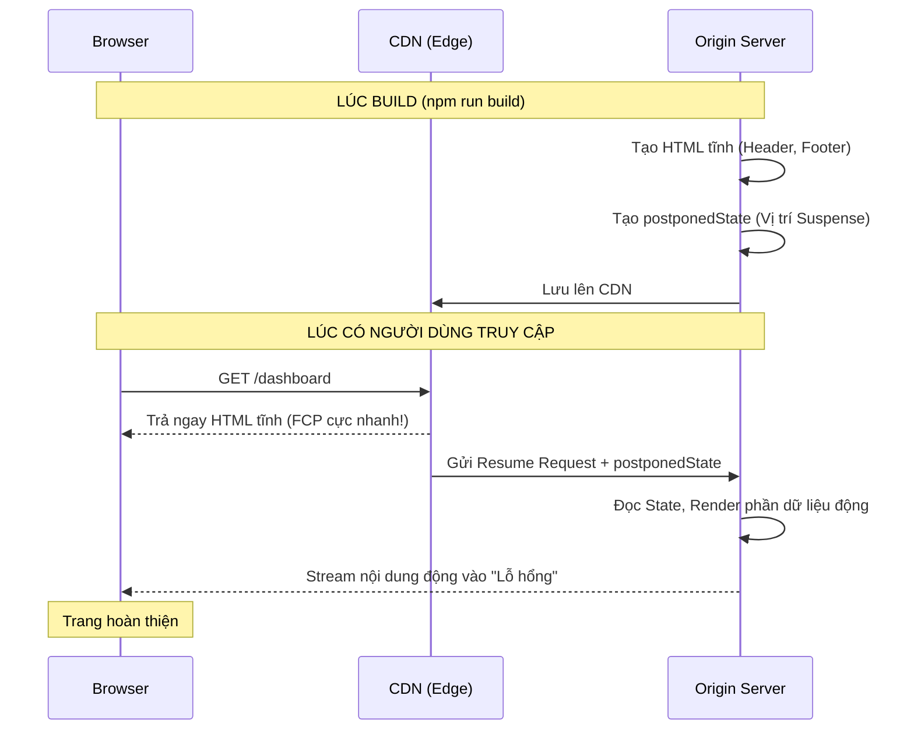

## Agenda

**Thời gian đọc ước tính:** ~15 phút

### Learning Outcomes
- **Hiểu** được Partial Prerendering (PPR) là gì và tại sao nó là "Chén thánh" của Web Rendering.
- **Giải thích** được cơ chế chia tách một trang thành "Static Shell" và "Dynamic Holes".
- **Biết cách** kích hoạt và sử dụng PPR trong Next.js 15+.
- **Hiểu** được những đòi hỏi khắt khe về hạ tầng (Resume Protocol) để chạy được PPR.

---

## Glossary & Vocabulary

**1. Technical Terms (Thuật ngữ kỹ thuật):**

| Term | Vietnamese Meaning & Quick Explain |
| :--- | :--- |
| **PPR (Partial Prerendering)** | Kết xuất trước một phần. Kỹ thuật cho phép render sẵn một nửa trang web (phần tĩnh) lúc Build, và render nửa còn lại (phần động) lúc Request. |
| **postponedState** | Một đoạn dữ liệu (blob) sinh ra lúc Build, dùng để báo cho Server biết: "Hôm trước tôi đã render đến đoạn này rồi, giờ có Request thì anh render tiếp phần còn lại nhé". |
| **Origin Compute** | Máy chủ gốc (thường là Server Node.js của bạn), nơi thực sự xử lý các logic nặng và kết nối Database, trái ngược với Edge/CDN (chỉ lưu file tĩnh). |

**2. Vocabulary Support (Từ vựng học thuật/B1+):**

| Word | Meaning in Context (Nghĩa trong ngữ cảnh) |
| :--- | :--- |
| **Sophistication (n)** | Sự tinh vi, phức tạp (Ví dụ: mức độ tinh vi của nền tảng Hosting). |
| **Opaque (adj)** | Đục, mờ đục. Nghĩa bóng trong IT: Dữ liệu dạng hộp đen, bạn chỉ việc truyền đi chứ không được phép đọc hay sửa (như `postponedState`). |
| **Degradation (n)** | Sự suy giảm. Graceful degradation nghĩa là hệ thống vẫn hoạt động (dù chậm hơn) thay vì sập hoàn toàn. |

---

## 1. WHY — "Chén thánh" của Web Rendering

Trong bài 1 (Rendering Strategies), chúng ta đã học:
- **Static Rendering:** Nhanh như chớp (từ CDN), nhưng không có dữ liệu cá nhân hóa.
- **Dynamic Rendering:** Có dữ liệu cá nhân hóa, nhưng chậm (từ Origin Server).

Trong bài 3 (Streaming), chúng ta học cách giảm thiểu sự chậm chạp của Dynamic bằng cách gửi Header/Layout trước (Static Shell). Tuy nhiên, **ngay cả cái Static Shell đó cũng phải được tạo ra và gửi từ Origin Server lúc có Request**. Mất ít nhất 50-100ms.

**Vấn đề:** Làm sao để Static Shell được gửi từ CDN (0ms), nhưng phần dữ liệu động vẫn được stream vào từ Server?
Đó chính là câu hỏi đã khai sinh ra **Partial Prerendering (PPR)**. Nó kết hợp đỉnh cao của cả 2 thế giới.

---

## 2. WHAT — Partial Prerendering là gì?

> **Định nghĩa:** Partial Prerendering (PPR) là tính năng tối ưu hóa rendering cho phép một trang web vừa có những phần được render tĩnh lúc Build (Static Shell), vừa có những phần được render động lúc Request (Dynamic Holes) bằng Suspense.

### 2.1. Cơ chế hoạt động (Build Time & Request Time)

**Definition Anatomy (Giải phẫu định nghĩa):**
- **Static Shell** (*Vỏ bọc tĩnh*): Tất cả các component không gọi dữ liệu động (không dùng `cookies()`, `headers()`, Database fetch).
- **Dynamic Holes** (*Lỗ hổng động*): Bất cứ Component nào được bọc bởi `<Suspense>`, Next.js sẽ coi đó là một "lỗ hổng" chưa được render.

**Lúc Build (Build time):**
Thay vì gặp `cookies()` rồi chuyển nguyên trang thành Dynamic như trước đây, với PPR, Next.js sẽ:
1. Render ra file HTML của Static Shell.
2. Sinh ra một file `postponedState` (Trạng thái tạm hoãn). Nó chứa thông tin vị trí các Suspense boundary đang bị bỏ trống.

**Lúc Request (Request time):**
1. CDN sẽ vứt thẳng file HTML tĩnh (Static Shell) vào mặt trình duyệt ngay lập tức (Thời gian trễ gần như 0ms).
2. Song song đó, CDN gửi cái `postponedState` về cho Origin Server.
3. Origin Server đọc `postponedState`, bắt đầu lấy dữ liệu động và stream nốt các phần còn thiếu (Dynamic Holes) qua giao thức HTTP Chunked Transfer.

### 2.2. Trực quan hóa kiến trúc PPR



---

## 3. HOW — Kích hoạt và Sử dụng PPR

*Lưu ý: Tính đến Next.js 15, PPR vẫn đang là tính năng Experimental (Thử nghiệm).*

### Bước 1: Bật cờ (Flag) trong Config
Bạn phải bật tính năng này trong `next.config.ts`:

```typescript
// next.config.ts
import type { NextConfig } from 'next';

const nextConfig: NextConfig = {
  experimental: {
    ppr: 'incremental', // Cho phép bật PPR trên từng route cụ thể
  },
};

export default nextConfig;
```

### Bước 2: Kích hoạt ở cấp độ Route
Thêm config `experimental_ppr` vào trang bạn muốn sử dụng.

```tsx
// app/dashboard/page.tsx
import { Suspense } from 'react'
import { cookies } from 'next/headers'

// Bật PPR cho riêng trang này
export const experimental_ppr = true

// Thành phần tĩnh (Static Shell)
function DashboardHeader() {
  return <h1>Xin chào! Đây là phần chung của mọi người.</h1>
}

// Thành phần động (Dynamic Hole)
async function UserCart() {
  const cookieStore = await cookies()
  const cartId = cookieStore.get('cartId')
  // ... fetch dữ liệu giỏ hàng ...
  return <div>Giỏ hàng của bạn có 3 món</div>
}

export default function Dashboard() {
  return (
    <main>
      {/* Sẽ được đẩy lên CDN lúc Build */}
      <DashboardHeader /> 

      {/* Sẽ bị bỏ trống lúc Build, và Stream từ Server lúc Request */}
      <Suspense fallback={<p>Đang tải giỏ hàng...</p>}>
        <UserCart />
      </Suspense>
    </main>
  )
}
```

---

## 4. The Resume Protocol & Ràng buộc Hạ tầng (Platform Support)

Để tính năng PPR chạy được tốc độ tối đa (CDN + Origin), hệ thống Hosting của bạn phải cực kỳ tinh vi.

Next.js gọi đây là **The Resume Protocol (Giao thức Tiếp tục)**.
Khi CDN nhận Request, nó phải biết cách gửi một HTTP POST request bí mật (với header `next-resume: 1`) kèm theo cái `postponedState` về cho máy chủ Node.js gốc, để máy chủ biết đường mà render tiếp thay vì render lại từ đầu.

**Khả năng hỗ trợ của các nền tảng (Tính đến hiện tại):**
- **Vercel:** Hỗ trợ hoàn hảo 100% (Vì họ tạo ra Next.js). Vercel Edge Network sẽ đảm nhận vai trò CDN và tự động gọi Resume Protocol.
- **Node.js tự host (EC2, VPS):** Vẫn chạy được PPR, nhưng dưới dạng *Origin-Only Implementation*. Nghĩa là máy chủ Node.js của bạn sẽ tự đọc cache cục bộ, gửi Static Shell đi, rồi tự stream phần Dynamic. Rất nhanh, nhưng bạn sẽ không có lợi thế địa lý của CDN.
- **AWS Amplify / Cloudflare Pages / Netlify:** Đang trong quá trình cập nhật các Adapter để hỗ trợ Resume Protocol đầy đủ.
- **Static Export (`out` folder):** KHÔNG hỗ trợ.

---

## 5. Discussion Questions

1. Theo bạn, tại sao việc chỉnh sửa thủ công file `postponedState` sinh ra trong thư mục `.next` lại bị cấm tuyệt đối (Opaque blob)? Điều gì sẽ xảy ra nếu ta sửa nó?
2. Nếu máy chủ Node.js gốc (Origin) bị sập hoàn toàn (Crash), nhưng CDN vẫn hoạt động tốt, thì người dùng truy cập vào trang có bật PPR sẽ thấy gì trên màn hình? (Đây chính là tính năng Graceful Degradation).
3. Tại sao PPR lại đe dọa sự tồn tại của các hàm như `getStaticProps` hay `getServerSideProps` của thế hệ Next.js Pages Router? Có Use-case nào mà Pages Router vẫn làm tốt hơn PPR không?

---

## References

- [Next.js Official Docs — PPR Platform Guide](https://nextjs.org/docs/app/guides/ppr-platform-guide) *(Crawled: 2026-06-25)*
- [Next.js Official Docs — Rendering Philosophy](https://nextjs.org/docs/app/guides/rendering-philosophy) *(Crawled: 2026-06-25)*

---

*Made by Anh Tu - Share to be share*
