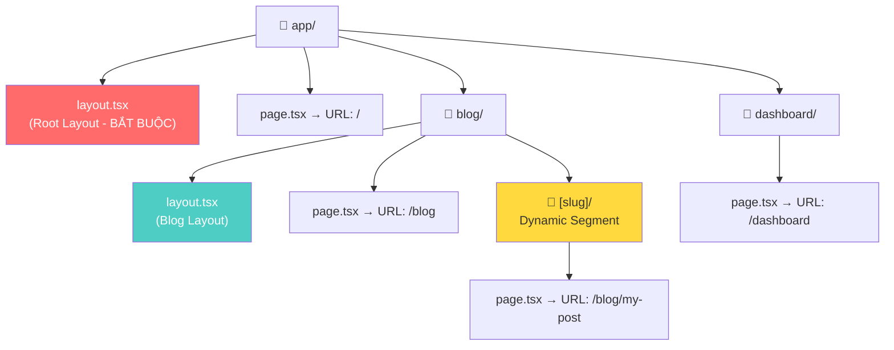
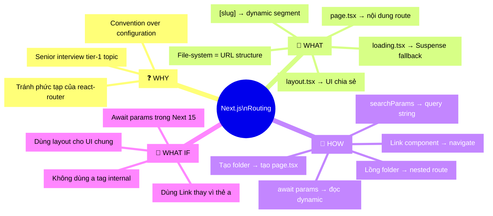

## 📋 Agenda

**Thời gian đọc ước tính:** ~15 phút

### Sau bài này, bạn sẽ:
- ✅ **Hiểu** được tại sao Next.js dùng file-system routing và lợi thế của nó
- ✅ **Phân biệt** được `page.tsx`, `layout.tsx`, và `loading.tsx` dùng khi nào
- ✅ **Tự tay** tạo được nested routes và dynamic segments từ đầu
- ✅ **Nắm được cơ bản** về cơ chế chuyển trang bằng `<Link>`

### Yêu cầu đầu vào (Prerequisites):
- 🔹 Biết cơ bản React component (JSX, props)
- 🔹 Đã cài Next.js và chạy được `npm run dev` ít nhất một lần

---

## ❓ WHY — Tại sao routing trong Next.js lại đặc biệt?

Bạn đã bao giờ làm React thuần (Vite, CRA) và phải vật lộn với `react-router-dom` chưa? Bạn phải tự khai báo từng route, tự quản lý nested routes, rồi lại lo thêm code splitting, lazy loading...

```jsx
// ❌ React thuần: Bạn tự làm mọi thứ
<Routes>
  <Route path="/" element={<Home />} />
  <Route path="/blog" element={<Blog />} />
  <Route path="/blog/:slug" element={<BlogPost />} />
</Routes>
```

**Vấn đề thực tế:** Theo khảo sát cộng đồng React, hơn **65% lỗi routing** trong các dự án vừa và lớn đến từ việc khai báo sai thứ tự route hoặc quên code splitting. Bảo trì khó, onboard teammate mới càng khó hơn.

**Next.js App Router sinh ra để giải quyết chính xác bài toán đó:**
- Không cần khai báo route — **cấu trúc thư mục = cấu trúc URL**
- Layouts tự động share trạng thái, không re-render
- Prefetching sẵn có, không cần cấu hình thêm

> 💡 **Career path:** Hiểu routing trong Next.js là kỹ năng *tier 1* khi đi phỏng vấn Senior Frontend. Đây là phần interviewer hay hỏi nhất vì nó liên quan đến cả performance lẫn architecture.

---

## 📖 WHAT — File-system Routing là gì?

### Ẩn dụ đời thường

**Hãy tưởng tượng** hệ thống routing của Next.js như một tòa nhà văn phòng nhiều tầng:

- **Mỗi tầng (folder)** = một URL segment
- **Cửa ra vào (file `page.tsx`)** = nội dung hiển thị cho người vào tầng đó
- **Hành lang chung (file `layout.tsx`)** = UI dùng chung (header, sidebar) cho cả tầng và các tầng con bên trong
- **Văn phòng riêng theo tên (`[id]` folder)** = Dynamic route — cùng một layout nhưng nội dung thay đổi tùy người

Dù bạn vào tầng 1, tầng 2 hay tầng 10 — hành lang chung vẫn ở đó, không bị dựng lại mỗi lần bạn di chuyển.

### Kiến trúc tổng quan



### Các file convention quan trọng

| File | Vai trò | Ghi chú |
|------|---------|---------|
| `page.tsx` | Nội dung trang, làm route accessible | Bắt buộc để route hoạt động |
| `layout.tsx` | UI chia sẻ, wrap `{children}` | Không re-render khi navigate |
| `loading.tsx` | UI fallback khi route đang load | Tự động wrap vào `<Suspense>` |
| `error.tsx` | UI khi có lỗi xảy ra | Phải là `'use client'` |
| `not-found.tsx` | UI trang 404 | Trigger bởi `notFound()` |

---

## 🔨 HOW — Thực hành từng bước

### Bước 1: Tạo Page đơn giản

Muốn có route `/`, tạo file `app/page.tsx`:

```tsx
// filename: app/page.tsx

// Đây là Server Component — chạy trên server, không gửi JS xuống client
// → Phù hợp để fetch data, đọc DB trực tiếp
export default function HomePage() {
  return <h1>Chào mừng đến trang chủ!</h1>
}
```

Muốn thêm route `/about`, thêm file `app/about/page.tsx`:

```tsx
// filename: app/about/page.tsx
export default function AboutPage() {
  return <h1>Giới thiệu về chúng tôi</h1>
}
```

> ✅ **Không cần khai báo gì thêm** — Next.js tự detect và đăng ký route.

---

### Bước 2: Tạo Root Layout (Bắt buộc)

```tsx
// filename: app/layout.tsx

// Root Layout là bắt buộc và phải chứa <html> + <body>
// Nó wraps TẤT CẢ các page trong ứng dụng
export default function RootLayout({
  children,
}: {
  children: React.ReactNode
}) {
  return (
    <html lang="vi">
      <body>
        {/* Navbar ở đây sẽ xuất hiện trên MỌI page — không re-render khi navigate */}
        <nav>My App</nav>
        <main>{children}</main>
      </body>
    </html>
  )
}
```

---

### Bước 3: Nested Routes và Nested Layouts

Tạo section `/blog` với layout riêng:

```
app/
├── layout.tsx        ← Root layout (wrap tất cả)
├── page.tsx          ← Route: /
└── blog/
    ├── layout.tsx    ← Blog layout (chỉ wrap /blog và con)
    ├── page.tsx      ← Route: /blog
    └── [slug]/
        └── page.tsx  ← Route: /blog/ten-bai-viet
```

```tsx
// filename: app/blog/layout.tsx

// Layout này chỉ áp dụng cho /blog và các route con
// Nó được wrap BÊN TRONG Root Layout
export default function BlogLayout({ children }: { children: React.ReactNode }) {
  return (
    <section>
      {/* Sidebar chỉ xuất hiện ở trang blog, không ảnh hưởng /dashboard */}
      <aside>Danh mục bài viết</aside>
      <article>{children}</article>
    </section>
  )
}
```

**Kết quả khi truy cập `/blog/my-post`:**
```
RootLayout (app/layout.tsx)
  └── BlogLayout (app/blog/layout.tsx)
        └── BlogPostPage (app/blog/[slug]/page.tsx)
```

---

### Bước 4: Dynamic Segments

Dùng tên thư mục trong ngoặc vuông `[slug]` để tạo dynamic route:

```tsx
// filename: app/blog/[slug]/page.tsx

// params là Promise chứa các dynamic segment
// Phải await trước khi dùng (Next.js 15+)
export default async function BlogPostPage({
  params,
}: {
  params: Promise<{ slug: string }>
}) {
  // Destructure sau khi await — đây là pattern mới từ Next.js 15
  const { slug } = await params

  // Fetch data dựa trên slug từ URL
  const post = await getPost(slug) // VD: slug = "nextjs-la-gi"

  return (
    <div>
      <h1>{post.title}</h1>
      <p>{post.content}</p>
    </div>
  )
}
```

> ⚠️ **Lưu ý Next.js 15:** `params` và `searchParams` đã được đổi sang `Promise`. Nếu bạn dùng phiên bản cũ hơn, không cần `await params`.

---

### Bước 5: Navigation với `<Link>`

```tsx
// filename: app/blog/page.tsx
import Link from 'next/link' // ← Luôn dùng next/link, KHÔNG dùng thẻ <a>

export default async function BlogPage() {
  const posts = await getPosts()

  return (
    <ul>
      {posts.map((post) => (
        <li key={post.slug}>
          {/* 
            <Link> vs <a>:
            - <a>: Full page reload, mất state, UX tệ
            - <Link>: Client-side transition, giữ state, cảm giác như SPA
          */}
          <Link href={`/blog/${post.slug}`}>{post.title}</Link>
        </li>
      ))}
    </ul>
  )
}
```

---

### Bước 6: Search Params

```tsx
// filename: app/products/page.tsx

// searchParams cho phép đọc query string: /products?category=phone&page=2
export default async function ProductsPage({
  searchParams,
}: {
  searchParams: Promise<{ category?: string; page?: string }>
}) {
  const { category, page = '1' } = await searchParams

  // Sử dụng searchParams khiến page này trở thành Dynamic Rendering
  // → Next.js sẽ render lại mỗi request, không cache
  const products = await getProducts({ category, page: Number(page) })

  return (
    <div>
      <h1>Danh mục: {category ?? 'Tất cả'}</h1>
      {/* render products... */}
    </div>
  )
}
```

---

### Bước 7: Loading UI

```tsx
// filename: app/blog/loading.tsx

// File này tự động được wrap vào <Suspense> bởi Next.js
// Hiển thị ngay lập tức khi user navigate đến /blog
export default function BlogLoading() {
  return (
    <div>
      {/* Skeleton UI thân thiện hơn là màn hình trắng */}
      {[1, 2, 3].map((i) => (
        <div key={i} style={{ background: '#eee', height: '80px', margin: '8px 0', borderRadius: '8px' }} />
      ))}
    </div>
  )
}
```

---

## 🚀 WHAT IF — Khi nào dùng gì?

### Bảng so sánh Pattern Routing

| Tình huống | Giải pháp | Ví dụ |
|-----------|-----------|-------|
| Nhiều page cùng chia header/sidebar | `layout.tsx` | Dashboard admin |
| URL thay đổi theo data | `[slug]` dynamic segment | Blog, e-commerce |
| Lọc, phân trang không đổi URL | `searchParams` prop | Danh sách sản phẩm |
| Cần trạng thái URL chia sẻ được | `searchParams` + `useSearchParams` | Filter phức tạp |
| Điều hướng từ event (onClick) | `useRouter().push()` | Form submit, auth |

### ⚠️ Pitfalls hay gặp

**1. Quên `await params` trong Next.js 15**
```tsx
// ❌ Sai — params là Promise, truy cập trực tiếp sẽ có warning
const { slug } = params

// ✅ Đúng
const { slug } = await params
```

**2. Dùng `<a>` thay vì `<Link>` để navigate internal**
```tsx
// ❌ Sai — reload toàn bộ trang, mất state, chậm
<a href="/about">About</a>

// ✅ Đúng — client-side transition, giữ shared layouts
<Link href="/about">About</Link>
```

**3. Đặt logic fetch data trong Layout**
```tsx
// ⚠️ Cẩn thận — Layout không có searchParams prop
// Nếu cần searchParams, phải đặt logic trong Page, không phải Layout
export default async function Layout({ children }) {
  // ❌ Layout không nhận searchParams
}
```

**4. Không có `loading.tsx` cho Dynamic Routes**

Dynamic routes cần fetch data từ server → user sẽ thấy màn hình trắng trong khi chờ. Luôn tạo `loading.tsx` cho route nào có dynamic data.

### Cơ chế Navigation & Prefetching hoạt động như thế nào?

Việc chuyển trang trong Next.js bằng `<Link>` mang lại cảm giác tức thì (instant) nhờ sự kết hợp của **Prefetching** (tải trước dữ liệu) và **Client-side transition** (chỉ cập nhật phần DOM thay đổi).

> 👉 **Deep Dive:** Cơ chế chi tiết, cách Next.js cache Router trên client, và phân biệt Hard vs Soft Navigation được giải thích chuyên sâu ở bài: **[5. Kỹ thuật Navigation & Prefetching](./05-linking-and-navigating.md)**.
---

## 🧩 MECE Mindmap — Tổng hợp kiến thức



---

## 📚 Tài liệu tham khảo

- [Next.js Docs — Layouts and Pages](https://nextjs.org/docs/app/getting-started/layouts-and-pages)
- [Next.js Docs — Linking and Navigating](https://nextjs.org/docs/app/getting-started/linking-and-navigating)
- [Next.js Docs — Dynamic Routes](https://nextjs.org/docs/app/api-reference/file-conventions/dynamic-routes)

---

*Made by Anh Tu - Share to be share*
