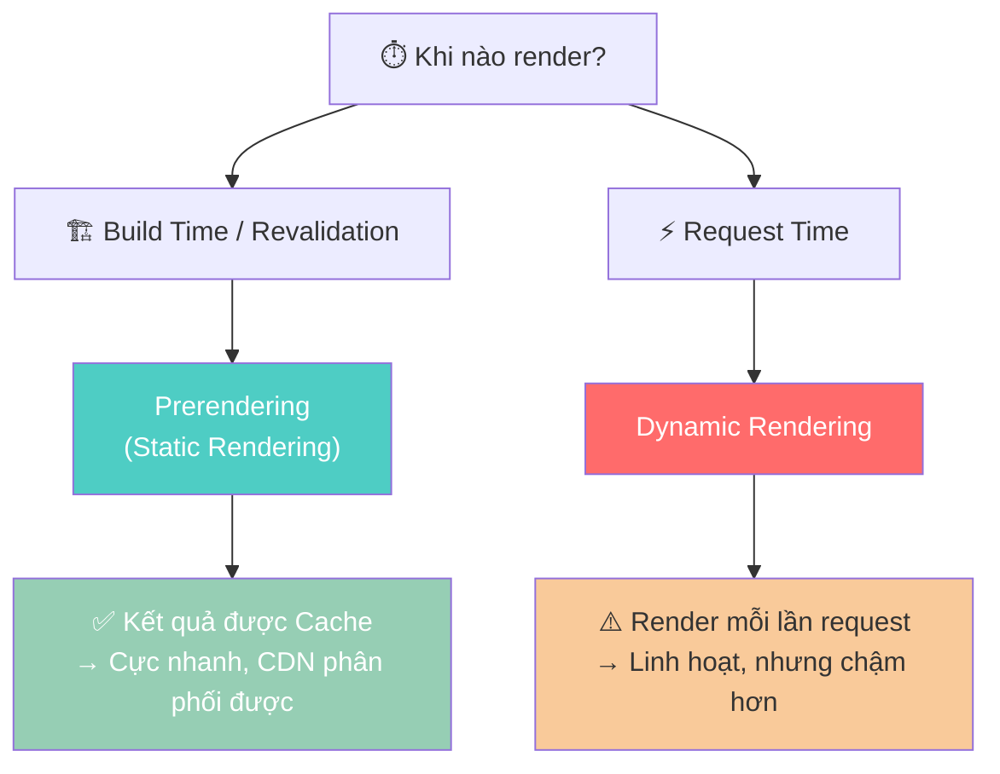
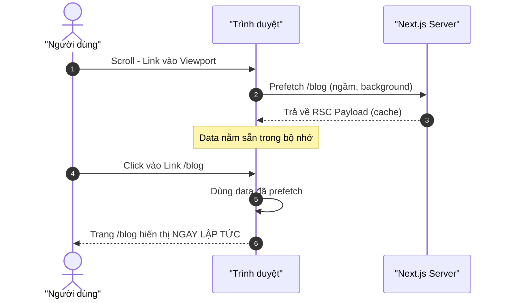
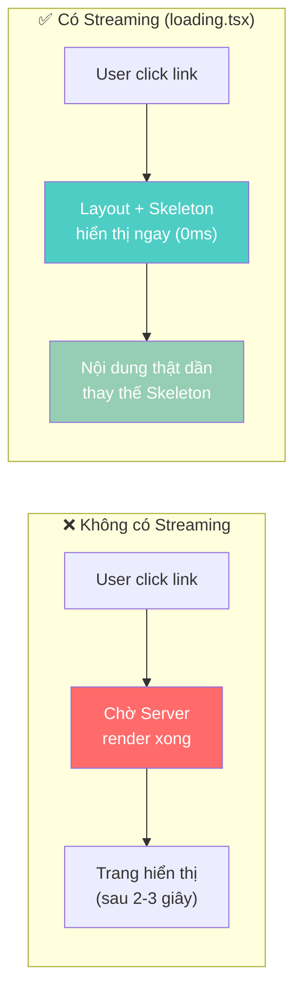
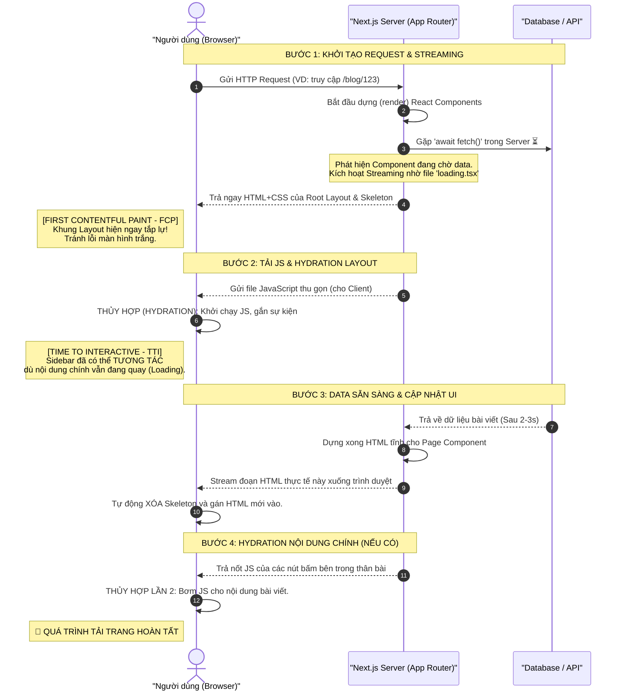
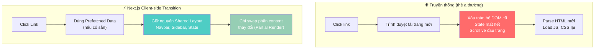
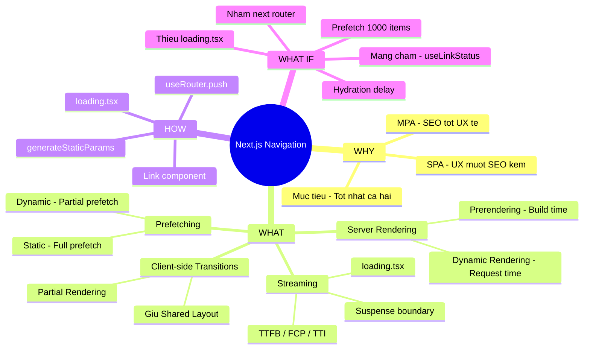

## 📋 Agenda

**Thời gian đọc ước tính:** ~18 phút

### Sau bài này, bạn sẽ:
- ✅ **Phân biệt** được Prerendering và Dynamic Rendering trong Server Rendering
- ✅ **Giải thích** được Prefetching hoạt động khác nhau trên Static Route và Dynamic Route
- ✅ **Tự tay** cấu hình Streaming với `loading.tsx` để cải thiện Core Web Vitals
- ✅ **Hiểu sâu** Client-side Transitions giúp app "cảm giác như SPA" dù chạy Server-side

### Yêu cầu đầu vào (Prerequisites):
- 🔹 Đã đọc và hiểu cơ bản về [Routing trong Next.js](./04-routing.md)
- 🔹 Đã biết Server Components vs Client Components là gì

---

## ❓ WHY — Cuộc chiến hai thái cực của Web

Có một câu nói chua ngoa trong giới dev: **"Chọn MPA thì SEO ngon nhưng UX tệ, chọn SPA thì UX mượt nhưng SEO chết."**

Nguồn gốc của cuộc chiến này:

| Tiêu chí | MPA (Multi-Page App) | SPA (Single-Page App) |
|----------|---------|---------|
| Chuyển trang | Load lại toàn bộ trang (màn hình trắng, giật lag) | Mượt hoàn toàn, không reload |
| SEO | ✅ Xuất sắc (HTML đầy đủ từ server) | ❌ Kém (Bot thấy trang trống) |
| Load đầu tiên | Nhanh (HTML nhỏ) | Chậm (cục JS khổng lồ) |
| UX khi dùng | Giật lag mỗi lần click | Rất mượt, cảm giác native |

> **Câu hỏi triệu đô:** Làm sao có thể đạt được **SEO như MPA** mà **mượt như SPA**?

Đây chính xác là bài toán Next.js đã giải quyết. Họ xây dựng một hệ thống navigation gồm **4 cơ chế phối hợp nhịp nhàng**:

1. **Server Rendering** — tạo HTML trên server để bot đọc được
2. **Prefetching** — tải trước nội dung trang kế tiếp ở nền
3. **Streaming** — gửi HTML từng phần thay vì chờ render xong toàn bộ
4. **Client-side Transitions** — chuyển trang mà không reload toàn bộ DOM

---

## 📖 WHAT — Giải phẫu 4 Cơ Chế Navigation

### Ẩn dụ: Dịch vụ giao đồ ăn cao cấp

Hãy tưởng tượng bạn đặt món ăn tại nhà hàng buffet hạng sang:

- **Server Rendering** = Bếp nấu đồ ăn thật (trên server) thay vì bạn tự nấu ở nhà (client), đảm bảo chất lượng chuẩn mực.
- **Prefetching** = Khi bạn nhìn vào menu và mắt dừng ở món Bò Wagyu, đầu bếp lập tức rã đông nguyên liệu ngay lập tức — dù bạn chưa bấm gọi món.
- **Streaming** = Thay vì chờ nấu xong cả mâm cỗ mới mang ra, nhà hàng mang ra từng món ngay khi xong — khai vị trước, rồi đến món chính.
- **Client-side Transitions** = Phục vụ chỉ đổi đĩa thức ăn, không dọn sạch toàn bộ bàn ăn. Ly nước, đũa, khăn giấy (shared layout) đều giữ nguyên.

---

### 🏗️ Cơ chế 1: Server Rendering

> **Định nghĩa:** Trong Next.js, Layout và Page là **React Server Components** theo mặc định. Mỗi lần navigate, **Server Component Payload** (dữ liệu UI đã render) được tạo trên server trước khi gửi cho client.

Có 2 loại Server Rendering — và đây là điểm **nhiều người hay nhầm**:



**Prerendering (Static Rendering):**
- Xảy ra tại **build time** hoặc sau **revalidation**
- Kết quả được **cache** → CDN có thể phân phối toàn cầu
- Phù hợp cho: trang blog, landing page, nội dung ít thay đổi

**Dynamic Rendering:**
- Xảy ra tại **request time** (mỗi lần user vào trang)
- Không cache → Linh hoạt, data luôn fresh
- Tự động kích hoạt khi dùng: `cookies()`, `headers()`, `searchParams`, `noStore()`

:::info Điểm quan trọng
**Trade-off của Server Rendering:** Client phải *chờ server trả lời* trước khi trang mới hiển thị. Đây là lý do Next.js cần thêm Prefetching và Streaming để che giấu độ trễ này.
:::

---

### 🔮 Cơ chế 2: Prefetching

> **Định nghĩa:** Prefetching là quá trình **tải trang ở nền** trước khi user thực sự click vào link đó. Khi user nhấp vào, data đã sẵn sàng ở client → chuyển trang gần như tức thì.



Next.js tự động prefetch mọi `<Link>` xuất hiện trong viewport. Tuy nhiên, **mức độ prefetch khác nhau tùy loại route:**

| Loại Route | Mức độ Prefetch | Chi tiết |
|---|---|---|
| **Static Route** | ✅ **Full prefetch** | Toàn bộ RSC Payload được tải trước |
| **Dynamic Route** | ⚡ **Partial prefetch** (nếu có `loading.tsx`) | Chỉ tải shared layout + loading skeleton |
| **Dynamic Route** | ❌ **Bỏ qua** (nếu không có `loading.tsx`) | Không prefetch để tránh tốn tài nguyên server |

```tsx
// filename: src/components/Navbar.tsx
import Link from 'next/link'

export default function Navbar() {
  return (
    <nav>
      {/* ✅ Static route → Full prefetch tự động khi vào viewport */}
      <Link href="/blog">Blog</Link>

      {/* ⚠️ Dùng thẻ <a> thường → KHÔNG có prefetch */}
      <a href="/contact">Contact</a>
    </nav>
  )
}
```

:::warning Lưu ý về Prefetch thủ công
Khi set `prefetch={false}`, Next.js vẫn **auto-prefetch khi user hover chuột** lên link đó. Prop `false` chỉ tắt việc prefetch khi link *mới lọt vào viewport* mà thôi.
:::

---

### 🌊 Cơ chế 3: Streaming

> **Định nghĩa:** Streaming cho phép server **gửi từng phần** của Dynamic Route xuống client ngay khi phần đó render xong, thay vì phải chờ toàn bộ trang hoàn thành.

**Vấn đề Streaming giải quyết:** Dynamic routes không được full-prefetch. Nếu không có Streaming, user phải nhìn chằm chằm vào màn hình trống suốt khi server đang chạy DB query, fetch API, v.v...



**Cách kích hoạt Streaming — Chỉ cần tạo file `loading.tsx`:**

```tsx
// filename: app/blog/loading.tsx
// Next.js tự động wrap page.tsx trong <Suspense> và dùng file này làm fallback

export default function Loading() {
  // Skeleton UI — hiển thị ngay khi user click vào /blog
  return (
    <div className="skeleton-container">
      <div className="skeleton-title" />
      <div className="skeleton-paragraph" />
      <div className="skeleton-paragraph" />
    </div>
  )
}
```

```tsx
// filename: app/blog/page.tsx
// Component này chạy async, có thể mất vài giây vì fetch data

export default async function BlogPage() {
  // Data fetch tốn thời gian — nhưng user đã thấy skeleton rồi!
  const posts = await fetch('https://api.example.com/posts').then(r => r.json())

  return (
    <ul>
      {posts.map(post => <li key={post.id}>{post.title}</li>)}
    </ul>
  )
}
```

**Hậu trường:** Next.js tự động bọc `page.tsx` trong `<Suspense>`. Khi user navigate đến, họ thấy skeleton ngay lập tức, và skeleton được swap ra nội dung thật khi server render xong.

**Lợi ích đo lường được — 3 Core Web Vitals được cải thiện:**

| Metric | Ý nghĩa | Streaming giúp thế nào |
|--------|---------|------------------------|
| **TTFB** (Time to First Byte) | Thời gian server gửi byte đầu tiên | Gửi layout/skeleton ngay, không chờ toàn trang |
| **FCP** (First Contentful Paint) | Lần đầu user thấy nội dung | Skeleton xuất hiện gần như ngay lập tức |
| **TTI** (Time to Interactive) | Thời gian trang phản hồi được sự kiện | Layout vẫn interactive trong khi content load |

**Quy trình Streaming & Hydration (Hậu trường chi tiết):**



:::tip Tip nâng cao
Bạn cũng có thể dùng `<Suspense>` trực tiếp trong JSX để stream từng component riêng lẻ, không cần phải stream cả trang:

```tsx
import { Suspense } from 'react'
import { SlowDataComponent } from './components'

export default function Page() {
  return (
    <div>
      <h1>Dashboard</h1>
      {/* Layout và tiêu đề hiển thị ngay */}
      <Suspense fallback={<ChartSkeleton />}>
        {/* Component này load chậm — streaming độc lập */}
        <SlowDataComponent />
      </Suspense>
    </div>
  )
}
```
:::

---

### ⚡ Cơ chế 4: Client-side Transitions

> **Định nghĩa:** Truyền thống, navigate đến server-rendered page = reload toàn bộ trang (clear state, reset scroll). Next.js tránh điều này bằng **Client-side Transitions** — chỉ cập nhật phần DOM thay đổi, giữ nguyên shared layout.



**Hai điều Client-side Transition làm:**
1. **Giữ nguyên Shared Layout và UI** (Navbar, Sidebar, Footer, Context State)
2. **Swap content** bằng prefetched loading state hoặc trang mới (nếu đã sẵn sàng)

Kết hợp 3 cơ chế lại, ta có flow hoàn chỉnh:

```
[Prefetch ở nền] + [Streaming skeleton] + [Client-side Transition]
       ↓                    ↓                        ↓
  Data sẵn sàng      User thấy phản hồi        Layout giữ nguyên
  trước khi click      ngay lập tức              không giật lag
```

---

## 🔨 HOW — Triển khai thực tế

### Bước 1: Điều hướng cơ bản — Component `<Link>`

```tsx
// filename: src/components/Navbar.tsx
import Link from 'next/link'

export default function Navbar() {
  return (
    <nav>
      {/* ✅ Prefetch bật tự động — nên dùng cho các link navigation chính */}
      <Link href="/dashboard">Dashboard</Link>

      {/* Tắt viewport-prefetch — phù hợp cho danh sách cực dài (hàng nghìn item) */}
      <Link href="/settings" prefetch={false}>Settings</Link>
    </nav>
  )
}
```

### Bước 2: Điều hướng bằng Code — `useRouter`

Khi cần chuyển trang sau xử lý logic (login, submit form, v.v.):

```tsx
// filename: src/components/LoginForm.tsx
'use client' // ← Mọi hook React phải nằm ở Client Component

import { useRouter } from 'next/navigation' // ⚠️ Đừng nhầm với next/router của Pages Router
import { useState } from 'react'

export function LoginForm() {
  const router = useRouter()
  const [isLoading, setIsLoading] = useState(false)

  const handleSubmit = async (e: React.FormEvent) => {
    e.preventDefault()
    setIsLoading(true)

    const isSuccess = await loginApi()

    if (isSuccess) {
      // Chuyển trang mượt với Client-side Transition — giống như click <Link>
      router.push('/dashboard')
    }
  }

  return (
    <form onSubmit={handleSubmit}>
      <button type="submit">{isLoading ? 'Loading...' : 'Login'}</button>
    </form>
  )
}
```

### Bước 3: Cấu hình Streaming với `loading.tsx`

```
app/
├── blog/
│   ├── loading.tsx   ← ✅ Kích hoạt Streaming cho toàn bộ /blog
│   └── page.tsx      ← Component này có thể async chậm tùy ý
└── layout.tsx
```

```tsx
// filename: app/blog/loading.tsx
export default function Loading() {
  // UI này xuất hiện NGAY KHI user click link /blog
  // Server render xong → tự động swap sang nội dung thật
  return <BlogSkeleton />
}
```

### Bước 4: Tối ưu Dynamic Routes với `generateStaticParams`

Nếu route có dynamic segment (`[slug]`) nhưng bạn biết trước danh sách slug, hãy dùng `generateStaticParams` để **pre-render tại build time** — biến Dynamic thành Static:

```tsx
// filename: app/blog/[slug]/page.tsx

// Hàm này chạy lúc build → tạo sẵn HTML cho từng bài viết
export async function generateStaticParams() {
  const posts = await fetch('https://api.example.com/posts').then(r => r.json())

  // Mỗi slug sẽ được pre-render thành static page → prefetch full
  return posts.map((post: { slug: string }) => ({ slug: post.slug }))
}

export default async function BlogPost({
  params,
}: {
  params: Promise<{ slug: string }>
}) {
  const { slug } = await params
  const post = await getPost(slug)
  return <article>{post.content}</article>
}
```

---

## 🚀 WHAT IF — Bẫy hay gặp & Tối ưu nâng cao

### Bẫy 1: Dynamic Route thiếu `loading.tsx` → User thấy màn hình đơ

**Triệu chứng:** User click link → trang trắng, không có phản hồi ~2-3 giây rồi trang mới hiện ra đột ngột.

**Nguyên nhân:** Dynamic route không có `loading.tsx` → không có partial prefetch → không có skeleton → client ngồi chờ server render xong mới thấy gì.

```
app/blog/[slug]/
├── page.tsx       ← Fetch DB ở đây, 2-3 giây
└── ❌ thiếu loading.tsx → User không thấy gì trong khi chờ
```

**Giải pháp:** Luôn thêm `loading.tsx` cho mọi dynamic route:

```tsx
// filename: app/blog/[slug]/loading.tsx
export default function Loading() {
  return <ArticleSkeleton />
}
```

### Bẫy 2: Prefetch quá mức với danh sách dài → Server DDoS chính mình

**Tình huống:** Render danh sách 1,000 bài viết, mỗi bài có `<Link>`. Khi user scroll qua, Next.js kích hoạt 1,000 prefetch request cùng lúc.

```tsx
// ❌ Sai — server bị 1000 request đổ vào khi user scroll
{items.map(item => (
  <Link href={`/item/${item.id}`}>{item.name}</Link>
))}

// ✅ Đúng — chỉ prefetch khi hover (Intent-based prefetching)
{items.map(item => (
  <Link href={`/item/${item.id}`} prefetch={false}>
    {item.name}
  </Link>
))}
```

**Tip nâng cao — Hover Prefetch Pattern:**

```tsx
// filename: src/components/HoverPrefetchLink.tsx
'use client'
import Link from 'next/link'
import { useState } from 'react'

// Chỉ prefetch khi user hover → thể hiện "intent" thật sự
function HoverPrefetchLink({ href, children }: { href: string; children: React.ReactNode }) {
  const [active, setActive] = useState(false)

  return (
    <Link
      href={href}
      prefetch={active ? null : false}   // null = prefetch mặc định (bật)
      onMouseEnter={() => setActive(true)}
    >
      {children}
    </Link>
  )
}
```

### Bẫy 3: Mạng chậm → Loading indicator không xuất hiện

**Vấn đề:** Trên mạng chậm/kém ổn định, prefetch chưa xong trước khi user click. Loading skeleton cũng chưa có → user lại thấy màn hình đơ.

**Giải pháp:** Dùng hook `useLinkStatus` để hiển thị loading indicator ngay tức thì:

```tsx
// filename: src/components/LoadingIndicator.tsx
'use client'
import { useLinkStatus } from 'next/link'

// Đặt component này vào trong <Link> để hiển thị spinner khi đang transition
export default function LoadingIndicator() {
  const { pending } = useLinkStatus()

  return (
    <span
      aria-hidden
      // Debounce 100ms → chỉ xuất hiện nếu nav > 100ms (tránh flash nhanh)
      className={`link-hint ${pending ? 'is-pending' : ''}`}
    />
  )
}
```

```css
/* styles/link-hint.css */
.link-hint {
  opacity: 0;
  /* Delay 100ms — tránh flash cho các navigation nhanh */
  animation: show-hint 0s 100ms forwards;
}

.link-hint.is-pending {
  animation: show-hint 0s 100ms forwards;
}

@keyframes show-hint {
  to { opacity: 1; }
}
```

### Bẫy 4: Hydration chưa xong → Prefetch không chạy ngay

**Vấn đề:** `<Link>` là Client Component, phải được **hydrate** trước khi có thể prefetch. Nếu JS bundle quá lớn, hydration chậm → prefetch delay, trải nghiệm người dùng tệ hơn mong đợi.

**Giải pháp:**
- Dùng `@next/bundle-analyzer` để phân tích và loại bỏ dependency nặng
- Chuyển logic từ Client Component sang Server Component khi có thể
- React xử lý điều này một phần bằng **Selective Hydration** (hydrate component ưu tiên theo interaction)

### Bẫy 5: Nhầm `useRouter` từ `next/router` (Pages Router)

```tsx
// ❌ Sai — next/router là của Pages Router (version cũ)
import { useRouter } from 'next/router'

// ✅ Đúng — next/navigation là của App Router
import { useRouter } from 'next/navigation'
```

### Tổng hợp: Khi nào dùng gì?

| Tình huống | Giải pháp tối ưu |
|---|---|
| Navigation UI (Navbar, Sidebar) | `<Link>` với prefetch mặc định |
| Danh sách dài (>50 items) | `<Link prefetch={false}>` hoặc `HoverPrefetchLink` |
| Chuyển trang sau xử lý logic | `useRouter().push()` |
| Dynamic route phải nhanh | `loading.tsx` + `generateStaticParams` nếu được |
| Mạng chậm, cần feedback tức thì | `useLinkStatus` hook |
| Cập nhật URL không navigate | `window.history.pushState` / `replaceState` |

---

## 🧩 MECE Mindmap — Tổng đúc kết



---

## 📚 Tài liệu tham khảo

- [Next.js Docs — Linking and Navigating](https://nextjs.org/docs/app/getting-started/linking-and-navigating)
- [Next.js Docs — Streaming](https://nextjs.org/docs/app/guides/streaming)
- [Next.js Docs — Prefetching Guide](https://nextjs.org/docs/app/guides/prefetching)
- [Next.js API — useLinkStatus](https://nextjs.org/docs/app/api-reference/functions/use-link-status)
- [Next.js API — generateStaticParams](https://nextjs.org/docs/app/api-reference/functions/generate-static-params)
- [Web.dev — Core Web Vitals](https://web.dev/explore/learn-core-web-vitals)

---
*Made by Anh Tu - Share to be share*
