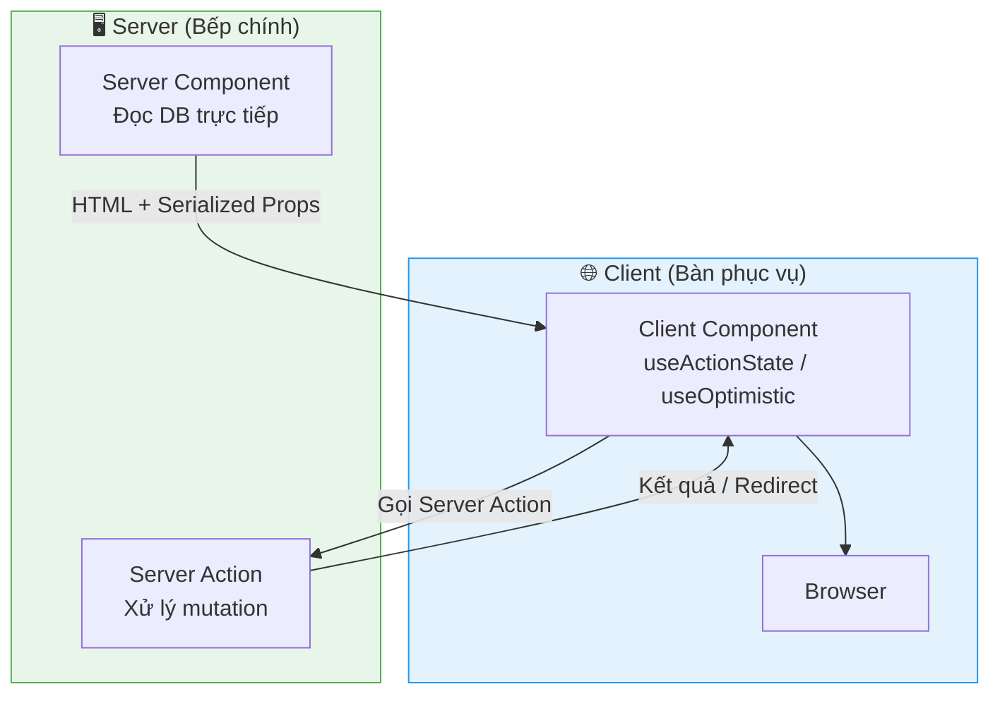
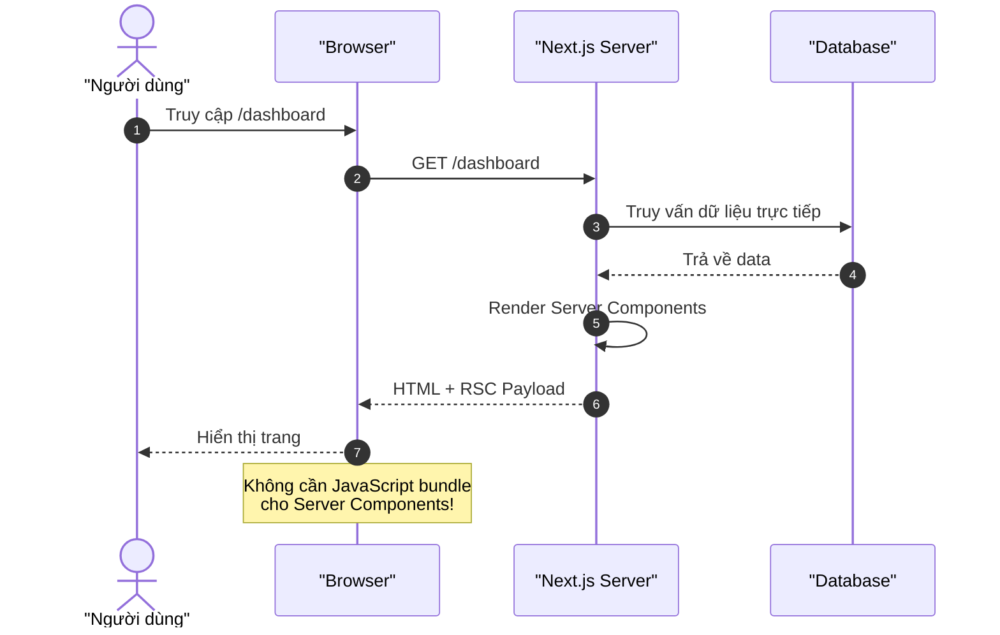
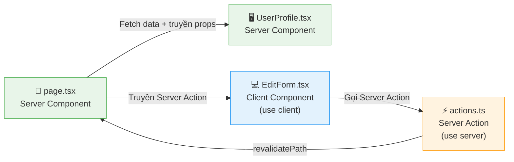
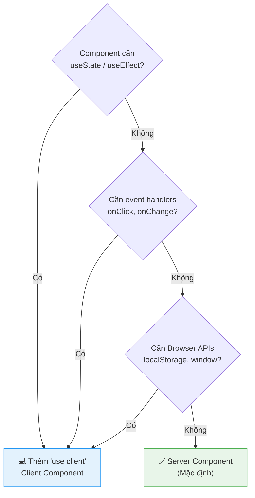
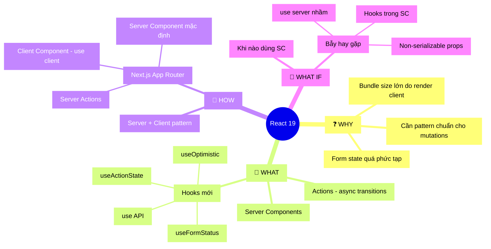

## 📋 Agenda

**Thời gian đọc ước tính:** ~20 phút

### Sau bài này, bạn sẽ:

- ✅ **Hiểu** được tại sao React 19 là bản phát hành quan trọng nhất trong nhiều năm qua
- ✅ **Giải thích** được Server Components là gì và tại sao Next.js App Router dùng nó làm mặc định
- ✅ **Phân biệt** được Server Components vs Client Components vs Server Actions
- ✅ **Sử dụng** được các hooks mới: `useActionState`, `useOptimistic`, `use`
- ✅ **Tránh** được các pitfalls phổ biến mà Junior hay mắc phải

### Yêu cầu đầu vào (Prerequisites):

- 🔹 Biết cơ bản React (useState, useEffect, component lifecycle)
- 🔹 Đã từng dùng Next.js App Router ít nhất một lần
- 🔹 Hiểu khái niệm async/await và HTTP request

<!--truncate-->

---

## ❓ WHY — React 19 ra đời để giải quyết vấn đề gì?

Bạn đã bao giờ viết một form đăng nhập và phải tự quản lý 3-4 state cùng lúc chưa?

```jsx
// Trước React 19 — "địa ngục" state management
const [name, setName] = useState("");
const [error, setError] = useState(null);
const [isPending, setIsPending] = useState(false);

const handleSubmit = async () => {
  setIsPending(true);        // 1. Bật loading
  const err = await updateName(name);
  setIsPending(false);       // 2. Tắt loading
  if (err) {
    setError(err);           // 3. Xử lý lỗi
    return;
  }
  redirect("/dashboard");    // 4. Redirect
};
```

**4 state variables** chỉ để xử lý một cái form. Và đây mới là form đơn giản — chưa tính đến optimistic updates, error boundaries, hay form reset.

Đây chính là vấn đề React 19 sinh ra để giải quyết: **làm cho data mutations đơn giản như hít thở.**

Ngoài ra, có một vấn đề còn lớn hơn: **JavaScript bundle size**. Mỗi component React đều được tải về browser của người dùng, kể cả những component chỉ đọc database và hiển thị HTML tĩnh. Tại sao không render chúng trên server ngay từ đầu?

> 💡 **React 19 stable** được phát hành ngày 05/12/2024 — đây là lần đầu tiên Server Components được tích hợp chính thức vào React core, sau hơn 3 năm thử nghiệm trong Canary.

---

## 📖 WHAT — React 19 Là Gì?

### Kiến trúc tổng quan

**Hãy tưởng tượng** một nhà hàng có hai khu bếp:

- **Bếp chính (Server)**: Nơi đầu bếp chuẩn bị thức ăn — chế biến, nấu nướng, lấy nguyên liệu từ kho (database). Khách hàng không vào được đây.
- **Bàn phục vụ (Client)**: Nơi khách hàng ngồi, tương tác, gọi thêm món, thanh toán.

Trước đây, React chỉ có "bàn phục vụ" — mọi thứ đều xảy ra ở browser. React 19 thêm "bếp chính" — Server Components — nơi render có thể xảy ra hoàn toàn trên server, gửi kết quả xuống client dưới dạng HTML/JSON.



---

### 🧩 Phần 1: Actions — Đơn giản hóa Data Mutations

**Actions** là tên gọi cho các async function chạy trong `startTransition`. React 19 tự động quản lý:

| Trước React 19 (thủ công) | React 19 Actions (tự động) |
|---|---|
| `setIsPending(true/false)` | ✅ Quản lý tự động |
| `setError(err)` | ✅ Tích hợp Error Boundary |
| Optimistic update thủ công | ✅ Qua `useOptimistic` |
| Reset form thủ công | ✅ Auto-reset khi success |

---

### 🪝 Phần 2: Các Hooks Mới

#### `useActionState` — Hook quản lý Action

Đây là hook trung tâm của React 19, thay thế pattern `isPending + error` cũ.

```jsx
// filename: components/UpdateNameForm.jsx

import { useActionState } from "react";

function UpdateNameForm() {
  // useActionState nhận vào: (action, initialState)
  // Trả về: [state, dispatchAction, isPending]
  const [error, submitAction, isPending] = useActionState(
    async (previousState, formData) => {
      const error = await updateName(formData.get("name"));
      
      if (error) {
        // Trả về error → state sẽ là error này
        return error;
      }
      
      // Thành công → redirect
      redirect("/dashboard");
      return null;
    },
    null, // initialState
  );

  return (
    // action={submitAction} → React tự handle pending + reset
    <form action={submitAction}>
      <input type="text" name="name" />
      <button type="submit" disabled={isPending}>
        {isPending ? "Đang cập nhật..." : "Cập nhật"}
      </button>
      {error && <p style={{ color: "red" }}>{error}</p>}
    </form>
  );
}
```

> 💡 **Lưu ý:** `useActionState` trước đây được gọi là `ReactDOM.useFormState` trong Canary releases. Đã đổi tên và deprecated `useFormState`.

---

#### `useFormStatus` — Đọc trạng thái Form từ Component con

Giải quyết vấn đề **prop drilling** khi cần biết form đang pending hay không trong component con sâu.

```jsx
// filename: components/SubmitButton.jsx

import { useFormStatus } from "react-dom";

// Component này có thể nhúng bên trong bất kỳ <form> nào
// mà không cần nhận prop "isPending" từ parent
function SubmitButton() {
  // useFormStatus đọc state của <form> cha gần nhất
  // như thể form là một Context provider
  const { pending } = useFormStatus();
  
  return (
    <button type="submit" disabled={pending}>
      {pending ? "Đang xử lý..." : "Gửi"}
    </button>
  );
}

// Dùng trong form
function MyForm() {
  return (
    <form action={someAction}>
      <input name="email" type="email" />
      <SubmitButton /> {/* Tự biết form đang pending */}
    </form>
  );
}
```

---

#### `useOptimistic` — Optimistic UI như chuyên gia

**Optimistic Update** nghĩa là: hiển thị kết quả ngay lập tức cho user, rồi mới thực sự gửi request. Nếu request lỗi, tự động rollback.

Giống như khi bạn nhấn "Like" một bài Facebook — số like tăng ngay lập tức, không cần chờ server phản hồi.

```jsx
// filename: components/LikeButton.jsx

import { useOptimistic, useState } from "react";

function LikeButton({ initialLikes }) {
  const [likes, setLikes] = useState(initialLikes);
  
  // useOptimistic(currentValue)
  // Trả về: [optimisticValue, setOptimisticValue]
  const [optimisticLikes, addOptimisticLike] = useOptimistic(likes);

  async function handleLike() {
    // 1. Hiển thị ngay (+1) — không cần chờ server
    addOptimisticLike(prev => prev + 1);
    
    // 2. Gửi request thật
    const newLikes = await likePost();
    
    // 3. Cập nhật state thật sau khi server trả về
    setLikes(newLikes);
    
    // ⚠️ Nếu request lỗi → React tự rollback về likes cũ
  }

  return (
    <button onClick={handleLike}>
      ❤️ {optimisticLikes}
    </button>
  );
}
```

---

#### `use()` — Hook đặc biệt có thể gọi có điều kiện

`use` là API mới cho phép đọc resources (Promise, Context) trong quá trình render. Điểm đặc biệt: **có thể gọi sau điều kiện (early return)** — điều mà các hooks thông thường không được phép.

```jsx
// filename: components/Heading.jsx

import { use } from "react";
import ThemeContext from "./ThemeContext";

function Heading({ children }) {
  // Trả về sớm — không có gì để render
  if (children == null) {
    return null;
  }
  
  // ✅ Hợp lệ dù gọi sau "early return"
  // useContext() sẽ báo lỗi ở chỗ này
  const theme = use(ThemeContext);
  
  return <h1 style={{ color: theme.color }}>{children}</h1>;
}
```

```jsx
// Dùng với Promise + Suspense
import { use, Suspense } from "react";

function Comments({ commentsPromise }) {
  // use() sẽ suspend component đến khi Promise resolve
  const comments = use(commentsPromise);
  return comments.map(c => <p key={c.id}>{c.text}</p>);
}

function Page({ commentsPromise }) {
  return (
    <Suspense fallback={<div>Đang tải bình luận...</div>}>
      <Comments commentsPromise={commentsPromise} />
    </Suspense>
  );
}
```

---

### 🖥️ Phần 3: React Server Components (RSC)

Đây là tính năng "thay đổi cuộc chơi" của React 19, và cũng là thứ Next.js App Router đã dùng từ v13.

#### Server Components là gì?

Server Components là các React component **chạy trên server**, không bao giờ được tải về browser.



```jsx
// filename: app/dashboard/page.jsx (Next.js App Router)

// Đây là Server Component mặc định trong Next.js
// KHÔNG có "use client" → chạy trên server

async function DashboardPage() {
  // ✅ Truy cập database trực tiếp — không cần API route
  // Code này KHÔNG bao giờ chạy trên browser
  const user = await db.user.findFirst({
    where: { id: session.userId }
  });

  // ✅ Truy cập file system, environment variables...
  const config = process.env.INTERNAL_CONFIG;

  return (
    <main>
      <h1>Xin chào, {user.name}!</h1>
      {/* Client Component có thể lồng bên trong */}
      <InteractiveChart data={user.stats} />
    </main>
  );
}
```

#### So sánh: Server Component vs Client Component

| Tiêu chí | Server Component | Client Component |
|---|---|---|
| **Directive** | Mặc định (không cần) | `"use client"` |
| **Chạy ở đâu** | Server (build/request time) | Browser |
| **Truy cập DB** | ✅ Trực tiếp | ❌ Phải qua API |
| **useState, useEffect** | ❌ Không được | ✅ OK |
| **Event handlers** | ❌ Không được | ✅ OK |
| **Bundle size** | 0 bytes | Tính vào bundle |
| **Streaming** | ✅ Hỗ trợ | Hạn chế |

---

### ⚡ Phần 4: Server Actions — Đột Phá Trong Form Handling

**Server Actions** cho phép Client Component gọi function **chạy trực tiếp trên server**.

> ⚠️ **Hiểu Nhầm Phổ Biến:** `"use server"` KHÔNG phải directive cho Server Component. `"use server"` là directive cho Server Actions. Server Component không có directive riêng.

```jsx
// filename: app/actions.js

"use server"; // ← Đây là Server Action, KHÔNG phải Server Component!

export async function updateUserProfile(formData) {
  // Code này chạy trên server, an toàn để:
  // - Truy cập database
  // - Dùng API keys bí mật
  // - Xác thực session
  
  const name = formData.get("name");
  
  await db.user.update({
    where: { id: session.userId },
    data: { name }
  });
  
  revalidatePath("/dashboard"); // Tự động revalidate cache
}
```

```jsx
// filename: app/dashboard/ProfileForm.jsx

"use client"; // Client Component

import { updateUserProfile } from "../actions";
import { useActionState } from "react";

export function ProfileForm({ currentName }) {
  const [error, formAction, isPending] = useActionState(
    updateUserProfile, // Server Action
    null
  );

  return (
    <form action={formAction}>
      <input 
        name="name" 
        defaultValue={currentName}
        disabled={isPending} 
      />
      <button disabled={isPending}>
        {isPending ? "Đang lưu..." : "Lưu thay đổi"}
      </button>
      {error && <p>{error}</p>}
    </form>
  );
}
```

---

### ✨ Phần 5: Các Cải Tiến Khác

#### `ref` như một Props thông thường

Không cần `forwardRef` nữa! React 19 cho phép truyền `ref` như prop bình thường.

```jsx
// ❌ Trước React 19 — cần forwardRef
const MyInput = forwardRef(({ placeholder }, ref) => (
  <input placeholder={placeholder} ref={ref} />
));

// ✅ React 19 — ref như prop thông thường
function MyInput({ placeholder, ref }) {
  return <input placeholder={placeholder} ref={ref} />;
}
```

#### `<Context>` như Provider

```jsx
// ❌ Cũ
<ThemeContext.Provider value="dark">
  {children}  
</ThemeContext.Provider>

// ✅ React 19 — gọn hơn
<ThemeContext value="dark">
  {children}
</ThemeContext>
```

#### Document Metadata trực tiếp trong Component

Không cần thư viện bên ngoài (như `react-helmet`) để quản lý `<title>`, `<meta>`.

```jsx
// filename: app/blog/[slug]/page.jsx

function BlogPost({ post }) {
  return (
    <article>
      {/* React tự động đưa các tags này vào <head> */}
      <title>{post.title}</title>
      <meta name="description" content={post.excerpt} />
      <meta name="keywords" content={post.tags.join(",")} />
      
      <h1>{post.title}</h1>
      <p>{post.content}</p>
    </article>
  );
}
```

---

## 🔨 HOW — Dùng React 19 với Next.js App Router

### Cấu trúc project thực tế

```
app/
├── layout.tsx          ← Server Component (mặc định)
├── page.tsx            ← Server Component (mặc định)
├── actions.ts          ← Server Actions ("use server")
└── components/
    ├── UserProfile.tsx  ← Server Component
    └── EditForm.tsx     ← Client Component ("use client")
```

### Pattern: Server Component + Client Component + Server Action



### Ví dụ Hoàn Chỉnh: Trang Profile

**Bước 1:** Tạo Server Action

```typescript
// filename: app/profile/actions.ts

"use server";

import { revalidatePath } from "next/cache";

export async function updateProfile(
  prevState: string | null,
  formData: FormData
): Promise<string | null> {
  const name = formData.get("name") as string;

  if (!name || name.length < 2) {
    return "Tên phải có ít nhất 2 ký tự";
  }

  try {
    await db.user.update({ data: { name } });
    // Cache của trang profile sẽ được làm mới
    revalidatePath("/profile");
    return null; // null = thành công
  } catch {
    return "Có lỗi xảy ra, vui lòng thử lại";
  }
}
```

**Bước 2:** Tạo Client Component (form tương tác)

```tsx
// filename: app/profile/EditProfileForm.tsx

"use client";

import { useActionState } from "react";
import { updateProfile } from "./actions";

export function EditProfileForm({ currentName }: { currentName: string }) {
  const [errorMsg, formAction, isPending] = useActionState(
    updateProfile,
    null // không có lỗi ban đầu
  );

  return (
    <form action={formAction}>
      <label htmlFor="name">Tên của bạn</label>
      <input
        id="name"
        name="name"
        defaultValue={currentName}
        disabled={isPending}
      />
      
      <button type="submit" disabled={isPending}>
        {isPending ? "⏳ Đang lưu..." : "💾 Lưu thay đổi"}
      </button>
      
      {errorMsg && (
        <p role="alert" style={{ color: "red" }}>
          ❌ {errorMsg}
        </p>
      )}
    </form>
  );
}
```

**Bước 3:** Server Component lắp ghép tất cả

```tsx
// filename: app/profile/page.tsx
// (Server Component — không có "use client")

import { EditProfileForm } from "./EditProfileForm";

async function ProfilePage() {
  // Fetch trực tiếp từ DB, không qua API route
  const user = await db.user.findFirst();

  return (
    <div>
      <h1>Hồ sơ cá nhân</h1>
      
      {/* Server Component — render trên server */}
      <p>Email: {user.email}</p>
      
      {/* Client Component — có tương tác */}
      <EditProfileForm currentName={user.name} />
    </div>
  );
}

export default ProfilePage;
```

---

## 🚀 WHAT IF — Khi nào dùng, khi nào không?

### Quyết định: Server hay Client Component?



### Bảng so sánh: Khi nào dùng từng tính năng?

| Tình huống | Nên dùng |
|---|---|
| Hiển thị dữ liệu từ DB | Server Component |
| Form với validation phức tạp | `useActionState` + Server Action |
| Like/vote với feedback ngay lập tức | `useOptimistic` |
| Button submit trong design system | `useFormStatus` |
| Đọc Context sau early return | `use(Context)` |
| Loading async data trong component | `use(Promise)` + Suspense |
| Truyền ref vào component con | Props `ref` trực tiếp (không cần `forwardRef`) |

---

### ⚠️ Pitfalls Hay Gặp

**1. Nhầm `"use server"` là directive của Server Component**

```jsx
// ❌ SAI — "use server" không phải Server Component directive
"use server"; // ← Đây là Server Action!

export default function Page() { ... }

// ✅ ĐÚNG — Server Component không cần directive
// (Mặc định trong Next.js App Router là Server Component)
export default function Page() { ... }
```

**2. Dùng hooks trong Server Component**

```jsx
// ❌ SAI — Server Component không có lifecycle
export default function Counter() {
  const [count, setCount] = useState(0); // 🔴 LỖI!
  return <button onClick={() => setCount(c => c + 1)}>{count}</button>;
}

// ✅ ĐÚNG — Thêm "use client" nếu cần state
"use client";
export default function Counter() {
  const [count, setCount] = useState(0);
  return <button onClick={() => setCount(c => c + 1)}>{count}</button>;
}
```

**3. Import Client Component vào Server Component mà không chú ý**

```jsx
// ❌ Nếu ClientWidget dùng useEffect, cần đảm bảo file có "use client"
import ClientWidget from "./ClientWidget"; // Phải có "use client" trong file đó!

// ✅ Ranh giới Client/Server được xác định bởi directive trong file
// Mỗi "use client" tạo ra một "boundary" mới
```

**4. Truyền non-serializable data từ Server sang Client Component**

```jsx
// ❌ SAI — Không thể truyền function thông thường qua RSC boundary
<ClientComponent onClick={someFunction} />

// ✅ ĐÚNG — Chỉ truyền được: primitives, JSON, Date, Server Actions
<ClientComponent 
  name="Anh Tú"           // ✅ string
  age={30}                // ✅ number  
  onUpdate={serverAction} // ✅ Server Action OK
/>
```

---

## 🗺️ Mindmap Tổng Kết



---

## 📚 Tài liệu tham khảo

- [React 19 Official Release Notes](https://react.dev/blog/2024/12/05/react-19)
- [React Server Components Docs](https://react.dev/reference/rsc/server-components)
- [React Server Actions Docs](https://react.dev/reference/rsc/server-actions)
- [useActionState Reference](https://react.dev/reference/react/useActionState)
- [useOptimistic Reference](https://react.dev/reference/react/useOptimistic)
- [Next.js Server Components Guide](https://nextjs.org/docs/app/building-your-application/rendering/server-components)

---

*Made by Anh Tu - Share to be share*
