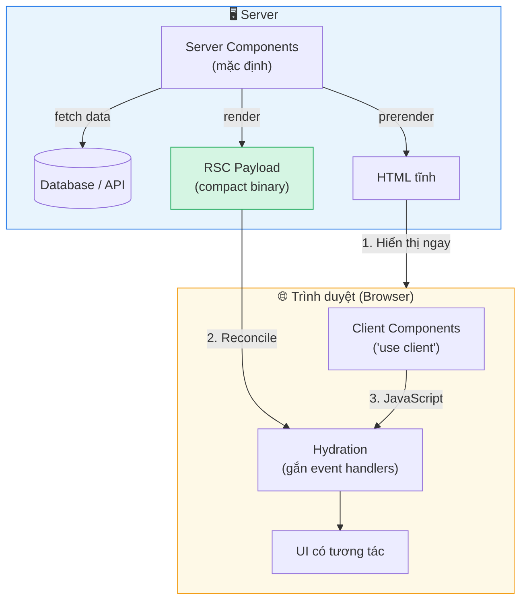
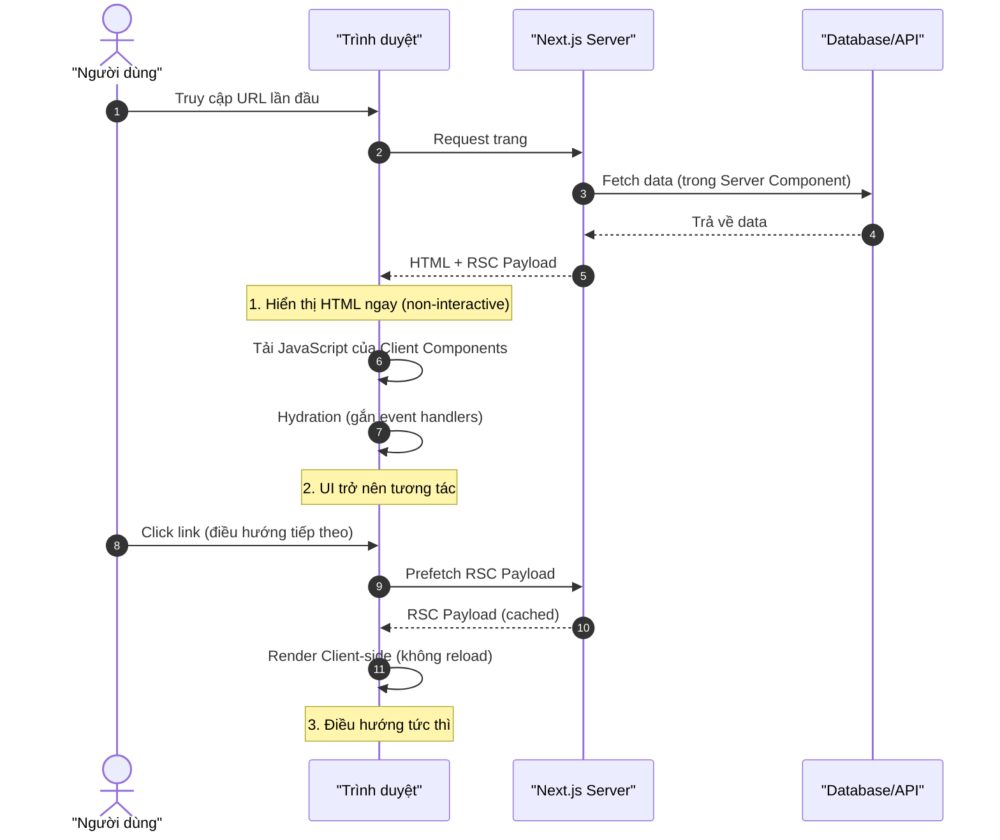
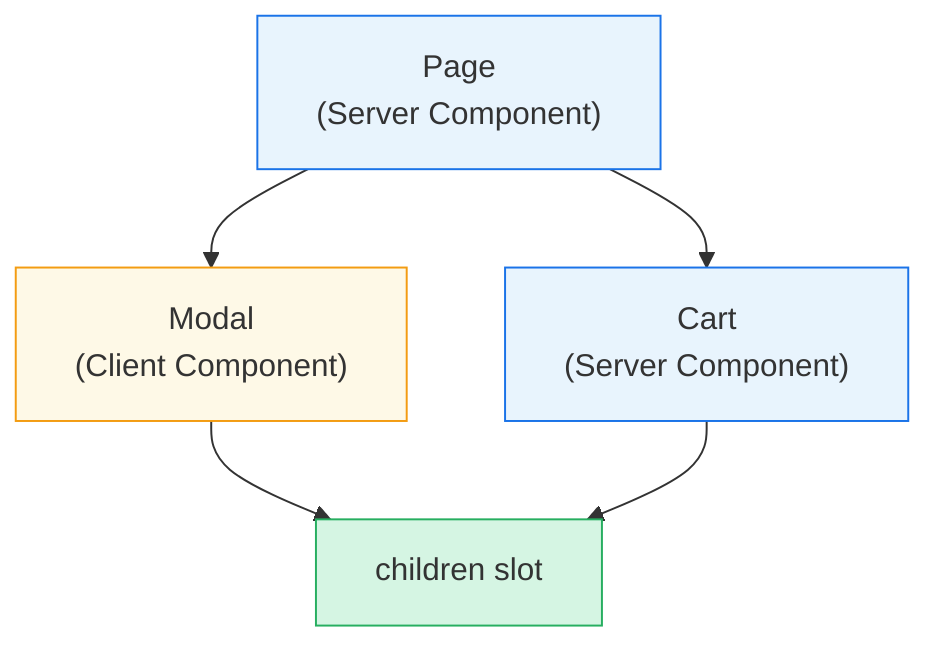
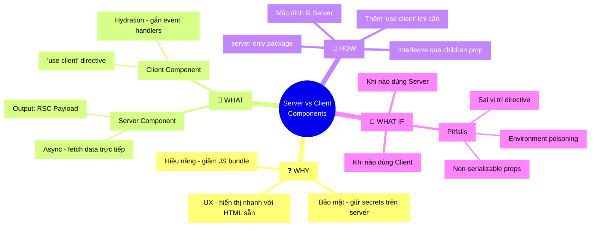

# Server và Client Components

## 📋 Agenda

**Thời gian đọc ước tính:** ~20 phút

### Sau bài này, bạn sẽ:

- ✅ **Giải thích** được tại sao Next.js App Router lại có hai loại component khác nhau
- ✅ **Phân biệt** được khi nào dùng Server Component và khi nào dùng Client Component
- ✅ **Hiểu** cơ chế RSC Payload, Hydration và quá trình render hai phía
- ✅ **Tự tay** kết hợp (interleave) Server và Client Components trong một ứng dụng thực tế
- ✅ **Tránh** được các lỗi phổ biến: environment poisoning, context không hoạt động trong Server Component

### Yêu cầu đầu vào (Prerequisites):

- 🔹 Biết cơ bản về React (component, props, useState)
- 🔹 Đã đọc bài [Routing trong Next.js](./04-routing.md)
- 🔹 Hiểu cơ bản về khái niệm SSR (Server-Side Rendering)

---

## ❓ WHY — Tại sao phải có hai loại component?

Bạn đã bao giờ gặp tình huống này chưa?

> *"Tôi cần lấy data từ database để hiển thị danh sách sản phẩm. Đồng thời, nút 'Thêm vào giỏ hàng' cần phản hồi ngay khi người dùng click."*

Nếu **mọi component đều chạy trên client (trình duyệt)**, bạn sẽ gặp vấn đề:

- 🔴 **Toàn bộ JavaScript** (kể cả logic lấy data) phải tải về trình duyệt → bundle to, trang chậm
- 🔴 **API keys, secrets** dễ bị lộ vì code chạy trên client
- 🔴 User phải đợi JavaScript tải xong mới thấy nội dung (blank screen)

Nếu **mọi component đều chạy trên server**, bạn cũng gặp giới hạn:

- 🔴 Không thể dùng `useState`, `useEffect`, sự kiện click
- 🔴 Không thể truy cập `localStorage`, `window`
- 🔴 UI trở nên tĩnh, không có tương tác

**Giải pháp của Next.js App Router (React Server Components):** Cho phép mỗi component "chọn nơi chạy" — server hoặc client — tùy theo nhiệm vụ của nó.

:::info Cập nhật từ React 19.2
React 19.2 (Oct 2025) giới thiệu thêm `<Activity />` giúp kiểm soát việc pre-render các phần ẩn của UI, và `cacheSignal` cho Server Components. Đây là bước tiến thêm trên nền tảng RSC mà bài này giới thiệu.
:::

---

## 📖 WHAT — Chúng là gì?

### Ẩn dụ: Bếp nhà hàng và bàn phục vụ

Hãy tưởng tượng một nhà hàng:

- **Bếp (Kitchen) = Server** 🍳: Chế biến món ăn, xử lý nguyên liệu thô (database, API), cần giữ bí mật công thức (API keys). Khách **không vào bếp** được.
- **Bàn phục vụ (Table) = Client** 🍽️: Khách hàng ngồi đây, tương tác trực tiếp (gọi thêm nước, chọn toppings), cần phản hồi ngay lập tức.

Một bữa ăn ngon (ứng dụng tốt) cần cả hai: **bếp chuẩn bị sẵn** rồi **bàn phục vụ tương tác**.

### Định nghĩa kỹ thuật

| | Server Component | Client Component |
|---|---|---|
| **Chạy ở đâu** | Trên server (khi build hoặc khi request) | Trên trình duyệt (client) |
| **Khai báo** | Mặc định (không cần thêm gì) | Thêm `'use client'` ở đầu file |
| **Có thể dùng** | `async/await`, database, secrets | `useState`, `useEffect`, Browser APIs |
| **Không thể dùng** | `useState`, event handlers, `window` | API keys bí mật (code lộ ra browser) |
| **Output** | RSC Payload (binary) | JavaScript bundle |

### Kiến trúc tổng thể



### RSC Payload là gì?

**RSC Payload** (React Server Component Payload) là định dạng dữ liệu nhị phân đặc biệt, chứa:

1. **Kết quả render** của các Server Components
2. **Placeholder** — nơi mà Client Components sẽ được render, kèm reference đến file JavaScript
3. **Props** được truyền từ Server Component sang Client Component

:::tip Tại sao không gửi HTML thô?
RSC Payload hiệu quả hơn HTML vì React biết chính xác cần update phần nào của DOM — không cần re-render toàn bộ trang khi navigate.
:::

### Hydration là gì?

**Hydration** là quá trình React "gắn" event handlers vào HTML tĩnh đã có sẵn, biến trang web từ tĩnh sang tương tác được.

```
HTML tĩnh (hiển thị ngay)
    +
JavaScript (tải sau)
    ↓
Hydration (React "thổi hồn")
    ↓
UI có tương tác (onClick, onChange hoạt động)
```

---

## 🔨 HOW — Làm thế nào để dùng?

### Quy trình render trong Next.js



### Bước 1: Server Component (mặc định)

Layouts và Pages trong App Router **mặc định là Server Components**. Bạn không cần làm gì thêm:

```typescript
// filename: app/posts/[id]/page.tsx

// ✅ Đây là Server Component — không cần 'use client'
// Lấy data trực tiếp từ DB, không cần fetch qua API route
import LikeButton from '@/app/ui/like-button'
import { getPost } from '@/lib/data'

export default async function Page({
  params,
}: {
  params: Promise<{ id: string }>
}) {
  const { id } = await params

  // Gọi async trực tiếp — chỉ Server Components mới làm được điều này
  const post = await getPost(id)

  return (
    <div>
      <main>
        <h1>{post.title}</h1>
        {/* LikeButton cần tương tác → Client Component */}
        <LikeButton likes={post.likes} />
      </main>
    </div>
  )
}
```

### Bước 2: Tạo Client Component

Thêm `'use client'` ở **đầu file**, trước tất cả import:

```typescript
// filename: app/ui/like-button.tsx

// ✅ Dòng này khai báo đây là Client Component
// Từ dòng này xuống, tất cả imports và child components đều là "client"
'use client'

import { useState } from 'react'

export default function LikeButton({ likes }: { likes: number }) {
  // useState chỉ dùng được trong Client Component
  const [count, setCount] = useState(likes)

  return (
    <div>
      <p>{count} likes</p>
      {/* onClick — event handler, chỉ hoạt động trên client */}
      <button onClick={() => setCount(count + 1)}>
        ❤️ Thích
      </button>
    </div>
  )
}
```

:::tip Một lần khai báo, áp dụng cho toàn bộ cây
Khi file được đánh dấu `'use client'`, **tất cả imports và child components** trong file đó đều tự động trở thành client. Bạn không cần thêm `'use client'` vào từng file con.
:::

### Bước 3: Thu nhỏ JS Bundle — chỉ dùng 'use client' khi cần

❌ **Sai — đánh dấu cả Layout là Client:**

```typescript
// filename: app/layout.tsx
'use client' // ← Không cần! Layout chủ yếu là static

import Search from './search'
import Logo from './logo'

// Bây giờ toàn bộ layout (kể cả Logo tĩnh) bị kéo vào client bundle!
export default function Layout({ children }) {
  return (
    <>
      <nav>
        <Logo />
        <Search />
      </nav>
      <main>{children}</main>
    </>
  )
}
```

✅ **Đúng — chỉ đánh dấu phần cần tương tác:**

```typescript
// filename: app/layout.tsx
// Layout là Server Component — không có 'use client'
import Search from './search' // Client Component
import Logo from './logo'     // Server Component

export default function Layout({ children }: { children: React.ReactNode }) {
  return (
    <>
      <nav>
        <Logo />   {/* Render on server, chỉ gửi HTML */}
        <Search /> {/* Chỉ phần này thêm vào JS bundle */}
      </nav>
      <main>{children}</main>
    </>
  )
}
```

```typescript
// filename: app/search.tsx
'use client' // ← Chỉ Search cần tương tác (ví dụ: debounce input)
export default function Search() {
  // ...
}
```

### Bước 4: Truyền data từ Server xuống Client

```typescript
// filename: app/ui/like-button.tsx
'use client'
export default function LikeButton({ likes }: { likes: number }) {
  // Nhận data qua props từ Server Component
  // ⚠️ Props phải "serializable" — không thể truyền Function, Date object, v.v.
}
```

Ngoài props, bạn cũng có thể **stream data** bằng [`use` API](https://react.dev/reference/react/use) — xem thêm trong bài Fetching Data.

### Bước 5: Interleaving — Kết hợp Server trong Client

**Vấn đề:** Client Component không thể import Server Component bên trong (vì Client bundle không biết về server):

```typescript
// ❌ KHÔNG LÀM VẬY — sẽ gây lỗi hoặc component bị chạy sai
'use client'
import ServerComponent from './server-component' // ← Bị kéo vào client bundle!
```

**Giải pháp:** Truyền Server Component qua `children` prop:

```typescript
// filename: app/ui/modal.tsx
'use client'
import { useState } from 'react'

export default function Modal({ children }: { children: React.ReactNode }) {
  const [isOpen, setIsOpen] = useState(false)
  return (
    <div>
      <button onClick={() => setIsOpen(!isOpen)}>Toggle</button>
      {/* children có thể là Server Component — React xử lý đúng */}
      {isOpen && <div>{children}</div>}
    </div>
  )
}
```

```typescript
// filename: app/page.tsx (Server Component)
import Modal from './ui/modal'
import Cart from './ui/cart' // Server Component lấy data từ DB

export default function Page() {
  return (
    // Modal (Client) bọc ngoài Cart (Server) — hoàn toàn hợp lệ!
    <Modal>
      <Cart />
    </Modal>
  )
}
```



### Bước 6: Context Provider trong Server Component

React Context **không hoạt động trong Server Components**. Đây là cách đúng để setup theme/auth provider:

```typescript
// filename: app/theme-provider.tsx
'use client' // ← Provider phải là Client Component

import { createContext, useContext } from 'react'

export const ThemeContext = createContext({})

export default function ThemeProvider({
  children,
}: {
  children: React.ReactNode
}) {
  // Wrap children, cho phép mọi Client Component con đều dùng được context
  return (
    <ThemeContext.Provider value="dark">
      {children}
    </ThemeContext.Provider>
  )
}
```

```typescript
// filename: app/layout.tsx (Server Component)
import ThemeProvider from './theme-provider'

export default function RootLayout({
  children,
}: {
  children: React.ReactNode
}) {
  return (
    <html>
      <body>
        {/* Đặt Provider càng sâu càng tốt — tránh bọc toàn bộ <html> */}
        <ThemeProvider>
          {children}
        </ThemeProvider>
      </body>
    </html>
  )
}
```

### Bước 7: Third-party Components không có 'use client'

Nhiều thư viện npm chưa thêm `'use client'` vào components của họ. Cách xử lý:

```typescript
// filename: app/ui/carousel.tsx

// ✅ Tạo wrapper Client Component để bọc third-party component
'use client'

// acme-carousel dùng useState bên trong nhưng không có 'use client'
// → Phải wrap trong Client Component của mình
import { Carousel } from 'acme-carousel'

// Re-export với 'use client' được đặt đúng chỗ
export default Carousel
```

```typescript
// filename: app/page.tsx (Server Component)
// Giờ có thể dùng bình thường vì đã wrap
import Carousel from './ui/carousel'

export default function Page() {
  return (
    <div>
      <p>Xem ảnh sản phẩm</p>
      <Carousel /> {/* ✅ Hoạt động vì đã được wrap */}
    </div>
  )
}
```

---

## 🚀 WHAT IF — Khi nào dùng, khi nào không?

### Bảng quyết định nhanh

| Bạn cần... | Dùng loại nào? | Lý do |
|---|---|---|
| Lấy data từ database | ✅ Server Component | Không lộ DB credentials |
| `useState`, `useReducer` | ✅ Client Component | Chỉ hoạt động trên browser |
| `useEffect`, lifecycle | ✅ Client Component | Side effects cần browser |
| `onClick`, `onChange` | ✅ Client Component | Event handlers cần DOM |
| `localStorage`, `window` | ✅ Client Component | Browser-only API |
| Dùng API keys bí mật | ✅ Server Component | Không bao giờ lộ ra client |
| SEO-critical content | ✅ Server Component | HTML được render sẵn |
| Real-time updates (WebSocket) | ✅ Client Component | Cần kết nối duy trì |
| Phần UI hoàn toàn tĩnh | ✅ Server Component | Giảm JS bundle |

### ⚠️ Pitfalls hay gặp

#### Pitfall 1: Environment Poisoning — Leak secrets lên client

```typescript
// filename: lib/data.ts
// ❌ Nguy hiểm: getData() có thể bị import vào Client Component
export async function getData() {
  const res = await fetch('https://api.example.com/data', {
    headers: {
      // API_KEY sẽ bị thay thành chuỗi rỗng "" khi chạy trên client
      // nhưng logic fetch vẫn bị lộ ra!
      authorization: process.env.API_KEY,
    },
  })
  return res.json()
}
```

✅ **Giải pháp: Dùng package `server-only`**

```bash
npm install server-only
```

```typescript
// filename: lib/data.ts
// Dòng này tạo lỗi BUILD-TIME nếu ai đó import file này vào Client Component
import 'server-only'

export async function getData() {
  const res = await fetch('https://api.example.com/data', {
    headers: {
      authorization: process.env.API_KEY, // ✅ Chỉ chạy trên server
    },
  })
  return res.json()
}
```

Tương tự, dùng `client-only` để đánh dấu code chỉ dành cho browser:

```typescript
// filename: lib/browser-utils.ts
import 'client-only' // ← Lỗi build nếu import vào Server Component

export function getScrollPosition() {
  return window.scrollY // Chỉ có trên browser
}
```

#### Pitfall 2: Truyền non-serializable props

```typescript
// ❌ Sai — Function không thể serialize
<ClientComponent onClick={() => console.log('click')} />

// ❌ Sai — Date object không thể serialize
<ClientComponent date={new Date()} />

// ✅ Đúng — Truyền string/number/plain object
<ClientComponent dateString={new Date().toISOString()} />
```

#### Pitfall 3: Đặt 'use client' sai chỗ

```typescript
// ❌ Sai — 'use client' phải ở TRÊN CÙNG, trước tất cả import
import { useState } from 'react'
'use client' // ← Không có tác dụng khi đặt đây!

// ✅ Đúng — Dòng đầu tiên của file
'use client'
import { useState } from 'react'
```

#### Pitfall 4: Nhầm lẫn 'use client' và 'use server'

| Directive | Dùng khi nào |
|---|---|
| `'use client'` | Đánh dấu file/component chạy trên browser |
| `'use server'` | Đánh dấu **Server Action** (function chạy trên server, được gọi từ client) |

---

## 🧠 Tổng kết — MECE Mindmap



---

## 📚 Tài nguyên

- [Next.js Docs: Server and Client Components](https://nextjs.org/docs/app/getting-started/server-and-client-components)
- [React Docs: Server Components](https://react.dev/reference/rsc/server-components)
- [React 19.2 Release Notes](https://react.dev/blog/2025/10/01/react-19-2) — `<Activity />`, `cacheSignal`
- [npm: server-only](https://www.npmjs.com/package/server-only)
- [npm: client-only](https://www.npmjs.com/package/client-only)

---

*Made by Anh Tu - Share to be share*
