# Các Phương Pháp Rendering trong Next.js

## 📋 Agenda

**Thời gian đọc ước tính:** ~25 phút

### Sau bài này, bạn sẽ:

- ✅ **Phân biệt** được 5 chiến lược rendering khác nhau trong Next.js App Router
- ✅ **Hiểu** cơ chế hoạt động của Static vs Dynamic Rendering, Streaming, ISR, và PPR
- ✅ **Tự quyết định** được khi nào dùng phương pháp nào cho từng loại trang
- ✅ **Triển khai** được ISR, Streaming với Suspense, và kích hoạt PPR trong dự án thực tế
- ✅ **Tránh** các lỗi phổ biến khi cấu hình sai chiến lược rendering

### Yêu cầu đầu vào (Prerequisites):

- 🔹 Đã đọc bài [Server và Client Components](./07-server-and-client-components.md)
- 🔹 Hiểu khái niệm RSC Payload, Hydration
- 🔹 Biết cơ bản về HTTP request/response và caching

---

## ❓ WHY — Tại sao cần nhiều phương pháp rendering?

**Vấn đề (Problem Statement):**

Không có một chiến lược rendering nào phù hợp cho mọi loại trang:

- 🔴 Trang **giới thiệu sản phẩm** (nội dung ít thay đổi): Nếu render mỗi request sẽ lãng phí tài nguyên server hoàn toàn không cần thiết.
- 🔴 Trang **bảng tin thời sự** (cập nhật liên tục): Nếu dùng nội dung tĩnh build sẵn từ hôm qua, người dùng sẽ thấy thông tin cũ.
- 🔴 Trang **giỏ hàng, hồ sơ cá nhân** (phụ thuộc user): Không thể cache chung — mỗi user cần dữ liệu riêng.
- 🔴 Trang **dashboard với 20 widget** (dữ liệu nặng): Nếu chờ tất cả data xong mới render → người dùng nhìn màn hình trắng quá lâu.

**Giải pháp (Solution):**

Next.js cung cấp **5 phương pháp rendering** với đặc tính khác nhau, cho phép chọn đúng công cụ cho đúng bài toán:

| Phương pháp | Render khi nào | Cache | Phù hợp |
|---|---|---|---|
| **Static** (SSG) | Lúc build | Mãi mãi | Trang tĩnh, blog, docs |
| **Dynamic** (SSR) | Mỗi request | Không | Trang cá nhân hóa |
| **CSR** | Trên browser | Session | UI tương tác |
| **Streaming** | Từng phần theo request | Một phần | Dashboard, trang phức tạp |
| **ISR** | Build + tái tạo định kỳ | Có giới hạn | Blog, catalog sản phẩm |
| **PPR** | Tĩnh + Dynamic trộn lẫn | Hybrid | Mọi loại trang |

---

## 📖 WHAT — Chúng là gì?

### Bức tranh toàn cảnh

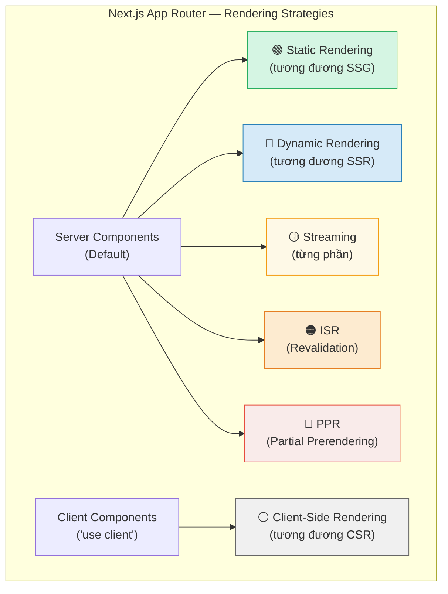

---

## 1️⃣ Static Rendering (Tương đương SSG)

### Định nghĩa

**Static Rendering** là chiến lược render trang tại **thời điểm build** (`npm run build`), tạo ra file HTML tĩnh được phục vụ từ CDN cho mọi request về sau. Đây là **chế độ mặc định** của Server Components khi không có Dynamic Functions.

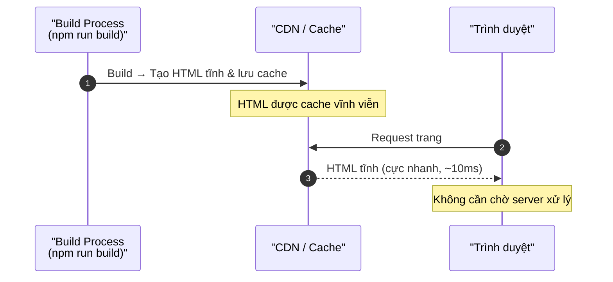

**Đặc điểm:**
- ⚡ **Nhanh nhất** — HTML có sẵn, không cần DB query lúc runtime
- 💰 **Chi phí thấp** — Server không làm việc gì khi có request
- 🌍 **CDN-able** — Có thể deploy lên Cloudflare, Vercel Edge, AWS CloudFront
- 📊 **SEO hoàn hảo** — Bot Google đọc được HTML đầy đủ ngay lần đầu

---

## 2️⃣ Dynamic Rendering (Tương đương SSR)

### Định nghĩa

**Dynamic Rendering** là chiến lược render trang **tại thời điểm có request từ người dùng**, cho phép phản hồi với dữ liệu cá nhân hóa (cookies, headers, query params). Next.js tự động chuyển sang Dynamic Rendering khi phát hiện Dynamic Functions.

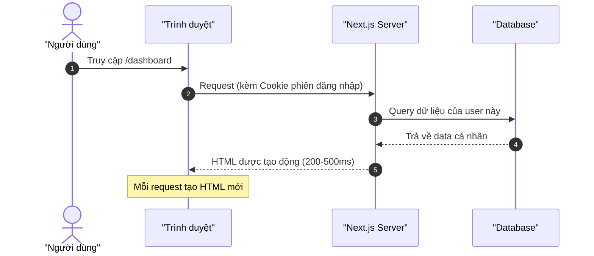

**Đặc điểm:**
- 🔑 **Cá nhân hóa** — Có thể đọc cookies, headers để render đúng với từng user
- 🔄 **Luôn mới** — Data không bao giờ stale, phù hợp real-time
- ⚠️ **Chậm hơn Static** — Server phải xử lý mỗi request
- 💸 **Tốn tài nguyên** — Mỗi request tốn CPU và memory của server

**Cách kích hoạt Dynamic Rendering:**

```typescript
// filename: app/dashboard/page.tsx

// ✅ Cách 1: Dùng cookies() — Next.js tự động chuyển sang Dynamic
import { cookies } from 'next/headers'

export default async function DashboardPage() {
  // Đọc cookie → kích hoạt Dynamic Rendering tự động
  const cookieStore = await cookies()
  const userId = cookieStore.get('user-id')?.value

  const data = await fetchUserData(userId)
  return <div>{data.name}</div>
}
```

```typescript
// filename: app/search/page.tsx

// ✅ Cách 2: Dùng searchParams — Next.js tự động chuyển sang Dynamic
export default async function SearchPage({
  searchParams,
}: {
  searchParams: Promise<{ q: string }>
}) {
  // Đọc query param → kích hoạt Dynamic Rendering
  const { q } = await searchParams
  const results = await searchDB(q)
  return <div>{results.map(r => <p key={r.id}>{r.title}</p>)}</div>
}
```

```typescript
// filename: app/prices/page.tsx

// ✅ Cách 3: Tường minh opt-out cache
import { unstable_noStore as noStore } from 'next/cache'

export default async function PricesPage() {
  // Khai báo rõ: không cache, luôn fetch mới
  noStore()

  const prices = await fetchLivePrices()
  return <div>{prices.btc}</div>
}
```

Next.js tự động chọn Static Rendering **khi không phát hiện Dynamic Signals** trong route:

| Dynamic Signal | Ý nghĩa |
|---|---|
| `cookies()`, `headers()` | Dữ liệu phụ thuộc request |
| `searchParams` prop | Query string thay đổi mỗi request |
| `fetch()` không có cache | Dữ liệu luôn mới |
| `noStore()` từ `unstable_noStore` | Opt-out cache tường minh |

---

## 3️⃣ Client Components — CSR (Client-Side Rendering)

### Định nghĩa

**Client-Side Rendering (CSR)** là chiến lược render UI **hoàn toàn trên trình duyệt** bằng JavaScript. Trong Next.js App Router, CSR được thực hiện thông qua **Client Components** (`'use client'`).

> 💡 **Lưu ý quan trọng:** Khác với CSR thuần túy (Next.js Pages Router với `getStaticProps` bỏ qua), Client Components trong App Router vẫn được **prerender thành HTML tĩnh trên server** trước, sau đó **Hydrate** trên client. Đây là điểm khác biệt lớn nhất.

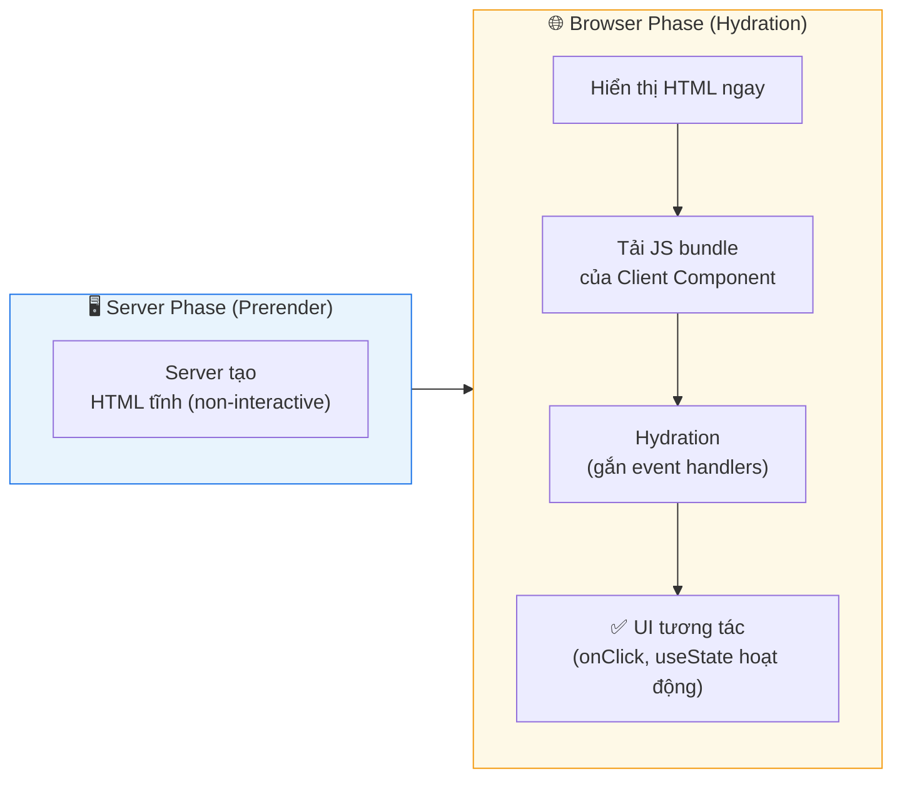

**Khi nào PHẢI dùng Client Component (CSR):**

| Tình huống | Lý do |
|---|---|
| `useState`, `useReducer`, `useEffect` | Chỉ hoạt động trong browser |
| Event handlers: `onClick`, `onChange` | Cần DOM API |
| `localStorage`, `sessionStorage`, `window` | Browser-only API |
| Real-time updates (WebSocket, SSE) | Cần kết nối duy trì |
| Third-party UI components (modal, tooltip) | Thường cần browser |

```typescript
// filename: app/ui/shopping-cart.tsx
'use client'

// useState — khai báo state cho số lượng sản phẩm trong giỏ hàng
import { useState } from 'react'

interface CartProps {
  initialCount: number // Dữ liệu ban đầu được truyền từ Server Component (serializable)
}

export default function ShoppingCart({ initialCount }: CartProps) {
  // useState chỉ hoạt động khi 'use client' được khai báo
  const [count, setCount] = useState(initialCount)

  return (
    <div>
      <span>🛒 {count} sản phẩm</span>
      {/* onClick — event handler, cần browser environment */}
      <button onClick={() => setCount(count + 1)}>Thêm</button>
      <button onClick={() => setCount(Math.max(0, count - 1))}>Bớt</button>
    </div>
  )
}
```

---

## 4️⃣ Streaming

### Định nghĩa

**Streaming** là kỹ thuật server gửi **từng phần nhỏ của HTML xuống trình duyệt ngay khi phần đó sẵn sàng**, thay vì chờ toàn bộ trang render xong mới gửi. Trong Next.js, Streaming được triển khai qua `<Suspense>` boundaries của React.

**Vấn đề Streaming giải quyết:**

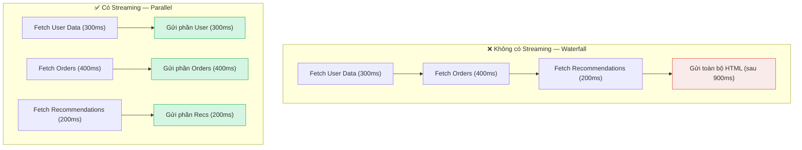

**Cơ chế hoạt động:**

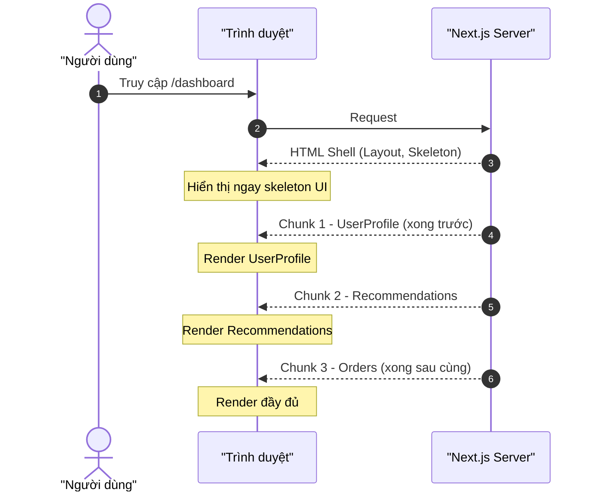

**Cách triển khai với `<Suspense>`:**

```typescript
// filename: app/dashboard/page.tsx
// Loading skeleton hiển thị ngay → từng phần load sau

import { Suspense } from 'react'
import UserProfile from '@/components/UserProfile'
import OrderList from '@/components/OrderList'
import Recommendations from '@/components/Recommendations'

// Skeleton hiển thị trong khi phần tương ứng đang fetch
function ProfileSkeleton() {
  return <div className="skeleton h-20 w-full animate-pulse rounded" />
}

export default function DashboardPage() {
  return (
    <div className="dashboard-grid">
      {/* Suspense boundary: fallback hiện khi UserProfile đang fetch */}
      <Suspense fallback={<ProfileSkeleton />}>
        <UserProfile />  {/* async Server Component — fetch DB độc lập */}
      </Suspense>

      {/* Mỗi Suspense có fallback riêng → stream song song */}
      <Suspense fallback={<div>Đang tải đơn hàng...</div>}>
        <OrderList />
      </Suspense>

      <Suspense fallback={<div>Đang tải gợi ý...</div>}>
        <Recommendations />
      </Suspense>
    </div>
  )
}
```

```typescript
// filename: app/components/UserProfile.tsx
// async Server Component — tự động được stream khi data sẵn sàng

export default async function UserProfile() {
  // Fetch chạy song song với các Suspense boundary khác
  const user = await fetchCurrentUser() // giả sử mất 300ms

  return (
    <div>
      
      <h2>{user.name}</h2>
    </div>
  )
}
```

**Tận dụng `loading.tsx` để stream toàn trang:**

```
app/
├── dashboard/
│   ├── page.tsx       ← Nội dung chính
│   └── loading.tsx    ← Skeleton tự động được wrap trong Suspense
```

```typescript
// filename: app/dashboard/loading.tsx
// Next.js tự động wrap page.tsx trong <Suspense fallback={<Loading />}>

export default function Loading() {
  return (
    <div className="loading-skeleton">
      <div className="skeleton h-8 w-48" />
      <div className="skeleton h-64 w-full mt-4" />
    </div>
  )
}
```

---

## 5️⃣ Incremental Static Regeneration (ISR)

### Định nghĩa

**ISR** là phương pháp cho phép **tái tạo (regenerate) các trang tĩnh sau một khoảng thời gian nhất định** mà không cần build lại toàn bộ site. Next.js sẽ phục vụ trang cũ (stale) trong khi trang mới đang được tạo ở background — chiến lược **Stale-While-Revalidate (SWR)**.

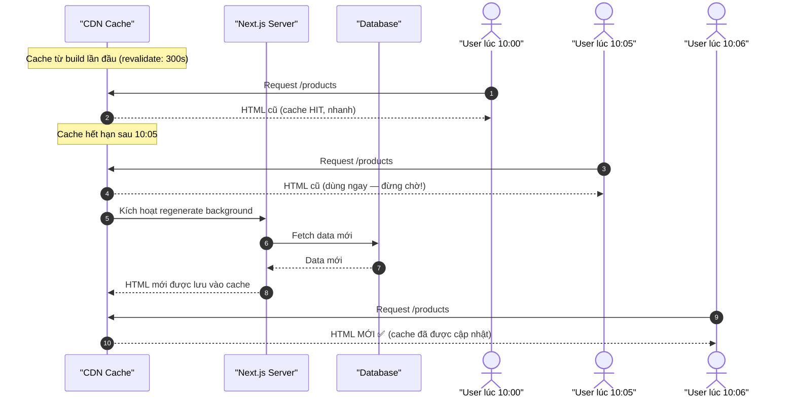

**Đây chính là cơ chế Stale-While-Revalidate:**
- User2 nhận được bản cũ **ngay lập tức** (không chờ) → UX tốt
- Đồng thời server âm thầm tạo bản mới → User3 nhận được bản mới

**Cách triển khai ISR:**

```typescript
// filename: app/products/page.tsx

// ✅ Cách 1: Cấu hình revalidate toàn trang
// Trang sẽ được tái tạo tối đa mỗi 5 phút (300 giây)
export const revalidate = 300

export default async function ProductsPage() {
  const products = await fetch('https://api.example.com/products', {
    // next.revalidate trên fetch level — linh hoạt hơn page-level
    next: { revalidate: 300 }
  }).then(r => r.json())

  return (
    <ul>
      {products.map((p: { id: string; name: string }) => (
        <li key={p.id}>{p.name}</li>
      ))}
    </ul>
  )
}
```

```typescript
// filename: app/blog/[slug]/page.tsx

// ✅ ISR kết hợp với Dynamic Routes
export const revalidate = 3600 // Tái tạo mỗi 1 giờ

// generateStaticParams: Pre-build các slug phổ biến lúc build time
export async function generateStaticParams() {
  const posts = await fetch('https://api.example.com/posts').then(r => r.json())

  // Chỉ pre-build 100 bài mới nhất; các bài khác sẽ render lần đầu on-demand
  return posts.slice(0, 100).map((post: { slug: string }) => ({
    slug: post.slug,
  }))
}

export default async function BlogPost({
  params,
}: {
  params: Promise<{ slug: string }>
}) {
  const { slug } = await params
  const post = await fetch(`https://api.example.com/posts/${slug}`, {
    next: { revalidate: 3600 }
  }).then(r => r.json())

  return <article>{post.content}</article>
}
```

**On-demand Revalidation — Tái tạo ngay khi cần:**

```typescript
// filename: app/api/revalidate/route.ts
// Webhook endpoint: CMS gọi khi có bài viết mới

import { revalidatePath, revalidateTag } from 'next/cache'
import { NextRequest } from 'next/server'

export async function POST(request: NextRequest) {
  const { slug, secret } = await request.json()

  // Bảo vệ endpoint bằng secret token
  if (secret !== process.env.REVALIDATION_SECRET) {
    return Response.json({ error: 'Unauthorized' }, { status: 401 })
  }

  // Tái tạo theo path cụ thể
  revalidatePath(`/blog/${slug}`)

  // Hoặc tái tạo theo tag (nhóm nhiều pages lại)
  // revalidateTag('blog-posts')

  return Response.json({ revalidated: true })
}
```

```typescript
// filename: lib/data.ts
// Gắn tag vào fetch để revalidateTag hoạt động được

export async function getPost(slug: string) {
  const res = await fetch(`https://api.example.com/posts/${slug}`, {
    // Tag này cho phép revalidateTag('blog-posts') invalidate tất cả posts cùng lúc
    next: { tags: ['blog-posts', `post-${slug}`] }
  })
  return res.json()
}
```

---

## 6️⃣ Partial Prerendering (PPR)

### Định nghĩa

**Partial Prerendering (PPR)** là chiến lược rendering **lai (hybrid)** của Next.js, cho phép **phần tĩnh của trang được prerender lúc build** và **phần động được stream vào sau** — tất cả trong cùng một HTTP response. PPR là tương lai của rendering trong Next.js, hiện đang ở giai đoạn experimental/incremental.

> 💡 **Bối cảnh ra đời:** Trước PPR, bạn phải chọn: TOÀN BỘ trang là Static hoặc TOÀN BỘ là Dynamic. PPR phá bỏ giới hạn này — một trang có thể vừa Static vừa Dynamic.

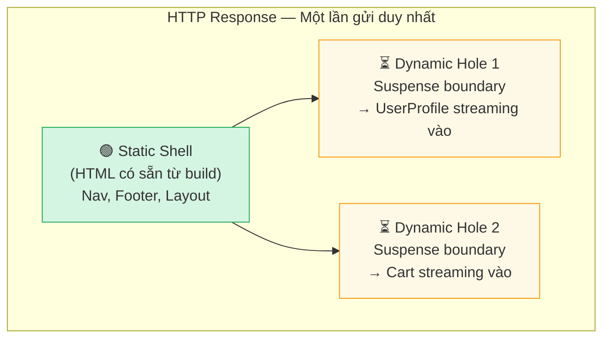

**So sánh trước và sau PPR:**

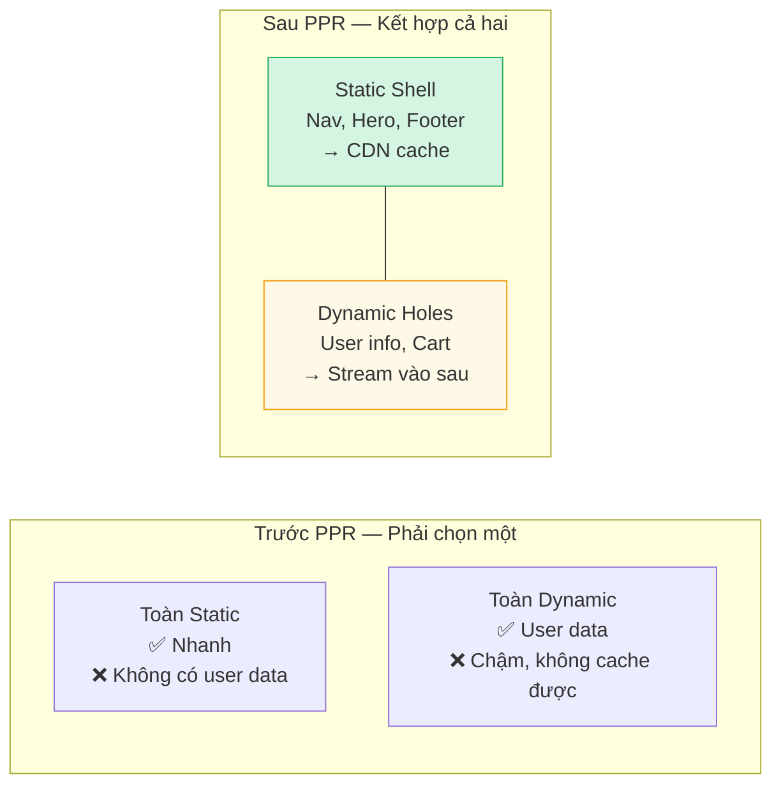

**Cách kích hoạt PPR:**

```javascript
// filename: next.config.js

/** @type {import('next').NextConfig} */
const nextConfig = {
  experimental: {
    // Incremental PPR: chỉ bật cho những route opt-in
    ppr: 'incremental',
  },
}

module.exports = nextConfig
```

```typescript
// filename: app/storefront/page.tsx

// Khai báo opt-in PPR cho route này
export const experimental_ppr = true

import { Suspense } from 'react'
import StaticHero from '@/components/StaticHero'        // Static — prerendered
import UserGreeting from '@/components/UserGreeting'    // Dynamic — cần cookies
import CartBadge from '@/components/CartBadge'          // Dynamic — cần session

export default function StorefrontPage() {
  return (
    <div>
      {/* ✅ Static — prerender lúc build, phục vụ từ CDN ngay lập tức */}
      <StaticHero />

      {/* ✅ Dynamic Hole — Suspense báo cho PPR biết đây là "lỗ hổng động" */}
      <Suspense fallback={<div>Xin chào...</div>}>
        {/* UserGreeting đọc cookie → tự động Dynamic */}
        <UserGreeting />
      </Suspense>

      {/* ✅ Dynamic Hole khác */}
      <Suspense fallback={<div>🛒 ...</div>}>
        <CartBadge />
      </Suspense>
    </div>
  )
}
```

```typescript
// filename: app/components/UserGreeting.tsx
import { cookies } from 'next/headers'

export default async function UserGreeting() {
  // cookies() → kích hoạt Dynamic Rendering cho component này
  // PPR sẽ "đào" một lỗ hổng tại vị trí Suspense bao quanh, và stream vào sau
  const cookieStore = await cookies()
  const userId = cookieStore.get('user-id')?.value

  if (!userId) return <p>Xin chào, khách!</p>

  const user = await fetchUser(userId)
  return <p>Xin chào, {user.name}! 👋</p>
}
```

**Luồng hoạt động PPR:**

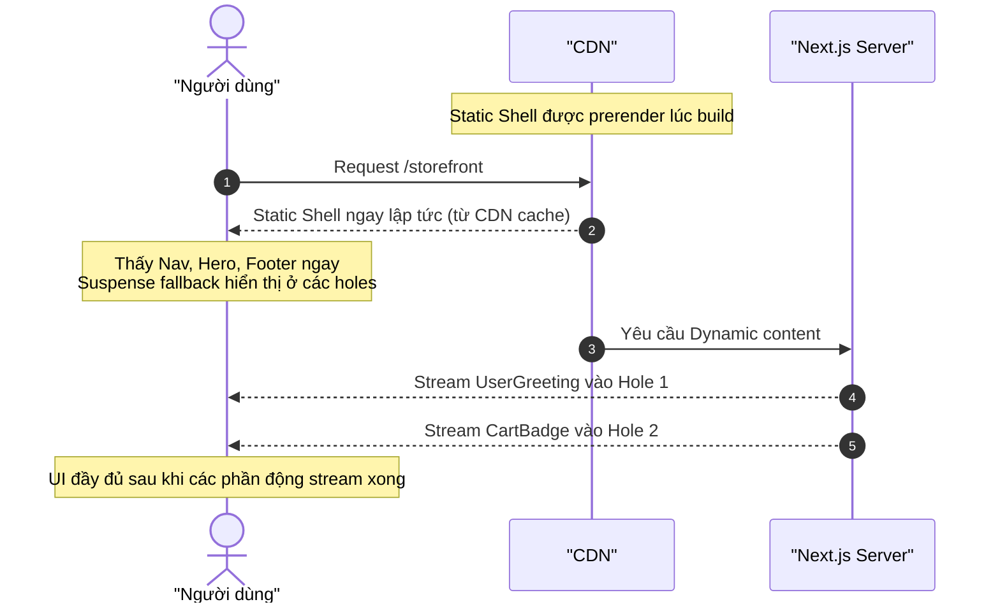

---

## 🔨 HOW — So sánh kỹ thuật và khi nào dùng gì

### Bảng so sánh toàn diện

| | Static | Dynamic | CSR | Streaming | ISR | PPR |
|---|---|---|---|---|---|---|
| **Render khi nào** | Build time | Mỗi request | Browser | Từng chunk | Build + định kỳ | Build + Stream |
| **Thời gian đầu tiên** | ⚡ Nhanh nhất | 🐢 Chậm nhất | 🐢 Chậm (JS load) | 🟨 Trung bình | ⚡ Nhanh | ⚡ Nhanh |
| **Dữ liệu có mới không** | ❌ Từ build | ✅ Luôn mới | ✅ Luôn mới | ✅ Luôn mới | 🟨 Định kỳ | 🟨 Hybrid |
| **Cá nhân hóa** | ❌ Không | ✅ Có | ✅ Có | ✅ Có | ❌ Không | ✅ Có (holes) |
| **SEO** | ✅ Hoàn hảo | ✅ Tốt | ❌ Kém | ✅ Tốt | ✅ Tốt | ✅ Tốt |
| **Cache được** | ✅ Mãi mãi | ❌ Không | ❌ Không | 🟨 Một phần | ✅ Có giới hạn | ✅ Shell |
| **Chi phí server** | 💰 Thấp nhất | 💸 Cao nhất | 💰 Thấp | 🟨 Trung bình | 💰 Thấp | 🟨 Trung bình |

### Quyết định nhanh — Trang của bạn thuộc loại nào?

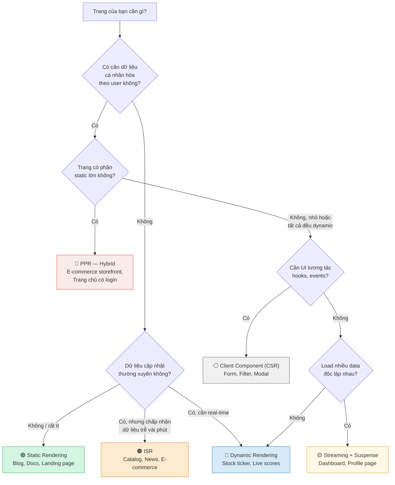

---

## 🚀 WHAT IF — Khi nào dùng, khi nào không?

### ✅ Nên dùng vs ❌ Không nên dùng

**🟢 Static Rendering:**

| ✅ Nên dùng | ❌ Không nên dùng |
|---|---|
| Blog, tài liệu, landing page | Trang có user-specific data |
| Marketing pages, portfolio | Real-time data (giá cổ phiếu...) |
| Trang ít thay đổi (policy, FAQ) | Data cập nhật &gt; vài lần/ngày |

**🔵 Dynamic Rendering:**

| ✅ Nên dùng | ❌ Không nên dùng |
|---|---|
| Dashboard cá nhân, hồ sơ | Trang tĩnh (lãng phí server) |
| Giỏ hàng, checkout | Trang mà data ít thay đổi → dùng ISR |
| Admin panel | Site có traffic cao (cân nhắc PPR thay thế) |

**🟠 ISR:**

| ✅ Nên dùng | ❌ Không nên dùng |
|---|---|
| Catalog sản phẩm, tin tức | Data cần real-time tuyệt đối |
| Blog nhiều bài, trang có traffic cao | Trang với data cá nhân hóa |
| E-commerce product pages | Data thay đổi rất nhanh (&lt;30s) |

**🟡 Streaming:**

| ✅ Nên dùng | ❌ Không nên dùng |
|---|---|
| Dashboard với nhiều widget độc lập | Trang đơn giản ít data |
| Profile page với data từ nhiều nguồn | Trang có data phụ thuộc nhau (waterfall cố ý) |
| Bất kỳ trang nào có slow fetch | Trang không có nhiều async component |

**🔴 PPR:**

| ✅ Nên dùng | ❌ Không nên dùng |
|---|---|
| E-commerce storefront | App không cần SEO (internal tools) |
| Trang chủ có nav động | Dự án không dùng Next.js mới nhất |
| Bất kỳ trang nào có cả static + dynamic | Đang trong production (vẫn experimental) |

### ⚠️ Pitfalls hay gặp

#### Pitfall 1: Dynamic Function trong Static Route làm trang bị chậm bất ngờ

```typescript
// ❌ Sai — cookies() sẽ chuyển TOÀN BỘ trang sang Dynamic
// Kể cả phần nav và footer tĩnh cũng sẽ bị render lại mỗi request
export default async function ProductPage() {
  const cookieStore = await cookies() // ← Opt-in Dynamic cả trang!
  const lang = cookieStore.get('lang')?.value ?? 'vi'

  const products = await fetchProducts() // Tốn thêm 500ms mỗi request

  return <div>{/* ... */}</div>
}
```

```typescript
// ✅ Đúng — Tách phần dynamic ra Client Component hoặc dùng PPR
// Phần static (products list) vẫn được cache, chỉ phần lang là dynamic

export default async function ProductPage() {
  // Không đọc cookies ở đây → trang vẫn Static
  const products = await fetchProducts()

  return (
    <div>
      {/* Client Component nhỏ đọc cookie ở browser */}
      <LanguageSwitcher />
      <ProductList products={products} />
    </div>
  )
}
```

#### Pitfall 2: Quên `export const revalidate` trong ISR làm trang không bao giờ cập nhật

```typescript
// ❌ Sai — không có revalidate → Static Rendering, cache mãi mãi
export default async function NewsPage() {
  const news = await fetchLatestNews() // Data từ build time, không bao giờ mới!
  return <div>{news.map(n => <p key={n.id}>{n.title}</p>)}</div>
}

// ✅ Đúng — thêm revalidate để ISR hoạt động
export const revalidate = 60 // Tái tạo mỗi 1 phút

export default async function NewsPage() {
  const news = await fetchLatestNews()
  return <div>{news.map(n => <p key={n.id}>{n.title}</p>)}</div>
}
```

#### Pitfall 3: Không có Suspense fallback khi dùng Streaming — UX xấu

```typescript
// ❌ Sai — không có fallback → trang trắng khi data đang load
import { Suspense } from 'react'

export default function Dashboard() {
  return (
    <Suspense> {/* ← Thiếu fallback! Người dùng thấy gì? Trắng! */}
      <SlowWidget />
    </Suspense>
  )
}

// ✅ Đúng — luôn có fallback có ý nghĩa
export default function Dashboard() {
  return (
    <Suspense fallback={<WidgetSkeleton />}> {/* ← Skeleton meaningful */}
      <SlowWidget />
    </Suspense>
  )
}
```

#### Pitfall 4: Dùng ISR cho data cần real-time — user thấy data cũ

```typescript
// ❌ Sai cho use-case này
// Trang giá cổ phiếu với revalidate 60 giây → giá sẽ lệch 1 phút!
export const revalidate = 60

export default async function StockPage() {
  const price = await fetchStockPrice('VIC') // Lệnh này có thể trả về giá cũ 60s
  return <div>{price}</div>
}

// ✅ Đúng — dùng Dynamic Rendering + Client-side polling
export default async function StockPage() {
  // Render server-side lần đầu với data mới nhất
  const initialPrice = await fetchStockPrice('VIC')
  return (
    // Client Component tự polling mỗi 5 giây
    <StockTicker symbol="VIC" initialPrice={initialPrice} />
  )
}
```

---

## 🧠 Tổng kết — MECE Mindmap

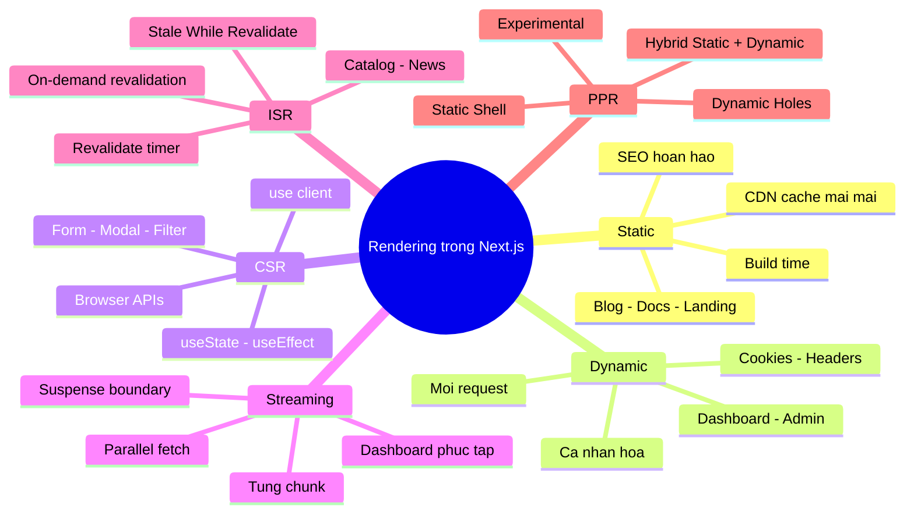

---

## 📚 Tài nguyên

- [Next.js Docs: Rendering Overview](https://nextjs.org/docs/app/building-your-application/rendering)
- [Next.js Docs: Static Rendering](https://nextjs.org/docs/app/building-your-application/rendering/server-components#static-rendering-default)
- [Next.js Docs: Dynamic Rendering](https://nextjs.org/docs/app/building-your-application/rendering/server-components#dynamic-rendering)
- [Next.js Docs: Streaming with Suspense](https://nextjs.org/docs/app/building-your-application/routing/loading-ui-and-streaming)
- [Next.js Docs: ISR — Revalidating Data](https://nextjs.org/docs/app/building-your-application/data-fetching/incremental-static-regeneration)
- [Next.js Docs: Partial Prerendering](https://nextjs.org/docs/app/building-your-application/rendering/partial-prerendering)
- [React Docs: Suspense](https://react.dev/reference/react/Suspense)

---

*Made by Anh Tu - Share to be share*
