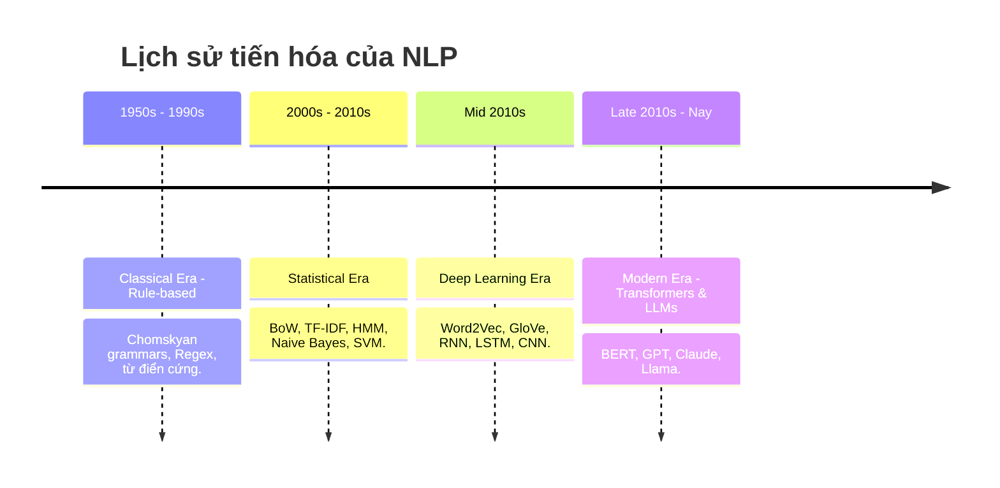
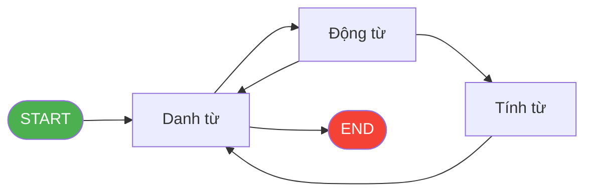
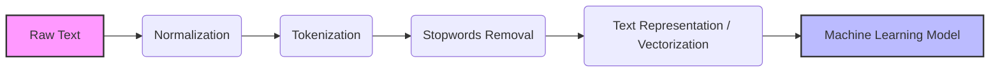

# Bài 1: NLP Fundamentals - Nền Tảng Xử Lý Ngôn Ngữ Tự Nhiên

Chào mừng bạn đến với **Module 1** trong chuỗi bài giảng về **NLP (Natural Language Processing)**. 

Trong thời đại mà dữ liệu văn bản (text data) bùng nổ, từ các bài đăng trên mạng xã hội, đánh giá sản phẩm, cho đến hàng triệu trang tài liệu y khoa và pháp lý, làm sao để máy tính có thể "đọc hiểu" và "giao tiếp" bằng ngôn ngữ của con người? Đó chính là lúc NLP xuất hiện.

Trong bài học đầu tiên này, chúng ta sẽ cùng giải phẫu NLP từ gốc rễ, tìm hiểu nguyên lý hoạt động và tự tay xây dựng một pipeline xử lý ngôn ngữ tự nhiên cơ bản.

---

## 1. NLP là gì? (Definition Anatomy)

> **Định nghĩa chuẩn:** 
> Natural Language Processing (Xử lý ngôn ngữ tự nhiên) là một nhánh của Trí tuệ nhân tạo (AI) và Ngôn ngữ học máy tính (Computational Linguistics), tập trung vào việc tạo ra các hệ thống có khả năng **hiểu (understand)**, **phân tích (analyze)**, và **sinh ra (generate)** ngôn ngữ của con người một cách tự nhiên và có ý nghĩa.

Hãy cùng **"giải phẫu"** định nghĩa này:
*   **Hiểu (Understand):** Máy tính không chỉ nhìn thấy một chuỗi các ký tự (A, B, C...) mà nó nắm bắt được ý nghĩa, cảm xúc (sentiment) hay ý định (intent) đằng sau chuỗi ký tự đó. (Ví dụ: Biết được câu "Tôi ghét sản phẩm này" là một đánh giá tiêu cực).
*   **Phân tích (Analyze):** Bóc tách cấu trúc ngữ pháp, xác định chủ ngữ, vị ngữ, hoặc trích xuất các thông tin quan trọng như tên người, địa điểm (Named Entity Recognition).
*   **Sinh ra (Generate):** Khả năng phản hồi lại con người bằng một đoạn văn bản mới mạch lạc và đúng ngữ cảnh (Ví dụ: Cách ChatGPT đang làm).

### Các bài toán phổ biến của NLP
NLP đang hiện diện ở khắp mọi nơi xung quanh bạn:
*   **Text Classification (Phân loại văn bản):** Lọc email rác (Spam Detection), phân loại tin tức (Thể thao, Kinh tế...).
*   **Sentiment Analysis (Phân tích cảm xúc):** Đánh giá bình luận của khách hàng là Tích cực/Tiêu cực/Trung tính.
*   **Machine Translation (Dịch máy):** Google Translate.
*   **Information Retrieval (Truy xuất thông tin):** Tìm kiếm nội dung dựa trên từ khóa (Google Search).
*   **Chatbot & Virtual Assistants (Trợ lý ảo):** Siri, Alexa, hoặc các hệ thống tư vấn khách hàng tự động.

---

## 2. Lịch sử phát triển của NLP (Root Cause Analysis)

NLP không phải mới xuất hiện gần đây. Nó đã trải qua một chặng đường dài phát triển, giải quyết những "điểm nghẽn" của từng thời kỳ.



---

### ⚙️ Era 1: The Classical Era (1950s–1990s) — Kỷ Nguyên Luật Cứng

> **Core Approach:** Các nhà khoa học ngôn ngữ học (Linguists) ngồi viết tay hàng ngàn quy tắc ngữ pháp (Grammar Rules), từ điển (Lexicons) và cấu trúc logic (Logical Forms) để máy tính "hiểu" ngôn ngữ.

Người đặt nền móng lý thuyết cho thời kỳ này là **Noam Chomsky** với lý thuyết **Formal Grammar** (Ngữ pháp hình thức). Ông mô tả ngôn ngữ như một hệ thống quy tắc tạo sinh (Generative Grammar): mọi câu văn hợp lệ đều có thể được sinh ra từ một tập luật hữu hạn. Đây là nền tảng cho các **Parse Tree** (Cây cú pháp).

**Các kỹ thuật đặc trưng:**
*   **Stemming (Rút gốc từ):** Cắt bỏ hậu tố để đưa từ về dạng gốc. Ví dụ: *running, runs, ran* → *run*. Đây là thuật toán đơn giản, dựa trên quy tắc cắt ký tự.
*   **Lemmatization (Chuẩn hóa từ gốc từ điển):** Thông minh hơn Stemming. *Better* → *good*, *was* → *be*. Cần một từ điển hình thái học (Morphological Dictionary).
*   **Syntax Parsing (Phân tích cú pháp):** Phân tích cấu trúc ngữ pháp của câu, xác định Chủ ngữ (Subject), Vị ngữ (Predicate), Tân ngữ (Object).

```
"The cat sat on the mat"
           ↓ Parse Tree
         [S]
        /   \
      [NP]  [VP]
    The cat  /  \
           sat  [PP]
               /   \
              on  [NP]
                 the mat
```

> **❌ Giới hạn (Limitations):**
> Hệ thống **Brittle (Giòn)**. Chỉ cần gặp tiếng lóng ("gonna", "wanna"), viết tắt, hoặc một câu mà người ta chưa viết luật cho, hệ thống sẽ sụp đổ. Việc mở rộng sang ngôn ngữ mới đồng nghĩa phải thuê thêm nhóm Linguist viết lại toàn bộ luật từ đầu — cực kỳ tốn kém và không thể scale.

---

### 📊 Era 2: The Statistical Era (2000s–2010s) — Kỷ Nguyên Xác Suất

> **Core Approach:** Thay vì viết luật thủ công, hãy để máy tính học từ dữ liệu. Nếu có đủ nhiều văn bản, máy tính có thể dùng xác suất để đoán từ nào đi với từ nào, câu nào thuộc loại nào.

**Tại sao chuyển sang Statistical?** Đầu những năm 1990s, bộ ngữ liệu Penn Treebank (hàng triệu từ tiếng Anh được gán nhãn tay) ra đời. Lần đầu tiên, các thuật toán Machine Learning có đủ dữ liệu để "học" thay vì phải "được lập trình".

**Các kỹ thuật đặc trưng:**

#### Bag-of-Words (BoW) & TF-IDF
Đây là bước đầu tiên chuyển chữ thành số. Một tài liệu được biểu diễn bằng một vector đếm số lần xuất hiện của từng từ.

| Câu | "phở" | "bún" | "ngon" | "xấu" |
|-----|-------|-------|--------|-------|
| "Phở ngon" | 1 | 0 | 1 | 0 |
| "Bún xấu" | 0 | 1 | 0 | 1 |

**TF-IDF** cải tiến hơn: từ nào xuất hiện nhiều trong 1 tài liệu (TF cao) nhưng hiếm gặp trên toàn bộ kho tài liệu (IDF cao) sẽ được coi là từ khóa quan trọng.

#### Naive Bayes Classifier
Dùng **Định lý Bayes** để phân loại văn bản. Câu hỏi đặt ra: *"Biết rằng câu này chứa từ 'tuyệt vời', xác suất đây là review tích cực là bao nhiêu?"*

```text
P(Tích cực | từ) = [P(từ | Tích cực) * P(Tích cực)] / P(từ)
```

Naive Bayes cực kỳ nhanh và hiệu quả với dữ liệu nhỏ, nhưng giả định mỗi từ **độc lập** nhau (vì vậy gọi là "Naive" — ngây thơ), điều này gần như không đúng với thực tế.

#### Hidden Markov Models (HMM)
HMM là công cụ mạnh để xử lý chuỗi (sequences). Ứng dụng cổ điển nhất là **Part-of-Speech Tagging (POS Tagging)** — gán nhãn từ loại (danh từ, động từ, tính từ) cho từng từ trong câu.



HMM mô hình hóa xác suất chuyển trạng thái: sau một Danh từ, khả năng cao nhất là gặp một Động từ. Máy tính học các xác suất này từ corpus được gán nhãn.

#### Support Vector Machines (SVM)
SVM là thuật toán phân loại tìm ra một **siêu phẳng (Hyperplane)** trong không gian đa chiều để tách biệt các lớp dữ liệu với **margin (khoảng cách)** lớn nhất có thể. Kết hợp với TF-IDF vector, SVM từng là state-of-the-art cho bài toán Text Classification trong gần 2 thập kỷ.

> **❌ Giới hạn (Limitations):**
> Các mô hình thống kê xử lý từ **cục bộ (locally)**. BoW hoàn toàn bỏ qua thứ tự từ — "Chó cắn người" và "Người cắn chó" cho ra cùng một vector! HMM chỉ nhìn được 1–2 bước về trước. Không mô hình nào có khả năng nắm bắt **ngữ cảnh dài (long-range dependencies)** — ví dụ, trong 1 đoạn văn dài 500 từ, từ ở câu đầu có thể ảnh hưởng đến nghĩa của từ ở câu cuối, nhưng Statistical Models không thể thấy điều đó.

---

### 🧠 Era 3: The Deep Learning Era (Mid 2010s) — Kỷ Nguyên Biểu Diễn

> **Core Approach:** Mạng nơ-ron nhân tạo tự động học cách biểu diễn từ thành các **vector số thực dày đặc (Dense Vectors)** — gọi là **Word Embeddings** — nơi mà ý nghĩa được mã hóa thành vị trí trong không gian toán học.

**Kỹ thuật tiêu biểu:** Word2Vec, GloVe, RNN, LSTM, CNN — được trình bày chi tiết trong **Module 2**.

> **❌ Giới hạn (Limitations):** RNN/LSTM bắt buộc đọc tuần tự từng từ một, không thể song song hóa trên GPU. Với các câu rất dài (>100 từ), thông tin vẫn bị "pha loãng" theo chiều dài.

---

### ✨ Era 4: The Modern Era (Late 2010s–Present) — Kỷ Nguyên Transformer

> **Core Approach:** Cơ chế **Self-Attention** cho phép mô hình phân tích mối quan hệ giữa **tất cả các từ trong câu cùng một lúc**, thay vì tuần tự từng từ.

**Kỹ thuật tiêu biểu:** BERT, GPT, và các LLMs hiện đại — được trình bày chi tiết trong **Module 3**.

**Tác động:** Các mô hình hiện đại hiểu được ngữ cảnh, sarcasm (mỉa mai), và intent (ý định). Đặc biệt, chúng có khả năng **zero-shot và few-shot learning** — thực hiện nhiệm vụ mới mà không cần được huấn luyện chuyên biệt cho nhiệm vụ đó.

---

## 3. Các Kỹ thuật Tiền xử lý Văn bản Cơ bản

Máy tính chỉ hiểu những con số (0 và 1), nó không hiểu ký tự chữ cái. Vì vậy, trước khi đưa dữ liệu text vào một mô hình AI, chúng ta phải qua bước **Tiền xử lý (Preprocessing)** và **Biểu diễn (Representation)**.

Dưới đây là một Text Processing Pipeline cơ bản:



### 3.1. Normalization (Chuẩn hóa văn bản)
Làm sạch văn bản thô để đồng nhất dữ liệu.
*   Chuyển tất cả về chữ thường (lowercase).
*   Xóa dấu câu (punctuation), các ký tự đặc biệt, URL, thẻ HTML.

### 3.2. Tokenization (Tách từ)
Chia một đoạn văn bản dài thành các đơn vị nhỏ hơn gọi là **Token** (có thể là từ, cụm từ, hoặc chữ cái).
*   *Input:* "Hôm nay trời rất đẹp"
*   *Output:* `["Hôm", "nay", "trời", "rất", "đẹp"]`

### 3.3. Stopwords Removal (Loại bỏ từ dừng)
**Stopwords** là những từ xuất hiện rất thường xuyên trong ngôn ngữ nhưng mang ít giá trị ngữ nghĩa đóng góp cho câu (Ví dụ trong tiếng Anh: *is, am, are, the, a, in* / Tiếng Việt: *là, của, những, các*).
*   *Mục đích:* Giảm kích thước dữ liệu, giúp mô hình tập trung vào các "từ khóa" quan trọng mang tính chất quyết định.

### 3.4. Text Representation (Biểu diễn văn bản)
Chuyển đổi các Token dạng chữ thành dạng số (Vectors). Có 3 thế hệ phương pháp tương ứng với 3 Era lịch sử:

| Phương pháp | Era | Đặc điểm | Hiểu ngữ cảnh? |
|-------------|-----|-----------|----------------|
| **BoW** (Bag of Words) | Statistical | Đếm số lần xuất hiện. Đơn giản, nhanh | ❌ Không |
| **TF-IDF** | Statistical | Trọng số hóa từ quan trọng vs. từ phổ biến | ❌ Không |
| **Word Embeddings** (Word2Vec, GloVe) | Deep Learning | Vector dày đặc, mã hóa ngữ nghĩa | ⚠️ Một phần |
| **Contextual Embeddings** (BERT, GPT) | Modern | Vector thay đổi theo từng ngữ cảnh | ✅ Có |

**Ví dụ minh họa sức mạnh của Word Embeddings:**
```
Vector("Vua") - Vector("Đàn ông") + Vector("Phụ nữ") ≈ Vector("Nữ hoàng")
Vector("Paris") - Vector("Pháp") + Vector("Đức") ≈ Vector("Berlin")
```

> **Trade-off (Đánh đổi):**
> - **BoW/TF-IDF**: Nhanh, ít tài nguyên, dễ giải thích — nhưng mù về ngữ cảnh.
> - **Word Embeddings**: Hiểu quan hệ ngữ nghĩa tốt hơn — nhưng vẫn là vector **tĩnh** (từ "bank" có cùng một vector dù nghĩa là "ngân hàng" hay "bờ sông").
> - **Contextual Embeddings**: Hiểu ngữ cảnh động — nhưng đòi hỏi tài nguyên tính toán rất lớn.

---

## 4. Thực hành: Pipeline Xử lý NLP Cơ bản bằng Python

Chúng ta sẽ cùng viết một đoạn code ngắn bằng thư viện `nltk` (Natural Language Toolkit) để xem máy tính thực hiện các bước trên như thế nào.

```python
import nltk
from nltk.corpus import stopwords
from nltk.tokenize import word_tokenize
from collections import Counter
import re

# Tải các gói dữ liệu cần thiết của nltk (Chỉ cần chạy 1 lần)
nltk.download('punkt')
nltk.download('stopwords')

# 1. Dữ liệu thô (Raw Text)
text = "Wow! The new iPhone 15 Pro is absolutely amazing, but the battery life is terrible. #Apple #iPhone15"

# 2. Normalization (Chuẩn hóa)
# Chuyển về chữ thường và chỉ giữ lại chữ cái, số
text_normalized = re.sub(r'[^a-zA-Z0-9\s]', '', text).lower()
print("1. Sau Normalization:", text_normalized)

# 3. Tokenization (Tách từ)
tokens = word_tokenize(text_normalized)
print("2. Sau Tokenization:", tokens)

# 4. Stopwords Removal (Loại bỏ từ dừng)
stop_words = set(stopwords.words('english'))
# Lọc bỏ các từ nằm trong danh sách stop words
filtered_tokens = [word for word in tokens if word not in stop_words]
print("3. Sau khi bỏ Stopwords:", filtered_tokens)

# 5. Đếm tần suất (Bag of Words cơ bản)
word_counts = Counter(filtered_tokens)
print("4. Tần suất xuất hiện:", dict(word_counts))
```

**Output mong đợi:**
```text
1. Sau Normalization: wow the new iphone 15 pro is absolutely amazing but the battery life is terrible apple iphone15
2. Sau Tokenization: ['wow', 'the', 'new', 'iphone', '15', 'pro', 'is', 'absolutely', 'amazing', 'but', 'the', 'battery', 'life', 'is', 'terrible', 'apple', 'iphone15']
3. Sau khi bỏ Stopwords: ['wow', 'new', 'iphone', '15', 'pro', 'absolutely', 'amazing', 'battery', 'life', 'terrible', 'apple', 'iphone15']
4. Tần suất xuất hiện: {'wow': 1, 'new': 1, 'iphone': 1, '15': 1, 'pro': 1, 'absolutely': 1, 'amazing': 1, 'battery': 1, 'life': 1, 'terrible': 1, 'apple': 1, 'iphone15': 1}
```

Như bạn thấy, từ câu văn ban đầu, máy tính giờ đây đã trích xuất được những thông tin cốt lõi (iphone, battery, terrible, amazing...) và sẵn sàng để đưa vào các mô hình Machine Learning phân loại cảm xúc tích cực/tiêu cực.

---

## 5. Tổng kết

Trong bài này, bạn đã nắm được:
1.  **Bản chất của NLP**: Dạy máy tính Hiểu, Phân tích và Sinh ra ngôn ngữ.
2.  **4 Era tiến hóa của NLP**:
    *   **Classical (1950s–1990s):** Luật cứng, Stemming, Parse Trees — Brittle, không scale được.
    *   **Statistical (2000s–2010s):** BoW, TF-IDF, HMM, SVM — Mạnh hơn nhưng mù về ngữ cảnh dài.
    *   **Deep Learning (Mid 2010s):** Word Embeddings, RNN/LSTM — Hiểu ngữ nghĩa nhưng chậm do tuần tự.
    *   **Modern (Late 2010s–nay):** Transformer, BERT, GPT — Song song, hiểu toàn cục, zero/few-shot.
3.  **Pipeline cơ bản**: Normalize → Tokenize → Stopwords Removal → Vectorization.

Ở bài tiếp theo, chúng ta sẽ bước sâu vào kỷ nguyên **Deep Learning trong NLP** — Word2Vec, GloVe, RNN, LSTM — và giải thích tại sao chúng là bước đột phá thực sự so với các phương pháp thống kê truyền thống. Hẹn gặp bạn ở Module 2!

<br/>

---
*Made by Anh Tu - Share to be share*
