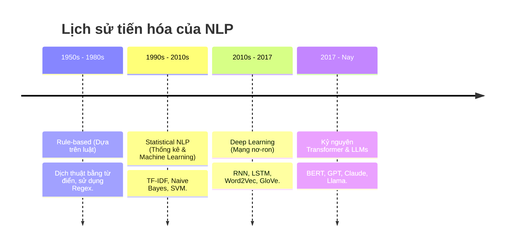
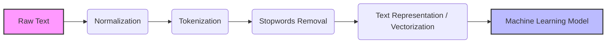

# Bài 1: NLP Fundamentals - Nền Tảng Xử Lý Ngôn Ngữ Tự Nhiên

Chào mừng bạn đến với **Module 1** trong chuỗi bài giảng về **NLP (Natural Language Processing)**. 

Trong thời đại mà dữ liệu văn bản (text data) bùng nổ, từ các bài đăng trên mạng xã hội, đánh giá sản phẩm, cho đến hàng triệu trang tài liệu y khoa và pháp lý, làm sao để máy tính có thể "đọc hiểu" và "giao tiếp" bằng ngôn ngữ của con người? Đó chính là lúc NLP xuất hiện.

Trong bài học đầu tiên này, chúng ta sẽ cùng giải phẫu NLP từ gốc rễ, tìm hiểu nguyên lý hoạt động và tự tay xây dựng một pipeline xử lý ngôn ngữ tự nhiên cơ bản.

---

## 1. NLP là gì? (Definition Anatomy)

> **Định nghĩa chuẩn:** 
> Natural Language Processing (Xử lý ngôn ngữ tự nhiên) là một nhánh của Trí tuệ nhân tạo (AI) và Ngôn ngữ học máy tính (Computational Linguistics), tập trung vào việc tạo ra các hệ thống có khả năng **hiểu (understand)**, **phân tích (analyze)**, và **sinh ra (generate)** ngôn ngữ của con người một cách tự nhiên và có ý nghĩa.

Hãy cùng **"giải phẫu"** định nghĩa này:
*   **Hiểu (Understand):** Máy tính không chỉ nhìn thấy một chuỗi các ký tự (A, B, C...) mà nó nắm bắt được ý nghĩa, cảm xúc (sentiment) hay ý định (intent) đằng sau chuỗi ký tự đó. (Ví dụ: Biết được câu "Tôi ghét sản phẩm này" là một đánh giá tiêu cực).
*   **Phân tích (Analyze):** Bóc tách cấu trúc ngữ pháp, xác định chủ ngữ, vị ngữ, hoặc trích xuất các thông tin quan trọng như tên người, địa điểm (Named Entity Recognition).
*   **Sinh ra (Generate):** Khả năng phản hồi lại con người bằng một đoạn văn bản mới mạch lạc và đúng ngữ cảnh (Ví dụ: Cách ChatGPT đang làm).

### Các bài toán phổ biến của NLP
NLP đang hiện diện ở khắp mọi nơi xung quanh bạn:
*   **Text Classification (Phân loại văn bản):** Lọc email rác (Spam Detection), phân loại tin tức (Thể thao, Kinh tế...).
*   **Sentiment Analysis (Phân tích cảm xúc):** Đánh giá bình luận của khách hàng là Tích cực/Tiêu cực/Trung tính.
*   **Machine Translation (Dịch máy):** Google Translate.
*   **Information Retrieval (Truy xuất thông tin):** Tìm kiếm nội dung dựa trên từ khóa (Google Search).
*   **Chatbot & Virtual Assistants (Trợ lý ảo):** Siri, Alexa, hoặc các hệ thống tư vấn khách hàng tự động.

---

## 2. Lịch sử phát triển của NLP (Root Cause Analysis)

NLP không phải mới xuất hiện gần đây. Nó đã trải qua một chặng đường dài phát triển, giải quyết những "điểm nghẽn" của từng thời kỳ.



### Tại sao lại có sự chuyển dịch này?
*   **Giai đoạn Rule-based (Dựa trên luật):** Các nhà khoa học cố gắng viết hàng ngàn quy tắc ngữ pháp (If-Else) để máy tính hiểu. **Sự thất bại:** Ngôn ngữ quá linh hoạt, nhiều ngoại lệ và tiếng lóng, việc viết luật thủ công là bất khả thi.
*   **Giai đoạn Statistical (Thống kê):** Máy tính bắt đầu "đếm từ". Từ nào xuất hiện nhiều cùng nhau thì có liên quan đến nhau. **Điểm nghẽn:** Không hiểu được "ngữ cảnh" và trật tự từ trong câu. Câu "Chó cắn người" và "Người cắn chó" có cùng lượng từ nhưng ý nghĩa hoàn toàn khác nhau.
*   **Giai đoạn Deep Learning & Transformer:** Mạng nơ-ron cho phép máy tính biểu diễn từ vựng dưới dạng các vector không gian (Embeddings), giúp nắm bắt được ngữ cảnh và mối quan hệ phức tạp giữa các từ trong những câu rất dài.

---

## 3. Các Kỹ thuật Tiền xử lý Văn bản Cơ bản

Máy tính chỉ hiểu những con số (0 và 1), nó không hiểu ký tự chữ cái. Vì vậy, trước khi đưa dữ liệu text vào một mô hình AI, chúng ta phải qua bước **Tiền xử lý (Preprocessing)** và **Biểu diễn (Representation)**.

Dưới đây là một Text Processing Pipeline cơ bản:



### 3.1. Normalization (Chuẩn hóa văn bản)
Làm sạch văn bản thô để đồng nhất dữ liệu.
*   Chuyển tất cả về chữ thường (lowercase).
*   Xóa dấu câu (punctuation), các ký tự đặc biệt, URL, thẻ HTML.

### 3.2. Tokenization (Tách từ)
Chia một đoạn văn bản dài thành các đơn vị nhỏ hơn gọi là **Token** (có thể là từ, cụm từ, hoặc chữ cái).
*   *Input:* "Hôm nay trời rất đẹp"
*   *Output:* `["Hôm", "nay", "trời", "rất", "đẹp"]`

### 3.3. Stopwords Removal (Loại bỏ từ dừng)
**Stopwords** là những từ xuất hiện rất thường xuyên trong ngôn ngữ nhưng mang ít giá trị ngữ nghĩa đóng góp cho câu (Ví dụ trong tiếng Anh: *is, am, are, the, a, in* / Tiếng Việt: *là, của, những, các*).
*   *Mục đích:* Giảm kích thước dữ liệu, giúp mô hình tập trung vào các "từ khóa" quan trọng mang tính chất quyết định.

### 3.4. Text Representation (Biểu diễn văn bản)
Chuyển đổi các Token dạng chữ thành dạng số (Vectors).
*   **Bag of Words (BoW):** Đếm số lần xuất hiện của mỗi từ trong tài liệu. Rất đơn giản nhưng bỏ qua trật tự từ.
*   **TF-IDF (Term Frequency-Inverse Document Frequency):** Đánh giá độ quan trọng của một từ. Một từ xuất hiện nhiều trong một câu nhưng ít xuất hiện trong toàn bộ kho tài liệu sẽ có điểm số cao (Ví dụ: từ chuyên ngành).
*   **Word Embeddings (Nâng cao):** Biểu diễn từ thành các vector số thực trong không gian n chiều, giữ lại được mối quan hệ ngữ nghĩa (Ví dụ: Vector("Vua") - Vector("Đàn ông") + Vector("Phụ nữ") $\approx$ Vector("Nữ hoàng")).

> **Trade-off (Đánh đổi):** 
> Các phương pháp như BoW hay TF-IDF thì rất nhanh, tốn ít tài nguyên tính toán và dễ giải thích, nhưng lại không hiểu được ngữ cảnh. Trong khi đó, Word Embeddings hiểu ngữ cảnh rất tốt nhưng đòi hỏi sức mạnh tính toán lớn và dữ liệu huấn luyện khổng lồ.

---

## 4. Thực hành: Pipeline Xử lý NLP Cơ bản bằng Python

Chúng ta sẽ cùng viết một đoạn code ngắn bằng thư viện `nltk` (Natural Language Toolkit) để xem máy tính thực hiện các bước trên như thế nào.

```python
import nltk
from nltk.corpus import stopwords
from nltk.tokenize import word_tokenize
from collections import Counter
import re

# Tải các gói dữ liệu cần thiết của nltk (Chỉ cần chạy 1 lần)
nltk.download('punkt')
nltk.download('stopwords')

# 1. Dữ liệu thô (Raw Text)
text = "Wow! The new iPhone 15 Pro is absolutely amazing, but the battery life is terrible. #Apple #iPhone15"

# 2. Normalization (Chuẩn hóa)
# Chuyển về chữ thường và chỉ giữ lại chữ cái, số
text_normalized = re.sub(r'[^a-zA-Z0-9\s]', '', text).lower()
print("1. Sau Normalization:", text_normalized)

# 3. Tokenization (Tách từ)
tokens = word_tokenize(text_normalized)
print("2. Sau Tokenization:", tokens)

# 4. Stopwords Removal (Loại bỏ từ dừng)
stop_words = set(stopwords.words('english'))
# Lọc bỏ các từ nằm trong danh sách stop words
filtered_tokens = [word for word in tokens if word not in stop_words]
print("3. Sau khi bỏ Stopwords:", filtered_tokens)

# 5. Đếm tần suất (Bag of Words cơ bản)
word_counts = Counter(filtered_tokens)
print("4. Tần suất xuất hiện:", dict(word_counts))
```

**Output mong đợi:**
```text
1. Sau Normalization: wow the new iphone 15 pro is absolutely amazing but the battery life is terrible apple iphone15
2. Sau Tokenization: ['wow', 'the', 'new', 'iphone', '15', 'pro', 'is', 'absolutely', 'amazing', 'but', 'the', 'battery', 'life', 'is', 'terrible', 'apple', 'iphone15']
3. Sau khi bỏ Stopwords: ['wow', 'new', 'iphone', '15', 'pro', 'absolutely', 'amazing', 'battery', 'life', 'terrible', 'apple', 'iphone15']
4. Tần suất xuất hiện: {'wow': 1, 'new': 1, 'iphone': 1, '15': 1, 'pro': 1, 'absolutely': 1, 'amazing': 1, 'battery': 1, 'life': 1, 'terrible': 1, 'apple': 1, 'iphone15': 1}
```

Như bạn thấy, từ câu văn ban đầu, máy tính giờ đây đã trích xuất được những thông tin cốt lõi (iphone, battery, terrible, amazing...) và sẵn sàng để đưa vào các mô hình Machine Learning phân loại cảm xúc tích cực/tiêu cực.

---

## 5. Tổng kết

Trong bài này, bạn đã nắm được:
1.  **Bản chất của NLP**: Dạy máy tính Hiểu, Phân tích và Sinh ra ngôn ngữ.
2.  **Sự tiến hóa**: Từ những đoạn code if-else cứng nhắc đến các mô hình Deep Learning hiểu ngữ cảnh hiện đại.
3.  **Pipeline cơ bản**: Để máy tính hiểu chữ, ta phải làm sạch (Normalize), băm nhỏ (Tokenize), vứt bỏ từ thừa (Stopwords) và biến chữ thành số (Vectorization).

Ở bài tiếp theo, chúng ta sẽ bước sang kỷ nguyên **Deep Learning trong NLP** – nơi mạng nơ-ron nhân tạo giúp giải quyết những giới hạn của các phương pháp thống kê truyền thống. Hẹn gặp bạn ở Module 2!

<br/>

---
*Made by Anh Tu - Share to be share*
