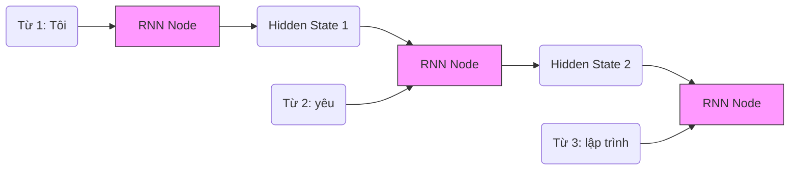

# Bài 2: Deep Learning trong NLP - Khi Máy Tính "Nhớ" Được Ngữ Cảnh

Chào mừng bạn đến với **Module 2**. Ở bài trước, chúng ta đã biết cách dùng các phương pháp thống kê (TF-IDF, Bag of Words) để đếm từ. Tuy nhiên, ngôn ngữ không chỉ là một "túi từ" lộn xộn. Trật tự của từ quyết định ý nghĩa của cả câu. 

Để giải quyết bài toán về thứ tự và ngữ cảnh, các nhà khoa học đã đưa **Deep Learning (Học sâu)** vào NLP. Trong bài này, chúng ta sẽ khám phá cách các mạng nơ-ron nhân tạo đọc văn bản như thế nào.

---

## 1. Deep Learning trong NLP là gì? (Definition Anatomy)

> **Định nghĩa:** 
> Deep Learning trong NLP là việc sử dụng các **Mạng nơ-ron nhân tạo nhiều lớp (Deep Neural Networks)** để tự động trích xuất các đặc trưng ngữ nghĩa phức tạp từ dữ liệu văn bản, thay vì phải định nghĩa luật (rules) thủ công hoặc thiết kế đặc trưng (feature engineering) bằng tay.

Hãy cùng **"giải phẫu"** định nghĩa này:
*   **Mạng nơ-ron nhân tạo nhiều lớp:** Cấu trúc toán học mô phỏng não bộ người. Thay vì đi qua một công thức cố định, dữ liệu đi qua nhiều "lớp màng lọc" (layers). Lớp đầu nhận diện từ vựng, lớp sau nhận diện cụm từ, lớp cuối cùng nhận diện cảm xúc cả câu.
*   **Tự động trích xuất:** Ở bài trước, dùng Machine Learning truyền thống, bạn phải tự "dọn dẹp" và "đếm từ". Với Deep Learning, bạn đưa thẳng văn bản vào (dưới dạng Embedding), mạng nơ-ron tự "học" xem từ nào quan trọng, từ nào đứng cạnh nhau thì mang ý nghĩa gì.

---

## 2. Bước Đột Phá: Từ "Đếm Từ" sang "Hiểu Nghĩa" — Word Embeddings

Trước khi đi vào các mạng nơ-ron phức tạp, cần hiểu bước đột phá nền tảng mà Deep Learning mang lại cho NLP: **Word Embeddings (Biểu diễn từ bằng vector)**.

### Tại sao cần Word Embeddings?

Ở thời Statistical Era, BoW/TF-IDF biểu diễn từ bằng các **Sparse Vector** (vector thưa):
*   Từ điển có 50,000 từ → mỗi từ là một vector có 50,000 chiều
*   Vector của từ "mèo": `[0, 0, 0, ..., 1, ..., 0, 0]` — chỉ có 1 đvị = 1, còn lại đều = 0
*   Hai từ "mèo" và "chó" hoàn toàn không có quan hệ gì trong không gian vector này

Với **Dense Embeddings**, mỗi từ được ánh xạ thành vector có 100–300 chiều, và những từ có nghĩa gần nhau sẽ **nằm gần nhau trong không gian vector**:

```
                Phụ nữ -------- Nữ hoàng
                   |                  |
                   |                  |   (các vector song song nhau)
                Đàn ông --------- Vua
```

### Word2Vec (2013 — Google)

Word2Vec là mô hình huấn luyện **dự đoán từ** để học embedding. Có 2 kiến trúc:

| Kiến trúc | Nguyên lý | Phù hợp |
|------------|-----------|----------|
| **CBOW** (Continuous Bag of Words) | Dùng các từ xung quanh để dự đoán từ trung tâm | Corpus lớn, từ phổ biến |
| **Skip-gram** | Dùng từ trung tâm để dự đoán các từ xung quanh | Từ hiếm, corpus nhỏ |

**Ví dụ:** Trong quá trình huấn luyện trên hàng tỷ câu, mô hình liên tục thấy *"vó ngựa"* và *"bờ biển"* xuất hiện cạnh từ *"ngựa"*. Vì vậy, vector của *"ngựa"* sẽ học cách "đẩy" gần các khái niệm liên quan trong không gian.

### GloVe (2014 — Stanford)

**GloVe (Global Vectors for Word Representation)** khác Word2Vec ở phương pháp:
*   Word2Vec học từ **cửa sổ cục bộ (local window)** — chỉ nhìn các từ láng giềng.
*   GloVe học từ **ma trận đồng xuất hiện toàn cục (global co-occurrence matrix)** — đếm tất cả cặp từ xuất hiện cùng nhau trong toàn bộ corpus.

**Kết quả:** GloVe thường cho embedding tốt hơn cho các mối quan hệ **ngữ nghĩa (semantic)** (Vua–Nữ hoàng), trong khi Word2Vec Skip-gram tốt hơn cho mối quan hệ **cú pháp (syntactic)** (run–running).

> **Hạn chế chứng kiến:**
> Cả Word2Vec và GloVe đều tạo ra **Static Embeddings** (vector tĩnh). Từ *"bank"* luôn có một vector duy nhất dù nó có nghĩa là *"ngân hàng"* hay *"bờ sông"*. Điều này được khắc phục bởi Contextual Embeddings của BERT ở Module 3.

---

## 3. Các Kiến trúc Mạng Nơ-ron Dành Cho Văn Bản (Sequential Models)

Văn bản là một loại **Dữ liệu tuần tự (Sequential Data)**. Từ đứng sau phụ thuộc vào từ đứng trước. Ví dụ: *"Hôm nay trời mưa to nên tôi mang..."* $\rightarrow$ Bộ não bạn tự đoán được từ tiếp theo có thể là *"ô"* hoặc *"áo mưa"*.

Không chỉ có RNN và LSTM, Deep Learning còn mang đến một kiến trúc đáng ngạc nhiên khác cho văn bản.

### 2.1. RNN (Recurrent Neural Network - Mạng nơ-ron hồi quy)



*   **Nguyên lý:** RNN đọc câu văn từng từ một, từ trái sang phải. Khi đọc một từ, nó tạo ra một **Hidden State** (Trạng thái ẩn - giống như "bộ nhớ ngắn hạn"). Bộ nhớ này được truyền sang bước tiếp theo để đọc từ thứ 2. Nhờ vậy, từ thứ 2 được hiểu dựa trên ngữ cảnh của từ thứ 1.
*   **Điểm yếu (Trade-off): Vấn đề Vanishing Gradient (Mất mát thông tin).** Nếu câu văn quá dài (vd: 50 từ), khi đọc đến từ thứ 50, RNN sẽ "quên" mất từ thứ 1. Nó giống như một người có trí nhớ ngắn hạn cực kém.

### 2.2. LSTM (Long Short-Term Memory) & GRU (Gated Recurrent Unit)

Để khắc phục chứng "hay quên" của RNN, LSTM ra đời.

*   **Nguyên lý:** LSTM thêm vào các "Cánh cổng" (Gates) bao gồm: Cổng quên (Forget Gate), Cổng nhớ (Input Gate), và Cổng xuất (Output Gate). 
*   **Cách hoạt động:** Khi đọc một câu dài, LSTM tự quyết định thông tin nào là "rác" thì mở Cổng Quên để xóa đi, thông tin nào quan trọng (VD: Chủ ngữ chính) thì nó giữ lại trong "bộ nhớ dài hạn" (Cell State).
*   **GRU:** Là phiên bản "rút gọn" của LSTM. GRU ít tham số hơn, chạy nhanh hơn, tốn ít RAM hơn nhưng hiệu năng gần tương đương LSTM trong hầu hết các bài toán.

> **Critical Thinking:** 
> Dù LSTM/GRU rất mạnh, nhưng chúng có một **điểm yếu cốt tử**: Chúng bắt buộc phải đọc từ trái sang phải một cách **tuần tự**. Bạn không thể bắt chúng đọc từ thứ 10 nếu chưa đọc xong 9 từ trước đó. Điều này khiến chúng **không thể chạy song song (parallel computing)** trên GPU, làm cho việc huấn luyện cực kỳ mất thời gian. Đây chính là lý do Transformer (Module 3) sau này đánh bại LSTM.

### 3.3. CNN for NLP (Convolutional Neural Networks cho Văn Bản)

CNN nổi tiếng trong xử lý hình ảnh, nhưng chúng cũng được áp dụng hiệu quả vào NLP bằng cách trượt cửa sổ (filter/kernel) qua các từ để phát hiện các **cụm từ (n-gram features)** quan trọng.

*   **Thế mạnh:** Rất nhanh (có thể song song hóa tuyệt vời), hiệu quả với các tác vụ **phân loại văn bản** (Sentiment Analysis, Spam Detection).
*   **Hạn chế:** Chỉ phát hiện được các mẫu cục bộ trong cửa sổ cố định, không nắm bắt được phụ thuộc dài như LSTM.

---

## 3. Ứng dụng của Mô hình Tuần tự

Trước khi Transformer ra đời, kiến trúc Seq2Seq (Sequence to Sequence) sử dụng Encoder-Decoder dựa trên LSTM đã thống trị các bài toán:

1.  **Dịch máy (Machine Translation):** Input là 1 chuỗi tiếng Việt $\rightarrow$ Output là 1 chuỗi tiếng Anh.
2.  **Tóm tắt văn bản (Text Summarization):** Input là bài báo dài 1000 từ $\rightarrow$ Output là đoạn tóm tắt 50 từ.
3.  **Nhận dạng giọng nói (Speech Recognition):** Input là chuỗi âm thanh $\rightarrow$ Output là chuỗi văn bản.

---

## 4. Thực hành: Xây dựng Mô hình Text Classification cơ bản bằng PyTorch

Chúng ta sẽ sử dụng thư viện **PyTorch** để định nghĩa một mạng Neural Network đơn giản gồm 1 lớp Embedding (biến từ thành vector) và 1 lớp Tuyến tính (Linear) để phân loại câu.

```python
import torch
import torch.nn as nn

# 1. Định nghĩa Kiến trúc Mạng Nơ-ron
class SimpleTextClassifier(nn.Module):
    def __init__(self, vocab_size, embedding_dim, num_classes):
        super(SimpleTextClassifier, self).__init__()
        
        # Lớp Embedding: Biến số ID của từ thành Vector (vd: dim=16)
        self.embedding = nn.Embedding(num_embeddings=vocab_size, embedding_dim=embedding_dim)
        
        # Lớp Linear: Lớp phân loại cuối cùng
        self.fc = nn.Linear(embedding_dim, num_classes)
        
    def forward(self, text_indices):
        # text_indices có kích thước [batch_size, sequence_length]
        
        # Bước 1: Tra cứu Vector (Word Embeddings)
        # Kích thước: [batch_size, sequence_length, embedding_dim]
        embedded = self.embedding(text_indices)
        
        # Bước 2: Tính trung bình cộng của tất cả các từ trong câu (Global Average Pooling)
        # Kích thước sau pooling: [batch_size, embedding_dim]
        pooled = embedded.mean(dim=1)
        
        # Bước 3: Phân loại
        # Kích thước Output: [batch_size, num_classes]
        output = self.fc(pooled)
        return output

# 2. Khởi tạo mô hình
VOCAB_SIZE = 10000  # Giả sử từ điển có 10,000 từ
EMBEDDING_DIM = 16  # Kích thước vector của mỗi từ
NUM_CLASSES = 2     # Phân loại 2 lớp: Tích cực / Tiêu cực

model = SimpleTextClassifier(VOCAB_SIZE, EMBEDDING_DIM, NUM_CLASSES)
print(model)

# 3. Chạy thử mô hình (Feed forward)
# Giả lập 1 câu gồm 5 từ, các từ được mã hóa thành các con số (Index trong từ điển)
dummy_input = torch.tensor([[104, 55, 301, 8, 492]]) 
predictions = model(dummy_input)

print("\nĐầu ra dự đoán (Raw logits):", predictions)
```

**Output mong đợi:**
```text
SimpleTextClassifier(
  (embedding): Embedding(10000, 16)
  (fc): Linear(in_features=16, out_features=2, bias=True)
)

Đầu ra dự đoán (Raw logits): tensor([[-0.2045,  0.1132]], grad_fn=<AddmmBackward0>)
```
*(Lưu ý: Raw logits chưa qua hàm Softmax nên giá trị có thể âm. Đây là tín hiệu thô trước khi chuyển thành xác suất phần trăm).*

---

## 5. Tổng kết

Trong Module 2, chúng ta đã hiểu được:
1.  **Bước đột phá của Word Embeddings**: Chuyển từ vector thưa (Sparse) sang vector dày đặc (Dense) nơi ý nghĩa được mã hóa thành không gian toán học. **Word2Vec** và **GloVe** là nền tảng.
2.  **Mô hình tuần tự (RNN/LSTM/GRU)**: Được thiết kế riêng cho ngôn ngữ vì khả năng lưu trữ ngữ cảnh từ trái sang phải.
3.  **CNN for NLP**: Phân loại văn bản nhanh nhưng chỉ nắm bắt cục bộ.
4.  **Hạn chế cốt lõi**: LSTM/GRU học tuần tự nên chậm và khó song song hóa. Static Embeddings không phân biệt được đa nghĩa.

Để vượt qua giới hạn tính toán tuần tự này, các nhà khoa học của Google đã tạo ra một "vụ nổ Big Bang" trong thế giới NLP. Đó chính là kiến trúc **Transformer**. Chúng ta sẽ khám phá nó ở **Module 3**.

<br/>

---
*Made by Anh Tu - Share to be share*
