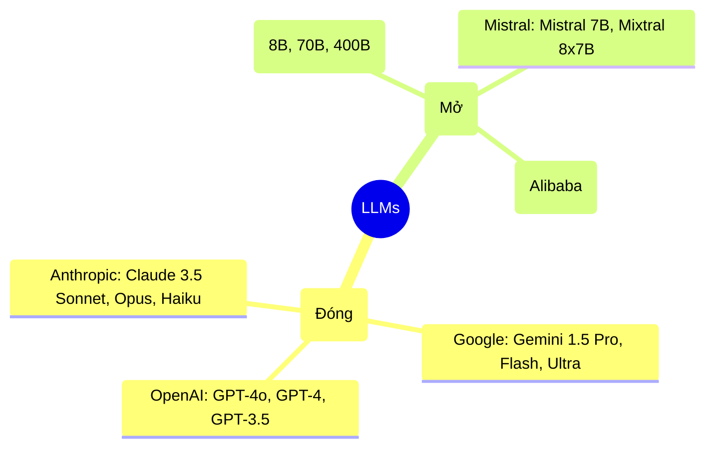

# Bài 3: Transformer & LLMs - Kỷ Nguyên Của Trí Tuệ Nhân Tạo Sinh Tạo

Chào mừng bạn đến với **Module 3**. Năm 2017, nhóm nghiên cứu của Google xuất bản một bài báo có tựa đề *"Attention Is All You Need"*. Bài báo này đã thay đổi vĩnh viễn quỹ đạo của AI, khai sinh ra **Kiến trúc Transformer**, đồng thời tạo tiền đề cho sự xuất hiện của các siêu AI như ChatGPT, Claude, Gemini ngày nay.

---

## 1. Kiến trúc Transformer (Root Cause Analysis)

Ở Module 2, chúng ta đã biết **LSTM/GRU** có một điểm yếu chí mạng: **Phải đọc từ tuần tự từ trái sang phải**. Điều này cản trở việc huấn luyện trên các bộ dữ liệu khổng lồ vì GPU không thể xử lý song song.

### Transformer là gì?
Transformer là một kiến trúc mạng nơ-ron loại bỏ hoàn toàn cơ chế đọc tuần tự của RNN/LSTM. Nó dựa vào một cơ chế toán học gọi là **Self-Attention (Tự chú ý)**.

> **Định nghĩa Self-Attention:**
> Cơ chế cho phép mô hình khi nhìn vào một từ trong câu, nó có thể đánh giá mức độ quan trọng (sự liên quan) của **tất cả các từ khác** trong cùng một câu đó tại cùng một thời điểm.

**Ví dụ:** Trong câu: *"Ngân hàng bên dòng sông bị vỡ nợ."*
Từ "Ngân hàng" ở đây có 2 nghĩa (bank of river hoặc financial bank). Nhờ Self-Attention, khi xử lý từ "Ngân hàng", mô hình sẽ tự động "nhìn" thấy cụm từ "vỡ nợ" ở cuối câu, từ đó suy ra ngay lập tức đây là tổ chức tài chính. LSTM mất nhiều bước để truyền thông tin này, còn Transformer thấy nó ngay lập tức (O(1)).

### Sự khác biệt: Transformer vs RNN/LSTM

| Tiêu chí | RNN / LSTM | Transformer |
| :--- | :--- | :--- |
| **Cách xử lý từ** | Tuần tự (Từng từ một) | Song song (Tất cả từ cùng lúc) |
| **Khả năng song song hóa** | Rất thấp (Chậm) | Rất cao (Khai thác tối đa GPU) |
| **Bắt ngữ cảnh xa** | Kém (Dễ quên do Vanishing Gradient) | Tốt (Self-Attention nhìn toàn cục) |
| **Nhu cầu dữ liệu** | Ít - Vừa | Khổng lồ (Càng nhiều càng thông minh) |

---

## 2. Large Language Models (LLMs) là gì?

> **Định nghĩa:**
> LLM (Mô hình ngôn ngữ lớn) là các mô hình AI dựa trên kiến trúc Transformer, được huấn luyện trên những tập dữ liệu văn bản khổng lồ (vài trăm Gigabytes đến Petabytes) với hàng tỷ hoặc hàng nghìn tỷ tham số (Parameters).

Chữ **"Large"** ở đây thể hiện 2 thứ:
1.  **Dữ liệu siêu lớn:** Toàn bộ Wikipedia, sách, Reddit, Github, báo chí...
2.  **Kích thước mô hình siêu lớn:** GPT-1 (117 triệu tham số), GPT-3 (175 tỷ tham số), GPT-4 (Ước tính > 1 nghìn tỷ). Tham số (Parameter) giống như "số lượng kết nối nơ-ron" trong não, càng nhiều thì suy luận càng phức tạp.

### Tổng quan các LLM phổ biến hiện nay



> **Đánh đổi (Trade-off):**
> *   **Closed Source:** Thông minh nhất, dễ dùng (gọi API), nhưng dữ liệu của bạn gửi lên server của hãng, tốn phí theo từng token.
> *   **Open Source:** Bạn sở hữu hoàn toàn mô hình, bảo mật dữ liệu 100%, miễn phí. Tuy nhiên, bạn phải tự thuê GPU rất đắt tiền để chạy chúng và độ thông minh thường thấp hơn một bậc so với Closed Source.

---

## 2.1. BERT vs GPT — Hai Trường Phái Của Modern NLP

Khi nói đến Transformer, có **2 hướng tư duy kiến trúc** được áp dụng khác nhau, dẫn đến 2 dòng mô hình lớn nhất hiện nay:

| Tiêu chí | **BERT** (Google, 2018) | **GPT** (OpenAI, 2018) |
| :--- | :--- | :--- |
| **Kiến trúc** | Encoder-only | Decoder-only |
| **Hướng Attention** | **Hai chiều (Bidirectional)** — nhìn cả từ trước và sau | **Một chiều (Unidirectional)** — chỉ nhìn từ trước đến hiện tại |
| **Mục tiêu huấn luyện** | Dự đoán từ **bị che** (Masked Language Model) | Dự đoán **từ tiếp theo** (Causal Language Model) |
| **Điểm mạnh** | Hiểu ngữ cảnh sâu, xuất sắc ở các tác vụ **phân loại, NER** | Sinh văn bản tự nhiên, xuất sắc ở **hỏi đáp, dịch, tóm tắt** |
| **Áp dụng** | Tìm kiếm Google, NER, phân loại tài liệu | ChatGPT, Claude, GitHub Copilot |

**Ví dụ minh họa cách huấn luyện:**

```
[BERT - Masked Language Model]
Input:  "Con [MASK] đang chạy trong vườn."
Output: Dự đoán: "mèo", "chó", "gà"...
→ BERT nhìn cả 2 phía: ["đang chạy trong vườn"] và ["Con"] để đoán.

[GPT - Causal Language Model]
Input:  "Con mèo đang"
Output: Dự đoán từ tiếp theo: "chạy", "ngủ", "ngồi"...
→ GPT chỉ nhìn về bên trái (đã có), không biết bên phải.
```

> **Critical Thinking:**
> Không có mô hình nào tốt hơn tuyệt đối. BERT thống trị các bài toán **hiểu ngôn ngữ (NLU)**, còn GPT thống trị các bài toán **sinh ngôn ngữ (NLG)**. Trên thực tế, các LLM hiện đại như Claude hay Gemini đã kết hợp ưu điểm của cả hai.

---

## 3. Hiểu rõ Token, Context và Prompting

Để sử dụng LLM hiệu quả, bạn cần nắm vững 3 khái niệm cốt lõi này.

### 3.1. Token là gì?
LLM không "đọc" theo từng từ, nó đọc theo **Token**.
*   Một token có thể là một từ, một phần của từ, hoặc chỉ một chữ cái.
*   *Quy tắc ngón tay cái đối với tiếng Anh:* 1 token $\approx$ 0.75 từ (tương đương 4 ký tự).
*   *Lưu ý với tiếng Việt:* Do tiếng Việt ít có trong dữ liệu huấn luyện, LLM thường cắt nhỏ từ tiếng Việt ra nhiều token hơn $\rightarrow$ chi phí chạy API tiếng Việt thường đắt hơn tiếng Anh khoảng 2-3 lần.

### 3.2. Context Window (Cửa sổ ngữ cảnh)
Là **dung lượng bộ nhớ ngắn hạn** của mô hình trong một lần trò chuyện.
*   GPT-3.5 có Context là 4K tokens (~3,000 từ). Nếu bạn đưa đoạn văn dài hơn, nó sẽ "quên" phần đầu.
*   Gemini 1.5 Pro có Context lên tới 2 Triệu tokens (~1.5 triệu từ), tương đương hàng chục cuốn tiểu thuyết hoặc video dài 2 tiếng.
*   *Lưu ý:* Context càng lớn, mô hình tính toán càng chậm và càng tốn tiền. Không nên nhồi nhét tài liệu không cần thiết vào Context.

### 3.3. Prompting (Kỹ thuật đặt câu lệnh)
Cách bạn giao tiếp, đưa chỉ thị để LLM sinh ra kết quả như ý muốn. 
Một prompt tốt thường có cấu trúc:
1.  **Role (Vai trò):** "Bạn là một chuyên gia lập trình Python..."
2.  **Context (Ngữ cảnh):** "...tôi đang có một đoạn code bị lỗi memory leak."
3.  **Task (Nhiệm vụ):** "Hãy tìm ra lỗi và viết lại đoạn code này..."
4.  **Format (Định dạng output):** "...trình bày dưới dạng danh sách gạch đầu dòng, kèm theo code blocks."

### 3.4. Zero-shot và Few-shot Learning

Đây là một trong những khả năng **kỳ diệu nhất** của LLMs — thứ mà các mô hình thống kê cũ không bao giờ làm được:

| Loại | Định nghĩa | Ví dụ Prompt |
| :--- | :--- | :--- |
| **Zero-shot** | Yêu cầu LLM thực hiện nhiệm vụ hoàn toàn mới, **không có ví dụ** nào trong prompt | *"Phân loại câu sau là Tích cực hay Tiêu cực: 'Món ăn thật tệ hại'"* |
| **Few-shot** | Cung cấp **một vài ví dụ (shots)** trước rồi hỏi, giúp LLM hiểu format/pattern mong muốn | *"Ví dụ 1: 'Ngon quá' → Tích cực. Ví dụ 2: 'Không có gì đặc sắc' → Trung tính. Giờ hãy phân loại: 'Món ăn thật tệ hại'"* |

**Tại sao LLM có khả năng này?** Vì được huấn luyện trên kích thước dữ liệu khổng lồ, LLM đã "thấy" gần như mọi cấu trúc nhiệm vụ được con người viết ra. Nó có khả năng **suy luận theo mẫu (In-context Learning)** chỉ từ mô tả và ví dụ trong prompt, không cần cập nhật tham số của mô hình.

---

## 4. RAG vs Fine-Tuning: Chọn hướng đi nào? (Critical Thinking)

Khi bạn muốn đưa dữ liệu riêng của công ty (Ví dụ: Tài liệu nội bộ, chính sách bảo hiểm) vào LLM, bạn có 2 con đường:

| Đặc điểm | RAG (Retrieval-Augmented Generation) | Fine-Tuning (Tinh chỉnh mô hình) |
| :--- | :--- | :--- |
| **Bản chất** | Tìm kiếm tài liệu, nhét vào Prompt (Context) bắt LLM đọc rồi trả lời. | Dạy lại LLM bằng cách cập nhật các tham số (Parameters) của mạng nơ-ron. |
| **Khả năng ghi nhớ kiến thức mới** | Xuất sắc. Báo cáo cập nhật từng giây. | Trung bình - Kém. LLM dễ quên kiến thức cũ hoặc "học vẹt". |
| **Chi phí / Độ phức tạp** | Thấp - Vừa. Dễ triển khai. | Rất cao. Cần GPU, Data Engineer. |
| **Khắc phục Hallucination (Bịa chuyện)** | Rất tốt. Trả lời dựa trên tài liệu được cung cấp. | Kém. Vẫn có thể bịa chuyện do tự tin thái quá. |
| **Trường hợp sử dụng phù hợp** | Xây dựng chatbot nội bộ, tra cứu tài liệu, CSKH. | Dạy LLM một *giọng văn* mới, một *ngôn ngữ lập trình* mới, hoặc phản hồi với định dạng phức tạp (như JSON schema nghiêm ngặt). |

> **Luật bất thành văn hiện nay:** 
> "Hãy luôn bắt đầu với RAG. Chỉ khi nào RAG không thể đáp ứng được định dạng (format) hoặc văn phong (tone), bạn mới nên nghĩ đến Fine-Tuning."

---

## 5. Tổng kết

*   **Transformer** đã thay đổi luật chơi nhờ cơ chế **Self-Attention** cho phép tính toán song song.
*   **BERT** (Bidirectional Encoder) xuất sắc về hiểu ngôn ngữ (NLU); **GPT** (Causal Decoder) xuất sắc về sinh văn bản (NLG). Các LLM hiện đại kết hợp cả hai.
*   LLM giao tiếp bằng **Tokens**, có bộ nhớ giới hạn là **Context Window**, và được điều khiển bởi **Prompting**.
*   Khả năng **Zero-shot/Few-shot** là bước nhảy vọt từ mô hình cũ (luôn cần dữ liệu huấn luyện chuyên biệt) sang mô hình thông minh thực sự (đọc hiểu yêu cầu và suy luận ngay từ đầu).
*   Để đưa dữ liệu nội bộ vào LLM, **RAG** là lựa chọn ưu tiên hàng đầu.

Chính vì RAG quá quan trọng và đang là tiêu chuẩn của ngành AI hiện nay, trong **Module 4**, chúng ta sẽ đi sâu vào việc giải phẫu và tự tay xây dựng một hệ thống RAG cơ bản!

<br/>

---
*Made by Anh Tu - Share to be share*
