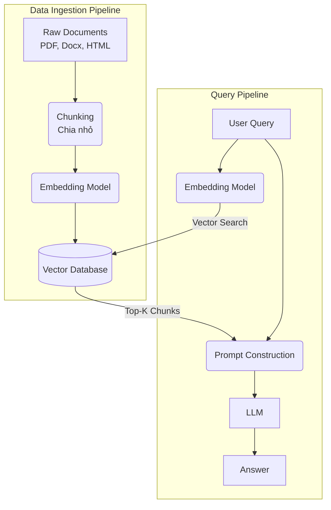

# Bài 4: RAG (Retrieval-Augmented Generation) - Cấp Cho AI Bộ Não Thứ Hai

Chào mừng bạn đến với **Module 4**. Như đã thảo luận ở bài trước, LLM (như ChatGPT) rất thông minh, nhưng chúng có nhược điểm chí mạng là **"ảo giác" (Hallucination)** - tức là bịa chuyện khi không biết câu trả lời, và **"lỗi thời"** - chúng không biết những thông tin xảy ra sau ngày dữ liệu huấn luyện bị ngắt.

Để giải quyết vấn đề này, các kỹ sư AI đã phát triển **RAG (Retrieval-Augmented Generation)**. Hiện nay, 90% các ứng dụng AI trong doanh nghiệp đều sử dụng RAG.

---

## 1. RAG là gì? (Definition Anatomy)

> **Định nghĩa:** 
> RAG (Retrieval-Augmented Generation) là một kỹ thuật kết hợp giữa khả năng **Truy xuất thông tin (Retrieval)** từ một kho dữ liệu nội bộ với khả năng **Sinh văn bản (Generation)** của một mô hình LLM, nhằm tạo ra những câu trả lời chính xác, được cập nhật và có nguồn gốc rõ ràng.

Hãy "giải phẫu" tên gọi này:
*   **Retrieval (Truy xuất):** Giống như khi làm bài kiểm tra mở (Open-book exam), học sinh phải lật sách ra tìm đúng trang tài liệu liên quan đến câu hỏi.
*   **Augmented (Tăng cường):** Lấy đoạn tài liệu vừa tìm được "nhét" vào trong Prompt (ngữ cảnh) cùng với câu hỏi của người dùng.
*   **Generation (Sinh tạo):** LLM (học sinh) đọc đoạn tài liệu đó và viết câu trả lời cuối cùng cho người dùng, đảm bảo không bịa chuyện.

---

## 2. Kiến trúc và Workflow của hệ thống RAG

Hệ thống RAG được chia làm 2 giai đoạn chính: **Data Ingestion (Nạp dữ liệu)** và **Querying (Truy vấn)**.



### Các thành phần cốt lõi:

#### 1. Chunking (Chia nhỏ tài liệu)
LLM có giới hạn về độ dài ngữ cảnh (Context Window). Bạn không thể nhét cuốn sách 1000 trang vào Prompt. Vì vậy, ta phải cắt tài liệu thành các mẩu nhỏ (Chunks) - ví dụ mỗi mẩu dài 500 từ.
*   *Lưu ý:* Phải chia sao cho mẩu văn bản không bị đứt đoạn ngữ nghĩa (sử dụng *Overlap* - phần gối lên nhau giữa 2 mẩu).

#### 2. Embedding Model (Mô hình nhúng)
Như đã học ở Module 1, máy tính không hiểu chữ. Mô hình Embedding (ví dụ: `text-embedding-ada-002` của OpenAI) sẽ biến mỗi mẩu văn bản (Chunk) thành một dãy số (Vector) gồm hàng ngàn chiều. 

#### 3. Vector Store (Cơ sở dữ liệu Vector)
Vector sinh ra sẽ được lưu trữ ở một loại Database đặc biệt như Pinecone, Qdrant, ChromaDB, hoặc pgvector. Nhiệm vụ của nó là tính toán khoảng cách toán học giữa các Vector siêu nhanh.

#### 4. Retrieval (Truy xuất - Semantic Search)
Khi người dùng đặt câu hỏi, câu hỏi cũng được biến thành Vector. Vector Database sẽ tìm kiếm các Chunk có Vector "nằm gần" Vector câu hỏi nhất trong không gian toán học (Tìm kiếm theo ngữ nghĩa - Semantic Search).

#### 5. Generation (Sinh tạo)
Ghép câu hỏi và các Chunk tìm được vào Prompt, đưa cho LLM:
*"Dựa vào tài liệu sau: [Chunk 1], [Chunk 2]... Hãy trả lời câu hỏi: [User Query]. Nếu không có thông tin, hãy nói tôi không biết."*

---

## 3. Tối ưu hóa RAG (Advanced RAG)

RAG cơ bản (Naive RAG) thường gặp phải các vấn đề như: Tìm kiếm không trúng đích, tài liệu rác làm nhiễu LLM. Dưới đây là một số kỹ thuật tối ưu hóa phổ biến:

*   **Hybrid Search:** Kết hợp tìm kiếm theo từ khóa (Keyword/BM25) và tìm kiếm theo ngữ nghĩa (Vector/Semantic). Giải quyết được điểm yếu của Vector khi người dùng gõ mã sản phẩm (ID) hoặc tên riêng chính xác.
*   **Reranking:** Sau khi Vector Store trả về 10 kết quả gần giống nhất, dùng một mô hình AI khác (Cross-Encoder) chấm điểm lại và sắp xếp lại để chọn ra 3 kết quả xuất sắc nhất đưa vào LLM.
*   **Query Reformulation:** Đôi khi người dùng đặt câu hỏi quá ngắn (Ví dụ: "Giá bao nhiêu?"). AI sẽ tự động viết lại câu hỏi dựa trên lịch sử chat trước đó ("Giá của gói bảo hiểm A là bao nhiêu?") rồi mới mang đi tìm kiếm.

---

## 4. Thực hành: Workflow giả lập của RAG

Để bạn dễ hình dung, chúng ta hãy xem một đoạn code giả lập (pseudo-code) cho một hệ thống RAG cơ bản bằng Python.

```python
# Pseudo-code minh họa quy trình RAG

# ==========================================
# GIAI ĐOẠN 1: NẠP DỮ LIỆU (INGESTION)
# ==========================================
raw_document = "Chính sách nghỉ phép: Nhân viên công ty X được nghỉ 12 ngày phép năm. Nhân viên làm trên 5 năm được thêm 2 ngày. Nghỉ ốm được hưởng 70% lương cơ bản..."

# 1. Chunking
chunks = [
    "Chính sách nghỉ phép: Nhân viên công ty X được nghỉ 12 ngày phép năm.",
    "Nhân viên làm trên 5 năm được thêm 2 ngày.",
    "Nghỉ ốm được hưởng 70% lương cơ bản."
]

# 2. Embedding & Lưu trữ
vector_db = VectorDatabase()
for chunk in chunks:
    vector = embedding_model.embed(chunk)
    vector_db.save(chunk, vector)

# ==========================================
# GIAI ĐOẠN 2: TRUY VẤN (QUERYING)
# ==========================================
user_query = "Tôi làm việc được 6 năm thì có bao nhiêu ngày phép?"

# 3. Retrieval (Truy xuất)
query_vector = embedding_model.embed(user_query)
# Tìm 2 chunk có ngữ nghĩa gần với câu hỏi nhất
retrieved_docs = vector_db.search(query_vector, top_k=2) 
# Giả sử tìm được 2 chunk:
# - "Chính sách nghỉ phép: Nhân viên công ty X được nghỉ 12 ngày phép năm."
# - "Nhân viên làm trên 5 năm được thêm 2 ngày."

# 4. Prompt Construction & Generation (Sinh tạo)
prompt = f"""
Bạn là chuyên viên nhân sự. Dựa vào tài liệu sau để trả lời câu hỏi. 
Tuyệt đối không bịa thông tin.

TÀI LIỆU:
{retrieved_docs[0]}
{retrieved_docs[1]}

CÂU HỎI: {user_query}
"""

answer = LLM.generate(prompt)
print(answer)
```

**Output mong đợi của LLM:**
*"Dựa vào chính sách công ty, mọi nhân viên có 12 ngày phép năm. Tuy nhiên, vì bạn đã làm việc trên 5 năm, bạn được cộng thêm 2 ngày. Tổng cộng bạn có 14 ngày phép năm."*

---

## 5. Tổng kết

*   **RAG** là công thức vàng hiện nay: **Retrieval (Kéo tài liệu) + Generation (Đọc và Trả lời)**.
*   Nó khắc phục hoàn toàn nhược điểm "ảo giác" và "lỗi thời" của các LLMs.
*   Tuy nhiên, hiệu năng của RAG phụ thuộc 80% vào chất lượng của khâu Retrieval. Nếu bạn "kéo" ra tài liệu sai, LLM sẽ trả lời sai (Garbage In - Garbage Out).

Trong **Module 5**, chúng ta sẽ nâng cấp hệ thống RAG tĩnh này thành các **AI Agent** tự chủ – nơi AI không chỉ biết "trả lời câu hỏi" mà còn biết "hành động", như tự gửi email, tự query SQL, hay tự đặt vé máy bay.

<br/>

---
*Made by Anh Tu - Share to be share*
