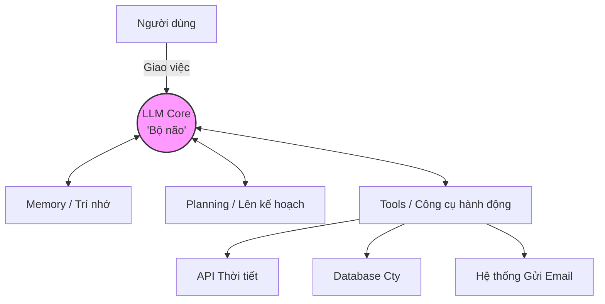

# Bài 5: AI Agents - Trao Quyền Hành Động Cho AI

Chào mừng bạn đến với **Module 5**. Đến thời điểm này, chúng ta đã biến AI từ những cỗ máy "chỉ biết thống kê từ" thành những chuyên gia đọc hiểu tài liệu (RAG). Tuy nhiên, chatbot RAG vẫn chỉ là **Hệ thống thụ động (Passive Systems)**: Bạn hỏi, nó đáp, và câu chuyện dừng lại ở đó. Nó không thể "làm" việc hộ bạn.

Sẽ ra sao nếu bạn có thể bảo AI: *"Hãy kiểm tra giá vé máy bay đi Nhật vào tuần tới, so sánh với ngân sách của tôi, và nếu rẻ hơn 10 triệu thì tự động đặt vé và gửi email báo cáo cho sếp"*? Đó chính là lãnh địa của **AI Agents (Tác tử AI)**.

---

## 1. AI Agent là gì? (Definition Anatomy)

> **Định nghĩa:** 
> AI Agent là một hệ thống tự chủ, trong đó Mô hình ngôn ngữ lớn (LLM) đóng vai trò là "Bộ não" trung tâm, có khả năng **Suy luận (Reasoning)**, lên **Kế hoạch (Planning)**, tự động gọi các **Công cụ ngoại vi (Tools/APIs)** để thực hiện hành động, nhận phản hồi và điều chỉnh bước đi tiếp theo cho đến khi đạt được mục tiêu cuối cùng.

Hãy "giải phẫu" sự khác biệt cốt lõi giữa Agent và Chatbot thông thường:

| Tiêu chí | Chatbot (Có/Không RAG) | AI Agent |
| :--- | :--- | :--- |
| **Quyền chủ động** | Bị động. Phụ thuộc 100% vào Prompt của người dùng. | Chủ động. Tự tạo ra Prompt cho chính mình ở các bước tiếp theo. |
| **Khả năng hành động** | Chỉ sinh ra văn bản. | Có thể thao tác với thế giới thực (Gửi Email, Xóa File, Gọi API, Mua hàng). |
| **Luồng xử lý (Workflow)** | Single-turn (Hỏi 1 câu - Đáp 1 câu). | Multi-turn (Suy luận $\rightarrow$ Hành động $\rightarrow$ Quan sát $\rightarrow$ Suy luận tiếp). |

---

## 2. Giải phẫu 4 thành phần cốt lõi của một AI Agent

Một AI Agent thực thụ không chỉ có mình LLM. Nó là một hệ sinh thái nhỏ bao gồm 4 khối kiến trúc cơ bản:



### 1. LLM (Bộ não trung tâm)
Là nơi xử lý ngôn ngữ, nhận diện ý định và quan trọng nhất là **Suy luận logic**. Không phải LLM nào cũng làm Agent được. Mô hình phải đủ thông minh (như GPT-4, Claude 3.5 Sonnet, Llama 3 70B) để tuân thủ luật lệ nghiêm ngặt (System Prompt) và gọi hàm (Function Calling) chính xác.

### 2. Planning (Lên kế hoạch)
Khi nhận một tác vụ phức tạp, Agent không cắm đầu làm ngay. Nó sẽ chia nhỏ bài toán (Task Decomposition). Kỹ thuật nổi tiếng nhất là **ReAct (Reasoning and Acting)**.
*   *Thought (Suy nghĩ):* Tôi cần làm gì tiếp theo?
*   *Action (Hành động):* Tôi sẽ gọi công cụ X.
*   *Observation (Quan sát):* Kết quả từ công cụ X trả về là Y.
(Vòng lặp này lặp lại cho đến khi tác vụ hoàn thành).

### 3. Tools (Công cụ ngoại vi)
Đôi mắt và cánh tay của AI. LLM vốn dĩ bị "mù" với thế giới bên ngoài (bị giới hạn ngày huấn luyện, không biết tính toán toán học phức tạp). Ta cung cấp Tools cho nó:
*   *Calculator Tool:* Dành cho tính toán chính xác.
*   *Web Search Tool:* Dành cho việc tra cứu thông tin thời gian thực.
*   *SQL Tool:* Dành cho việc query trực tiếp vào Database công ty.

### 4. Memory (Trí nhớ)
*   **Short-term Memory (Trí nhớ ngắn hạn):** Lưu trữ toàn bộ lịch sử trò chuyện trong phiên hiện tại (Context Window).
*   **Long-term Memory (Trí nhớ dài hạn):** Lưu lại sở thích, thói quen của người dùng thông qua Vector Database (RAG) để nhớ từ ngày này qua tháng khác.

---

## 3. Workflow: Agent sử dụng Tools như thế nào? (Root Cause Analysis)

Việc AI "sử dụng" công cụ thực chất là một nghệ thuật giao tiếp chuẩn mực giữa LLM và Code (Python/Node.js). Cơ chế này được gọi là **Function Calling**.

1.  **Bước 1:** Bạn định nghĩa một tập hợp các Tools (Viết Code mô tả tên hàm, tham số).
2.  **Bước 2:** Bạn nạp mô tả của các Tools này vào System Prompt.
3.  **Bước 3:** LLM đọc Prompt. Khi nhận câu hỏi, nó suy luận xem *có cần dùng Tool nào không*. Nếu có, nó không trả về chữ nghĩa bình thường, mà trả về một khối JSON chứa **Tên hàm** và **Tham số**.
4.  **Bước 4:** Hệ thống của bạn (Python code) bắt lấy chuỗi JSON đó, thực thi hàm thực tế trên máy tính, và gửi kết quả (Observation) ngược lại cho LLM để nó đưa ra kết luận.

---

## 4. Thực hành: Xây dựng ReAct Agent Đơn Giản

Chúng ta sẽ minh họa cách LLM suy nghĩ và gọi Tool thông qua một pseudo-code (giả lập sử dụng LangChain hoặc thư viện tương đương).

Giả sử ta cung cấp 1 Tool: `get_weather(location)`

```python
# Pseudo-code minh họa ReAct Agent

# 1. Định nghĩa Tool
def get_weather(location):
    # (Hàm thực tế gọi API thời tiết)
    if location == "Hà Nội": return "35 độ C, nắng nóng."
    if location == "Đà Lạt": return "20 độ C, mưa rào."
    return "Không rõ"

tools = [
    {
        "name": "get_weather",
        "description": "Lấy thông tin thời tiết hiện tại của một thành phố.",
        "parameters": {"location": "Tên thành phố"}
    }
]

# 2. Khởi tạo Agent
agent = Agent(llm=GPT_4, tools=tools, system_prompt="Bạn là một trợ lý thông minh. Hãy suy nghĩ từng bước và dùng Tool nếu cần thiết.")

# 3. Chạy Agent
user_request = "Thời tiết ở Hà Nội hôm nay thế nào? Tôi có nên đi bơi không?"
agent.run(user_request)

# LOG QUÁ TRÌNH SUY LUẬN CỦA AGENT:
"""
Thought 1: Người dùng hỏi về thời tiết Hà Nội và việc đi bơi. Tôi không có thông tin thời tiết hiện tại. Tôi cần dùng Tool 'get_weather'.
Action 1: Call Tool 'get_weather' with parameter {"location": "Hà Nội"}
Observation 1: "35 độ C, nắng nóng."
Thought 2: Thời tiết Hà Nội đang rất nóng. Đây là điều kiện lý tưởng để đi bơi. Tôi đã đủ thông tin để trả lời.
Final Answer: Hiện tại Hà Nội đang nắng nóng với nhiệt độ 35 độ C. Đây là thời tiết rất lý tưởng để đi bơi giải nhiệt bạn nhé!
"""
```

> **Critical Thinking (Cảnh báo):**
> Trao "cánh tay" cho AI đồng nghĩa với rủi ro bảo mật khổng lồ. Nếu bạn cung cấp Tool `delete_database()` hoặc `send_mass_email()`, Agent có thể gây ra thảm họa nếu bị Prompt Injection (Tấn công chèn mã độc vào Prompt). 
> **Luôn yêu cầu xác nhận của con người (Human-in-the-loop)** trước khi Agent thực thi các Tool mang tính rủi ro cao (mutating actions).

---

## 5. Tổng kết

*   **AI Agent** là bước tiến từ "Máy móc thụ động" lên "Tác tử tự chủ".
*   Sức mạnh của Agent nằm ở **Vòng lặp Suy luận (ReAct)** và khả năng sử dụng **Công cụ (Tools)**.
*   Tuy nhiên, Agent hiện tại vẫn còn chậm, tốn nhiều API token, và đôi khi mắc kẹt trong những vòng lặp vô tận (Infinite Loops) nếu Tool bị lỗi.

Vậy làm thế nào để đưa các hệ thống như RAG hay AI Agent vào môi trường thực tế (Production), đáp ứng hàng ngàn người dùng mà không bị sập? Chúng ta sẽ giải quyết bài toán kỹ thuật phần mềm này trong **Module 6** – Module cuối cùng của khóa học!

<br/>

---
*Made by Anh Tu - Share to be share*
