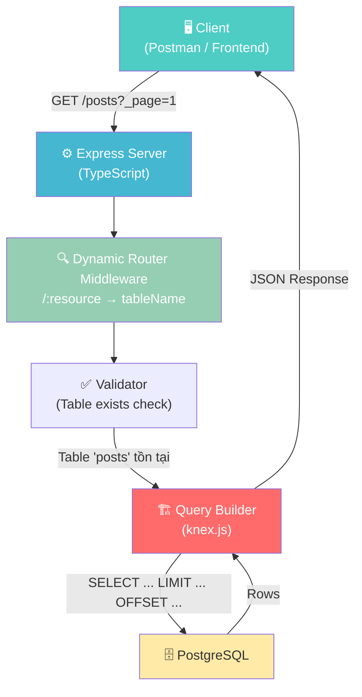
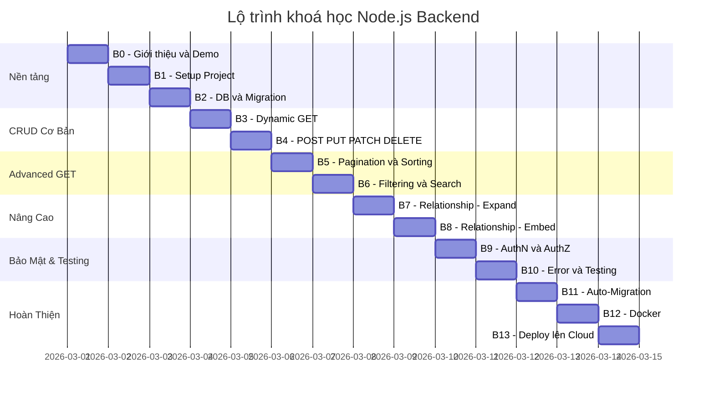
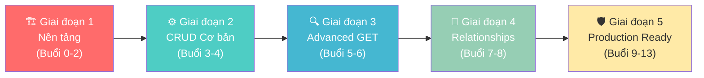
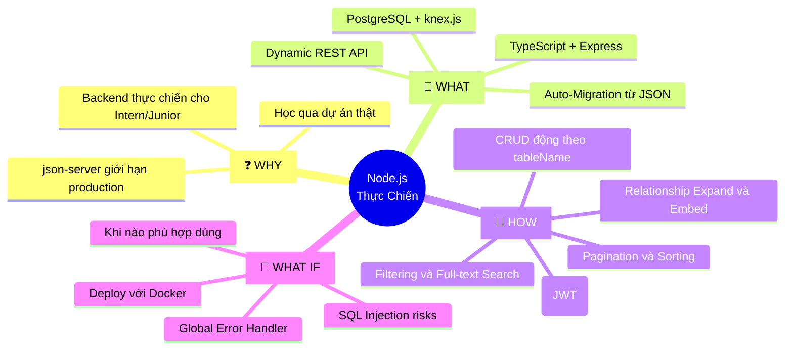

# 🚀 Build Your Own JSON Server — Khoá Học Node.js Thực Chiến

## 📋 Agenda

**Thời gian học ước tính:** ~13 buổi (mỗi buổi 2–3 giờ)

### Sau khoá học này, bạn sẽ:

- ✅ **Hiểu** được vòng đời của một HTTP request đi qua Node.js & Express từ đầu đến cuối
- ✅ **Thiết kế** được RESTful API động (Dynamic REST API) — không cần định nghĩa từng route thủ công
- ✅ **Tự tay** xây dựng một ứng dụng backend hoàn chỉnh với TypeScript + PostgreSQL chạy được trên production
- ✅ **Phân biệt** được Query Builder vs ORM và biết khi nào nên dùng cái nào
- ✅ **Xử lý** được các bài toán nâng cao: Pagination, Sorting, Filtering, Full-text Search, Relationship

### Yêu cầu đầu vào (Prerequisites):

- 🔹 Hiểu cơ bản về JavaScript (ES6+): Arrow function, Promise, Async/Await
- 🔹 Biết sơ về HTTP: GET, POST, status code
- 🔹 Đã từng chạy lệnh `npm install` ít nhất một lần 😄

---

## ❓ WHY — Tại Sao Khoá Học Này Tồn Tại?

Bạn đã từng dùng **`json-server`** chưa?

Đây là một công cụ thần thánh khi làm prototype: chỉ cần tạo 1 file `db.json`, chạy một lệnh, bạn ngay lập tức có đầy đủ REST API `GET/POST/PUT/DELETE` mà không cần viết một dòng code nào.

```bash
# Chỉ cần làm 2 bước này — REST API sẵn sàng!
echo '{"posts": [{"id": 1, "title": "Hello"}]}' > db.json
npx json-server db.json
```

**Nhưng có một vấn đề:** `json-server` lưu dữ liệu trong file `.json`. Khi bạn cần đưa ứng dụng lên production với hàng nghìn users đồng thời, file `.json` không thể đáp ứng được — không có transaction, không có index, không scale được.

> 💡 **Câu hỏi đặt ra:** Nếu chúng ta xây dựng lại `json-server` nhưng dùng **PostgreSQL thật** làm lớp lưu trữ thì sẽ như thế nào?

Đó chính là dự án xuyên suốt 13 buổi học của chúng ta. Không học chay — học bằng cách **build một sản phẩm thật sự**.

---

## 📖 WHAT — Chúng Ta Sẽ Xây Dựng Gì?

### Tổng Quan Hệ Thống

Ứng dụng hoạt động theo nguyên lý **"Convention over Configuration"** (Quy ước thay vì cấu hình):

> Thay vì viết `router.get('/posts', ...)` và `router.get('/users', ...)` riêng lẽ, hệ thống **tự động sinh ra mọi API endpoint** dựa trên cấu trúc bảng trong PostgreSQL.



### Tech Stack

| Công nghệ | Vai trò | Lý do chọn |
|:---|:---|:---|
| **Node.js** | Runtime environment | Nền tảng, không thể thiếu |
| **TypeScript** (Strict) | Ngôn ngữ | Type safety — bắt lỗi từ compile time, không phải runtime |
| **Express.js** | Web framework | Nhẹ, linh hoạt, phổ biến nhất trong thực tế |
| **PostgreSQL** | Database | Mạnh, miễn phí, hỗ trợ JSON native |
| **knex.js** | Query Builder | Linh hoạt hơn ORM khi cần Dynamic SQL |
| **Zod** | Data Validation | Type-safe validation, tích hợp tốt với TypeScript |
| **Docker** | Deployment | Đóng gói môi trường, chạy mọi nơi |

:::note Tại sao KHÔNG dùng Prisma/TypeORM?
ORM như Prisma yêu cầu bạn định nghĩa model từ trước (ví dụ: `model Post { ... }`). Nhưng dự án này cần **API động** — bảng nào trong DB là có API đó. Query Builder (`knex.js`) cho phép build câu SQL động mà không bị lock vào schema cố định.
:::

---

## 🗺️ Lộ Trình Học (13 Buổi)



### Phân Chia Theo Giai Đoạn



---

## 🔨 HOW — Tính Năng Cuối Khoá

Sau 13 buổi, hệ thống của bạn hỗ trợ toàn bộ các tính năng sau:

### 📌 Dynamic CRUD — Tự động với MỌI bảng

```bash
# Không cần viết route — mọi bảng trong DB đều có API!
GET    /posts          # Lấy tất cả posts
GET    /posts/1        # Lấy post có id=1
POST   /posts          # Tạo post mới
PUT    /posts/1        # Cập nhật toàn bộ post id=1
PATCH  /posts/1        # Cập nhật 1 phần post id=1
DELETE /posts/1        # Xoá post id=1
```

### 📌 Advanced Querying — Phân trang, Sắp xếp, Lọc

```bash
# Pagination (Phân trang)
GET /posts?_page=2&_limit=10
# → Trả về posts trang 2, mỗi trang 10 bản ghi + header X-Total-Count

# Sorting (Sắp xếp)
GET /posts?_sort=created_at&_order=desc
# → Sắp xếp theo ngày tạo, mới nhất lên đầu

# Filtering (Lọc chính xác)
GET /posts?status=published&author_id=5
# → Lọc posts đã published của tác giả id=5

# Range Filtering (Lọc theo khoảng)
GET /products?price_gte=100&price_lte=500
# → Sản phẩm có giá từ 100 đến 500

# Full-text Search (Tìm kiếm toàn văn)
GET /posts?q=nodejs
# → Tìm "nodejs" trong TẤT CẢ các cột text của bảng posts
```

### 📌 Relationships — Lấy dữ liệu liên quan

```bash
# Expand (Lấy thông tin bảng cha — "parent")
GET /posts?_expand=user
# → Mỗi post sẽ đính kèm object user tương ứng

# Embed (Lấy danh sách bảng con — "children")
GET /users?_embed=posts
# → Mỗi user sẽ đính kèm mảng posts của họ
```

### 📌 Auto-Migration — Khởi tạo từ file JSON

```bash
# Chỉ cần tạo db.json...
echo '{"posts": [{"id": 1, "title": "Hello Node.js"}]}' > db.json

# Khởi động server — bảng tự động được tạo + dữ liệu được import!
npm run dev
# ✅ Table 'posts' created successfully
# ✅ 1 record(s) inserted into 'posts'
# 🚀 Server running on http://localhost:3000
```

---

## 🚀 WHAT IF — Câu Hỏi Mở Rộng

### Khi nào NÊN dùng kiến trúc "Dynamic API" này?

| ✅ Phù hợp | ❌ Không phù hợp |
|:---|:---|
| Prototype / MVP nhanh | Hệ thống có logic nghiệp vụ phức tạp |
| Internal tools, Admin panels | Cần validation phức tạp theo từng entity |
| Dự án nhỏ-vừa cần CRUD nhanh | Hệ thống microservices lớn |
| Mock API cho frontend team | Cần fine-grained permission mỗi resource |

## 📚 Tài Liệu Tham Khảo

| Tài liệu | Link |
|:---|:---|
| Node.js Official Docs | [nodejs.org](https://nodejs.org/en/docs) |
| Express.js Guide | [expressjs.com](https://expressjs.com/en/guide/routing.html) |
| TypeScript Handbook | [typescriptlang.org](https://www.typescriptlang.org/docs/handbook/) |
| Knex.js Query Builder | [knexjs.org](https://knexjs.org/guide/) |
| Zod Validation | [zod.dev](https://zod.dev/) |
| PostgreSQL Docs | [postgresql.org](https://www.postgresql.org/docs/) |
| json-server (gốc) | [github.com/typicode/json-server](https://github.com/typicode/json-server) |

---

## 🗺️ Sơ Đồ Tư Duy — Toàn Cảnh Khoá Học



---

:::tip Lời Khuyên Cho Học Viên
Đừng cố **copy-paste** code. Hãy **tự gõ lại** từng dòng và đọc comment giải thích. Cảm giác "aha!" khi tự mình làm API respond đúng lần đầu tiên là không thể thay thế được! 🎉
:::

---

*Made by Anh Tu - Share to be share*
