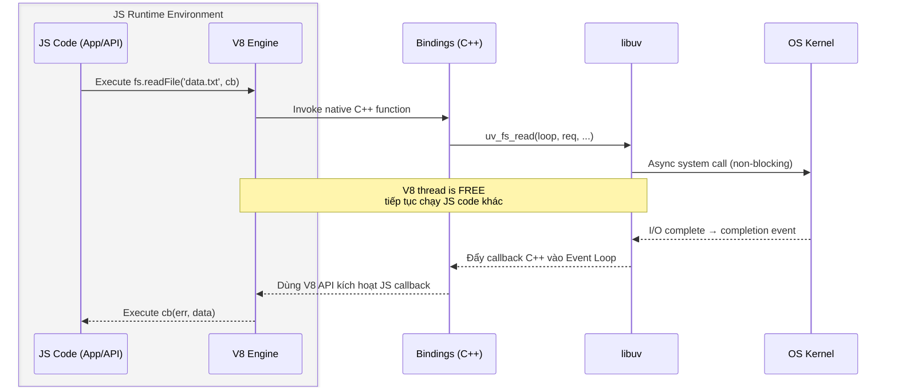

## Agenda

**Thời gian đọc ước tính:** ~25 phút

### Learning Outcomes

- **Giải thích** được tại sao Node.js ra đời và vấn đề cụ thể nó giải quyết
- **Phân biệt** được vai trò của V8, libuv, và Event Loop trong kiến trúc Node.js
- **Mô tả** được vòng đời của một I/O operation từ JavaScript xuống tới OS
- **Sử dụng** được `process` object để kiểm soát runtime environment và memory

---

## Glossary & Vocabulary

**1. Technical Terms (Thuật ngữ kỹ thuật):**

| Term                              | Vietnamese Meaning & Quick Explain                                                                                |
| :-------------------------------- | :---------------------------------------------------------------------------------------------------------------- |
| **V8 Engine**               | Engine JavaScript của Google viết bằng C++, biên dịch và thực thi JS code bên trong một Virtual Machine. |
| **libuv**                   | Thư viện C xử lý I/O bất đồng bộ, quản lý event loop, thread pool, và giao tiếp với OS.              |
| **Event Loop**              | Vòng lặp đơn luồng của Node.js, liên tục kiểm tra và thực thi callback từ hàng đợi.                |
| **Thread Pool**             | Tập hợp các luồng ngầm do libuv quản lý để xử lý các blocking I/O operations (mặc định 4 threads). |
| **Bindings**                | Lớp cầu nối giữa JavaScript và các C/C++ libraries — được viết bằng C++, expose API C++ sang JS.      |
| **C/C++ Addons**            | Module tùy chỉnh do người dùng viết bằng C/C++, cho phép tích hợp native code vào Node.js.             |
| **c-ares**                  | Thư viện C xử lý DNS lookup bất đồng bộ — dùng thay cho DNS blocking của OS.                           |
| **llhttp**                  | Parser HTTP request/response hiệu năng cao kế thừa từ http-parser — phân tích HTTP protocol.              |
| **OpenSSL**                 | Thư viện mã hóa cung cấp TLS/SSL cho`https`, `tls`, `crypto` modules.                                  |
| **zlib**                    | Thư viện nén/giải nén dữ liệu nhanh — dùng trong HTTP compression (gzip, deflate).                       |
| **Callback**                | Hàm được đăng ký để thực thi khi một sự kiện hoặc I/O operation hoàn tất.                         |
| **REPL**                    | Read-Eval-Print Loop — shell tương tác của Node.js để chạy JS trực tiếp.                                |
| **GC (Garbage Collection)** | Cơ chế tự động giải phóng bộ nhớ không còn được sử dụng.                                          |
| **CommonJS**                | Đặc tả module system của Node.js — chuẩn hoá cách`require()` và `module.exports` hoạt động.       |
| **IPC**                     | Inter-Process Communication — cơ chế giao tiếp giữa các tiến trình.                                       |

**2. Vocabulary Support (Từ vựng học thuật/B1+):**

| Word                         | Meaning in Context                                                                                                       |
| :--------------------------- | :----------------------------------------------------------------------------------------------------------------------- |
| **Scalable (adj)**     | Có khả năng mở rộng — hệ thống xử lý được nhiều tải hơn mà không cần thay đổi kiến trúc.          |
| **Concurrent (adj)**   | Đồng thời — nhiều tác vụ được xử lý trong cùng một khoảng thời gian (không nhất thiết song song).     |
| **Blocking (adj)**     | Chặn — một operation chiếm dụng thread, không cho các việc khác chạy trong lúc chờ.                          |
| **Non-blocking (adj)** | Không chặn — operation được đăng ký rồi trả quyền kiểm soát ngay, kết quả được trả về qua callback. |
| **Compile (v)**        | Biên dịch — chuyển source code thành machine code để CPU thực thi.                                               |
| **Delegate (v)**       | Ủy thác — giao việc cho thành phần khác thực hiện thay.                                                         |
| **Abstraction (n)**    | Lớp trừu tượng — che giấu sự phức tạp bên dưới, cung cấp interface đơn giản hơn.                        |
| **Overhead (n)**       | Chi phí phát sinh thêm (về bộ nhớ hoặc thời gian).                                                               |

---

## 1. WHY — Tại Sao Node.js Ra Đời?

### 1.1. Vấn Đề Của Ứng Dụng Web Truyền Thống

Khi web application phát triển về quy mô (scale), hai chiều dữ liệu cần được kiểm soát: **volume** (*khối lượng*) và **shape** (*hình dạng*).

Các ứng dụng server truyền thống (Apache, mod_php) xử lý mỗi connection bằng một **thread** (*luồng*) riêng biệt — mô hình gọi là **thread-per-request**. Vấn đề kỹ thuật phát sinh:

1. **I/O Bottleneck** (*Tắc nghẽn I/O*): Mỗi thread phải **chờ** khi đọc file, query database, hoặc gọi network. Trong thời gian chờ đó, thread bị **block** — không làm được gì nhưng vẫn chiếm tài nguyên.
2. **Resource Exhaustion** (*Cạn kiệt tài nguyên*): Mỗi thread tốn ~1–2 MB RAM. Với 10,000 connections đồng thời, server cần ~10–20 GB chỉ để duy trì các thread — chưa kể overhead của việc context-switching.
3. **Scalability ceiling** (*Giới hạn mở rộng*): Khi số thread tăng, OS phải liên tục switch giữa chúng, làm chậm toàn bộ hệ thống.

### 1.2. Giải Pháp Của Ryan Dahl

Ryan Dahl, creator của Node.js, xác định nguyên nhân gốc rễ: **most worker threads spend their time waiting** (hầu hết thời gian của thread là để chờ).

Ông thiết lập Node.js dựa trên 5 nguyên tắc cứng:

- Một Node process chạy trên **single thread** (*đơn luồng*), điều phối thực thi qua **event loop**
- Web applications có bản chất I/O intensive — tập trung làm I/O nhanh
- Program flow được điều hướng qua **asynchronous callbacks** (*callback bất đồng bộ*)
- Các CPU-heavy operations phải được tách ra thành các **parallel processes** (*tiến trình song song*) riêng biệt
- Các chương trình phức tạp phải được lắp ráp từ các chương trình đơn giản hơn

> **Nguyên tắc cốt lõi:** Operations must never block — Các thao tác không được phép chặn thread chính.

---

## 2. WHAT — Node.js Là Gì?

### 2.1. Định Nghĩa Kỹ Thuật

> **Node.js** là một **non-blocking** (*không chặn*), **event-driven** (*hướng sự kiện*) **JavaScript runtime** (*môi trường chạy JavaScript*) được xây dựng trên V8 Engine của Chrome, cung cấp khả năng thực thi JavaScript phía server với I/O bất đồng bộ.

### 2.2. Definition Anatomy — Giải Phẫu Định Nghĩa

**"non-blocking"** (*không chặn*):
Khi một I/O operation được yêu cầu (đọc file, query DB), Node.js **không đứng chờ** cho đến khi có kết quả. Thay vào đó, nó đăng ký một callback và tiếp tục xử lý các việc khác. Khi I/O hoàn tất, callback được đưa vào hàng đợi để thực thi.

**"event-driven"** (*hướng sự kiện*):
Toàn bộ luồng điều khiển của chương trình được quyết định bởi **events** (*sự kiện*) — khi một sự kiện xảy ra (connection đến, file đọc xong, timer hết hạn), Node.js phản ứng bằng cách gọi callback tương ứng.

**"JavaScript runtime"** (*môi trường chạy JavaScript*):
Node.js không phải là một ngôn ngữ mới — nó là một **execution environment** (*môi trường thực thi*) cho JavaScript bên ngoài trình duyệt. Nó bổ sung các API hệ thống (filesystem, network, process) mà browser JS không có.

### 2.3. Architectural Layers — Kiến Trúc Phân Tầng


**Mô tả từng thành phần:**

- **Node.js Application** *(Layer 1)*: JavaScript code của bạn — entry point là file `.js` bạn viết.
- **Node.js API** *(Layer 2)*: Các interface JavaScript cấp cao như `fs`, `http`, `path`, `events`, `stream`. Đây là những gì bạn `require()` hàng ngày.
- **Node.js Bindings** *(Layer 3)*: Lớp cầu nối quan trọng nhất, viết bằng C++. Nó **expose** (*phơi bày*) các API của libuv và các C libraries khác lên JavaScript (thông qua V8).
- **Standard Library** *(Layer 3)*: Các core module được viết bằng JavaScript thuần — implement logic phía trên Bindings.
- **C/C++ Addons** *(Layer 3)*: Module tùy chỉnh do lập trình viên viết bằng C/C++ để tích hợp native code.
- **V8 Engine** *(Layer 4)*: JIT compile JavaScript thành machine code. Quản lý heap memory và Garbage Collection. Nó là "bộ não" execute bước 1, 2 và 9.
- **libuv** *(Layer 4)*: Thư viện C đa nền tảng — chịu trách nhiệm toàn bộ Event Loop, Thread Pool, và async I/O.
- **c-ares / llhttp / OpenSSL / zlib** *(Layer 4)*: Các thư viện C++ chuyên biệt được Bindings gọi trực tiếp mà không cần qua libuv (trừ một số tác vụ đặc biệt libuv sẽ handle thread pool cho chúng).

### 2.5. Luồng Thực Thi I/O — Execution Flow

Khi một I/O operation được gọi, luồng đi qua toàn bộ các tầng:



**V8 Engine (chi tiết):**

V8 không chỉ interpret JS mà **Just-In-Time compile** (*biên dịch ngay lúc chạy*) — tạo machine code tối ưu hóa tại runtime. Nó cung cấp nhiều cờ cấu hình:

```bash
# Xem tất cả options của V8
node --v8-options

# Kiểm tra phiên bản V8 đang dùng
node -e "console.log(process.versions.v8)"
```


**process object:**

`process` là một instance của `EventEmitter`, có thể truy cập từ bất kỳ scope nào trong Node.js, là cầu nối giữa JavaScript code và V8 runtime:


Sơ đồ trên minh họa vòng đời của một lời gọi `readDir`: stack được xây dựng lên `(global → fileSystem → readDir → anonymous callback)`, libuv xử lý I/O trong background, và khi hoàn tất, callback được đưa vào V8 thread để thực thi. Sau đó toàn bộ stack được tháo xuống và process có thể thoát.

---

## 3. HOW — Làm Việc Với Node.js Runtime

### 3.1. Quản Lý Bộ Nhớ V8

V8 có giới hạn bộ nhớ mặc định:

- **32-bit systems**: 700 MB
- **64-bit systems**: 1400 MB (các phiên bản V8 mới không còn hard limit, nhưng OS vẫn giới hạn)

Khi cần tăng giới hạn, dùng flag `--max_old_space_size` (giá trị tính bằng MB):

```bash
# filename: start-server.sh

# Tăng heap limit lên 4GB — dùng khi ứng dụng cần xử lý dataset lớn trong RAM
node --max_old_space_size=4096 server.js
```

Để khám phá giới hạn stack, chạy chương trình gây tràn stack:

```javascript
// filename: stack-overflow-demo.js
var count = 0;

// Hàm tự gọi lại vô hạn để test giới hạn call stack của V8
(function curse() {
  console.log(++count);
  curse();
})();
// => RangeError: Maximum call stack size exceeded
// Thường xảy ra sau ~10,000-15,000 lần gọi đệ quy
```

Điều chỉnh stack size (đơn vị KB):

```bash
# Tăng stack size lên 65536 KB (64 MB) cho các thuật toán đệ quy sâu
node --stack_size=65536 deep-recursion.js
```

### 3.2. Garbage Collection (GC)

V8 tự động quản lý bộ nhớ qua GC. Hai flag quan trọng để tinh chỉnh:

```bash
# --nouse_idle_notification: Ngăn Node gửi idle notification tới V8,
# giúp GC chạy ít thường xuyên hơn → tăng throughput trong lúc xử lý
node --nouse_idle_notification server.js

# --expose_gc: Cho phép gọi gc() thủ công từ JavaScript code
node --expose_gc server.js
```

```javascript
// filename: manual-gc.js

// Dùng khi cần release memory sau khi process một batch lớn
// để tránh heap fragmentation tích lũy
if (typeof gc === 'function') {
  gc(); // Chỉ hoạt động khi chạy với --expose_gc
}
```

### 3.3. process Object — Truy Cập Runtime

```javascript
// filename: process-demo.js

// process.argv chứa command-line arguments bắt đầu từ index 2
var size = process.argv[2];    // Ví dụ: "1000000"
var total = process.argv[3] || 100;
var buffer = [];

for (var i = 0; i < total; i++) {
  buffer.push(Buffer.alloc(Number(size)));
  // process.memoryUsage() trả về snapshot bộ nhớ hiện tại của V8 heap
  // heapTotal: tổng bộ nhớ đã được cấp phát
  // heapUsed: bộ nhớ đang thực sự được dùng
  process.stdout.write(process.memoryUsage().heapTotal + "\n");
}
```

Chạy và redirect output ra file:

```bash
# Chạy với 1MB buffer, lặp 100 lần
node process-demo.js 1000000 100

# Redirect output để phân tích sau
node process-demo.js 1000000 100 > memory-log.txt
```

Lưu ý: `console.log` thực chất là wrapper của `process.stdout.write`:

```javascript
// Đây là implementation thật trong Node.js core
console.log = function (d) {
  process.stdout.write(d + '\n');
};
```

### 3.4. EventEmitter — Nền Tảng Của Mọi Event

Hầu hết các module trong Node.js đều là instances của `EventEmitter` (*Bộ phát sự kiện*). Đây là pattern cơ bản:

```javascript
// filename: event-emitter-demo.js
var EventEmitter = require('events').EventEmitter;

// Tạo Counter kế thừa từ EventEmitter
// để Counter có khả năng emit events
var Counter = function(init) {
  this.increment = function() {
    init++;
    // emit: phát ra sự kiện 'incremented' kèm giá trị hiện tại
    // Tất cả listener đã đăng ký sẽ được gọi đồng bộ
    this.emit('incremented', init);
  };
};
Counter.prototype = new EventEmitter();

var counter = new Counter(10);

var callback = function(count) {
  console.log(count);
};

// addListener và .on() là hoàn toàn tương đương nhau
counter.addListener('incremented', callback);

counter.increment(); // => 11
counter.increment(); // => 12

// Sau khi không cần theo dõi nữa, phải xóa listener
// để tránh memory leak — đây là pitfall phổ biến
counter.removeListener('incremented', callback);
```

### 3.5. Streams Và EventEmitter

I/O trong Node.js được triển khai dưới dạng **event-driven data streams** (*luồng dữ liệu hướng sự kiện*):

```javascript
// filename: readable-stream-demo.js
var Readable = require('stream').Readable;
var readable = new Readable;
var count = 0;

// _read là internal method phải implement
// Nó được gọi mỗi khi consumer cần thêm dữ liệu
readable._read = function() {
  if (++count > 10) {
    // push(null) báo hiệu stream đã kết thúc → emit 'end' event
    return readable.push(null);
  }
  setTimeout(function() {
    // push() đưa dữ liệu vào buffer của stream
    // Consumer sẽ nhận được qua event 'data' hoặc method read()
    readable.push(count + "\n");
  }, 500);
};

// pipe() nối readable stream với writable stream
// Mọi data push vào readable → tự động ghi vào stdout
readable.pipe(process.stdout);
```

### 3.6. Module System — CommonJS

Node.js áp dụng **CommonJS** specification để tổ chức code:

```javascript
// filename: src/utils/math.js

// module.exports định nghĩa public API của module này
// Các file khác require() sẽ nhận được đúng object này
module.exports = {
  add: (a, b) => a + b,
  multiply: (a, b) => a * b,
};
```

```javascript
// filename: src/main.js

// require() load module đồng bộ, cache kết quả sau lần đầu
// → require() cùng một file 100 lần vẫn chỉ execute 1 lần
const math = require('./utils/math');

console.log(math.add(3, 7)); // => 10
```

### 3.7. REPL — Debug và Khám Phá Runtime

Node.js REPL (*Read-Eval-Print Loop*) là môi trường tương tác để test nhanh:

```bash
# Vào REPL mode
node

# Ví dụ tương tác
> 2 + 2
4
> process.version
'v20.11.0'
> process.memoryUsage()
{ rss: 30035968, heapTotal: 4702208, heapUsed: 2815296, external: 1115048 }
```

Có thể tạo remote REPL để debug Node process đang chạy trên server:

```javascript
// filename: repl-server.js
var repl = require('repl');
var net = require('net');

// Tạo TCP server expose một REPL session qua socket
// Dùng để debug production process mà không cần restart
net.createServer(function(socket) {
  repl
    .start({
      prompt: '> ',
      input: socket,   // nhận input từ socket (remote terminal)
      output: socket,  // gửi output trở về socket
      terminal: true,
    })
    .on('exit', function() {
      socket.end();
    });
}).listen(8080);
```

```javascript
// filename: repl-client.js
var net = require('net');
var sock = net.connect(8080);

// pipe stdin của terminal local vào socket
// → những gì gõ ở client được gửi đến server để thực thi
process.stdin.pipe(sock);
sock.pipe(process.stdout);
```

### 3.8. Network I/O — UDP Example

Node.js hỗ trợ nhiều protocol ngoài HTTP. Ví dụ với UDP (*User Datagram Protocol*):

```javascript
// filename: udp-demo.js
var dgram = require('dgram');
var client = dgram.createSocket("udp4");
var server = dgram.createSocket("udp4");

var message = process.argv[2] || "message";
message = Buffer.from(message);

// UDP server là EventEmitter — lắng nghe event 'message'
server
  .on("message", function(msg) {
    process.stdout.write("Got message: " + msg + "\n");
    process.exit();
  })
  .bind(41234);

// Gửi message đến port 41234 trên localhost
client.send(message, 0, message.length, 41234, "localhost");
```

Chạy:

```bash
node udp-demo.js "hello node"
# => Got message: hello node
```

---

## 4. Trade-offs & Limitations

| Vấn đề                     | Mô tả                                                                                                      | Giải pháp                                                      |
| :---------------------------- | :----------------------------------------------------------------------------------------------------------- | :--------------------------------------------------------------- |
| **CPU-intensive tasks** | Các task tính toán nặng (mã hóa, xử lý ảnh)**block** Event Loop, làm freeze toàn bộ server | Dùng`child_process`, `Worker Threads`, hoặc C++ Addons     |
| **V8 Memory Limit**     | Heap mặc định ~1.4GB trên 64-bit, vượt quá → process crash                                           | Tăng`--max_old_space_size`, hoặc split thành nhiều process |
| **GC Pauses**           | GC chạy có thể gây latency spike (10–100ms) ảnh hưởng realtime apps                                  | Tuning với`--nouse_idle_notification`, giám sát heap usage  |
| **Single-threaded JS**  | Một unhandled exception → crash toàn bộ process                                                          | `process.on('uncaughtException')`, PM2, cluster                |
| **Callback Complexity** | Nested callbacks sâu làm code khó đọc và debug                                                         | Promises, async/await, hoặc EventEmitter pattern                |

---

## 5. Discussion Questions

**Câu 1:** Nếu `console.log` thực chất là wrapper của `process.stdout.write`, điều đó có nghĩa gì khi bạn redirect stdout của Node process sang một file? Liệu `console.log` có vẫn ghi vào terminal không?

**Câu 2:** libuv mặc định có **4 threads** trong thread pool. Khi nào thì số lượng này trở thành bottleneck, và làm thế nào để tăng lên (hint: environment variable `UV_THREADPOOL_SIZE`)?

**Câu 3:** Xét đoạn code sau:

```javascript
var count = 0;
(function curse() {
  console.log(++count);
  curse();
})();
```

Tại sao V8 không thể tối ưu đệ quy vô hạn này bằng **tail call optimization** (*tối ưu đệ quy đuôi*)? Điều này liên quan gì đến cấu trúc call stack của V8?

**Câu 4:** Trong production, nếu memory của Node process tăng liên tục và không bao giờ giảm (memory leak), làm thế nào bạn dùng `--expose_gc` và `process.memoryUsage()` để chẩn đoán vấn đề?

---

## References

| Tài liệu                       | Link                                                                                                                        |
| :------------------------------- | :-------------------------------------------------------------------------------------------------------------------------- |
| Mastering Node.js (PACKT)        | Chapter 1 — Understanding the Node Environment                                                                             |
| Node.js Official Docs — process | [nodejs.org/api/process.html](https://nodejs.org/api/process.html)                                                           |
| libuv Documentation              | [libuv.org/en/stable](http://libuv.org/en/stable/)                                                                           |
| libuv Deep Dive (Nikhil Marathe) | [nikhilm.github.io/uvbook](http://nikhilm.github.io/uvbook/)                                                                 |
| V8 Engine Blog                   | [v8.dev/blog](https://v8.dev/blog)                                                                                           |
| Node.js Event Loop (Official)    | [nodejs.org/en/docs/guides/event-loop-timers-and-nexttick](https://nodejs.org/en/docs/guides/event-loop-timers-and-nexttick) |

---

*Made by Anh Tu - Share to be share*
