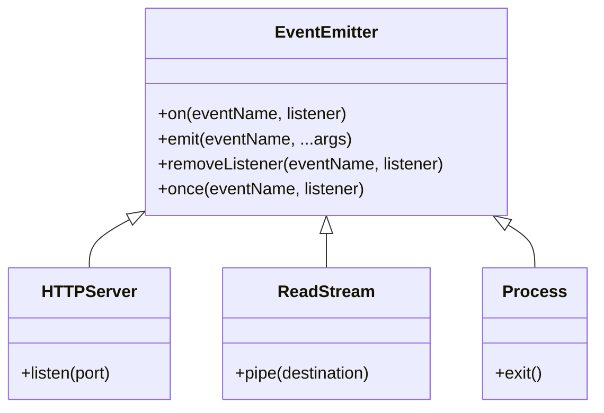

## Agenda

**Thời gian đọc ước tính:** ~20 phút

### Learning Outcomes

- **Thấu hiểu** bản chất chi phí I/O (Cost of I/O) và lý do tại sao mô hình blocking truyền thống thất bại ở quy mô lớn.
- **Nắm vững** mô hình Event-driven và cách `EventEmitter` làm xương sống cho toàn bộ Node.js.
- **Xây dựng** được Custom EventEmitter và hiểu cơ chế Pub/Subscribe.
- **Biết** khi nào nên dùng `nextTick`, `setImmediate`, `setTimeout` ở mức độ thực hành.

---

## Glossary & Vocabulary

**1. Technical Terms (Thuật ngữ kỹ thuật):**

| Term                       | Vietnamese Meaning & Quick Explain                                                                                                                                   |
| :------------------------- | :------------------------------------------------------------------------------------------------------------------------------------------------------------------- |
| **Event-driven**     | Hướng sự kiện — luồng điều khiển của chương trình được quyết định bởi các sự kiện xảy ra (thay vì chạy tuần tự từ trên xuống dưới). |
| **Asynchronous I/O** | I/O bất đồng bộ — yêu cầu I/O (đọc file, mạng) được gửi đi, chương trình lập tức làm việc khác mà không đứng chờ kết quả.              |
| **EventEmitter**     | Class cốt lõi trong Node.js cung cấp cơ chế Publish/Subscribe (phát và lắng nghe sự kiện).                                                                 |
| **POSIX Signal**     | Tín hiệu từ Hệ điều hành gửi đến tiến trình (ví dụ: `SIGINT` khi ấn Ctrl+C).                                                                         |

**2. Vocabulary Support (Từ vựng học thuật/B1+):**

| Word                          | Meaning in Context                                                                                            |
| :---------------------------- | :------------------------------------------------------------------------------------------------------------ |
| **Cost / Overhead (n)** | Chi phí (về mặt thời gian xử lý CPU hoặc bộ nhớ RAM).                                                |
| **Determine (v)**       | Xác định / Quyết định (luồng chạy của chương trình).                                              |
| **Deferred (adj)**      | Trì hoãn — các tác vụ được hoãn lại để thực thi ở tương lai thay vì chạy ngay lập tức.   |
| **Deterministic (adj)** | Có tính quyết định — chạy 10 lần thì kết quả và thứ tự thực thi luôn giống nhau cả 10 lần. |

---

## 1. WHY — Tại Sao Cần Event-Driven?

### 1.1. Sự Tàn Khốc Của Chi Phí I/O (The Cost of I/O)

CPU hiện đại cực kỳ nhanh. Nhưng các thao tác I/O (đọc ổ đĩa cứng, gửi request qua mạng) lại cực kỳ chậm so với tốc độ của CPU. Hãy nhìn vào bảng so sánh tương đối sau:

- L1 Cache: ~3 CPU cycles
- L2 Cache: ~14 CPU cycles
- RAM: ~250 CPU cycles
- Ổ cứng (Disk): ~41,000,000 CPU cycles
- Mạng (Network): ~240,000,000 CPU cycles

Nếu CPU đang xử lý một request mạng bằng mô hình **Blocking** (Đồng bộ / Chặn), nó sẽ phải "ngồi chơi xơi nước" chờ đợi 240 triệu chu kỳ CPU chỉ để nhận dữ liệu, trong khi nó có thể làm được hàng triệu phép tính khác.


*Mô hình Blocking truyền thống: Tiến trình (Process) bị chặn hoàn toàn chờ I/O, lãng phí thời gian CPU (idle time).*

### 1.2. Cuộc Chiến Của Các Mô Hình Server

Để giải quyết vấn đề chờ I/O, lịch sử công nghệ đã sinh ra các mô hình:

**Mô hình Worker Pool (Thread-per-request):**
Thay vì chặn toàn bộ server, HĐH tạo ra nhiều Thread. Thread 1 bị chặn thì HĐH switch sang Thread 2 để làm việc.
👉 *Vấn đề:* Tốn RAM (mỗi thread tốn ~1-2MB), chi phí context-switching quá cao.


**Mô hình Event-Driven Non-blocking (Của Node.js):**
Chỉ dùng **1 Thread duy nhất**. Khi gặp I/O, nó đăng ký một callback và giao việc cho HĐH, sau đó đi xử lý request khác. Khi HĐH làm xong, nó sẽ bắn ra một **Event (Sự kiện)** để báo cho Thread quay lại xử lý kết quả.


*Kiến trúc Hướng sự kiện: Các request không bị chặn, mà được đưa vào hàng đợi chờ Event Loop xử lý callback.*

---

## 2. WHAT — Event-Driven Programming Là Gì?

### 2.1. Định Nghĩa Kỹ Thuật

> **Lập trình hướng sự kiện (Event-driven programming)** là một mô hình thiết kế phần mềm trong đó **luồng điều khiển của chương trình** được quyết định bởi các sự kiện (ví dụ: click chuột, tin nhắn đến mạng, file đọc xong) thông qua cơ chế Publish/Subscribe.

### 2.2. Definition Anatomy — Giải Phẫu Định Nghĩa

**"luồng điều khiển"** (*control flow*):
Trong mô hình tuần tự truyền thống, code chạy dòng 1, dòng 2, rồi dòng 3. Trong Event-driven, bạn không biết khi nào dòng code trong callback sẽ chạy — nó phụ thuộc vào thế giới bên ngoài (khi nào I/O hoàn tất).

**"Publish/Subscribe"**:
Một đối tượng sẽ làm Publisher (Phát sự kiện), một đối tượng khác làm Subscriber (Lắng nghe sự kiện). Hai đối tượng này không cần biết mặt nhau, chúng giao tiếp hoàn toàn qua tên sự kiện (event name). Điều này giúp code **rời rạc (decoupled)** và dễ bảo trì.

### 2.3. EventEmitter — Trái Tim Của Node.js

Hầu hết mọi core module của Node.js (`fs`, `http`, `net`, `stream`) đều kế thừa từ class `EventEmitter`.



Mọi thứ bạn thao tác trong Node.js thực chất đều đang làm việc với `EventEmitter`.

---

## 3. HOW — Làm Việc Với Event-Driven Trong Thực Tế

### 3.1. Tạo Một Custom EventEmitter

Tạo một ứng dụng mô phỏng Sensor đo nhiệt độ:

```javascript
const EventEmitter = require('events');

// 1. Tạo Class kế thừa EventEmitter
class TemperatureSensor extends EventEmitter {
  constructor() {
    super();
    this.temp = 25;
  }

  start() {
    setInterval(() => {
      this.temp += Math.random() > 0.5 ? 1 : -1;
    
      // 2. Phát sự kiện (Publish)
      this.emit('data', this.temp);

      if (this.temp >= 30) {
        this.emit('alert', 'Warning: High Temperature!');
      }
    }, 1000);
  }
}

const sensor = new TemperatureSensor();

// 3. Lắng nghe sự kiện (Subscribe)
sensor.on('data', (temp) => console.log(`Current Temp: ${temp}°C`));

sensor.once('alert', (msg) => {
  console.error(msg); // Dùng .once() nên dòng này chỉ chạy 1 lần duy nhất
});

sensor.start();
```

### 3.2. Nguồn Sự Kiện (Event Sources) Tự Nhiên

Ngoài các custom events, Node.js phơi bày các sự kiện cấp thấp từ Hệ điều hành (OS) thông qua đối tượng `process`:

**POSIX Signals:**
Cách hệ điều hành giao tiếp với phần mềm.

```javascript
process.on('SIGINT', () => {
  console.log('Bạn vừa ấn Ctrl+C. Đang dọn dẹp bộ nhớ trước khi tắt...');
  // Đóng database connections, flush logs...
  process.exit(0); 
});
```

### 3.3. Tổng Quan Event Loop — Cỗ Máy Phía Sau

Event Loop là vòng lặp C++ bên trong libuv, chịu trách nhiệm điều phối toàn bộ luồng bất đồng bộ. Sau khi Call Stack rỗng, Event Loop tiếp quản và thực thi các callbacks theo thứ tự:

**Timers → I/O Callbacks → I/O Polling → Check (setImmediate) → Close Callbacks**

Giữa các giai đoạn, **Microtask Queue** (`process.nextTick`, `Promise.then`) luôn được ưu tiên — đây là lý do `nextTick` cắt ngang hàng đợi của timer và setImmediate.

| Hàm | Thứ tự ưu tiên | Ghi chú |
| :--- | :---: | :--- |
| `process.nextTick()` | ⚡ Cao nhất | Cắt ngang ngay sau callback hiện tại |
| `Promise.then()` | 🔥 Cao | Sau nextTick, trước mọi phase |
| `setImmediate()` | ✅ Trung bình | Sau I/O Poll phase |
| `setTimeout(0)` | ⏱️ Phụ thuộc HĐH | Có thể bị delay 1ms, non-deterministic |

:::tip Đọc Thêm — Deep Dive Event Loop
Muốn hiểu sâu về từng phase, edge cases (I/O Polling, Timer 1ms threshold), GIF minh họa trực quan, và Challenge Code → xem bài **[2B. Deep Dive: Event Loop ⚙️](/docs/nodejs/nodejs-architecture/event-loop-deep-dive)**
:::

---

## 4. Discussion Questions

**Câu 1:** Trong kiến trúc Microservices, hệ thống Pub/Sub như Kafka hay RabbitMQ chia sẻ cùng triết lý nào với `EventEmitter` của Node.js? Điểm khác biệt lớn nhất giữa chúng là gì?

**Câu 2:** Khi bạn viết một ứng dụng HTTP Server, một Exception chưa được `catch` ném ra từ bên trong một hàm callback bất đồng bộ (như `fs.readFile`) sẽ gây ra hậu quả gì? Tại sao cấu trúc `try/catch` truyền thống không bắt được lỗi này?

**Câu 3:** Tại sao khi gọi `.emit('event')` trong constructor của một class kế thừa EventEmitter, listener đăng ký bên ngoài constructor lại **không bắt được** event đó? Làm thế nào để giải quyết?

---

## 5. References

| Tài liệu                           | Link                                                                                                                                                          |
| :----------------------------------- | :------------------------------------------------------------------------------------------------------------------------------------------------------------ |
| Mastering Node.js (PACKT)            | Chapter 2 — Understanding Asynchronous Event-Driven Programming                                                                                              |
| Node.js Docs: The Node.js Event Loop | [nodejs.org/en/docs/guides/event-loop-timers-and-nexttick](https://nodejs.org/en/docs/guides/event-loop-timers-and-nexttick)                                   |
| Understanding process.nextTick()     | [nodejs.org/en/docs/guides/event-loop-timers-and-nexttick#process-nexttick](https://nodejs.org/en/docs/guides/event-loop-timers-and-nexttick#process-nexttick) |

---

*Made by Anh Tu - Share to be share*
