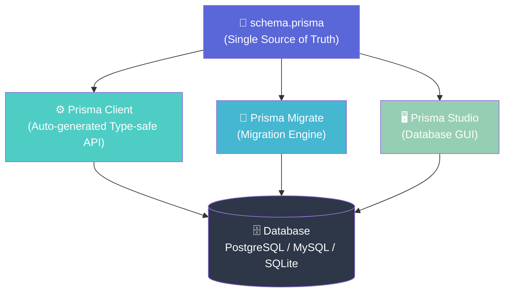
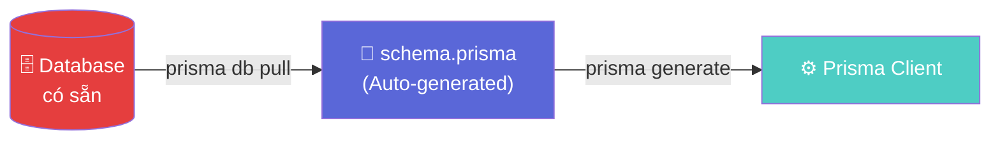
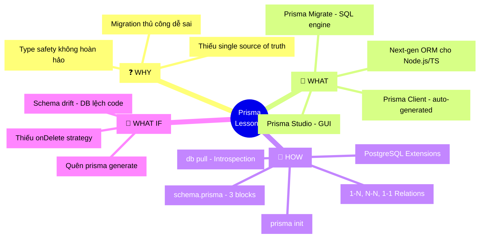

# Lesson 1: Tổng quan & Prisma Schema

## 📋 Agenda

**Thời gian đọc ước tính:** ~20 phút

### Sau bài này, bạn sẽ:
- ✅ **Hiểu** Prisma ORM là gì và tại sao nó khác biệt so với ORM truyền thống
- ✅ **Giải thích** được kiến trúc 3 thành phần của Prisma (Client, Migrate, Studio)
- ✅ **Tự tay** viết được file `schema.prisma` với model User và Post có quan hệ 1-N
- ✅ **Phân biệt** khi nào dùng Introspection (`db pull`) so với viết schema từ đầu

### Yêu cầu đầu vào (Prerequisites):
- 🔹 Biết cơ bản TypeScript (interface, async/await)
- 🔹 Đã từng làm việc với một cơ sở dữ liệu quan hệ (PostgreSQL, MySQL)
- 🔹 Đã cài đặt Node.js (>= 18) và npm

---

## ❓ Vấn đề & Giải pháp

**Vấn đề (Problem Statement):**
- ORM truyền thống (TypeORM, Sequelize) phụ thuộc vào **Decorator/Class** → code phức tạp, dễ misconfigure
- Không có **nguồn sự thật duy nhất (single source of truth)** cho database schema → schema trong code và trong DB dễ bị lệch nhau
- Type safety không hoàn hảo: nếu thay đổi model, TypeScript không tự cập nhật kiểu dữ liệu cho toàn bộ codebase
- Viết migration thủ công dễ sai, khó review và khó rollback

**Giải pháp (Solution):**
Prisma giải quyết bằng cách đặt **`schema.prisma`** làm nguồn sự thật duy nhất. Từ một file schema, Prisma tự động sinh ra:
1. **Prisma Client** — thư viện TypeScript type-safe 100%
2. **SQL Migrations** — file migration chính xác, có thể review và version control
3. **Database GUI** — Prisma Studio để quản lý dữ liệu trực quan

---

## 📖 Prisma ORM là gì?

**Định nghĩa:** Prisma là một **Next-generation ORM** cho Node.js/TypeScript. Thay vì dùng Class/Decorator như ORM truyền thống, Prisma dùng file schema riêng (`.prisma`) để định nghĩa model, sau đó **auto-generate** một Prisma Client type-safe hoàn toàn.

**Databases được hỗ trợ:** PostgreSQL, MySQL, MariaDB, SQLite, SQL Server, MongoDB, CockroachDB.

### Kiến trúc 3 thành phần



| Thành phần | Vai trò | Lệnh liên quan |
|---|---|---|
| **Prisma Client** | Thư viện query DB type-safe | `prisma generate` |
| **Prisma Migrate** | Quản lý schema & migration | `prisma migrate dev` |
| **Prisma Studio** | GUI để xem & sửa dữ liệu | `prisma studio` |

### So sánh với ORM truyền thống

| Tiêu chí | TypeORM | Prisma |
|---|---|---|
| **Định nghĩa Model** | Class + Decorator (`@Entity`) | File `.prisma` (DSL riêng) |
| **Type Safety** | ⚠️ Partial (decorator dễ sai) | ✅ 100% auto-generated |
| **Migration** | Generate từ Entity diff | Generate từ Schema diff |
| **Raw SQL** | `$queryRaw` / `query()` | `$queryRaw` (tagged template) |
| **Learning Curve** | Trung bình | Thấp (schema DSL đơn giản) |
| **Ecosystem** | Mature, tích hợp NestJS tốt | Đang phát triển mạnh |

> 💡 **Pro-tip:** Prisma **không phải** công cụ thay thế hoàn toàn TypeORM trong mọi trường hợp. Nếu dự án đang dùng TypeORM ổn định, không cần migrate. Prisma tỏa sáng trong **greenfield projects** hoặc khi type-safety là ưu tiên hàng đầu.

---

## 🔨 Prisma Schema

### Cài đặt ban đầu

```bash
# Khởi tạo Prisma trong project (tạo schema.prisma + .env)
npx prisma init --datasource-provider postgresql
```

Lệnh này tạo ra:
```
prisma/
  schema.prisma   ← File schema chính
.env              ← Chứa DATABASE_URL
```

### Cấu trúc file schema.prisma

File `schema.prisma` gồm **3 block chính:**

```prisma
// filename: prisma/schema.prisma

// 1. datasource — Kết nối database
datasource db {
  provider = "postgresql"
  url      = env("DATABASE_URL")
}

// 2. generator — Chỉ định output của Prisma Client
generator client {
  provider = "prisma-client-js"
  // output   = "../src/generated/prisma"  // Tùy chọn: đổi thư mục output
}

// 3. model — Định nghĩa bảng (tương đương Entity trong TypeORM)
model User {
  id        Int      @id @default(autoincrement())
  email     String   @unique
  name      String?  // ? = optional (nullable)
  createdAt DateTime @default(now())
  updatedAt DateTime @updatedAt

  // Quan hệ 1-N: Một User có nhiều Post
  posts Post[]
}

model Post {
  id        Int      @id @default(autoincrement())
  title     String
  content   String?
  published Boolean  @default(false)
  createdAt DateTime @default(now())

  // Foreign key — bắt buộc phải có khi dùng quan hệ
  authorId Int
  author   User @relation(fields: [authorId], references: [id], onDelete: Cascade)

  // Index cho trường hay filter/sort
  @@index([authorId])
}
```

### Các Attribute quan trọng trong Schema

```prisma
model Example {
  // --- Primary Key ---
  id        Int    @id @default(autoincrement())  // Auto-increment integer
  uuid      String @id @default(uuid())            // UUID string

  // --- Constraints ---
  email     String @unique                          // Unique constraint
  code      String @unique @db.VarChar(10)         // Giới hạn độ dài DB-level

  // --- Default Values ---
  status    String  @default("active")
  createdAt DateTime @default(now())
  updatedAt DateTime @updatedAt                    // Auto-update timestamp

  // --- Table-level constraints ---
  @@unique([firstName, lastName])                  // Composite unique
  @@index([status, createdAt])                     // Composite index
  @@map("tbl_examples")                            // Map sang tên bảng khác
}
```

### Quan hệ (Relations)

```prisma
// filename: prisma/schema.prisma — Các loại quan hệ

// ── 1-N (One-to-Many) ──
model Category {
  id       Int       @id @default(autoincrement())
  name     String
  products Product[]
}

model Product {
  id         Int      @id @default(autoincrement())
  name       String
  categoryId Int
  category   Category @relation(fields: [categoryId], references: [id])
}

// ── N-N (Many-to-Many) — Prisma tạo bảng trung gian tự động ──
model Student {
  id      Int      @id @default(autoincrement())
  courses Course[]
}

model Course {
  id       Int       @id @default(autoincrement())
  title    String
  students Student[]
}

// ── 1-1 (One-to-One) ──
model Profile {
  id     Int  @id @default(autoincrement())
  bio    String?
  userId Int  @unique   // @unique đảm bảo mỗi User chỉ có 1 Profile
  user   User @relation(fields: [userId], references: [id])
}
```

---

## 🔨 Introspection — `prisma db pull`

### Introspection là gì?

**Introspection** là quá trình Prisma **đọc database có sẵn** và **tự động sinh ra `schema.prisma`** tương ứng. Cực kỳ hữu ích khi:

- Bắt đầu làm việc với **Brownfield project** (database hiện có, chưa dùng Prisma)
- Cần migrate từ ORM khác sang Prisma mà không muốn mất dữ liệu



```bash
# Kết nối đến database có sẵn và generate schema
npx prisma db pull

# Sau đó generate Prisma Client từ schema vừa tạo
npx prisma generate
```

> ⚠️ **Lưu ý thực tế:** `db pull` sẽ **overwrite** file `schema.prisma` hiện tại. Hãy backup trước nếu bạn đã chỉnh sửa thủ công. Khi làm Brownfield, workflow thường là: `db pull` → chỉnh sửa schema nếu cần → `generate`.

---

## 🔨 PostgreSQL Extensions

Prisma hỗ trợ khai báo và sử dụng **PostgreSQL extensions** trực tiếp trong `schema.prisma`:

```prisma
// filename: prisma/schema.prisma

datasource db {
  provider   = "postgresql"
  url        = env("DATABASE_URL")
  // Bật chế độ hỗ trợ extensions
  extensions = [pgcrypto, uuid_ossp(map: "uuid-ossp"), pg_trgm]
}

generator client {
  provider        = "prisma-client-js"
  // Bắt buộc phải thêm dòng này để dùng extensions
  previewFeatures = ["postgresqlExtensions"]
}

model User {
  // Dùng uuid() từ extension uuid-ossp
  id    String @id @default(dbgenerated("gen_random_uuid()")) @db.Uuid
  email String @unique
}
```

```bash
# Áp dụng extension vào database (chỉ thực hiện khi migrate)
npx prisma migrate dev --name add_extensions
```

> 💡 **Pro-tip:** `pgcrypto` dùng để hash password (`crypt()`) ở DB-level. `uuid-ossp` dùng để sinh UUID-v4. `pg_trgm` dùng cho full-text search fuzzy matching. Tuy nhiên, với hầu hết dự án, xử lý ở application level vẫn linh hoạt hơn.

---

## 🚀 Trade-off & Pitfalls

| ✅ NÊN | ❌ KHÔNG nên |
|---|---|
| Coi `schema.prisma` là nguồn sự thật duy nhất | Sửa database trực tiếp mà không cập nhật schema |
| Dùng `prisma db pull` khi brownfield | Viết lại schema từ đầu cho DB có sẵn |
| Commit file `prisma/migrations/` vào Git | Bỏ qua migrations folder trong `.gitignore` |
| Dùng `@updatedAt` cho trường cần auto-update | Tự viết logic update timestamp thủ công |

### ⚠️ Pitfalls hay gặp

**1. Quên chạy `prisma generate` sau khi sửa schema**
Khi bạn thêm field mới vào `schema.prisma`, nếu không chạy `prisma generate` thì Prisma Client vẫn dùng kiểu cũ → code TypeScript không nhận ra field mới.

**2. `schema.prisma` vs database bị lệch nhau**
Nếu không qua Prisma Migrate (sửa DB bằng tay qua pgAdmin), schema trong code và DB sẽ không đồng bộ. Dùng `prisma db pull` để sync lại, hoặc `prisma migrate diff` để kiểm tra sự khác biệt.

**3. Không đặt `onDelete` cho relations**
Mặc định Prisma dùng `Restrict`, nghĩa là không thể xóa `User` nếu còn `Post`. Hãy cân nhắc `Cascade` (xóa theo) hay `SetNull` tùy business logic.

---

## 🗺️ MECE Mindmap



---

*Made by Anh Tu - Share to be share*
