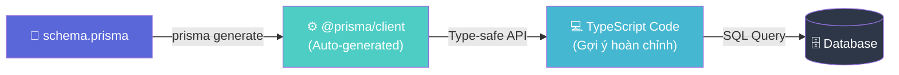
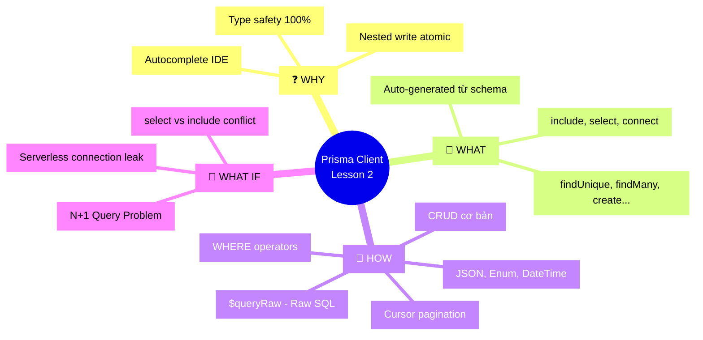

# Lesson 2: Prisma Client — Truy vấn & Type Safety

## 📋 Agenda

**Thời gian đọc ước tính:** ~25 phút

### Sau bài này, bạn sẽ:
- ✅ **Khởi tạo** và quản lý `PrismaClient` instance đúng cách
- ✅ **Thực hiện** đầy đủ thao tác CRUD với Prisma Client API
- ✅ **Sử dụng** `include`, `select` và Nested Writes để thao tác với dữ liệu quan hệ
- ✅ **Xử lý** kiểu đặc biệt: `JSON`, `Enum`, `DateTime`
- ✅ **Viết** Raw SQL an toàn với `$queryRaw`

### Yêu cầu đầu vào (Prerequisites):
- 🔹 Đã hoàn thành Lesson 1 (hiểu cấu trúc `schema.prisma`)
- 🔹 Biết async/await và TypeScript generics cơ bản

---

## ❓ Vấn đề & Giải pháp

**Vấn đề (Problem Statement):**
- ORM thiếu type-safe: query trả về `any` → lỗi undefined field chỉ phát hiện khi runtime
- Không có autocomplete khi viết query → developer phải nhớ tên field/relation
- Nested operations (tạo parent + child cùng lúc) thường phức tạp, dễ quên transaction

**Giải pháp (Solution):**
Prisma Client được **auto-generated** từ `schema.prisma`, đảm bảo:
- Mọi method, field, và return type đều có TypeScript type chính xác 100%
- IDE (VS Code) sẽ autocomplete đầy đủ field name, relation, và filter options
- Nested Writes cho phép thao tác parent-child trong **một lần gọi duy nhất**

---

## 📖 Prisma Client là gì?

**Định nghĩa:** Prisma Client là một **thư viện query builder type-safe** được sinh tự động từ `schema.prisma`. Mỗi lần schema thay đổi, chạy `prisma generate` để cập nhật.



---

## 🔨 Setup và Khởi tạo PrismaClient

### Cài đặt

```bash
npm install @prisma/client
npx prisma generate   # Sinh Prisma Client từ schema
```

### Singleton Pattern — Tránh quá nhiều kết nối

```typescript
// filename: src/lib/prisma.ts

import { PrismaClient } from '@prisma/client';

// Singleton pattern: đảm bảo chỉ có 1 instance trong toàn app
// Đặc biệt quan trọng với Next.js (Hot Reload tạo nhiều instance)
const globalForPrisma = global as unknown as { prisma: PrismaClient };

export const prisma =
  globalForPrisma.prisma ||
  new PrismaClient({
    log: ['query', 'error', 'warn'], // Log mọi thao tác trong dev
  });

if (process.env.NODE_ENV !== 'production') {
  // Chỉ lưu vào global trong dev để tránh hot-reload tạo nhiều instance
  globalForPrisma.prisma = prisma;
}
```

```typescript
// filename: src/app.ts — Sử dụng trong NestJS/Express

import { prisma } from './lib/prisma';

// Đảm bảo disconnect khi app shutdown
async function main() {
  try {
    await app.listen(3000);
  } finally {
    // Giải phóng connection pool khi tắt server
    await prisma.$disconnect();
  }
}
```

---

## 🔨 CRUD Cơ bản

### findUnique — Tìm theo khóa duy nhất

```typescript
// filename: src/services/user.service.ts

import { prisma } from '../lib/prisma';

// findUnique: CHỈ query bằng @id hoặc @unique field
// Trả về: User | null
const user = await prisma.user.findUnique({
  where: { id: 1 },
});

// Với composite unique key
const post = await prisma.post.findUnique({
  where: {
    authorId_slug: { authorId: 1, slug: 'my-post' }, // Composite unique
  },
});
```

### findFirst & findMany — Tìm một hoặc nhiều

```typescript
// findFirst: Lấy bản ghi đầu tiên khớp với điều kiện
// Trả về: User | null
const firstAdmin = await prisma.user.findFirst({
  where: { role: 'ADMIN' },
  orderBy: { createdAt: 'desc' }, // Lấy admin mới nhất
});

// findMany: Lấy nhiều bản ghi
// Trả về: User[]
const allUsers = await prisma.user.findMany({
  where: { isActive: true },
  orderBy: [
    { createdAt: 'desc' }, // Sort chính: mới nhất
    { name: 'asc' },        // Sort phụ: theo tên
  ],
  take: 10,   // Limit
  skip: 20,   // Offset (trang 3 nếu take=10)
});
```

### create, update, delete

```typescript
// --- CREATE ---
const newUser = await prisma.user.create({
  data: {
    email: 'tu@example.com',
    name: 'Anh Tu',
  },
  // select: Chỉ trả về các field cần thiết (tối ưu performance)
  select: {
    id: true,
    email: true,
    createdAt: true,
  },
});

// --- UPDATE ---
const updatedUser = await prisma.user.update({
  where: { id: 1 },
  data: {
    name: 'Anh Tu Updated',
    // Prisma có atomic operators: increment, decrement, multiply...
    // loginCount: { increment: 1 },
  },
});

// --- UPSERT (Create or Update) ---
const upserted = await prisma.user.upsert({
  where: { email: 'tu@example.com' },
  update: { name: 'Tu Updated' },
  create: { email: 'tu@example.com', name: 'Tu New' },
});

// --- DELETE ---
// Xóa vĩnh viễn. Dùng soft-delete thay thế trong production
const deleted = await prisma.user.delete({
  where: { id: 1 },
});

// --- deleteMany (Bulk delete) ---
const { count } = await prisma.post.deleteMany({
  where: { published: false, createdAt: { lt: new Date('2024-01-01') } },
});
console.log(`Đã xóa ${count} bài viết nháp cũ`);
```

---

## 🔨 Relations — Thao tác dữ liệu quan hệ

### include — Eager Loading

```typescript
// filename: src/services/post.service.ts

// include: Lấy kèm dữ liệu từ bảng liên quan (tương đương JOIN)
const userWithPosts = await prisma.user.findUnique({
  where: { id: 1 },
  include: {
    posts: {
      where: { published: true }, // Filter lồng nhau
      orderBy: { createdAt: 'desc' },
      take: 5,                    // Lấy 5 bài viết mới nhất
    },
  },
});
// userWithPosts.posts → Post[] (TypeScript biết rõ kiểu này)
```

### select — Chỉ lấy field cần thiết

```typescript
// select: Kiểm soát chính xác field nào được trả về
// Dùng khi API response không cần toàn bộ data → giảm bandwidth
const users = await prisma.user.findMany({
  select: {
    id: true,
    name: true,
    email: true,
    // Lấy kèm relation với select lồng nhau
    posts: {
      select: {
        id: true,
        title: true,
        // Không lấy content (có thể rất lớn)
      },
    },
    // _count: Đếm số lượng relation mà không cần tải dữ liệu
    _count: {
      select: { posts: true },
    },
  },
});
// users[0]._count.posts → number
```

### Nested Writes — Tạo dữ liệu quan hệ cùng lúc

```typescript
// filename: src/services/post.service.ts

// Tạo User + Posts trong một transaction duy nhất
// Prisma tự wrap trong transaction — đảm bảo all-or-nothing
const newUserWithPosts = await prisma.user.create({
  data: {
    email: 'developer@example.com',
    name: 'Dev',
    posts: {
      create: [
        { title: 'Bài viết đầu tiên', content: 'Nội dung bài 1' },
        { title: 'Bài viết thứ hai', published: true },
      ],
    },
  },
  include: { posts: true }, // Trả về kèm posts vừa tạo
});

// Connect — Kết nối với record đã tồn tại
const post = await prisma.post.create({
  data: {
    title: 'Bài viết mới',
    author: {
      connect: { id: 1 }, // Liên kết với User có id=1 đã tồn tại
    },
  },
});

// connectOrCreate — Connect nếu tồn tại, create nếu chưa có
const tag = await prisma.post.update({
  where: { id: 1 },
  data: {
    tags: {
      connectOrCreate: {
        where: { name: 'nodejs' },
        create: { name: 'nodejs' },
      },
    },
  },
});
```

---

## 🔨 Filtering & Sorting nâng cao

```typescript
// filename: src/services/search.service.ts

// --- WHERE operators ---
const results = await prisma.post.findMany({
  where: {
    AND: [
      { published: true },
      { title: { contains: 'Prisma', mode: 'insensitive' } }, // ILIKE
    ],
    OR: [
      { authorId: 1 },
      { authorId: 2 },
    ],
    NOT: { deletedAt: null }, // Chỉ lấy đã xóa
    createdAt: {
      gte: new Date('2024-01-01'), // >= ngày này
      lt: new Date('2025-01-01'),  // < ngày này
    },
    views: { gt: 100 }, // > 100 lượt xem
  },
});

// --- Cursor-based Pagination (tốt hơn offset cho data lớn) ---
// Trang 1:
const page1 = await prisma.post.findMany({
  take: 10,
  orderBy: { id: 'asc' },
});

// Trang kế tiếp:
const lastId = page1[page1.length - 1]?.id;
const page2 = await prisma.post.findMany({
  take: 10,
  skip: 1,           // Bỏ qua cursor item
  cursor: { id: lastId }, // Bắt đầu từ sau item cuối của trang trước
  orderBy: { id: 'asc' },
});
```

---

## 🔨 Type Safety & Special Fields

### Sức mạnh Type Safety

```typescript
// filename: src/services/type-demo.ts

import { Prisma } from '@prisma/client';

// Prisma.UserCreateInput — Type cho input create (auto-generated)
function createUser(data: Prisma.UserCreateInput) {
  return prisma.user.create({ data });
}

// Prisma.UserGetPayload — Type cho output với include/select cụ thể
type UserWithPosts = Prisma.UserGetPayload<{
  include: { posts: true };
}>;

// ✅ TypeScript biết rõ user.posts là Post[]
function processUser(user: UserWithPosts) {
  user.posts.forEach(post => console.log(post.title));
}
```

### JSON Field

```typescript
// Schema:
// model Settings {
//   id       Int  @id
//   metadata Json
// }

// Tạo với JSON object
await prisma.settings.create({
  data: {
    metadata: {
      theme: 'dark',
      notifications: { email: true, sms: false },
    },
  },
});

// Filter theo JSON field (PostgreSQL)
const darkThemeUsers = await prisma.settings.findMany({
  where: {
    metadata: {
      path: ['theme'],
      equals: 'dark',
    },
  },
});
```

### Enum Field

```typescript
// Schema:
// enum Role { USER ADMIN MODERATOR }
// model User { role Role @default(USER) }

import { Role } from '@prisma/client';

// Dùng enum type-safe — TypeScript sẽ báo lỗi nếu gõ sai
const admins = await prisma.user.findMany({
  where: { role: Role.ADMIN },
});

// Update role
await prisma.user.update({
  where: { id: 1 },
  data: { role: 'MODERATOR' }, // Cũng chấp nhận string literal
});
```

### DateTime Field

```typescript
// Lấy posts trong 7 ngày qua
const recentPosts = await prisma.post.findMany({
  where: {
    createdAt: {
      gte: new Date(Date.now() - 7 * 24 * 60 * 60 * 1000),
    },
  },
  orderBy: { createdAt: 'desc' },
});
```

---

## 🔨 Raw SQL — $queryRaw & $executeRaw

Dùng khi cần SQL phức tạp mà Prisma Client API không hỗ trợ (ví dụ: window functions, CTE).

```typescript
// filename: src/services/analytics.service.ts

import { prisma } from '../lib/prisma';
import { Prisma } from '@prisma/client';

// $queryRaw — Trả về dữ liệu (SELECT)
// Tagged template literal tự động escape input → chống SQL Injection
const userId = 1; // Input từ user

const posts = await prisma.$queryRaw<Array<{ id: number; title: string; views: number }>>`
  SELECT id, title, views
  FROM "Post"
  WHERE "authorId" = ${userId}    -- ${...} được parameterized, không thể inject
  ORDER BY views DESC
  LIMIT 10
`;

// $executeRaw — Thực thi câu lệnh (INSERT/UPDATE/DELETE), trả về số row bị ảnh hưởng
const updatedCount = await prisma.$executeRaw`
  UPDATE "Post"
  SET views = views + 1
  WHERE id = ${postId}
`;

// ⚠️ NGUY HIỂM: Dùng Prisma.sql để compose query động một cách an toàn
function buildDynamicQuery(status: string) {
  // Prisma.sql tự escape value, Prisma.raw cho column/table name (KHÔNG escape)
  return prisma.$queryRaw`
    SELECT * FROM "Post"
    WHERE status = ${Prisma.sql`${status}`}
    ORDER BY ${Prisma.raw('"createdAt"')} DESC
  `;
}
```

> ⚠️ **Lưu ý quan trọng:** Chỉ dùng `Prisma.raw()` cho **tên cột/bảng** (không phải user input). Mọi giá trị đến từ user phải đi qua `${}` (template literal) để được parameterized tự động.

---

## 🚀 Trade-off & Pitfalls

| ✅ NÊN | ❌ KHÔNG nên |
|---|---|
| Dùng `select` để chỉ lấy field cần thiết | `findMany` không có `select` → lấy toàn bộ field (N+1 data) |
| `_count` để đếm relation | `include` toàn bộ relation chỉ để đếm |
| Cursor-based pagination cho dataset lớn | Offset pagination với `skip` lớn → chậm dần |
| `$queryRaw` tagged template | String concatenation trong SQL → SQL Injection |

### ⚠️ Pitfalls hay gặp

**1. N+1 Query Problem**
```typescript
// ❌ Sai: Mỗi user lại query thêm 1 lần để lấy posts → N+1 queries
const users = await prisma.user.findMany();
for (const user of users) {
  const posts = await prisma.post.findMany({ where: { authorId: user.id } });
}

// ✅ Đúng: 1 query với include
const users = await prisma.user.findMany({
  include: { posts: true },
});
```

**2. Prisma Client trong Serverless**
Mỗi function invocation tạo `new PrismaClient()` → connection pool bị cạn kiệt. Dùng Singleton Pattern (đã trình bày ở trên) hoặc **Prisma Accelerate** (sẽ đề cập Lesson 3).

**3. select vs include — Không dùng cùng nhau**
`select` và `include` **không thể dùng song song** trên cùng một level. Nếu dùng `select`, hãy nest relation bên trong `select`.

---

## 🗺️ MECE Mindmap



---

*Made by Anh Tu - Share to be share*
