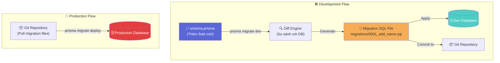
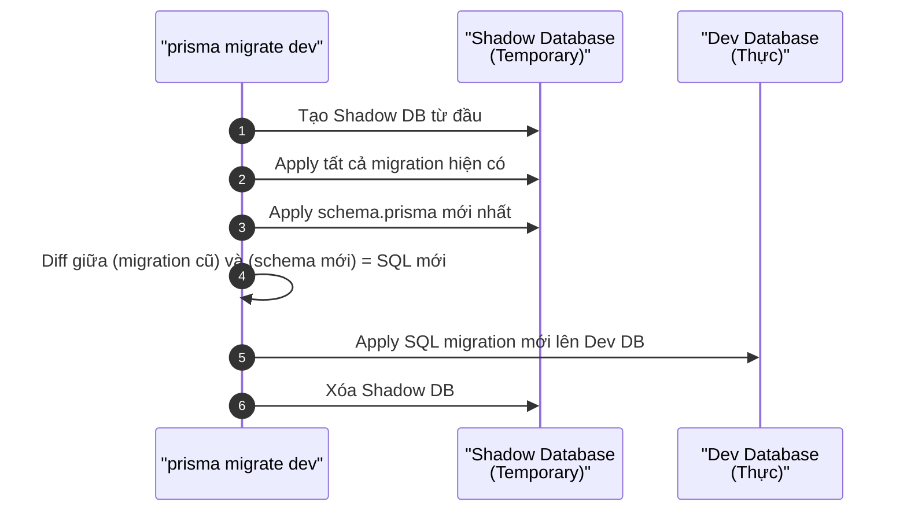
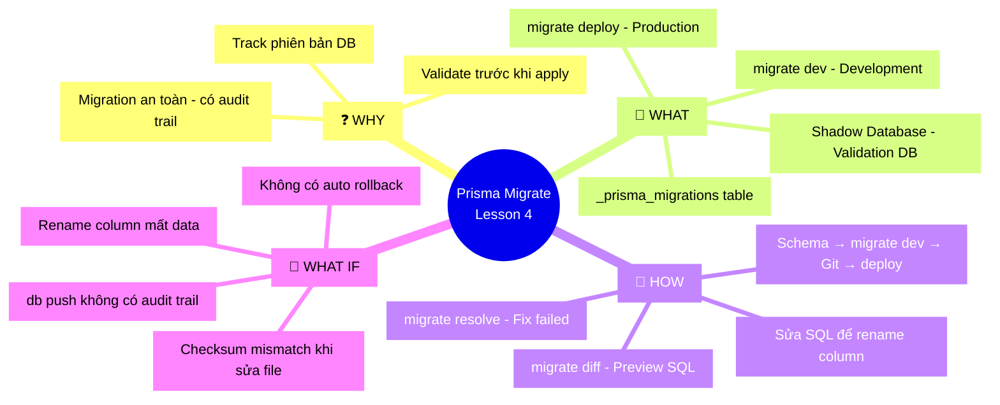

# Lesson 4: Prisma Migrate — Quản lý Database Schema

## 📋 Agenda

**Thời gian đọc ước tính:** ~18 phút

### Sau bài này, bạn sẽ:
- ✅ **Hiểu** Prisma Migrate hoạt động như thế nào bên dưới (SQL generation engine)
- ✅ **Phân biệt** rõ `migrate dev` (development) và `migrate deploy` (production/CI)
- ✅ **Giải thích** Shadow Database là gì và tại sao Prisma cần nó
- ✅ **Đọc** được bảng `_prisma_migrations` để trace lịch sử migration
- ✅ **Nhận biết** các hạn chế của Prisma Migrate trong dự án phức tạp

### Yêu cầu đầu vào (Prerequisites):
- 🔹 Đã hoàn thành Lesson 1 (hiểu `schema.prisma`)
- 🔹 Hiểu cơ bản về database migration concept

---

## ❓ Vấn đề & Giải pháp

**Vấn đề (Problem Statement):**
- Khi schema thay đổi (thêm cột, đổi kiểu dữ liệu), cần đồng bộ database theo cách **an toàn, có thể rollback**
- Migration viết thủ công dễ sai, không có validation trước khi áp dụng
- Không biết database hiện tại đang ở phiên bản nào, migration nào đã chạy

**Giải pháp (Solution):**
Prisma Migrate tự động:
1. **Phát hiện thay đổi** giữa `schema.prisma` và trạng thái database hiện tại
2. **Sinh ra file SQL migration** (readable, reviewable, committable vào Git)
3. **Track lịch sử** migration qua bảng `_prisma_migrations`
4. **Validate** migration an toàn qua Shadow Database trước khi apply thật

---

## 📖 Prisma Migrate hoạt động như thế nào?



### Workflow thực tế

```bash
# Bước 1: Sửa schema.prisma (thêm field, model...)
# Bước 2: Generate và apply migration
npx prisma migrate dev --name add_user_avatar

# Prisma sẽ:
# 1. So sánh schema hiện tại với DB
# 2. Tạo file: prisma/migrations/20240101_add_user_avatar/migration.sql
# 3. Apply migration lên dev DB
# 4. Chạy prisma generate để cập nhật Client
```

Kết quả sinh ra file SQL có thể đọc và review được:

```sql
-- filename: prisma/migrations/20240408_add_user_avatar/migration.sql
-- Prisma tự sinh ra, nhưng bạn có thể chỉnh sửa trước khi apply

-- AlterTable
ALTER TABLE "User" ADD COLUMN "avatarUrl" TEXT;
ALTER TABLE "User" ADD COLUMN "bio" TEXT;
```

---

## 🔨 migrate dev vs migrate deploy

Đây là sự khác biệt **quan trọng nhất** bạn cần nắm vững:

| | `prisma migrate dev` | `prisma migrate deploy` |
|---|---|---|
| **Môi trường** | Development | Production / CI/CD |
| **Shadow Database** | ✅ Sử dụng | ❌ Không dùng |
| **Generate Client** | ✅ Tự động | ❌ Phải chạy riêng |
| **Reset DB nếu conflict** | ✅ Có thể hỏi | ❌ Không bao giờ reset |
| **Tạo migration mới** | ✅ Nếu schema thay đổi | ❌ Chỉ apply file đã có |
| **Mức độ nguy hiểm** | Thấp (dev DB) | Cao (prod data) |

### migrate dev — Development

```bash
# Phát triển tính năng mới
npx prisma migrate dev --name add_post_tags

# Nếu muốn reset hoàn toàn DB dev (mất dữ liệu dev - OK)
npx prisma migrate reset

# Chỉ xem diff mà không apply
npx prisma migrate diff \
  --from-schema-datamodel prisma/schema.prisma \
  --to-schema-datasource prisma/schema.prisma \
  --script
```

### migrate deploy — Production/CI

```bash
# Trong CI/CD pipeline hoặc Dockerfile
# KHÔNG bao giờ chạy migrate dev trên production
npx prisma migrate deploy

# Sau đó generate client (nếu cần)
npx prisma generate
```

```yaml
# filename: .github/workflows/deploy.yml

- name: Apply database migrations
  run: |
    # Deploy only applies pending migrations, never drops data
    npx prisma migrate deploy
  env:
    DATABASE_URL: ${{ secrets.DATABASE_URL }}

- name: Generate Prisma Client
  run: npx prisma generate
```

> ⚠️ **Lưu ý cực kỳ quan trọng:** `migrate deploy` sẽ **lỗi nếu có migration pending chưa được review** (tức là migration đã apply trên dev nhưng chưa commit vào Git). Đây là cơ chế bảo vệ cố ý của Prisma để tránh áp dụng migration chưa được kiểm duyệt.

---

## 🔨 Shadow Database là gì?

### Cơ chế hoạt động

**Shadow Database** là một **database tạm thời, vô hình**, Prisma tạo ra tự động trong quá trình `migrate dev`. Người dùng không cần biết đến sự tồn tại của nó — Prisma quản lý toàn bộ.



### Tại sao cần Shadow Database?

Shadow DB đảm bảo migration được generate **chính xác** bằng cách:
1. Replay toàn bộ lịch sử migration từ đầu
2. So sánh với schema hiện tại
3. Chỉ lấy phần **diff mới nhất** → tránh duplicate hay conflict

```bash
# Nếu database không hỗ trợ tạo Shadow DB tự động (Cloud DB, giới hạn quyền)
# Cần chỉ định shadowDatabaseUrl riêng

# filename: prisma/schema.prisma
datasource db {
  provider          = "postgresql"
  url               = env("DATABASE_URL")
  shadowDatabaseUrl = env("SHADOW_DATABASE_URL") # DB riêng chỉ dùng cho shadow
}
```

> 💡 **Pro-tip:** Các managed database như **PlanetScale**, **Neon** thường có giới hạn quyền tạo database → Shadow DB sẽ không tự tạo được. Phải setup `shadowDatabaseUrl` riêng hoặc dùng `migrate diff` + áp dụng thủ công.

---

## 🔨 Migration History — Bảng `_prisma_migrations`

Prisma tự tạo bảng `_prisma_migrations` trong database để track trạng thái migration:

```sql
-- Cấu trúc bảng _prisma_migrations
SELECT id, checksum, finished_at, migration_name, logs, rolled_back_at, started_at, applied_steps_count
FROM "_prisma_migrations"
ORDER BY started_at DESC;
```

| Cột | Ý nghĩa |
|---|---|
| `migration_name` | Tên file migration (timestamp + name) |
| `finished_at` | Thời điểm apply thành công |
| `rolled_back_at` | Nếu có giá trị → migration đã rollback |
| `checksum` | Hash của file SQL → detect nếu file bị sửa sau khi apply |
| `logs` | Log lỗi nếu migration thất bại |

### Xử lý Migration thất bại

```bash
# Nếu migration apply một phần → database ở trạng thái "dirty"
# Prisma sẽ báo lỗi khi chạy lần tiếp theo

# Cách sửa:
# 1. Resolve lỗi trong file migration.sql
# 2. Mark migration là resolved manually
npx prisma migrate resolve --applied "20240408_add_user_avatar"
# Hoặc rollback (nếu có migration rollback script)
npx prisma migrate resolve --rolled-back "20240408_add_user_avatar"
```

---

## 🔨 Hạn chế của Prisma Migrate

Prisma Migrate là công cụ mạnh, nhưng có một số hạn chế cần biết:

### 1. Không hỗ trợ Rollback tự động

Prisma **không có built-in rollback command** như Flyway hay Liquibase. Khi migration fail trên production, bạn phải:
- Viết migration ngược lại thủ công
- Hoặc dùng database backup để restore

```bash
# Không có lệnh "prisma migrate down" hay "prisma rollback"
# Workaround: Tạo migration mới để undo thay đổi
npx prisma migrate dev --name revert_add_user_avatar
```

### 2. Không thể rename cột trực tiếp

Khi rename cột trong schema, Prisma interpret là **xóa cột cũ + thêm cột mới** → **mất data!**

```prisma
// ❌ Nguy hiểm: Prisma sẽ DROP fullName và ADD displayName
model User {
  // Before: fullName String
  displayName String // Đổi tên → Prisma không biết đây là rename
}
```

```sql
-- SQL Prisma tự sinh ra (nguy hiểm):
ALTER TABLE "User" DROP COLUMN "fullName";  -- MẤT DATA!
ALTER TABLE "User" ADD COLUMN "displayName" TEXT NOT NULL;
```

**Giải pháp:** Chỉnh sửa migration SQL trước khi apply:

```sql
-- Sửa thủ công file migration.sql
ALTER TABLE "User" RENAME COLUMN "fullName" TO "displayName";
-- Thay vì DROP + ADD
```

### 3. Hạn chế với Complex Schema Changes

Một số thao tác phức tạp không được hỗ trợ tốt:
- Thay đổi kiểu dữ liệu cột có data (VD: `String` → `Int`)
- Thêm `NOT NULL` constraint vào cột có NULL values
- Composite primary key thay đổi

**Workaround chung:**
```sql
-- Luôn preview migration SQL trước khi apply trên production
npx prisma migrate diff \
  --from-schema-datasource prisma/schema.prisma \
  --to-schema-datamodel prisma/schema.prisma \
  --script
```

---

## 🚀 Trade-off & Pitfalls

| ✅ NÊN | ❌ KHÔNG nên |
|---|---|
| `migrate deploy` trong CI/CD | `migrate dev` trên server production |
| Review migration SQL trước khi commit | Apply "blind" mà không đọc SQL |
| Backup DB trước khi migrate production | Migrate production không có backup |
| Tạo migration nhỏ, thường xuyên | Gom nhiều thay đổi lớn vào 1 migration |

### ⚠️ Pitfalls hay gặp

**1. Sửa file migration.sql đã apply**
Prisma dùng `checksum` để detect. Nếu sửa file đã apply → Mọi `migrate deploy` sau sẽ báo lỗi "checksum mismatch". Không bao giờ sửa migration đã được apply trên môi trường thật.

**2. Dùng `db push` thay `migrate dev` trong dev team**
`prisma db push` là "shortcut" không tạo migration file — tiện nhưng không có audit trail. Trong team, luôn dùng `migrate dev` để có file migration commit vào Git.

**3. Quên apply migration khi deploy**
Nếu deploy code mới (dùng field mới trong schema) mà chưa chạy `migrate deploy` → runtime error. Hãy luôn chạy migration **trước** khi deploy application code.

---

## 🗺️ MECE Mindmap



---

*Made by Anh Tu - Share to be share*
