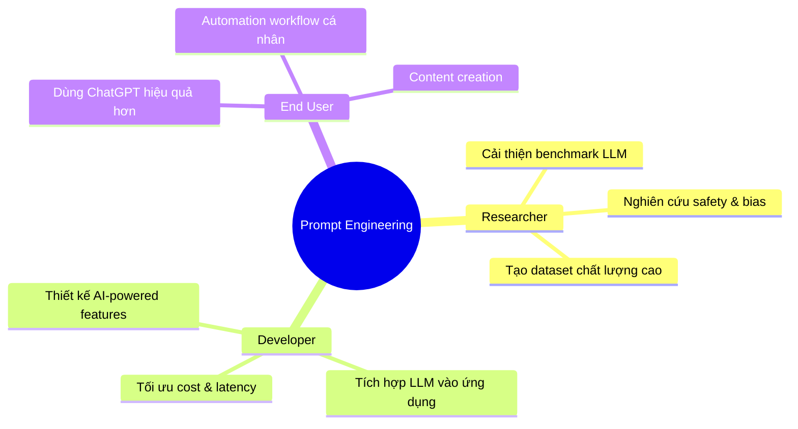
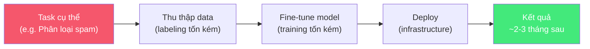
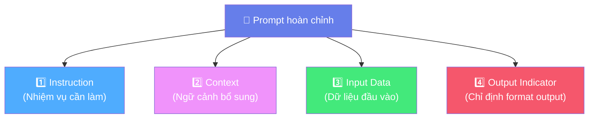
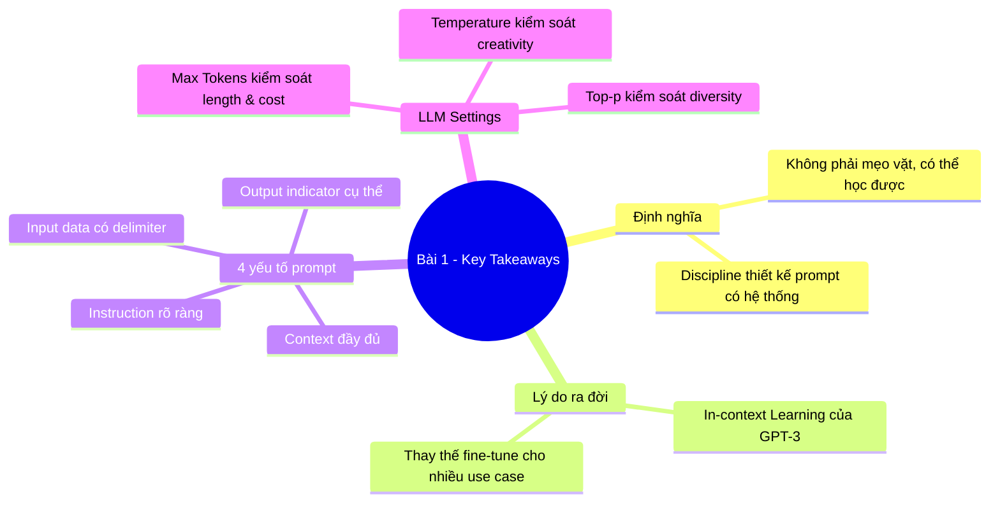

# 🎯 Bài 1: Prompt Engineering là gì? Tại sao nó quan trọng?

## 📋 Agenda

**Thời gian đọc ước tính:** ~20 phút

### Sau bài này, bạn sẽ:
- ✅ **Định nghĩa** được Prompt Engineering theo chuẩn kỹ thuật
- ✅ **Hiểu** tại sao Prompt Engineering ra đời và giải quyết vấn đề gì
- ✅ **Phân tích** được cấu trúc 4 yếu tố của một prompt hiệu quả
- ✅ **Cấu hình** được các LLM settings cơ bản (Temperature, Top-p, Max Tokens)

### Prerequisites:
- 🔹 Đã đọc Bài LLM Foundation (hoặc biết cơ bản về LLM)
- 🔹 Đã từng dùng ChatGPT hoặc Claude ít nhất một lần

---

## ❓ Vấn đề & Giải pháp

**Vấn đề (Problem Statement):**

Hầu hết người dùng đang giao tiếp với AI như cách họ **gõ Google năm 2008** — chỉ một vài từ khóa rời rạc. Nhưng AI thế hệ mới không phải search engine. Nó là một "đồng nghiệp thông minh" cần được brief đúng cách mới cho kết quả tốt.

```
❌ Prompt tệ: "Viết code Python"
✅ Prompt tốt: "Viết hàm Python đọc file CSV, lọc các dòng có cột 'status' = 'active',
               và trả về list dict. Xử lý exception nếu file không tồn tại."
```

**Giải pháp:** Học Prompt Engineering — kỹ thuật thiết kế và tối ưu hóa câu lệnh để khai thác tối đa sức mạnh của LLM.

---

## 📖 WHAT — Prompt Engineering là gì?

### Định nghĩa kỹ thuật

> **Prompt Engineering** là một ngành kỷ luật (discipline) tập trung vào việc **phát triển và tối ưu hóa các câu lệnh đầu vào (prompts)** nhằm khai thác hiệu quả năng lực của Large Language Models (LLMs) cho các ứng dụng và tác vụ cụ thể.
>
> — *Định nghĩa tổng hợp từ DAIR.AI Prompt Engineering Guide*

**Giải phẫu từ khóa:**

| Từ khóa | Ý nghĩa |
|---------|---------|
| **Discipline** | Không phải "mẹo vặt" — đây là kỹ năng có hệ thống, có thể học và đo lường |
| **Optimize** | Cải tiến lặp đi lặp lại — prompting là quá trình iterative, không phải one-shot |
| **Prompts** | Đầu vào cho LLM — có thể là text, ví dụ, instructions, context, hay kết hợp tất cả |
| **Efficiently** | Tiết kiệm tokens, thời gian, và chi phí API — quan trọng trong production |

### Ai cần Prompt Engineering?



---

## 🔍 WHY — Tại sao Prompt Engineering ra đời?

### Lịch sử ngắn: Vấn đề cũ → Giải pháp mới

**Vấn đề của thế hệ AI trước (pre-2020):**

Muốn AI làm tốt một task cụ thể, bạn phải:
1. Thu thập hàng nghìn ví dụ labeled data
2. Fine-tune model riêng cho task đó
3. Tốn hàng tuần/tháng và hàng nghìn USD compute



**Giải pháp của Prompt Engineering (post-GPT-3, 2020+):**

GPT-3 chứng minh một điều đột phá: **In-context Learning** — chỉ cần "nhúng" ví dụ vào prompt, model có thể làm tốt task mới **mà không cần fine-tune**.


> 💡 **Trade-off cần nhớ:** Prompt Engineering nhanh và rẻ hơn Fine-tuning, nhưng không thể thay thế hoàn toàn. Fine-tuning vẫn tốt hơn khi cần domain-specific knowledge sâu hoặc hành vi rất đặc biệt.

---

## 🔨 HOW — 4 Yếu Tố Cấu Thành Một Prompt

Theo DAIR.AI Guide, một prompt hoàn chỉnh có thể bao gồm tối đa 4 thành phần:



### 1️⃣ Instruction — Nhiệm vụ rõ ràng

Phần quan trọng nhất. Bắt đầu bằng **động từ hành động** cụ thể.

```
❌: "Sentiment"
✅: "Phân loại sentiment của đoạn review sau là Positive, Negative, hoặc Neutral."
```

**Động từ gợi ý theo task:**
- **Tóm tắt:** Summarize, Condense, Distill
- **Phân loại:** Classify, Categorize, Label
- **Sinh nội dung:** Write, Generate, Create, Draft
- **Phân tích:** Analyze, Explain, Break down, Evaluate

### 2️⃣ Context — Ngữ cảnh giúp AI hiểu đúng

Cung cấp thông tin nền giúp AI cho output phù hợp hơn:

```
❌ Không có context:
"Giải thích Docker"

✅ Có context:
"Giải thích Docker cho sinh viên năm 2 chưa biết về containerization.
Dùng ngôn ngữ đơn giản, tránh thuật ngữ phức tạp."
```

### 3️⃣ Input Data — Dữ liệu cần xử lý

Dữ liệu cụ thể mà AI cần làm việc. Nên dùng **delimiters** để phân tách rõ ràng:

```
Tóm tắt đoạn văn sau trong 3 bullet points:

---
[Nội dung bài báo dài ở đây...]
---
```

**Các delimiters phổ biến:**
- Triple backticks: ` ``` `
- XML tags: `<document>...</document>`
- Triple dashes: `---`
- Hash headers: `### Input ###`

### 4️⃣ Output Indicator — Chỉ định format output

Nói cho AI biết **format bạn muốn**:

```
Trả về kết quả theo format JSON:
{
  "sentiment": "Positive/Negative/Neutral",
  "confidence": 0.0-1.0,
  "reason": "Giải thích ngắn gọn"
}
```

### Ví dụ Prompt đầy đủ 4 yếu tố:

```
[INSTRUCTION] Phân loại sentiment của review sản phẩm sau.

[CONTEXT] Bạn là chuyên gia phân tích feedback khách hàng cho một e-commerce
platform. Cần phân loại chính xác để team product có thể cải thiện sản phẩm.

[INPUT DATA]
---
"Giao hàng nhanh, đóng gói cẩn thận. Sản phẩm đúng như mô tả.
Tuy nhiên, màu sắc hơi khác so với ảnh. Nhìn chung vẫn ổn."
---

[OUTPUT INDICATOR] Trả về JSON với format:
{"sentiment": "...", "score": 0-10, "key_points": ["...", "..."]}
```

---

## ⚙️ LLM Settings — Nút bấm ảnh hưởng output

Khi gọi LLM qua API, có một số tham số quan trọng cần hiểu:

### Temperature

```python
# Temperature kiểm soát độ "ngẫu nhiên" của output
temperature = 0.0  # Deterministic — luôn cho kết quả giống nhau
temperature = 0.7  # Balanced — khuyến nghị cho hầu hết tasks
temperature = 1.5  # Creative — đa dạng nhưng có thể "loạn"
```

| Temperature | Use Case |
|-------------|---------|
| `0.0 - 0.3` | Code generation, data extraction, factual Q&A |
| `0.5 - 0.8` | Summarization, classification, balanced tasks |
| `0.8 - 1.5` | Creative writing, brainstorming, poetry |

> ⚠️ **Common Mistake:** Dùng temperature cao cho task cần chính xác (như tính toán hay lấy data) → AI "sáng tạo" nhưng sai!

### Top-p (Nucleus Sampling)

```python
# Top-p chọn từ pool token có tổng xác suất = p
top_p = 0.1   # Chỉ lấy top token rất có xác suất cao → conservative
top_p = 0.9   # Lấy từ pool rộng hơn → đa dạng hơn
top_p = 1.0   # Không giới hạn
```

> 💡 **Best Practice:** Thường chỉ điều chỉnh **một trong hai** (temperature hoặc top_p), không điều chỉnh cả hai cùng lúc.

### Max Tokens

Giới hạn độ dài output. Tính toán chi phí API dựa trên tokens:

```
Ước tính thô: 1 token ≈ 0.75 từ tiếng Anh ≈ 1-2 ký tự tiếng Việt
GPT-4 pricing: ~$0.03/1K tokens (input) + $0.06/1K tokens (output)
```

---

## 🚀 WHAT IF — Common Pitfalls

| Lỗi phổ biến | Hệ quả | Cách sửa |
|-------------|--------|---------|
| Instruction mơ hồ | Output lan man, không đúng mục đích | Dùng động từ cụ thể, chỉ định format |
| Thiếu context | AI đoán sai domain/tone | Thêm background và target audience |
| Prompt quá dài | Tốn tokens, AI có thể bỏ sót | Ưu tiên thông tin quan trọng lên đầu |
| Không dùng delimiters | AI lẫn instruction với data | Dùng `---`, backticks, hoặc XML tags |
| Yêu cầu nhiều task 1 lúc | Output rối, thiếu sót | Tách thành nhiều prompt riêng |

---

## 💡 Bài tập thực hành

**Cải thiện 3 prompt sau:**

```
Prompt 1 (tệ): "Viết email"

Prompt 2 (tệ): "Explain machine learning"

Prompt 3 (tệ): "Làm gì với bug này: TypeError: cannot read property of undefined"
```

*Gợi ý: Áp dụng 4 yếu tố (Instruction + Context + Input + Output Indicator)*

---

## 📌 Tóm tắt



**Bài tiếp theo:** [Bài 2 — Basics of Prompting: Nghệ Thuật Đặt Câu Hỏi Cho AI →](./02-basics-of-prompting)

---

*Made by Anh Tu - Share to be share*
