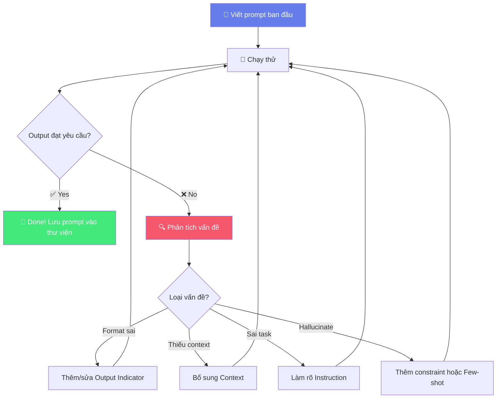
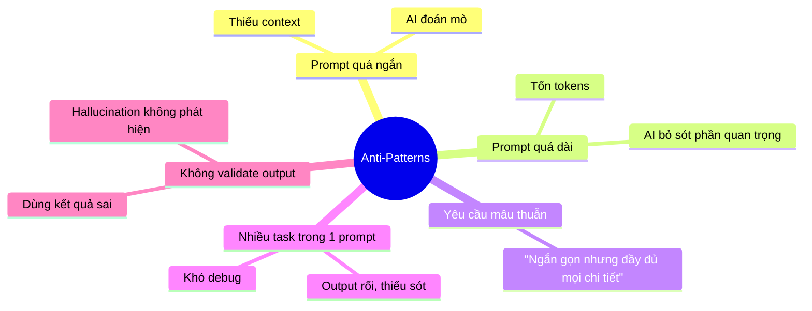

# ✍️ Bài 2: Basics of Prompting — Nghệ Thuật Đặt Câu Hỏi Cho AI

## 📋 Agenda

**Thời gian đọc ước tính:** ~25 phút

### Sau bài này, bạn sẽ:
- ✅ **Áp dụng** được các general tips thiết kế prompt chuyên nghiệp
- ✅ **Thực hành** prompting cho các task phổ biến: text summarization, classification, code, Q&A
- ✅ **Nhận diện** và sửa được anti-patterns phổ biến
- ✅ **Xây dựng** workflow iterative refinement để tự cải thiện prompt

### Prerequisites:
- 🔹 Đã đọc Bài 1 (Introduction)

---

## ❓ Vấn đề & Giải pháp

**Analogy — Prompt như "briefing cho nhân viên mới":**

Hãy tưởng tượng bạn là Team Lead. Bạn vừa onboard một nhân viên cực kỳ thông minh, học nhanh, nhưng họ chưa biết gì về context của công ty bạn.

- **Brief tệ:** *"Làm cái report đó đi"* → Nhân viên đứng nhìn bạn
- **Brief tốt:** *"Làm báo cáo doanh thu Q1 2025 theo định dạng Excel. Lấy data từ sheet 'Sales_Q1'. Tổng hợp theo từng sản phẩm. Deadline 5pm hôm nay."*

AI cũng vậy. Càng rõ ràng, kết quả càng tốt.

---

## 📖 General Tips for Designing Prompts

### Tip 1: Bắt đầu bằng lệnh đơn giản, iterate dần

Đừng cố viết "prompt hoàn hảo" ngay từ đầu. Bắt đầu đơn giản rồi cải thiện:

```
Vòng 1: "Tóm tắt bài viết này"
Vòng 2: "Tóm tắt bài viết này trong 3 điểm chính"
Vòng 3: "Tóm tắt bài viết này trong 3 bullet points, mỗi điểm không quá 20 từ,
          tập trung vào ý nghĩa thực tiễn cho developer"
```

### Tip 2: Instruction ở đầu, context ở sau

Nghiên cứu cho thấy đặt instruction trước giúp model focus hơn:

```
✅ Tốt (Instruction → Data):
Tóm tắt đoạn văn sau:
---
[Nội dung văn bản]
---

❌ Kém (Data trước, instruction sau):
---
[Nội dung dài]
---
Hãy tóm tắt đoạn trên.
```

### Tip 3: Cụ thể và chính xác

Tránh các từ mơ hồ như "một ít", "ngắn gọn", "chi tiết":

```
❌ Mơ hồ: "Giải thích ngắn gọn về Kubernetes"
✅ Cụ thể: "Giải thích Kubernetes trong 3 câu, dành cho developer chưa biết gì
            về container orchestration"
```

### Tip 4: Dùng delimiters để phân tách content

Delimiters giúp AI không bị "lẫn" instruction với data:

```python
# Triple backticks
prompt = """
Dịch đoạn code sau sang Python:
```javascript
const add = (a, b) => a + b;
```
"""

# XML Tags (phổ biến với Claude)
prompt = """
Phân tích sentiment của review sau:
<review>
Sản phẩm tốt nhưng giao hàng chậm quá.
</review>
"""

# Triple dashes
prompt = """
Tóm tắt bài báo sau:
---
[Nội dung bài báo]
---
"""
```

### Tip 5: Chỉ định rõ format output

```
Trả về kết quả theo format sau:
- Tên: ...
- Email: ...
- Chức vụ: ...
Không thêm nội dung nào khác ngoài format trên.
```

### Tip 6: Dùng "Few-shot" khi cần format đặc biệt

*(Chi tiết ở Bài 3, nhưng cần biết ngay)*

Thay vì mô tả format, **show examples**:

```
Chuyển đổi các câu sau sang passive voice:

Input: "The cat ate the fish."
Output: "The fish was eaten by the cat."

Input: "She wrote the report."
Output: "The report was written by her."

Input: "Team dev đã fix bug đó."
Output: ???
```

### Tip 7: Tránh nói "không làm gì" — hãy nói "làm gì thay vào đó"

```
❌ "Đừng dùng ngôn ngữ kỹ thuật"
✅ "Dùng ngôn ngữ đơn giản, tương tự như giải thích cho học sinh lớp 10"
```

---

## 🔨 Ví dụ thực tế theo từng task

### 1. Text Summarization

**Use case:** Tóm tắt tài liệu kỹ thuật, meeting notes, bài báo

```
Tóm tắt tài liệu kỹ thuật sau cho team Product Manager
(không có background kỹ thuật sâu):

---
[Nội dung technical specification document]
---

Yêu cầu output:
- Executive Summary: 2-3 câu
- Key Features: 3-5 bullet points
- Technical Risks: 2-3 items cần PM lưu ý
- Next Steps: Action items cụ thể
```

**Output mẫu tốt:**
```
📋 Executive Summary:
Hệ thống sẽ migrate từ monolith sang microservices trong Q2 2025...

⭐ Key Features:
- API Gateway mới hỗ trợ rate limiting
- ...

⚠️ Technical Risks:
- Migration data có thể gây downtime 2-4 giờ
- ...
```

---

### 2. Classification

**Use case:** Phân loại ticket support, phân loại feedback, labeling data

```
Phân loại ticket hỗ trợ khách hàng sau vào một trong các category:
[BUG], [FEATURE_REQUEST], [BILLING], [HOW_TO], [OTHER]

Ticket: "Tôi muốn biết cách xuất báo cáo ra PDF"

Trả về theo format: CATEGORY: [category] | CONFIDENCE: [high/medium/low]
```

**Output:** `CATEGORY: HOW_TO | CONFIDENCE: high`

---

### 3. Code Generation & Debug

**Use case:** Viết code mới, debug, code review, refactor

```
Vai trò: Bạn là senior Python developer với kinh nghiệm 10 năm.

Nhiệm vụ: Viết hàm Python với các yêu cầu sau:
- Đọc file CSV từ đường dẫn được truyền vào
- Lọc các dòng có cột 'status' = 'active'
- Trả về list of dictionaries
- Xử lý FileNotFoundError và raise ValueError nếu column không tồn tại
- Thêm type hints và docstring

Format output:
1. Code (trong code block)
2. Giải thích logic chính (2-3 câu)
3. Ví dụ sử dụng
```

**Code output mẫu:**

```python
import csv
from pathlib import Path

def filter_active_records(file_path: str) -> list[dict]:
    """
    Đọc file CSV và lọc các records có status = 'active'.

    Args:
        file_path: Đường dẫn đến file CSV

    Returns:
        List of dictionaries chứa các active records

    Raises:
        FileNotFoundError: Nếu file không tồn tại
        ValueError: Nếu column 'status' không có trong CSV
    """
    path = Path(file_path)
    if not path.exists():
        raise FileNotFoundError(f"File không tìm thấy: {file_path}")

    with open(path, newline='', encoding='utf-8') as f:
        reader = csv.DictReader(f)

        if 'status' not in reader.fieldnames:
            raise ValueError("Column 'status' không tồn tại trong CSV")

        return [row for row in reader if row['status'] == 'active']
```

---

### 4. Question Answering (Closed Domain)

**Use case:** Q&A từ tài liệu nội bộ, knowledge base

```
Trả lời câu hỏi dựa HOÀN TOÀN vào tài liệu được cung cấp dưới đây.
Nếu không tìm thấy thông tin, hãy nói rõ "Tài liệu không có thông tin này".
Không được bịa hoặc dùng kiến thức bên ngoài.

Tài liệu:
<document>
[Nội dung tài liệu nội bộ công ty...]
</document>

Câu hỏi: Chính sách nghỉ phép năm 2025 như thế nào?
```

> 💡 **Lý do quan trọng:** Câu lệnh "trả lời dựa hoàn toàn vào tài liệu" giúp giảm hallucination đáng kể — đây là nền tảng của RAG (Bài 7).

---

### 5. Information Extraction

**Use case:** Extract entities từ văn bản tự nhiên

```
Extract thông tin sau từ email và trả về JSON:

Email:
---
Từ: nguyen.van.a@company.com
Subject: Meeting Q2 Planning - 15/05/2025 - 14:00

Xin chào team, chúng ta sẽ họp planning Q2 vào ngày 15/5 lúc 2pm tại phòng
họp 3A. Agenda chính: OKRs review và roadmap 2025. Vui lòng confirm trước 13/5.
---

Output JSON:
{
  "sender": "...",
  "meeting_date": "YYYY-MM-DD",
  "meeting_time": "HH:MM",
  "location": "...",
  "agenda_items": ["...", "..."],
  "deadline_confirm": "YYYY-MM-DD"
}
```

---

## 🔄 Iterative Refinement Workflow

Đây là workflow thực tế khi làm việc với prompts:



### Log cải tiến prompt — thực hành tốt:

```markdown
## Prompt v1
"Tóm tắt bài viết này"
→ Vấn đề: Output quá dài, không đúng format cần

## Prompt v2  
"Tóm tắt bài viết trong 3 bullet points"
→ Vấn đề: Bullet points quá dài, lan man

## Prompt v3 (Final)
"Tóm tắt bài viết trong 3 bullet points. Mỗi bullet không quá 15 từ.
Tập trung vào điểm quan trọng nhất cho decision making."
→ ✅ Output đạt yêu cầu
```

---

## ⚠️ Anti-Patterns cần tránh



---

## 💡 Bài tập thực hành

Cải thiện các prompts sau bằng cách áp dụng tips trong bài này:

**Prompt 1 (cần cải thiện):**
```
Viết email xin lỗi khách hàng
```

**Prompt 2 (cần cải thiện):**
```
Tìm bug trong code này:
def calculate(a, b):
    return a/b
```

**Prompt 3 (cần cải thiện):**
```
Giải thích API
```

*Hướng dẫn: Với mỗi prompt, hãy thêm đủ 4 yếu tố (Instruction + Context + Input Data + Output Indicator) và áp dụng ít nhất 3 tips từ bài này.*

---

## 📌 Tóm tắt

| Tips | Áp dụng khi |
|------|------------|
| Iterate từ đơn giản | Bắt đầu với task mới |
| Instruction trước, data sau | Tất cả prompts |
| Dùng delimiters | Khi có input data dài |
| Chỉ định format output | Cần output có cấu trúc |
| Cụ thể về constraint | Khi yêu cầu về độ dài, style |
| Show examples (few-shot) | Format phức tạp, output đặc biệt |
| Nói "làm gì" thay vì "không làm gì" | Khi cần control tone/style |

**Bài tiếp theo:** [Bài 3 — Zero-Shot & Few-Shot: Hai Kỹ Thuật Nền Tảng →](./03-zero-shot-few-shot)

---

*Made by Anh Tu - Share to be share*
