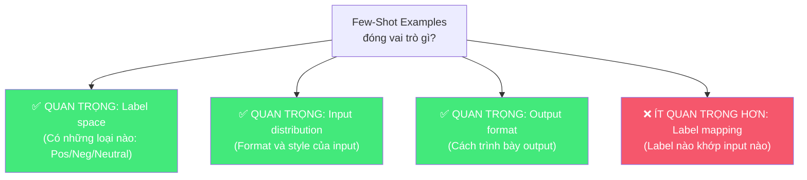
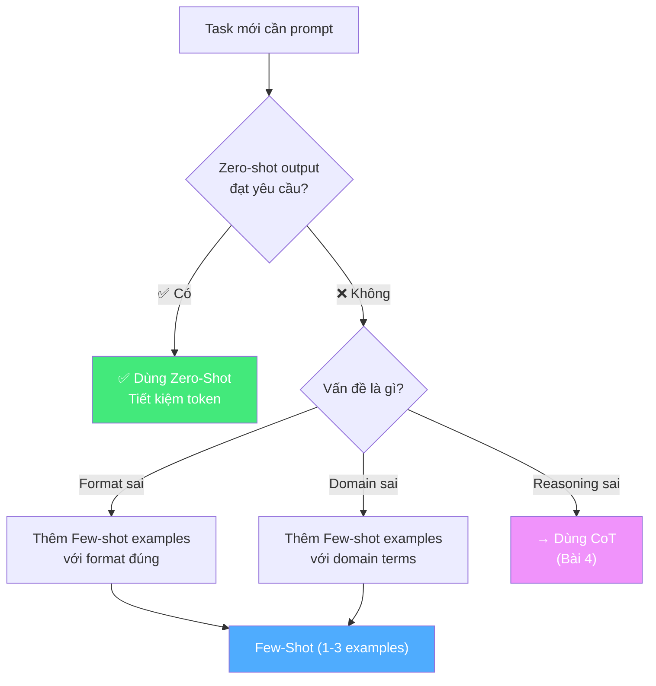
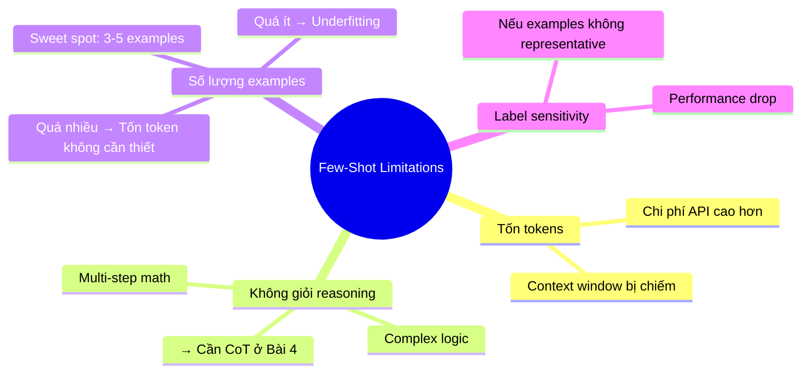

# 🎲 Bài 3: Zero-Shot & Few-Shot — Hai Kỹ Thuật Nền Tảng

## 📋 Agenda

**Thời gian đọc ước tính:** ~25 phút

### Sau bài này, bạn sẽ:
- ✅ **Phân biệt** rõ Zero-Shot và Few-Shot prompting
- ✅ **Hiểu** cơ chế In-context Learning và tại sao nó hoạt động
- ✅ **Quyết định** khi nào dùng Zero-Shot, khi nào dùng Few-Shot
- ✅ **Thiết kế** Few-shot examples chất lượng cao

### Prerequisites:
- 🔹 Đã đọc Bài 1 & 2

---

## ❓ Vấn đề & Giải pháp

**Vấn đề:** Bạn cần LLM phân loại email theo một schema đặc thù của công ty (không phải schema phổ thông). Làm sao AI biết phải theo đúng format của bạn?

**Hai cách tiếp cận:**

```
Cách 1 — Zero-Shot: Mô tả thật rõ ràng những gì bạn muốn
Cách 2 — Few-Shot: Cho AI xem ví dụ thay vì mô tả
```

Hiểu khi nào dùng cái nào là **skill cốt lõi của Prompt Engineering**.

---

## 📖 WHAT — Định nghĩa

### Zero-Shot Prompting

> **Zero-Shot Prompting** là kỹ thuật cung cấp prompt **không có ví dụ** (0 examples), hoàn toàn dựa vào khả năng generalization của LLM đã được học từ pre-training.

```
[ZERO-SHOT EXAMPLE]

Phân loại sentiment của review sau: Positive, Negative, hoặc Neutral.

Review: "Giao hàng nhanh, sản phẩm đúng mô tả. Rất hài lòng!"

Sentiment:
```

**Output:** `Positive`

AI tự suy luận mà không cần ví dụ — vì trong quá trình pre-training, nó đã gặp hàng triệu ví dụ tương tự.

---

### Few-Shot Prompting

> **Few-Shot Prompting** là kỹ thuật cung cấp **một số ví dụ (demonstrations)** trong prompt để AI học cách xử lý task theo pattern mong muốn — còn gọi là **In-context Learning**.

```
[FEW-SHOT EXAMPLE — 3-shot]

Phân loại sentiment của review. Trả về chỉ label.

Review: "Sản phẩm rất tốt, đóng gói cẩn thận"
Sentiment: Positive

Review: "Giao hàng chậm, hàng bị hỏng"
Sentiment: Negative

Review: "Bình thường, không có gì đặc biệt"
Sentiment: Neutral

Review: "Giá hơi cao nhưng chất lượng xứng đáng"
Sentiment: ???
```

**Output:** `Positive`

---

## 🔍 WHY — In-context Learning hoạt động như thế nào?

### Câu hỏi thú vị từ nghiên cứu

Nhóm nghiên cứu của Min et al. (2022) đặt câu hỏi: **Điều gì trong few-shot examples thực sự quan trọng?**

Họ thử nghiệm: Nếu **thay label bằng label ngẫu nhiên** (Positive → Negative, Negative → Positive), kết quả có thay đổi không?

```
[CORRUPTED FEW-SHOT — labels ngẫu nhiên]

Review: "Sản phẩm rất tốt"
Sentiment: NEGATIVE  ← ❌ Label sai!

Review: "Giao hàng chậm"
Sentiment: POSITIVE  ← ❌ Label sai!

Review: "Giá hơi cao nhưng chất lượng xứng đáng"
Sentiment: ???
```

**Kết quả gây bất ngờ:** Performance chỉ giảm nhẹ!

### Kết luận quan trọng



> 💡 **Insight thực tế:** Few-shot không chỉ "dạy" AI label đúng — nó còn **set up format, tone, và style** của output. Đây là lý do few-shot hữu ích ngay cả với các task đơn giản.

---

## ⚖️ Trade-off: Zero-Shot vs Few-Shot

| Chiều | Zero-Shot | Few-Shot |
|-------|-----------|----------|
| Token cost | ✅ Thấp | ❌ Cao hơn (tỷ lệ với số examples) |
| Latency | ✅ Nhanh | ❌ Chậm hơn |
| Accuracy (task phổ thông) | ✅ Tốt | ✅ Tốt hơn |
| Format control | ❌ Kém | ✅ Tốt |
| Setup time | ✅ Nhanh | ❌ Cần chuẩn bị examples |
| Domain-specific task | ❌ Kém | ✅ Tốt hơn nhiều |

**Quy tắc ngón tay cái:** Luôn thử Zero-shot trước. Chỉ chuyển sang Few-shot khi format hoặc domain không đạt yêu cầu.

| | Zero-Shot | Few-Shot |
|--|-----------|----------|
| **Token cost** | ✅ Thấp | ❌ Cao hơn (tỷ lệ với số examples) |
| **Latency** | ✅ Nhanh | ❌ Chậm hơn |
| **Accuracy (phổ thông)** | ✅ Tốt | ✅ Tốt hơn |
| **Format control** | ❌ Kém | ✅ Tốt |
| **Setup time** | ✅ Nhanh | ❌ Cần chuẩn bị examples |
| **Domain-specific** | ❌ Kém | ✅ Tốt hơn nhiều |

---

## 🔨 HOW — Decision Framework

### Khi nào dùng Zero-Shot?

```
✅ Task phổ thông, AI "biết rõ" (summarization, translation, Q&A)
✅ Khi cần tối thiểu token/cost
✅ Prototyping nhanh
✅ Task đơn giản, format output phổ thông
```

### Khi nào dùng Few-Shot?

```
✅ Output format phức tạp, đặc thù
✅ Domain-specific terminology
✅ Khi Zero-Shot cho output không đúng format
✅ Task classification với label space đặc biệt
✅ Cần consistency cao trong output style
```

### Decision Tree:



---

## 🎯 Thiết kế Few-Shot Examples chất lượng cao

### 4 nguyên tắc chọn examples

**1. Diversity — Đại diện đủ các trường hợp**

```
❌ Tệ — tất cả cùng loại:
Example 1: Review Positive → Positive
Example 2: Review Positive → Positive
Example 3: Review Positive → Positive

✅ Tốt — đa dạng:
Example 1: Review Positive → Positive
Example 2: Review Negative → Negative
Example 3: Review Neutral → Neutral
```

**2. Relevance — Gần với task thực tế**

```
❌ Tệ — dùng ví dụ chung chung:
"Tôi yêu thích bộ phim này" → Positive

✅ Tốt — dùng ví dụ gần với domain thực:
"Sản phẩm chống nước tốt, pin trâu 3 ngày" → Positive
(Nếu task là phân tích review đồng hồ)
```

**3. Consistent Format — Format đồng nhất**

```
❌ Tệ — format không nhất quán:
Review: "..." → Positive
"..." — NEGATIVE
Text: "..." Neutral

✅ Tốt — format đồng nhất:
Review: "..."
Sentiment: Positive

Review: "..."
Sentiment: Negative
```

**4. Quality > Quantity**

```
1-3 examples chất lượng cao >> 10 examples chất lượng thấp
```

---

## 🔨 Ví dụ thực tế: Named Entity Recognition (NER)

**Bài toán:** Extract tên người, tổ chức, địa điểm từ văn bản.

```
[ZERO-SHOT — có thể không đúng format]
Extract các named entities từ đoạn văn sau...

[FEW-SHOT — format rõ ràng hơn]

Extract tên Người (PER), Tổ chức (ORG), Địa điểm (LOC) từ văn bản.
Format: entity | type

Văn bản: "Elon Musk, CEO của Tesla, vừa công bố sản phẩm mới tại San Francisco."
Entities:
Elon Musk | PER
Tesla | ORG
San Francisco | LOC

Văn bản: "Nguyễn Phú Trọng tham dự hội nghị ASEAN tại Jakarta."
Entities:
Nguyễn Phú Trọng | PER
ASEAN | ORG
Jakarta | LOC

Văn bản: "Google DeepMind đặt trụ sở chính tại London, Anh Quốc."
Entities:
```

**Output kỳ vọng:**
```
Google DeepMind | ORG
London | LOC
Anh Quốc | LOC
```

---

## 🚀 Limitations của Few-Shot



> 💡 **Transition sang Bài 4:** Nếu task yêu cầu **suy luận nhiều bước** (multi-step math, complex logic), Few-shot vẫn chưa đủ. Chúng ta cần **Chain-of-Thought Prompting**.

---

## 💡 Bài tập thực hành

**Task 1:** Viết Zero-shot prompt để phân loại email công việc thành: [URGENT], [NORMAL], [FYI], [ACTION_REQUIRED]

**Task 2:** Cải thiện thành Few-shot prompt với 3 examples chất lượng cao.

**Task 3:** Thử nghiệm: Nếu bạn "đổi label" (giống thí nghiệm của Min et al.), output có thay đổi nhiều không? Tại sao?

---

## 📌 Tóm tắt

| | Zero-Shot | Few-Shot |
|--|-----------|----------|
| Số examples | 0 | 1-10 (thường 3-5) |
| Dùng khi | Task phổ thông | Format đặc thù, domain riêng |
| Ưu điểm | Nhanh, rẻ | Chính xác, consistent |
| Nhược điểm | Ít control | Tốn tokens |
| Fail case | Task phức tạp | Reasoning nhiều bước |

**Bài tiếp theo:** [Bài 4 — Chain-of-Thought: Dạy AI "Suy Nghĩ Từng Bước" →](./04-chain-of-thought)

---

*Made by Anh Tu - Share to be share*
