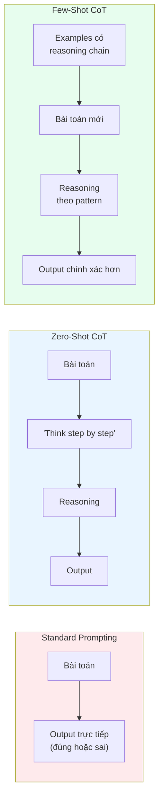
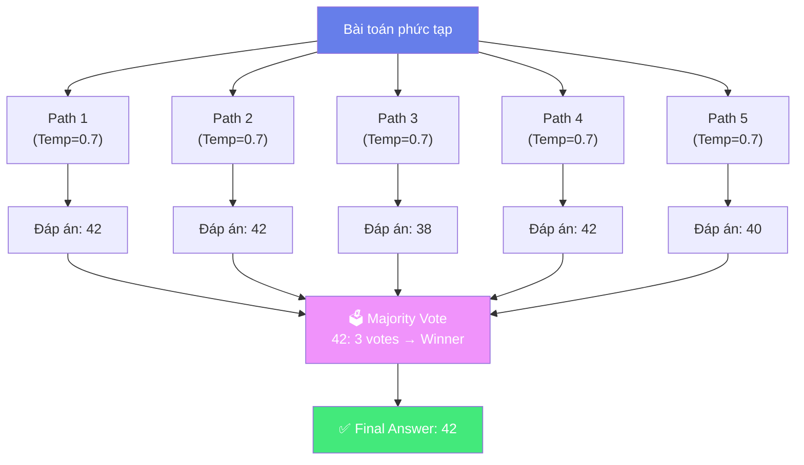
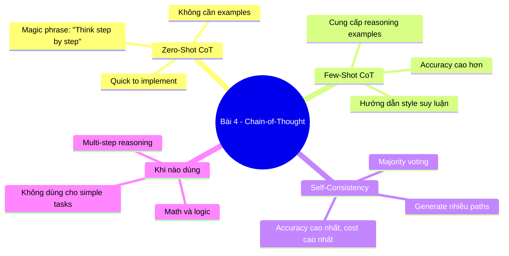

# 🔗 Bài 4: Chain-of-Thought — Dạy AI "Suy Nghĩ Từng Bước"

## 📋 Agenda

**Thời gian đọc ước tính:** ~30 phút

### Sau bài này, bạn sẽ:
- ✅ **Hiểu** tại sao LLM thường fail ở multi-step reasoning
- ✅ **Áp dụng** Zero-shot CoT với magic phrase "Let's think step by step"
- ✅ **Thiết kế** Few-shot CoT examples với reasoning chains chất lượng
- ✅ **Sử dụng** Self-Consistency để tăng độ chính xác
- ✅ **Biết** khi nào CoT hiệu quả và khi nào không

### Prerequisites:
- 🔹 Đã đọc Bài 3 (Zero-Shot & Few-Shot)

---

## ❓ Vấn đề & Giải pháp

### Hook: Tại sao AI giải toán lớp 3 sai?

```
[STANDARD PROMPT — Without CoT]
Prompt: "Roger có 5 quả bóng tennis. Anh ta mua thêm 2 hộp bóng tennis.
         Mỗi hộp có 3 quả bóng. Hỏi Roger có bao nhiêu quả bóng?"

GPT-3.5 answer: "11"  ← ✅ Đúng
```

Nhưng với bài toán phức tạp hơn:

```
[STANDARD PROMPT — Without CoT]
Prompt: "Một nhà hàng phục vụ 3 bữa ăn mỗi ngày. Mỗi bữa phục vụ 50 khách.
         Mỗi tháng, nhà hàng đặt hàng 600 bộ đũa. Đũa được dùng 1 lần rồi bỏ.
         Hỏi trung bình mỗi ngày nhà hàng có đủ đũa không?"

Model: "Có, nhà hàng đủ đũa" ← ❌ Trả lời sai, reasoning sai
```

**Vấn đề gốc rễ:** LLM generate từng token theo xác suất. Với bài toán nhiều bước, nếu không "bắt buộc" suy luận tuần tự, model có thể skip steps và output sai.

**Giải pháp:** Chain-of-Thought — buộc model phải "nói to" reasoning của nó.

---

## 📖 WHAT — Chain-of-Thought là gì?

> **Chain-of-Thought (CoT) Prompting** là kỹ thuật khuyến khích LLM tạo ra một **chuỗi lập luận trung gian** (intermediate reasoning steps) trước khi đưa ra câu trả lời cuối cùng.
>
> — *Wei et al., 2022 — "Chain-of-Thought Prompting Elicits Reasoning in Large Language Models"*

**Giải phẫu khái niệm:**
- **Chain** — Chuỗi liên tiếp, bước này dẫn đến bước kia
- **of Thought** — Của quá trình suy nghĩ (reasoning), không phải của output
- **Prompting** — Được trigger bởi prompt, không tự nhiên xuất hiện

---

## 🔨 HOW — Hai loại CoT

### 1. Zero-Shot CoT — "Let's think step by step"

Phát hiện bởi Kojima et al. (2022): Chỉ cần thêm một câu thần kỳ vào cuối prompt!

```
[WITHOUT CoT]
Prompt: "Tính: nếu tôi có $100, tiêu 30% cho thức ăn và 25% cho đi lại,
         tôi còn lại bao nhiêu?"
Output: "$45"  ← Có thể đúng hoặc sai

[WITH Zero-Shot CoT]
Prompt: "Tính: nếu tôi có $100, tiêu 30% cho thức ăn và 25% cho đi lại,
         tôi còn lại bao nhiêu? Hãy suy nghĩ từng bước."
Output:
"Bước 1: Tính tiền thức ăn: $100 × 30% = $30
 Bước 2: Tính tiền đi lại: $100 × 25% = $25
 Bước 3: Tổng chi tiêu: $30 + $25 = $55
 Bước 4: Còn lại: $100 - $55 = $45
 Kết quả: $45" ← ✅ Đúng VÀ có thể verify từng bước
```

**Các trigger phrases phổ biến:**
```
- "Let's think step by step."
- "Hãy suy nghĩ từng bước một."
- "Let's work through this carefully."
- "Think out loud."
- "Explain your reasoning."
```

---

### 2. Few-Shot CoT — Cung cấp reasoning examples

Đây là phương pháp gốc của Wei et al. (2022): Thêm ví dụ **có reasoning chain** vào prompt.

```
[FEW-SHOT CoT EXAMPLE]

Q: Roger có 5 quả bóng tennis. Anh ta mua thêm 2 hộp, mỗi hộp 3 quả. Tổng cộng?
A: Roger bắt đầu với 5 quả.
   2 hộp × 3 quả/hộp = 6 quả mới.
   Tổng: 5 + 6 = 11 quả.
   Đáp án: 11 quả bóng.

Q: Nhà hàng phục vụ 3 bữa/ngày, mỗi bữa 50 khách.
   Tháng này đặt 600 bộ đũa. Đũa dùng 1 lần.
   Hỏi mỗi ngày đủ đũa không? (Giả sử tháng 30 ngày)
A: ???
```

**Output kỳ vọng:**
```
A: Tính lượng đũa cần mỗi ngày:
   3 bữa × 50 khách = 150 khách/ngày.
   Mỗi khách dùng 1 bộ đũa → cần 150 bộ đũa/ngày.
   
   Tính đũa trung bình mỗi ngày từ kho:
   600 bộ ÷ 30 ngày = 20 bộ/ngày.
   
   So sánh: Cần 150 bộ/ngày, có 20 bộ/ngày → KHÔNG ĐỦ.
   
   Đáp án: Không, nhà hàng thiếu đũa trầm trọng (chỉ có 13% nhu cầu).
```

---

### So sánh Standard vs Zero-shot CoT vs Few-shot CoT



---

## 🔄 Self-Consistency — Voting nhiều reasoning paths

**Vấn đề với CoT đơn lẻ:** Một reasoning chain vẫn có thể sai vì randomness (temperature > 0).

**Giải pháp:** Wang et al. (2022) đề xuất **Self-Consistency** — generate nhiều reasoning paths, sau đó vote lấy đáp án xuất hiện nhiều nhất.



**Trade-off của Self-Consistency:**
- ✅ Tăng accuracy đáng kể (~+10-20% trên math benchmarks)
- ❌ Tốn gấp N lần tokens và chi phí (N = số paths)
- ✅ Phù hợp khi task quan trọng, accuracy critical

---

## 🔌 Generate Knowledge Prompting

Kỹ thuật liên quan: **Generate Knowledge Prompting** (Liu et al., 2022) — trước khi answer, bắt AI generate knowledge liên quan trước.

```
[PHASE 1 — Generate Knowledge]
Prompt: "Hãy liệt kê các facts quan trọng về việc ủ bia thủ công
         (homebrewing beer) để trả lời câu hỏi sau."

AI output: "1. Quá trình lên men cần nhiệt độ ổn định 18-24°C..."

[PHASE 2 — Answer với knowledge đã generate]
Prompt: "Dựa vào kiến thức sau:
[Knowledge từ Phase 1]

Trả lời câu hỏi: Tại sao bia thủ công thường có độ cồn cao hơn bia công nghiệp?"
```

**So sánh với CoT:**
- CoT: Focus vào reasoning steps (HOW to think)
- Generate Knowledge: Focus vào knowledge retrieval (WHAT to know trước)

---

## ⚙️ Khi nào CoT hiệu quả?

Dựa trên nghiên cứu của Wei et al. (2022):

```mermaid
quadrantChart
    title CoT Effectiveness by Task Type
    x-axis Simple Task --> Complex Task
    y-axis Small Model (< 100B) --> Large Model (> 100B)
    quadrant-1 CoT Most Effective
    quadrant-2 CoT Helps
    quadrant-3 CoT Ineffective or Harmful
    quadrant-4 Standard Prompting Fine
    Arithmetic reasoning: [0.8, 0.9]
    Commonsense reasoning: [0.7, 0.8]
    Symbolic reasoning: [0.9, 0.85]
    Simple classification: [0.2, 0.4]
    Factual lookup: [0.3, 0.3]
    Creative writing: [0.5, 0.6]
```

**CoT ĐẶC BIỆT hiệu quả với:**
- ✅ Bài toán số học nhiều bước
- ✅ Commonsense reasoning
- ✅ Symbolic reasoning (logic)
- ✅ Các task cần explanation/justification

**CoT KHÔNG hiệu quả hoặc harmful với:**
- ❌ Simple classification (làm chậm, không cải thiện)
- ❌ Factual lookup (có thể hallucinate reasoning)
- ❌ Model nhỏ < 100B (không đủ capacity)

---

## 🚀 Ứng dụng thực tế cho Developer

### Use case 1: Code Review với CoT

```
Review đoạn code Python sau. Hãy phân tích từng bước:
Bước 1: Kiểm tra correctness (logic có đúng không?)
Bước 2: Kiểm tra edge cases (có handle exception không?)
Bước 3: Kiểm tra performance (có bottleneck không?)
Bước 4: Đưa ra recommendations

```python
def get_user_data(user_id):
    users = db.query("SELECT * FROM users")
    for user in users:
        if user.id == user_id:
            return user
    return None
```
```

### Use case 2: Debugging với CoT

```
Tôi gặp bug sau. Hãy phân tích step by step để tìm root cause:

Error: "IndexError: list index out of range"
Code:
```python
data = [1, 2, 3]
print(data[5])
```

Hãy:
1. Giải thích nguyên nhân gốc rễ
2. Xác định tất cả scenarios có thể gây ra lỗi này
3. Đề xuất ít nhất 2 cách fix khác nhau với trade-off của mỗi cách
```

---

## ⚠️ Pitfalls của CoT

| Pitfall | Mô tả | Cách tránh |
|---------|--------|-----------|
| **Plausible but wrong** | Reasoning chain nghe có vẻ đúng nhưng logic sai | Verify từng bước quan trọng |
| **Verbose reasoning** | Reasoning quá dài, lan man | Chỉ định số bước hoặc giới hạn length |
| **Inefficient for simple tasks** | Dùng CoT cho task đơn giản → tốn tokens | Dùng Zero-shot cho task đơn giản |
| **Hallucinated reasoning** | AI bịa steps trung gian | Cross-check với sources thực |

---

## 💡 Bài tập thực hành

**Task 1:** Giải bài toán sau với Standard prompt, rồi với Zero-shot CoT. So sánh kết quả:

> "Một startup có 3 co-founders. Sau round A, họ bán 20% cho investor. Sau round B, họ bán thêm 15% nữa. Hiện tại, 3 founders còn sở hữu bao nhiêu % công ty?"

**Task 2:** Viết Few-shot CoT prompt cho task: phân tích trade-off của một quyết định kỹ thuật (ví dụ: SQL vs NoSQL).

**Task 3:** Implement Self-Consistency manually: Chạy cùng một CoT prompt 5 lần (copy-paste, vì không có API), ghi lại 5 đáp án, và vote.

---

## 📌 Tóm tắt



**Bài tiếp theo:** [Bài 5 — Tree of Thoughts & Prompt Chaining: Khi Một Prompt Không Đủ →](./05-tree-of-thoughts-chaining)

---

*Made by Anh Tu - Share to be share*
