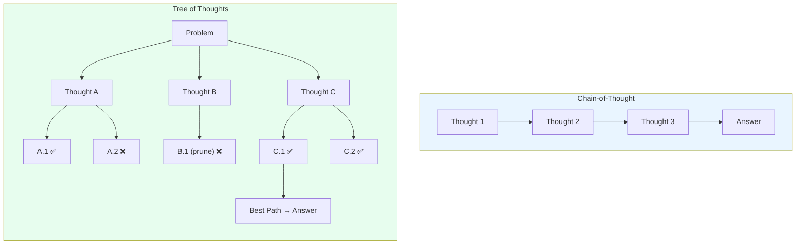
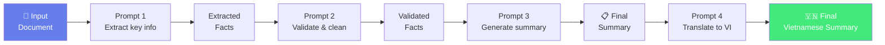
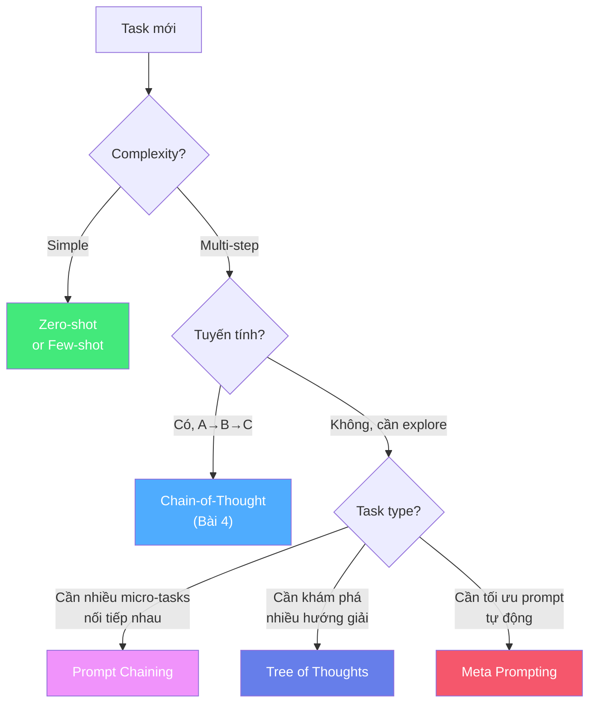

# 🌳 Bài 5: Tree of Thoughts & Prompt Chaining — Khi Một Prompt Không Đủ

## 📋 Agenda

**Thời gian đọc ước tính:** ~30 phút

### Sau bài này, bạn sẽ:
- ✅ **Hiểu** kiến trúc Tree of Thoughts và khác biệt với CoT
- ✅ **Thiết kế** Prompt Chaining pipeline cho task phức tạp
- ✅ **Biết** khi nào nên dùng ToT vs Prompt Chaining vs CoT
- ✅ **Áp dụng** Meta Prompting để AI tự tối ưu prompt

### Prerequisites:
- 🔹 Đã đọc Bài 4 (Chain-of-Thought)

---

## ❓ Vấn đề & Giải pháp

**Vấn đề:** CoT rất tốt cho reasoning tuyến tính (A → B → C). Nhưng nhiều task thực tế cần **khám phá nhiều hướng**, **backtrack** khi sai, và **chọn path tốt nhất** — giống như chơi cờ vua.

```
CoT (Linear):    A → B → C → D → Kết quả
                              (Nếu B sai → toàn bộ reasoning sai)

ToT (Tree):      A → B1 → C1 → (Tốt ✅)
                   → B2 → C2 → (Xấu ❌, backtrack)
                   → B3 → (Bỏ, prune sớm)
                 → Chọn path tốt nhất
```

---

## 📖 WHAT — Tree of Thoughts (ToT)

> **Tree of Thoughts** là framework cho phép LLM khám phá nhiều "nhánh suy nghĩ" (thoughts) khác nhau, đánh giá chúng, và tìm kiếm path tốt nhất đến đích — mô phỏng cách con người giải quyết vấn đề phức tạp.
>
> — *Yao et al., 2023 — "Tree of Thoughts: Deliberate Problem Solving with Large Language Models"*

### ToT vs CoT: So sánh chi tiết



### 4 Components của ToT

```
1. THOUGHT DECOMPOSITION — Chia task thành các "thought steps" có thể evaluate được
2. THOUGHT GENERATOR — Sinh ra nhiều thoughts khác nhau tại mỗi step
3. STATE EVALUATOR — Đánh giá mỗi thought: promising / not promising
4. SEARCH ALGORITHM — BFS (duyệt theo chiều rộng) hoặc DFS (duyệt theo chiều sâu)
```

---

## 🔨 HOW — Triển khai ToT thực tế

### Ví dụ: Game "24" (tính toán)

Bài toán: Cho 4 số [4, 9, 10, 13], dùng các phép +, -, ×, ÷ để ra đúng 24.

```
[ToT Prompt — Phase 1: Generate thoughts]

Bài toán: Dùng [4, 9, 10, 13] và các phép +, -, ×, ÷ để ra 24.
Mỗi số dùng đúng 1 lần.

Đề xuất 3 cách bắt đầu khác nhau (chỉ bước đầu tiên):
1. ...
2. ...
3. ...

---

[ToT Prompt — Phase 2: Evaluate thoughts]

Đánh giá mỗi cách bắt đầu trên:
- "sure" nếu chắc chắn có thể ra 24
- "maybe" nếu có thể nhưng chưa chắc
- "impossible" nếu chắc chắn không ra 24

---

[ToT Prompt — Phase 3: Explore promising paths]

Với cách được đánh giá "sure" hoặc "maybe", tiếp tục explore...
```

### Ví dụ thực tế cho developer: Architecture Decision

```
[ToT cho System Design]

Nhiệm vụ: Thiết kế hệ thống notification cho 1M users.

Bước 1 — Generate 3 approaches:
"Hãy đề xuất 3 kiến trúc notification khác nhau. Mỗi approach chỉ 1-2 câu."

Bước 2 — Evaluate:
"Đánh giá mỗi approach trên thang điểm 1-10 theo: scalability, cost, complexity.
Loại bỏ approach thấp điểm nhất."

Bước 3 — Deep dive winning approach:
"Với approach được chọn, thiết kế chi tiết: components, data flow, và potential failure points."
```

---

## 🔗 Prompt Chaining — Pipeline nhiều prompt nối tiếp

**Prompt Chaining** là kỹ thuật đơn giản hơn ToT, nhưng rất thực tế: chia task phức tạp thành **chuỗi prompts nhỏ**, output của prompt này là input của prompt tiếp theo.



### Use case thực tế: Document Analysis Pipeline

```python
# Giả sử bạn có document analysis workflow

# PROMPT 1: Extract
prompt_1 = f"""
Extract thông tin sau từ document:
- Main topic
- Key arguments (tối đa 5)
- Conclusions

Document:
---
{document_text}
---
Trả về JSON.
"""
extracted = llm(prompt_1)

# PROMPT 2: Validate
prompt_2 = f"""
Kiểm tra xem các extracted information sau có đúng với document không.
Đánh dấu [VERIFIED] hoặc [UNVERIFIED] cho mỗi item.

Extracted:
{extracted}

Original document:
---
{document_text}
---
"""
validated = llm(prompt_2)

# PROMPT 3: Generate output
prompt_3 = f"""
Dựa vào thông tin đã verified sau, viết executive summary 3 đoạn
cho audience là C-level executives:

{validated}
"""
final_summary = llm(prompt_3)
```

### Best Practices cho Prompt Chaining

```
✅ Validate output giữa các bước — đừng assume output của prompt N luôn đúng
✅ Dùng structured output (JSON) giữa các prompts để dễ parse
✅ Xử lý lỗi ở mỗi bước — nếu extract sai, mọi bước sau đều sai
✅ Log intermediate outputs để debug
✅ Design checkpoints — cho phép human review ở các bước quan trọng
```

---

## 🤖 Meta Prompting — AI viết prompt cho AI

**Meta Prompting** là kỹ thuật dùng AI để **tạo hoặc cải thiện prompts** thay vì viết tay.

```
[META PROMPT EXAMPLE]

Bạn là expert về Prompt Engineering.

Nhiệm vụ: Cải thiện prompt sau để cho kết quả chính xác và consistent hơn
với task phân loại sentiment cho review sản phẩm e-commerce Việt Nam.

Prompt hiện tại:
---
"Phân tích sentiment của review này"
---

Hãy viết lại prompt với:
1. Clear instruction
2. Specific label space phù hợp với context Việt Nam
3. Few-shot examples (2-3)
4. Output format rõ ràng
```

**Ứng dụng:** Dùng Meta Prompting để tự động hóa việc tối ưu prompts trong production.

---

## ⚖️ Khi nào dùng gì?



---

## 💡 Bài tập thực hành

**Task 1 — Prompt Chaining:**
Thiết kế pipeline 3-bước để phân tích một PR (Pull Request) và generate code review report. Xác định rõ input/output của mỗi bước.

**Task 2 — ToT:**
Dùng ToT approach để so sánh 3 database technology (PostgreSQL, MongoDB, Redis) cho một use case cụ thể. Generate 3 evaluation criteria, đánh giá từng DB theo mỗi criteria.

**Task 3 — Meta Prompting:**
Dùng AI để cải thiện một prompt bạn đã viết ở các bài trước. So sánh kết quả trước và sau.

---

## 📌 Tóm tắt

| Technique | Khi dùng | Complexity | Token Cost |
|-----------|---------|-----------|-----------|
| CoT | Linear reasoning | Medium | Medium |
| Prompt Chaining | Task có nhiều sub-tasks tuần tự | High | High |
| Tree of Thoughts | Task cần explore & backtrack | Very High | Very High |
| Meta Prompting | Tối ưu prompt tự động | Medium | Medium |

**Bài tiếp theo:** [Bài 6 — ReAct & Reflexion: AI Biết Tự Kiểm Tra và Sửa Lỗi →](./06-react-reflexion)

---

*Made by Anh Tu - Share to be share*
